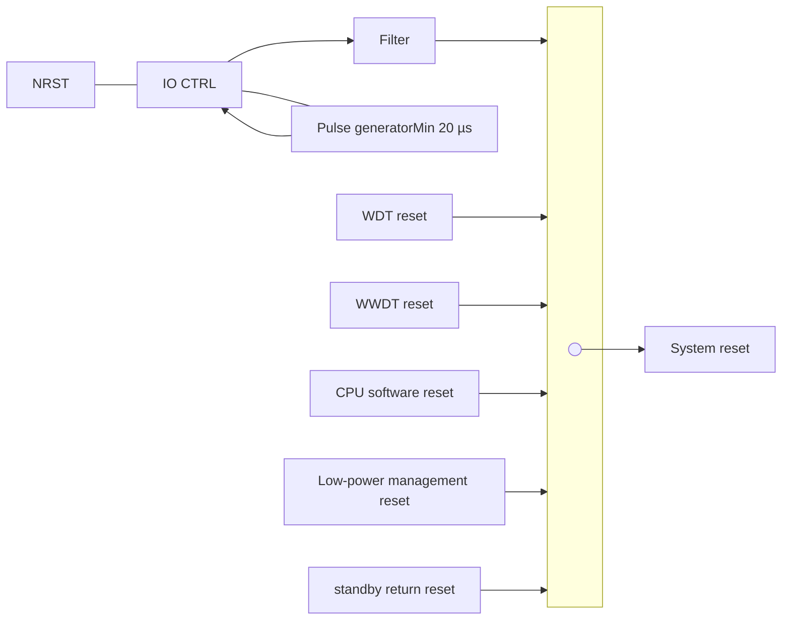

ARTERY logo

# AT32F435/437 Series Reference Manual

* Low-power management reset: This type of reset is enabled when entering Standby mode (by clearing the nSTDBY_RST bit in the user system data area); this type of reset is also enabled when entering Deepsleep mode (by clearing the nDEPSLP_RST in the user system data area).
* POR reset: power-on reset
* LVR reset: low voltage reset
* When exiting Standby mode

NRST reset, WDT reset, WWDT reset, software reset and low-power management reset sets all registers to their reset values except the clock control/status register (CRM_CTRLSTS) and the battery powered domain; the power-on reset, low-voltage reset or reset generated when exiting Standby mode sets all registers to their reset values except the battery powered domain registers.

Figure 4-2 System reset circuit

## 4.2.2 Battery powered domain reset

Battery powered domain has two specific reset sources:

* Software reset: triggered by setting the BPDRST bit in the battery powered domain control register (CRM_BPDC)
* VDD or VBAT power on, if both supplies have been powered off.

Software reset affects only the battery powered domain.

## 4.3 CRM registers

These peripheral registers have to be accessed by bytes (8 bits), half words (16 bits) or words (32 bits).

<u>Table 4-1 CRM register map and reset values</u>

| Register      | Offset | Reset value |
| ------------- | ------ | ----------- |
| CRM\_CTRL     | 0x000  | 0x0000 XX83 |
| CRM\_PLLCFG   | 0x004  | 0x0003 3002 |
| CRM\_CFG      | 0x008  | 0x0000 0000 |
| CRM\_CLKINT   | 0x00C  | 0x0000 0000 |
| CRM\_AHBRST1  | 0x010  | 0x0000 0000 |
| CRM\_AHBRST2  | 0x014  | 0x0000 0000 |
| CRM\_AHBRST3  | 0x018  | 0x0000 0000 |
| CRM\_APB1RST  | 0x020  | 0x0000 0000 |
| CRM\_APB2RST  | 0x024  | 0x0000 0000 |
| CRM\_AHBEN1   | 0x030  | 0x0000 0000 |
| CRM\_AHBEN2   | 0x034  | 0x0000 0000 |
| CRM\_AHBEN3   | 0x038  | 0x0000 0000 |
| CRM\_APB1EN   | 0x040  | 0x0000 0000 |
| CRM\_APB2EN   | 0x044  | 0x0000 0000 |
| CRM\_AHBLPEN1 | 0x050  | 0x3F63 90FF |

2025.05.28
Page 73
Rev 2.07

Artery logo
AT32F435/437 Series Reference Manual

| CRM\_AHBLPEN2 | 0x054 | 0x0000 8081 |
| ------------- | ----- | ----------- |
| CRM\_AHBLPEN3 | 0x058 | 0x0000 C003 |
| CRM\_APB1LPEN | 0x060 | 0xF6FE E9FF |
| CRM\_APB2LPEN | 0x064 | 0x2017 7733 |
| CRM\_BPDC     | 0x070 | 0x0000 0000 |
| CRM\_CTRLSTS  | 0x074 | 0x0C00 0000 |
| CRM\_MISC1    | 0x0A0 | 0x0000 0000 |
| CRM\_MISC2    | 0x0A4 | 0x0000 000D |

# 4.3.1 Clock control register (CRM_CTRL)

| Bit        | Name     | Reset value | Type | Description                                                                                                                                                                                                                                                                                                                                                                                                                                                                         |
| ---------- | -------- | ----------- | ---- | ----------------------------------------------------------------------------------------------------------------------------------------------------------------------------------------------------------------------------------------------------------------------------------------------------------------------------------------------------------------------------------------------------------------------------------------------------------------------------------- |
| Bit 30: 26 | Reserved | 0x00        | resd | Kept at its default value.                                                                                                                                                                                                                                                                                                                                                                                                                                                          |
| Bit 25     | PLLSTBL  | 0x0         | ro   | PLL clock stable This bit is set by hardware after PLL is ready. 0: PLL clock is not ready. 1: PLL clock is ready.                                                                                                                                                                                                                                                                                                                                                      |
| Bit 24     | PLLEN    | 0x0         | rw   | PLL enable This bit is set and cleared by software. It can also be cleared by hardware when entering Standby or Deepsleep mode. When the PLL clock is used as the system clock, this bit cannot be cleared. 0: PLL is OFF 1: PLL is ON.                                                                                                                                                                                                                                 |
| Bit 23: 20 | Reserved | 0x0         | resd | Kept at its default value.                                                                                                                                                                                                                                                                                                                                                                                                                                                          |
| Bit 19     | CFDEN    | 0x0         | rw   | Clock failure detector enable 0: OFF 1: ON                                                                                                                                                                                                                                                                                                                                                                                                                                  |
| Bit 18     | HEXTBYPS | 0x0         | rw   | High speed external crystal bypass This bit can be written only if the HEXT is disabled. 0: OFF 1: ON                                                                                                                                                                                                                                                                                                                                                                   |
| Bit 17     | HEXTSTBL | 0x0         | ro   | High speed external crystal stable This bit is set by hardware after HEXT becomes stable. 0: HEXT is not ready. 1: HEXT is ready.                                                                                                                                                                                                                                                                                                                                       |
| Bit 16     | HEXTEN   | 0x0         | rw   | High speed external crystal enable This bit is set and cleared by software. It can also be cleared by hardware when entering Standby or Deepsleep mode. When the HEXT clock is used as the system clock, this bit cannot be cleared 0: OFF. 1: ON                                                                                                                                                                                                                       |
| Bit 15: 8  | HICKCAL  | 0xXX        | rw   | High speed internal clock calibration The default value of this field is the initial factory calibration value. When the HICK output frequency is 48 MHz, it needs adjust 240 kHz (design value) based on this frequency for each HICKCAL value change; when HICK output frequency is 8 MHz (design value), it needs adjust 40 kHz based on this frequency for each HICKCAL value change. Note: This bit can be written only if the HICKCAL\_KEY\[7: 0] is set as 0x5A. |

2025.05.28
Page 74
Rev 2.07

ARTERY logo
AT32F435/437 Series Reference Manual

| Bit 7: 2 | HICKTRIM | 0x20 | rw | High speed internal clock trimming These bits work with the HICKCAL\[7: 0] to determine the HICK oscillator frequency. The default value is 32, which can trim the HICK to be ±1%.                                                                                                                                 |
| -------- | -------- | ---- | -- | ---------------------------------------------------------------------------------------------------------------------------------------------------------------------------------------------------------------------------------------------------------------------------------------------------------------------- |
| Bit 1    | HICKSTBL | 0x1  | ro | High speed internal clock stable This bit is set by hardware after the HICK is ready. 0: Not ready 1: Ready                                                                                                                                                                                                |
| Bit 0    | HICKEN   | 0x1  | rw | High speed internal clock enable This bit is set and cleared by software. It can also be set by hardware when exiting Standby or Deepsleep mode. When a HEXT clock failure occurs. This bit can also be set. When the HICK is used as the system clock, this bit cannot be cleared. 0: Disabled 1: Enabled |

# 4.3.2 PLL clock configuration register (CRM_PLLCFG)

Access: 0 wait state, accessible by words, half-words and bytes.

| Bit        | Name     | Reset value | Type | Description                                                                                                                                                                                                                                                                                                                                                          |
| ---------- | -------- | ----------- | ---- | -------------------------------------------------------------------------------------------------------------------------------------------------------------------------------------------------------------------------------------------------------------------------------------------------------------------------------------------------------------------- |
| Bit 31: 23 | Reserved | 0x000       | resd | Kept at its default value.                                                                                                                                                                                                                                                                                                                                           |
| Bit 22     | PLLRCS   | 0x0         | rw   | PLL reference clock select The PLL reference clock source is selected by setting or resetting this bit. This bit can be written only when the PLL is disabled. 0: HICK is used as PLL reference clock 1: HEXT is used as PLL reference clock                                                                                                             |
| Bit 21: 19 | Reserved | 0x0         | resd | Kept at its default value.                                                                                                                                                                                                                                                                                                                                           |
| Bit 18: 16 | PLL\_FR  | 0x3         | rw   | PLL post-division PLL\_FR range (2\~5) 000: Reserved. Do not use. 001: Reserved. Do not use. 010: PLL post-division=4 011: PLL post-division=8 100: PLL post-division=16 101: PLL post-division=32 Others: Reserved. Do not use. Attention should be paid to the correlation between the PLL\_FR value and post-division factor. |
| Bit 15     | Reserved | 0x0         | resd | Kept at its default value.                                                                                                                                                                                                                                                                                                                                           |
| Bit 14: 6  | PLL\_NS  | 0x0C0       | rw   | PLL multiplication factor PLL\_NS range (31\~500) 000000000 \~ 000011110: Forbidden 000011111: 31 000100000: 32 000100001: 33 ...... 111110011: 499 111110100: 500 111110101\~111111111: Forbidden                                                                                                                               |
| Bit 5: 4   | Reserved | 0x0         | resd | Kept at its default value.                                                                                                                                                                                                                                                                                                                                           |

2025.05.28
Page 75
Rev 2.07

ARTERY logo
AT32F435/437 Series Reference Manual

| Bit 3: 0 | PLL\_MS | 0x2 | rw | PLL pre-division PLL\_MS range (1\~15) 0000: Forbidden 0001: 1 0010: 2 0011: 3 …… 1110: 14 1111: 15 |
| -------- | ------- | --- | -- | ----------------------------------------------------------------------------------------------------------------------------------- |

Note: PLL clock formulas:

PLL output clock = PLL input clock x PLL frequency multiplication factor / (PLL pre-divider factor x PLL post-divider factor)

500 MHz <= PLL input clock x PLL frequency multiplication factor / PLL pre-divider factor <= 1200 MHz
2 MHz <= PLL input clock / PLL pre-divider factor <= 16 MHz

# 4.3.3 Clock configuration register (CRM_CFG)

Access: 0 to 2 wait states. 1 or 2 wait states are inserted only when the access occurs during a clock source switch.

| Bit        | Name          | Reset value | Type | Description                                                                                                                                                                                                                                                                                                                                                                                                                                                                                                                               |
| ---------- | ------------- | ----------- | ---- | ----------------------------------------------------------------------------------------------------------------------------------------------------------------------------------------------------------------------------------------------------------------------------------------------------------------------------------------------------------------------------------------------------------------------------------------------------------------------------------------------------------------------------------------- |
| Bit 31:30  | CLKOUT2\_SEL1 | 0x0         | rw   | Clock output2 selection 1 This field is set and cleared by software. 00: System clock (SCLK) selected 01: Secondary clock output selected by the CLKOUT2\_SEL2 bit in the CRM\_MISC1 register 10: External oscillator clock (HEXT) selected 11: PLL clock output Note: This clock out may be cut off during the startup and switch of CLKOUT2 clock source. While being used as an output to the CLKOUT2 pin, the system clock output frequency must be no more than 50 MHz (the maximum frequency of an IO port) |
| Bit 29: 27 | CLKOUT2DIV1   | 0x0         | rw   | Clock output2 division1 0xx: CLKOUT2 100: CLKOUT2/2 101: CLKOUT2/3 110: CLKOUT2/4 111: CLKOUT2/5                                                                                                                                                                                                                                                                                                                                                                                                                      |
| Bit 26: 24 | USBDIV        | 0x0         | rw   | Clock output1 division1 0xx: CLKOUT1 100: CLKOUT1/2 101: CLKOUT1/3 110: CLKOUT1/4 111: CLKOUT1/5                                                                                                                                                                                                                                                                                                                                                                                                                      |
| Bit 23     | Reserved      | 0x0         | resd | Kept at its default value.                                                                                                                                                                                                                                                                                                                                                                                                                                                                                                                |
| Bit 22: 21 | CLKOUT1\_SEL  | 0x0         | rw   | Clock output1 selection This field is set and cleared by software. 00: HICK selected 01: LEXT selected 10: HEXT selected 11: PLL selected Note: This clock out may be cut off during the startup and switch of CLKOUT1 clock source. While being used as an output to the CLKOUT1 pin, the system clock output frequency must not exceed 50 MHz (the maximum frequency of an IO port).                                                                                                                            |

2025.05.28
Page 76
Rev 2.07

ARTERY logo
AT32F435/437 Series Reference Manual

| Bit 20: 16 | ERTCDIV  | 0x00 | rw   | HEXT division for ERTC clock This field is set and cleared by software to divide the HEXT for ERTC clock. These bits must be configured before selecting the ERTC clock source. 00000: Forbidden 00001: Forbidden 00010: HEXT/2 00011: HEXT/3 00100: HEXT/4 ... 11110: HEXT/30 11111: HEXT/31 |                                                      |                                                       |                                                        |                           |
| ---------- | -------- | ---- | ---- | ------------------------------------------------------------------------------------------------------------------------------------------------------------------------------------------------------------------------------------------------------------------------------------------------------------------------------------- | ---------------------------------------------------- | ----------------------------------------------------- | ------------------------------------------------------ | ------------------------- |
| Bit 15: 13 | APB2DIV  | 0x0  | rw   | APB2 division The divided HCLK is used as APB2 clock. 0xx: not divided 100: divided by 2 101: divided by 4 110: divided by 8 111: divided by 16 Note: The software must set these bits correctly to ensure that the APB2 clock frequency does not exceed 144 MHz.                                         |                                                      |                                                       |                                                        |                           |
| Bit 12: 10 | APB1DIV  | 0x0  | rw   | APB1 division The divided HCLK is used as APB1 clock. 0xx: not divided 100: divided by 2 101: divided by 4 110: divided by 8 111: divided by 16 Note: The software must set these bits correctly to ensure that the APB1 clock frequency does not exceed 144 MHz                                          |                                                      |                                                       |                                                        |                           |
| Bit 9: 8   | Reserved | 0x0  | resd | Kept at its default value.                                                                                                                                                                                                                                                                                                            |                                                      |                                                       |                                                        |                           |
| Bit 7: 4   | AHBDIV   | 0x0  | rw   | AHB division 0xxx: SCLK not divided 1000: SCLK divided by 2                                                                                                                                                                                                                                                                   | 1100: SCLK divided by 64 1001: SCLK divided by 4 | 1101: SCLK divided by 128 1010: SCLK divided by 8 | 1110: SCLK divided by 256 1011: SCLK divided by 16 | 1111: SCLK divided by 512 |
| Bit 3: 2   | SCLKSTS  | 0x0  | R0   | System clock select status 00: HICK 01: HEXT 10: PLL 11: Reserved. Kept at its default value.                                                                                                                                                                                                                         |                                                      |                                                       |                                                        |                           |
| Bit 1: 0   | SCLKSEL  | 0x0  | rw   | System clock select 00: HICK 01: HEXT 10: PLL 11: Reserved. Kept at its default value.                                                                                                                                                                                                                                |                                                      |                                                       |                                                        |                           |

2025.05.28
Page 77
Rev 2.07

ARTERY logo
AT32F435/437 Series Reference Manual

# 4.3.4 Clock interrupt register (CRM_CLKINT)

<u>Access: 0 wait state, accessible</u> by words, half-words and bytes.

| Bit        | Name        | Reset value | Type | Description                                                                                                                                   |
| ---------- | ----------- | ----------- | ---- | --------------------------------------------------------------------------------------------------------------------------------------------- |
| Bit 31: 24 | Reserved    | 0x00        | resd | Kept at its default value.                                                                                                                    |
| Bit 23     | CFDFC       | 0x0         | wo   | Clock failure detection flag clear Writing 1 by software to clear CFDF. 0: No effect 1: Clear                                     |
| Bit 22: 21 | Reserved    | 0x0         | resd | Kept at its default value.                                                                                                                    |
| Bit 20     | PLLSTBLFC   | 0x0         | wo   | PLL stable flag clear Writing 1 by software to clear PLLSTBLF. 0: No effect 1: Clear                                              |
| Bit 19     | HEXTSTBLFC  | 0x0         | wo   | HEXT stable flag clear Writing 1 by software to clear HEXTSTBLF. 0: No effect 1: Clear                                            |
| Bit 18     | HICKSTBLFC  | 0x0         | wo   | HICK stable flag clear Writing 1 by software to clear HICKSTBLF. 0: No effect 1: Clear                                            |
| Bit 17     | LEXTSTBLFC  | 0x0         | wo   | LEXT stable flag clear Writing 1 by software to clear LEXTSTBLF. 0: No effect 1: Clear                                            |
| Bit 16     | LICKSTBLFC  | 0x0         | wo   | LICK stable flag clear Writing 1 by software to clear LICKSTBLF. 0: No effect 1: Clear                                            |
| Bit 15: 13 | Reserved    | 0x0         | resd | Kept at its default value.                                                                                                                    |
| Bit 12     | PLLSTBLIEN  | 0x0         | rw   | PLL stable interrupt enable 0: Disabled 1: Enabled                                                                                    |
| Bit 11     | HEXTSTBLIEN | 0x0         | rw   | HEXT stable interrupt enable 0: Disabled 1: Enabled                                                                                   |
| Bit 10     | HICKSTBLIEN | 0x0         | rw   | HICK stable interrupt enable 0: Disabled 1: Enabled                                                                                   |
| Bit 9      | LEXTSTBLIEN | 0x0         | rw   | LEXT stable interrupt enable 0: Disabled 1: Enabled                                                                                   |
| Bit 8      | LICKSTBLIEN | 0x0         | rw   | LICK stable interrupt enable 0: Disabled 1: Enabled                                                                                   |
| Bit 7      | CFDF        | 0x0         | ro   | Clock Failure Detection flag This bit is set by hardware when the HEXT clock failure occurs. 0: No clock failure 1: Clock failure |
| Bit 6: 5   | Reserved    | 0x0         | resd | Keep at its default value.                                                                                                                    |

2025.05.28
Page 78
Rev 2.07

Artery logo AT32F435/437 Series Reference Manual

| Bit 4 | PLLSTBLF  | 0x0 | ro | PLL stable flag Set by hardware. 0: PLL is not ready. 1: PLL is ready.              |
| ----- | --------- | --- | -- | ----------------------------------------------------------------------------------------------- |
| Bit 3 | HEXTSTBLF | 0x0 | ro | HEXT stable flag Set by hardware. 0: HEXT is not ready. 1: HEXT is ready.           |
| Bit 2 | HICKSTBLF | 0x0 | ro | HICK stable flag Set by hardware. 0: HICK is not ready. 1: HICK is ready.           |
| Bit 1 | LEXTSTBLF | 0x0 | ro | LEXT stable flag Set by hardware. 0: LEXT is not ready. 1: LEXT is ready.           |
| Bit 0 | LICKSTBLF | 0x0 | ro | LICK stable interrupt flag Set by hardware. 0: LICK is not ready. 1: LICK is ready. |

# 4.3.5 APB peripheral reset register 1 (CRM_APBRST1)

Access: 0 wait state, accessible by words, half-words and bytes.

| Bit        | Name      | Reset value | Type | Description                                                                     |
| ---------- | --------- | ----------- | ---- | ------------------------------------------------------------------------------- |
| Bit 31: 30 | Reserved  | 0x0         | resd | Kept at its default value.                                                      |
| Bit 29     | OTGFS2RST | 0x0         | rw   | OTGFS2 reset 0: Does not reset the OTGFS2 1: Reset the OTGFS2           |
| Bit 28: 26 | Reserved  | 0x0         | resd | Kept at its default value.                                                      |
| Bit 25     | EMACRST   | 0x0         | rw   | EMAC reset 0: Does not reset the Ethernet MAC 1: Reset the Ethernet MAC |
| Bit 24     | DMA2RST   | 0x0         | rw   | DMA2 reset 0: Does not reset DMA2 1: Reset DMA2                         |
| Bit 23     | Reserved  | 0x0         | resd | Kept at its default value.                                                      |
| Bit 22     | DMA1RST   | 0x0         | rw   | DMA1 reset 0: Does not reset DMA1 1: Reset DMA1                         |
| Bit 21     | EDMARST   | 0x0         | rw   | EDMA reset 0: Does not reset EDMA 1: Reset EDMA                         |
| Bit 20: 13 | Reserved  | 0x0         | resd | Kept at its default value.                                                      |
| Bit 12     | CRCRST    | 0x0         | rw   | CRC reset 0: Does not reset CRC 1: Reset CRC                            |
| Bit 11: 8  | Reserved  | 0x0         | resd | Kept at its default value.                                                      |
| Bit 7      | GPIOHRST  | 0x0         | rw   | IO port H reset 0: Does not reset IO port H 1: Reset IO port H          |
| Bit 6      | GPIOGRST  | 0x0         | rw   | IO port G reset 0: Does not reset IO port G 1: Reset IO port G          |
| Bit 5      | GPIOFRST  | 0x0         | rw   | IO port F reset 0: Does not reset IO port F 1: Reset IO port F          |

2025.05.28 Page 79 Rev 2.07

Artery logo
AT32F435/437 Series Reference Manual

| Bit 4 | GPIOERST | 0x0 | rw | IO port E reset 0: Does not reset IO port E 1: Reset IO port E |
| ----- | -------- | --- | -- | ---------------------------------------------------------------------- |
| Bit 3 | GPIODRST | 0x0 | rw | IO port D reset 0: Does not reset IO port D 1: Reset IO port D |
| Bit 2 | GPIOCRST | 0x0 | rw | IO port C reset 0: Does not reset IO port C 1: Reset IO port C |
| Bit 1 | GPIOBRST | 0x0 | rw | IO port B reset 0: Does not reset IO port B 1: Reset IO port B |
| Bit 0 | GPIOARST | 0x0 | rw | IO port A reset 0: Does not reset IO port A 1: Reset IO port A |

## 4.3.6 APB peripheral reset register 2 (CRM_APBRST2)

Access: 0 wait state, accessible by words, half-words and bytes.

| Bit       | Name      | Reset value | Type | Description                                                   |
| --------- | --------- | ----------- | ---- | ------------------------------------------------------------- |
| Bit 31:16 | Reserved  | 0x0         | resd | Kept at its default value.                                    |
| Bit 15    | SDIO1RST  | 0x0         | rw   | SDIO1 reset 0: Does not reset SDIO1 1: Reset SDIO1    |
| Bit 14:8  | Reserved  | 0x0         | resd | Kept at its default value.                                    |
| Bit 7     | OTGFS1RST | 0x0         | rw   | OTGFS1 reset 0: Does not reset OTGFS1 1: Reset OTGFS1 |
| Bit 6:1   | Reserved  | 0x0         | resd | Kept at its default value.                                    |
| Bit 0     | DVPRST    | 0x0         | rw   | DVP reset 0: Does not reset DVP 1: Reset DVP          |

## 4.3.7 APB peripheral reset register 3 (CRM_APBRST3)

Access: 0 wait state, accessible by words, half-words and bytes.

| Bit       | Name     | Reset value | Type | Description                                                |
| --------- | -------- | ----------- | ---- | ---------------------------------------------------------- |
| Bit 31:16 | Reserved | 0x0         | resd | Kept at its default value.                                 |
| Bit 15    | SDIO2RST | 0x0         | rw   | SDIO2 reset 0: Does not reset SDIO2 1: Reset SDIO2 |
| Bit 14    | QSPI2RST | 0x0         | rw   | QSPI2 reset 0: Does not reset QSPI2 1: Reset QSPI2 |
| Bit 13: 2 | Reserved | 0x0         | resd | Kept at its default value.                                 |
| Bit 1     | QSPI1RST | 0x0         | rw   | QSPI1 reset 0: Does not reset QSPI1 1: Reset QSPI1 |
| Bit 0     | XMCRST   | 0x0         | rw   | XMC reset 0: Does not reset XMC 1: Reset XMC       |

2025.05.28
Page 80
Rev 2.07

ARTERY logo
AT32F435/437 Series Reference Manual

# 4.3.8 APB1 peripheral reset register (CRM_APB1RST)

Access: 0 wait state, accessible by words, half-words and bytes.

| Bit        | Name      | Reset value | Type | Description                                                                                    |
| ---------- | --------- | ----------- | ---- | ---------------------------------------------------------------------------------------------- |
| Bit 31     | UART8RST  | 0x0         | rw   | UART8 reset 0: Does not reset UART8 1: Reset UART8                                     |
| Bit 30     | UART7RST  | 0x0         | rw   | UART7 reset 0: Does not reset UART7 1: Reset UART7                                     |
| Bit 29     | DACRST    | 0x0         | rw   | DAC interface reset 0: Does not reset DAC interface 1: Reset DAC interface             |
| Bit 28     | PWCRST    | 0x0         | rw   | Power interface reset 0: Does not reset Power interface 1: Reset Power interface       |
| Bit 27     | Reserved  | 0x0         | resd | Kept at its default value.                                                                     |
| Bit 26     | CAN2RST   | 0x0         | rw   | CAN2 reset 0: Does not reset CAN2 1: Reset CAN2                                        |
| Bit 25     | CAN1RST   | 0x0         | rw   | CAN1 reset 0: Does not reset CAN1 1: Reset CAN1                                        |
| Bit 24     | Reserved  | 0x0         | resd | Kept at its default value.                                                                     |
| Bit 23     | I2C3RST   | 0x0         | rw   | I²C3 reset 0: Does not reset I²C3 1: Reset I²C3                                        |
| Bit 22     | I2C2RST   | 0x0         | rw   | I²C2 reset 0: Does not reset I²C2 1: Reset I²C2                                        |
| Bit 21     | I2C1RST   | 0x0         | rw   | I²C1 reset 0: Does not reset I²C1 1: Reset I²C1                                        |
| Bit 20     | UART5RST  | 0x0         | rw   | UART5 reset 0: Does not reset UART5 1: Reset UART5                                     |
| Bit 19     | UART4RST  | 0x0         | rw   | UART4 reset 0: Does not reset UART4 1: Reset UART4                                     |
| Bit 18     | USART3RST | 0x0         | rw   | USART3 reset Set and cleared by software. 0: Does not reset USART3 1: Reset USART3 |
| Bit 17     | USART2RST | 0x0         | rw   | USART2 reset 0: Does not reset USART2 1: Reset USART2                                  |
| Bit 16     | Reserved  | 0x0         | resd | Kept at its default value.                                                                     |
| Bit 15     | SPI3RST   | 0x0         | rw   | SPI3 reset 0: Does not reset SPI3 1: Reset SPI3                                        |
| Bit 14     | SPI2RST   | 0x0         | rw   | SPI3 reset 0: Does not reset SPI2 1: Reset SPI2                                        |
| Bit 13: 12 | Reserved  | 0x0         | resd | Kept at its default value.                                                                     |
| Bit 11     | WWDTRST   | 0x0         | rw   | Window watchdog reset 0: Does not reset Window watchdog 1: Reset Window watchdog       |
| Bit 10: 9  | Reserved  | 0x0         | resd | Kept at its default value.                                                                     |
| Bit 8      | TMR14RST  | 0x0         | rw   | Timer14 reset 0: Does not reset Timer14 1: Reset Timer14                               |
| Bit 7      | TMR13RST  | 0x0         | rw   | Timer13 reset 0: Does not reset Timer13                                                    |

2025.05.28
Page 81
Rev 2.07

Artery logo AT32F435/437 Series Reference Manual

|       |          |     |    | 1: Reset Timer13                                                 |
| ----- | -------- | --- | -- | ---------------------------------------------------------------- |
| Bit 6 | TMR12RST | 0x0 | rw | Timer12 reset 0: Does not reset Timer12 1: Reset Timer12 |
| Bit 5 | TMR7RST  | 0x0 | rw | Timer7 reset 0: Does not reset Timer7 1: Reset Timer7    |
| Bit 4 | TMR6RST  | 0x0 | rw | Timer6 reset 0: Does not reset Timer6 1: Reset Timer6    |
| Bit 3 | TMR5RST  | 0x0 | rw | Timer5 reset 0: Does not reset Timer5 1: Reset Timer5    |
| Bit 2 | TMR4RST  | 0x0 | rw | Timer4 reset 0: Does not reset Timer4 1: Reset Timer4    |
| Bit 1 | TMR3RST  | 0x0 | rw | Timer3 reset 0: Does not reset Timer3 1: Reset Timer3    |
| Bit 0 | TMR2RST  | 0x0 | rw | Timer2 reset 0: Does not reset Timer2 1: Reset Timer2    |

### 4.3.9 APB2 peripheral reset register (CRM_APB2RST)

Access: 0 wait state, accessible by words, half-words and bytes.

| Bit        | Name      | Reset value | Type | Description                                                                          |
| ---------- | --------- | ----------- | ---- | ------------------------------------------------------------------------------------ |
| Bit 31: 30 | Reserved  | 0x0         | resd | Kept at its default value.                                                           |
| Bit 29     | ACCRST    | 0x0         | rw   | ACC reset 0: Does not reset ACC 1: Reset ACC                                 |
| Bit 28: 21 | Reserved  | 0x00        | resd | Kept at its default value.                                                           |
| Bit 20     | TMR20RST  | 0x0         | rw   | Timer20 reset 0: Does not reset Timer20 1: Reset Timer20                     |
| Bit 19     | Reserved  | 0x0         | resd | Kept at its default value.                                                           |
| Bit 18     | TMR11RST  | 0x0         | rw   | Timer11 reset 0: Does not reset Timer11 1: Reset Timer11                     |
| Bit 17     | TMR10RST  | 0x0         | rw   | Timer10 reset 0: Does not reset Timer10 1: Reset Timer10                     |
| Bit 16     | TMR9RST   | 0x0         | rw   | Timer9 reset 0: Does not reset Timer9 1: Reset Timer9                        |
| Bit 15     | Reserved  | 0x0         | resd | Kept at its default value.                                                           |
| Bit 14     | SCFGRST   | 0x0         | rw   | SCFG reset 0: Does not reset SCFG 1: Reset SCFG                              |
| Bit 13     | SPI4RST   | 0x0         | rw   | SPI4 reset 0: Does not reset SPI4 1: Reset SPI4                              |
| Bit 12     | SPI1RST   | 0x0         | rw   | SPI1 reset 0: Does not reset SPI1 1: Reset SPI1                              |
| Bit 11: 9  | Reserved  | 0x0         | resd | Kept at its default value.                                                           |
| Bit 8      | ADCRST    | 0x0         | rw   | ADC interface reset 0: Does not reset ADC1 interface 1: Reset ADC1 interface |
| Bit 7: 6   | Reserved  | 0x0         | resd | Kept at its default value.                                                           |
| Bit 5      | USART6RST | 0x0         | rw   | USART6 reset 0: Does not reset USART6 1: Reset USART6                        |
| Bit 4      | USART1RST | 0x0         | rw   | USART1 reset                                                                         |

2025.05.28 Page 82 Rev 2.07

ARTERY logo AT32F435/437 Series Reference Manual

| Bit      | Name     | Reset value | Type | Description                                                   |
| -------- | -------- | ----------- | ---- | ------------------------------------------------------------- |
|          |          |             |      | 0: Does not reset USART1 1: Reset USART1                  |
| Bit 3: 2 | Reserved | 0x0         | resd | Kept at its default value.                                    |
| Bit 1    | TMR8RST  | 0x0         | rw   | TMR8 timer reset 0: Does not reset TMR8 1: Reset TMR8 |
| Bit 0    | TMR1RST  | 0x0         | rw   | TMR1 timer reset 0: Does not reset TMR1 1: Reset TMR1 |

# 4.3.10 APB peripheral clock enable register 1 (CRM_AHBEN1)

Access: 0 wait state, accessible by words, half-words and bytes.

| Bit        | Name      | Reset value | Type | Description                                                                                                                                   |
| ---------- | --------- | ----------- | ---- | --------------------------------------------------------------------------------------------------------------------------------------------- |
| Bit 31: 30 | Reserved  | 0x0         | resd | Kept at its default value.                                                                                                                    |
| Bit 29     | OTGFS2EN  | 0x0         | rw   | OTGFS2 clock enable 0: Disabled 1: Enabled                                                                                            |
| Bit 28     | EMACPTPEN | 0x0         | rw   | EMAC PTP clock enable 0: Disabled 1: Enabled                                                                                          |
| Bit 27     | EMACRXEN  | 0x0         | rw   | EMAC RX clock enable 0: Disabled 1: Enabled Note: In RMII mode, if this clock is enabled, then MAC RMII clock is enabled as well. |
| Bit 26     | EMACTXEN  | 0x0         | rw   | EMAC TX clock enable 0: Disabled 1: Enabled Note: In RMII mode, if this clock is enabled, then MAC RMII clock is enabled as well. |
| Bit 25     | EMACEN    | 0x0         | rw   | EMAC clock enable 0: Disabled 1: Enabled                                                                                              |
| Bit 24     | DMA2EN    | 0x0         | rw   | DMA2 clock enable 0: Disabled 1: Enabled                                                                                              |
| Bit 23     | Reserved  | 0x0         | resd | Kept at its default value.                                                                                                                    |
| Bit 22     | DMA1EN    | 0x0         | rw   | DMA1 clock enable 0: Disabled 1: Enabled                                                                                              |
| Bit 21     | EDMAEN    | 0x0         | rw   | EDMA clock enable 0: Disabled 1: Enabled                                                                                              |
| Bit 20:13  | Reserved  | 0x0         | resd | Kept at its default value.                                                                                                                    |
| Bit 12     | CRCEN     | 0x0         | rw   | CRC clock enable 0: Disabled 1: Enabled                                                                                               |
| Bit 11: 8  | Reserved  | 0x0         | resd | Kept at its default value.                                                                                                                    |
| Bit 7      | GPIOHEN   | 0x0         | rw   | IO port H clock enable 0: Disabled 1: Enabled                                                                                         |
| Bit 6      | GPIOGEN   | 0x0         | rw   | IO port G clock enable 0: Disabled 1: Enabled                                                                                         |

2025.05.28 Page 83 Rev 2.07

ARTERY logo
AT32F435/437 Series Reference Manual

| Bit 5 | GPIOFEN | 0x0 | rw | IO port F clock enable 0: Disabled 1: Enabled |
| ----- | ------- | --- | -- | ----------------------------------------------------- |
| Bit 4 | GPIOEEN | 0x0 | rw | IO port E clock enable 0: Disabled 1: Enabled |
| Bit 3 | GPIODEN | 0x0 | rw | IO port D clock enable 0: Disabled 1: Enabled |
| Bit 2 | GPIOCEN | 0x0 | rw | IO port C clock enable 0: Disabled 1: Enabled |
| Bit 1 | GPIOBEN | 0x0 | rw | IO port B clock enable 0: Disabled 1: Enabled |
| Bit 0 | GPIOAEN | 0x0 | rw | IO port A clock enable 0: Disabled 1: Enabled |

## 4.3.11 APB peripheral clock enable register 2 (CRM_AHBEN2)

Access: 0 wait state, accessible by words, half-words and bytes.

| Bit        | Name     | Reset value | Type | Description                                        |
| ---------- | -------- | ----------- | ---- | -------------------------------------------------- |
| Bit 31: 16 | Reserved | 0x00        | resd | Kept at its default value.                         |
| Bit 15     | SDIO1EN  | 0x0         | rw   | SDIO1 clock enable 0: Disabled 1: Enabled  |
| Bit 14: 8  | Reserved | 0x00        | resd | Kept at its default value.                         |
| Bit 7      | OTGFS1EN | 0x0         | rw   | OTGFS1 clock enable 0: Disabled 1: Enabled |
| Bit 6: 1   | Reserved | 0x00        | resd | Kept at its default value.                         |
| Bit 0      | DVPEN    | 0x0         | rw   | DVP clock enable 0: Disabled 1: Enabled    |

## 4.3.12 APB1 peripheral clock enable register 3 (CRM_AHBEN3)

Access: 0 wait state, accessible by words, half-words and bytes.

| Bit        | Name     | Reset value | Type | Description                                       |
| ---------- | -------- | ----------- | ---- | ------------------------------------------------- |
| Bit 31: 16 | Reserved | 0x00        | resd | Kept at its default value.                        |
| Bit 15     | SDIO2EN  | 0x0         | rw   | SDIO2 clock enable 0: Disabled 1: Enabled |
| Bit 14     | QSPI2EN  | 0x0         | rw   | QSPI2 clock enable 0: Disabled 1: Enabled |
| Bit 13: 2  | Reserved | 0x0         | resd | Kept at its default value.                        |
| Bit 1      | QSPI1EN  | 0x0         | rw   | QSPI1 clock enable 0: Disabled 1: Enabled |
| Bit 0      | XMCEN    | 0x0         | rw   | XMC clock enable 0: Disabled 1: Enabled   |

2025.05.28
Page 84
Rev 2.07

ARTERY logo AT32F435/437 Series Reference Manual

# 4.3.13 APB1 peripheral clock enable register (CRM_APB1EN)

<u>Access: 0</u> wait state, accessible by words, half-words and bytes.

| Bit        | Name     | Reset value | Type | Description                                                 |
| ---------- | -------- | ----------- | ---- | ----------------------------------------------------------- |
| Bit 31     | UART8EN  | 0x0         | rw   | UART8 clock enable 0: Disabled 1: Enabled           |
| Bit 30     | UART7EN  | 0x0         | rw   | UART7 clock enable 0: Disabled 1: Enabled           |
| Bit 29     | DACEN    | 0x0         | rw   | DAC interface clock enable 0: Disabled 1: Enabled   |
| Bit 28     | PWCEN    | 0x0         | rw   | Power interface clock enable 0: Disabled 1: Enabled |
| Bit 27     | Reserved | 0x0         | resd | Kept at its default value.                                  |
| Bit 26     | CAC2EN   | 0x0         | rw   | CAN2 clock enable 0: Disabled 1: Enabled            |
| Bit 25     | CAC1EN   | 0x0         | rw   | CAN1 clock enable 0: Disabled 1: Enabled            |
| Bit 24     | Reserved | 0x0         | resd | Kept at its default value.                                  |
| Bit 23     | I2C3EN   | 0x0         | rw   | I²C3 clock enable 0: Disabled 1: Enabled            |
| Bit 22     | I2C2EN   | 0x0         | rw   | I²C2 clock enable 0: Disabled 1: Enabled            |
| Bit 21     | I2C1EN   | 0x0         | rw   | I²C1 clock enable 0: Disabled 1: Enabled            |
| Bit 20     | UART5EN  | 0x0         | rw   | UART5 clock enable 0: Disabled 1: Enabled           |
| Bit 19     | UART4EN  | 0x0         | rw   | UART4 clock enable 0: Disabled 1: Enabled           |
| Bit 18     | USART3EN | 0x0         | rw   | USART3 clock enable 0: Disabled 1: Enabled          |
| Bit 17     | USART2EN | 0x0         | rw   | USART2 clock enable 0: Disabled 1: Enabled          |
| Bit 16     | Reserved | 0x0         | resd | Kept at its default value.                                  |
| Bit 15     | SPI3EN   | 0x0         | rw   | SPI3 clock enable 0: Disabled 1: Enabled            |
| Bit 14     | SPI2EN   | 0x0         | rw   | SPI2 clock enable 0: Disabled 1: Enabled            |
| Bit 13: 12 | Reserved | 0x0         | rw   | Kept at its default value.                                  |

2025.05.28 Page 85 Rev 2.07

Artery logo

# AT32F435/437 Series Reference Manual

| Bit 11    | WWDTEN   | 0x0 | rw | Window watchdog clock enable 0: Disabled 1: Enabled |
| --------- | -------- | --- | -- | ----------------------------------------------------------- |
| Bit 10: 9 | Reserved | 0x0 | rw | Kept at its default value.                                  |
| Bit 8     | TMR14EN  | 0x0 | rw | Timer14 clock enable 0: Disabled 1: Enabled         |
| Bit 7     | TMR13EN  | 0x0 | rw | Timer13 clock enable 0: Disabled 1: Enabled         |
| Bit 6     | TMR12EN  | 0x0 | rw | Timer12 clock enable 0: Disabled 1: Enabled         |
| Bit 5     | TMR7EN   | 0x0 | rw | Timer7 clock enable 0: Disabled 1: Enabled          |
| Bit 4     | TMR6EN   | 0x0 | rw | Timer6 clock enable 0: Disabled 1: Enabled          |
| Bit 3     | TMR5EN   | 0x0 | rw | Timer5 clock enable 0: Disabled 1: Enabled          |
| Bit 2     | TMR4EN   | 0x0 | rw | Timer4 clock enable 0: Disabled 1: Enabled          |
| Bit 1     | TMR3EN   | 0x0 | rw | Timer3 clock enable 0: Disabled 1: Enabled          |
| Bit 0     | TMR2EN   | 0x0 | rw | Timer2 clock enable 0: Disabled 1: Enabled          |

## 4.3.14 APB2 peripheral clock enable register (CRM_AHB2EN)

Access: 0 wait state, accessible by words, half-words and bytes.

| Bit        | Name     | Reset value | Type | Description                                         |
| ---------- | -------- | ----------- | ---- | --------------------------------------------------- |
| Bit 31: 30 | Reserved | 0x0         | resd | Kept at its default value.                          |
| Bit 29     | ACCEN    | 0x0         | rw   | ACC clock enable 0: Disabled 1: Enabled     |
| Bit 28: 21 | Reserved | 0x0         | resd | Kept at its default value.                          |
| Bit 20     | TMR20EN  | 0x0         | rw   | Timer20 clock enable 0: Disabled 1: Enabled |
| Bit 19     | Reserved | 0x0         | resd | Kept at its default value.                          |
| Bit 18     | TMR11EN  | 0x0         | rw   | Timer11 clock enable 0: Disabled 1: Enabled |
| Bit 17     | TMR10EN  | 0x0         | rw   | Timer10 clock enable 0: Disabled 1: Enabled |
| Bit 16     | TMR9EN   | 0x0         | rw   | Timer9 clock enable 0: Disabled 1: Enabled  |

2025.05.28
Page 86
Rev 2.07

Artery logo
AT32F435/437 Series Reference Manual

| Bit 15   | Reserved | 0x0 | resd | Kept at its default value.                                 |
| -------- | -------- | --- | ---- | ---------------------------------------------------------- |
| Bit 14   | SCFGEN   | 0x0 | rw   | SCFG clock enable 0: Disabled 1: Enabled           |
| Bit 13   | SPI4EN   | 0x0 | rw   | SPI4 clock enable 0: Disabled 1: Enabled           |
| Bit 12   | SPI1EN   | 0x0 | rw   | SPI1 clock enable 0: Disabled 1: Enabled           |
| Bit 11   | Reserved | 0x0 | resd | Kept at its default value.                                 |
| Bit 10   | ADC3EN   | 0x0 | rw   | ADC3 interface clock enable 0: Disabled 1: Enabled |
| Bit 9    | ADC2EN   | 0x0 | rw   | ADC2 interface clock enable 0: Disabled 1: Enabled |
| Bit 8    | ADC1EN   | 0x0 | rw   | ADC1 interface clock enable 0: Disabled 1: Enabled |
| Bit 7: 6 | Reserved | 0x0 | rw   | Kept at its default value.                                 |
| Bit 5    | USART6EN | 0x0 | rw   | USART6 clock enable 0: Disabled 1: Enabled         |
| Bit 4    | USART1EN | 0x0 | rw   | USART1 clock enable 0: Disabled 1: Enabled         |
| Bit 3: 2 | Reserved | 0x0 | resd | Kept at its default value.                                 |
| Bit 1    | TMR8EN   | 0x0 | rw   | Timer8 clock enable 0: Disabled 1: Enabled         |
| Bit 0    | TMR1EN   | 0x0 | rw   | Timer1 clock enable 0: Disabled 1: Enabled         |

# 4.3.15 APB peripheral clock enable in low power mode register1 (CRM_AHBLPEN1)

Access: 0 wait state, accessible by words, half-words and bytes.

| Bit        | Name          | Reset value | Type | Description                                                                                                                                                     |
| ---------- | ------------- | ----------- | ---- | --------------------------------------------------------------------------------------------------------------------------------------------------------------- |
| Bit 31: 30 | Reserved      | 0x0         | resd | Kept at its default value.                                                                                                                                      |
| Bit 29     | OTGFS2LPEN    | 0x1         | rw   | OTGFS2 clock enable in sleep mode 0: Disabled 1: Enabled                                                                                                |
| Bit 28     | EMACPTP\_LPEN | 0x1         | rw   | EMAC PTP clock enable in sleep mode 0: Disabled 1: Enabled                                                                                              |
| Bit 27     | EMACRXLPEN    | 0x1         | rw   | EMAC RX clock enable in sleep mode 0: Disabled 1: Enabled Note: In RMII mode, if this clock is enabled, then the MAC RMII clock is enabled as well. |
| Bit 26     | EMACTXLPEN    | 0x1         | rw   | EMAC TX clock enable in sleep mode Set and cleared by software. 0: Disabled 1: Enabled                                                              |

2025.05.28
Page 87
Rev 2.07

ARTERY logo # AT32F435/437 Series Reference Manual

|            |           |     |      | Note: In RMII mode, if this clock is enabled, then the MAC RMII clock is enabled as well. |
| ---------- | --------- | --- | ---- | ----------------------------------------------------------------------------------------- |
| Bit25      | EMACLPEN  | 0x1 | rw   | EMAC clock enable during sleep mode 0: Disabled 1: Enabled                        |
| Bit 24     | DMA2LPEN  | 0x1 | rw   | DMA2 clock enable in sleep mode 0: Disabled 1: Enabled                            |
| Bit 23     | Reserved  | 0x0 | resd | Kept at its default value.                                                                |
| Bit 22     | DMA1LPEN  | 0x1 | rw   | DMA1 clock enable in sleep mode 0: Disabled 1: Enabled                            |
| Bit 21     | EDMALPEN  | 0x1 | rw   | EDMA clock enable in sleep mode 0: Disabled 1: Enabled                            |
| Bit 20: 18 | Reserved  | 0x0 | resd | Kept at its default value.                                                                |
| Bit 17     | SRAM2LPEN | 0x1 | rw   | SRAM2 clock enable in sleep mode 0: Disabled 1: Enabled                           |
| Bit 16     | SRAM1LPEN | 0x1 | rw   | SRAM1 clock enable in sleep mode 0: Disabled 1: Enabled                           |
| Bit 15     | FLASHLPEN | 0x1 | rw   | FLASH clock enable during sleep mode 0: Disabled 1: Enabled                       |
| Bit 14: 13 | Reserved  | 0x0 | resd | Kept at its default value.                                                                |
| Bit12      | CRCLPEN   | 0x1 | rw   | CRC clock enable during sleep mode 0: Disabled 1: Enabled                         |
| Bit 11: 8  | Reserved  | 0x0 | resd | Kept at its default value.                                                                |
| Bit 7      | GPIOHLPEN | 0x1 | rw   | O port H clock enable in sleep mode 0: Disabled 1: Enabled                        |
| Bit 6      | GPIOGLPEN | 0x1 | rw   | IO port G clock enable in sleep mode 0: Disabled 1: Enabled                       |
| Bit 5      | GPIOFLPEN | 0x1 | rw   | IO port F clock enable in sleep mode 0: Disabled 1: Enabled                       |
| Bit 4      | GPIOELPEN | 0x1 | rw   | IO port E clock enable in sleep mode 0: Disabled 1: Enabled                       |
| Bit 3      | GPIODLPEN | 0x1 | rw   | IO port D clock enable in sleep mode 0: Disabled 1: Enabled                       |
| Bit 2      | GPIOCLPEN | 0x1 | rw   | IO port C clock enable in sleep mode 0: Disabled 1: Enabled                       |
| Bit 1      | GPIOBLPEN | 0x1 | rw   | IO port B clock enable in sleep mode 0: Disabled 1: Enabled                       |
| Bit 0      | GPIOALPEN | 0x1 | rw   | IO port A clock enable in sleep mode 0: Disabled 1: Enabled                       |

2025.05.28 Page 88 Rev 2.07

ARTERY logo AT32F435/437 Series Reference Manual

# 4.3.16 APB peripheral clock enable in low power mode register2 (CRM_AHBLPEN2)

Access: 0 wait state, accessible by words, half-words and bytes.

| Bit        | Name       | Reset value | Type | Description                                                      |
| ---------- | ---------- | ----------- | ---- | ---------------------------------------------------------------- |
| Bit 31: 16 | Reserved   | 0x0000      | resd | Kept at its default value.                                       |
| Bit 15     | SDIO1LPEN  | 0x1         | rw   | SDIO1 clock enable in sleep mode 0: Disabled 1: Enabled  |
| Bit 14: 8  | Reserved   | 0x00        | resd | Kept at its default value.                                       |
| Bit 7      | OTGFS1LPEN | 0x1         | rw   | OTGFS1 clock enable in sleep mode 0: Disabled 1: Enabled |
| Bit 6: 1   | Reserved   | 0x00        | resd | Kept at its default value.                                       |
| Bit 0      | DVPLPEN    | 0x1         | rw   | DVP clock enable in sleep mode 0: Disabled 1: Enabled    |

# 4.3.17 APB peripheral clock enable in low power mode register3 (CRM_AHBLPEN3)

Access: 0 wait state, accessible by words, half-words and bytes.

| Bit        | Name      | Reset value | Type | Description                                                     |
| ---------- | --------- | ----------- | ---- | --------------------------------------------------------------- |
| Bit 31: 16 | Reserved  | 0x0000      | resd | Kept at its default value.                                      |
| Bit 15     | SDIO2LPEN | 0x0         | rw   | SDIO2 clock enable in sleep mode 0: Disabled 1: Enabled |
| Bit 14     | QSPI2LPEN | 0x0         | rw   | QSPI2 clock enable in sleep mode 0: Disabled 1: Enabled |
| Bit 13: 2  | Reserved  | 0x000       | resd | Kept at its default value.                                      |
| Bit 1      | QSPI1LPEN | 0x1         | rw   | QSPI1 clock enable in sleep mode 0: Disabled 1: Enabled |
| Bit 0      | XMCLPEN   | 0x1         | rw   | XMC clock enable in sleep mode 0: Disabled 1: Enabled   |

# 4.3.18 APB1 peripheral clock enable in low power mode register (CRM_AHB1LPEN)

Access: 0 wait state, accessible by words, half-words and bytes.

| Bit    | Name      | Reset value | Type | Description                                                               |
| ------ | --------- | ----------- | ---- | ------------------------------------------------------------------------- |
| Bit 31 | UART8LPEN | 0x1         | rw   | UART8 clock enable in sleep mode 0: Disabled 1: Enabled           |
| Bit 30 | UART7LPEN | 0x1         | rw   | UART7 clock enable in sleep mode 0: Disabled 1: Enabled           |
| Bit 29 | DACLPEN   | 0x1         | rw   | DAC interface clock enable in sleep mode 0: Disabled 1: Enabled   |
| Bit 28 | PWCLPEN   | 0x1         | rw   | Power interface clock enable in sleep mode 0: Disabled 1: Enabled |
| Bit 27 | Reserved  | 0x0         | resd | Kept at its default value.                                                |
| Bit 26 | CAN2LPEN  | 0x1         | rw   | CAN2 clock enable in sleep mode 0: Disabled 1: Enabled            |
| Bit 25 | CAN1LPEN  | 0x1         | rw   | CAN1 clock enable in sleep mode 0: Disabled 1: Enabled            |

2025.05.28
Page 89
Rev 2.07

Artery logo **AT32F435/437 Series Reference Manual**

| Bit 24     | Reserved   | 0x0 | resd | Kept at its default value.                                                |
| ---------- | ---------- | --- | ---- | ------------------------------------------------------------------------- |
| Bit 23     | I2C3LPEN   | 0x1 | rw   | I2C3 clock enable in sleep mode 0: Disabled 1: Enabled            |
| Bit 22     | I2C2LPEN   | 0x1 | rw   | I2C2 clock enable in sleep mode 0: Disabled 1: Enabled            |
| Bit 21     | I2C1LPEN   | 0x1 | rw   | I2C1 clock enable in sleep mode 0: Disabled 1: Enabled            |
| Bit 20     | UART5LPEN  | 0x1 | rw   | UART5 clock enable in sleep mode 0: Disabled 1: Enabled           |
| Bit 19     | UART4LPEN  | 0x1 | rw   | UART4 clock enable in sleep mode 0: Disabled 1: Enabled           |
| Bit 18     | USART3LPEN | 0x1 | rw   | USART3 clock enable in sleep mode 0: Disabled 1: Enabled          |
| Bit 17     | USART2LPEN | 0x1 | rw   | USART2 clock enable in sleep mode 0: Disabled 1: Enabled          |
| Bit 16     | Reserved   | 0x0 | resd | Kept at its default value.                                                |
| Bit 15     | SPI3LPEN   | 0x1 | rw   | SPI3 clock enable in sleep mode 0: Disabled 1: Enabled            |
| Bit 14     | SPI2LPEN   | 0x1 | rw   | SPI 2 clock enable in sleep mode 0: Disabled 1: Enabled           |
| Bit 13: 12 | Reserved   | 0x2 | resd | Kept at its default value.                                                |
| Bit 11     | WWDTLPEN   | 0x1 | rw   | Window watchdog clock enable in sleep mode 0: Disabled 1: Enabled |
| Bit 10: 9  | Reserved   | 0x0 | resd | Kept at its default value.                                                |
| Bit 8      | TMR14LPEN  | 0x1 | rw   | Timer14 clock enable in sleep mode 0: Disabled 1: Enabled         |
| Bit 7      | TMR13LPEN  | 0x1 | rw   | Timer13 clock enable in sleep mode 0: Disabled 1: Enabled         |
| Bit 6      | TMR12LPEN  | 0x1 | rw   | Timer12 clock enable in sleep mode 0: Disabled 1: Enabled         |
| Bit 5      | TMR7LPEN   | 0x1 | rw   | Timer 7 clock enable in sleep mode 0: Disabled 1: Enabled         |
| Bit 4      | TMR6LPEN   | 0x1 | rw   | Timer 6 clock enable in sleep mode 0: Disabled 1: Enabled         |
| Bit 3      | TMR5LPEN   | 0x1 | rw   | Timer 5 clock enable in sleep mode 0: Disabled 1: Enabled         |
| Bit 2      | TMR4LPEN   | 0x1 | rw   | Timer 4 clock enable in sleep mode 0: Disabled 1: Enabled         |
| Bit 1      | TMR3LPEN   | 0x1 | rw   | Timer 3 clock enable in sleep mode 0: Disabled 1: Enabled         |
| Bit 0      | TMR2LPEN   | 0x1 | rw   | Timer 2 clock enable in sleep mode 0: Disabled 1: Enabled         |

2025.05.28 Page 90 Rev 2.07

ARTERY logo AT32F435/437 Series Reference Manual

### 4.3.19 APB2 peripheral clock enable in low power mode register (CRM_AHB2LPEN)

Access: 0 wait state, accessible by words, half-words and bytes.

| Bit        | Name       | Reset value | Type | Description                                                              |
| ---------- | ---------- | ----------- | ---- | ------------------------------------------------------------------------ |
| Bit 31: 30 | Reserved   | 0x0         | resd | Kept at its default value.                                               |
| Bit 29     | ACCLPEN    | 0x1         | rw   | ACC clock enable in sleep mode 0: Disabled 1: Enabled            |
| Bit 28: 21 | Reserved   | 0x00        | resd | Kept at its default value.                                               |
| Bit 20     | TMR20LPEN  | 0x1         | rw   | Timer20 clock enable in sleep mode 0: Disabled 1: Enabled        |
| Bit 19     | Reserved   | 0x0         | resd | Kept at its default value.                                               |
| Bit 18     | TMR11LPEN  | 0x1         | rw   | Timer11 clock enable during sleep mode 0: Disabled 1: Enabled    |
| Bit 17     | TMR10LPEN  | 0x1         | rw   | Timer10 clock enable in sleep mode 0: Disabled 1: Enabled        |
| Bit 16     | TMR9LPEN   | 0x1         | rw   | Timer9 clock enable in sleep mode 0: Disabled 1: Enabled         |
| Bit 15     | Reserved   | 0x0         | resd | Kept at its default value.                                               |
| Bit 14     | SCFGLPEN   | 0x1         | rw   | SCFG clock enable in sleep mode 0: Disabled 1: Enabled           |
| Bit 13     | SPI4LPEN   | 0x1         | rw   | SPI4 clock enable in sleep mode 0: Disabled 1: Enabled           |
| Bit 12     | SPI1LPEN   | 0x1         | rw   | SPI1 clock enable in sleep mode 0: Disabled 1: Enabled           |
| Bit 11     | Reserved   | 0x0         | resd | Kept at its default value.                                               |
| Bit 10     | ADC3LPEN   | 0x1         | rw   | ADC3 interface clock enable in sleep mode 0: Disabled 1: Enabled |
| Bit 9      | ADC2LPEN   | 0x1         | rw   | DC2 interface clock enable in sleep mode 0: Disabled 1: Enabled  |
| Bit 8      | ADC1LPEN   | 0x1         | rw   | ADC1 interface clock enable in sleep mode 0: Disabled 1: Enabled |
| Bit 7: 6   | Reserved   | 0x0         | resd | Kept at its default value.                                               |
| Bit 5      | USART6LPEN | 0x1         | rw   | USART6 clock enable in sleep mode 0: Disabled 1: Enabled         |
| Bit 4      | USART1LPEN | 0x1         | rw   | USART1 clock enable in sleep mode 0: Disabled 1: Enabled         |
| Bit 3: 2   | Reserved   | 0x0         | resd | Kept at its default value.                                               |
| Bit 1      | TMR8LPEN   | 0x1         | rw   | TMR8 timer clock enable in sleep mode 0: Disabled 1: Enabled     |
| Bit 0      | TMR1LPEN   | 0x1         | rw   | TMR1 timer clock enable in sleep mode 0: Disabled 1: Enabled     |

2025.05.28 Page 91 Rev 2.07

ARTERY logo
AT32F435/437 Series Reference Manual

# 4.3.20 Battery powered domain control register (CRM_BPDC)

Access: 0 to 3 wait states, accessible by words, half-words or bytes. Wait states are inserted in the case of consecutive accesses to this register.

Note: LEXTEN, LEXTBYPS, ERTCSEL, and ERTCEN bits of the battery powered domain control register CRM_BDC) are in the battery powered domain. As a result, these bits are write protected after reset, and can only be modified by setting the BPWEN bit in the power control register (PWR_CTRL). These bits could be reset only by battery powered domain reset. Any internal or external reset does not affect these bits.

| Bit        | Name     | Reset value | Type | Description                                                                                                                                                                                                                   |
| ---------- | -------- | ----------- | ---- | ----------------------------------------------------------------------------------------------------------------------------------------------------------------------------------------------------------------------------- |
| Bit 31: 17 | Reserved | 0x0000      | resd | Kept at its default value.                                                                                                                                                                                                    |
| Bit 16     | BPDRST   | 0x0         | rw   | Battery powered domain software reset 0: Do not reset battery powered domain software 1: Reset battery powered domain software                                                                                        |
| Bit 15     | ERTCEN   | 0x0         | rw   | ERTC clock enable Set and cleared by software. 0: Disabled 1: Enabled                                                                                                                                             |
| Bit 14: 10 | Reserved | 0x00        | resd | Kept at its default value.                                                                                                                                                                                                    |
| Bit 9: 8   | eRTCSEL  | 0x0         | rw   | eRTC clock selection Once the ERTC clock source is selected, it cannot be changed until the BPDRST bit is reset. 00: No clock 01: LEXT 10: LICK 11: Divided HEXT (with the ERTC\_DIV bit in the CRM\_CFG) |
| Bit 7: 3   | Reserved | 0x00        | resd | Kept at its default value.                                                                                                                                                                                                    |
| Bit 2      | LEXTBYPS | 0x0         | rw   | Low speed external crystal bypass 0: Disabled 1: Enabled                                                                                                                                                              |
| Bit 1      | LEXTSTBL | 0x0         | ro   | Low speed external oscillator stable Set by hardware after the LEXT is ready. 0: LEXT is not ready. 1: LEXT is ready.                                                                                             |
| Bit 0      | LEXTEN   | 0x0         | rw   | External low-speed oscillator enable 0: Disabled 1: Enabled                                                                                                                                                           |

# 4.3.21 Control/status register (CRM_CTRLSTS)

Reset flag can only be cleared by power reset or by writing the RSTFC bit, while others are cleared by system reset.

Access: 0 to 3 wait states, accessible by words, half-words or bytes. Wait states are inserted in the case of consecutive accesses to this register.

| Bit    | Name     | Reset value | Type | Description                                                                                                                                                                       |
| ------ | -------- | ----------- | ---- | --------------------------------------------------------------------------------------------------------------------------------------------------------------------------------- |
| Bit 31 | LPRSTF   | 0x0         | ro   | Low-power reset flag Set by hardware. Cleared by writing to the RSTFC bit. 0: No low-power reset occurs 1: Low-power reset occurs                                     |
| Bit 30 | WWDTRSTF | 0x0         | ro   | Window watchdog timer reset flag Set by hardware. Cleared by writing to the RSTFC bit. 0: No window watchdog timer reset occurs 1: Window watchdog timer reset occurs |

2025.05.28
Page 92
Rev 2.07

ARTERY logo AT32F435/437 Series Reference Manual

| Bit       | Name     | Reset value | Type | Description                                                                                                                                                   |
| --------- | -------- | ----------- | ---- | ------------------------------------------------------------------------------------------------------------------------------------------------------------- |
| Bit 29    | WDTRSTF  | 0x0         | ro   | Watchdog timer reset flag Set by hardware. Cleared by writing to the RSTFC bit. 0: No watchdog timer reset occurs 1: Watchdog timer reset occurs. |
| Bit 28    | SWRSTF   | 0x0         | ro   | Software reset flag Set by hardware. Cleared by writing to the RSTFC bit. 0: No software reset occurs 1: Software reset occurs.                   |
| Bit 27    | PORRSTF  | 0x1         | ro   | POR/LVR reset flag Set by hardware. Cleared by writing to the RSTFC bit. 0: No POR/LVR reset occurs 1: POR/LVR reset occurs.                      |
| Bit 26    | NRSTF    | 0x1         | rw   | NRST pin reset flag Set by hardware. Cleared by writing to the RSTFC bit. 0: No NRST pin reset occurs 1: NRST pin reset occurs                    |
| Bit 25    | Reserved | 0x0         | resd | Kept at its default value.                                                                                                                                    |
| Bit 24    | RSTFC    | 0x0         | rw   | Reset flag clear Cleared by writing 1 through software. 0: No effect 1: Clear the reset flag.                                                     |
| Bit 23: 2 | Reserved | 0x000000    | resd | Kept at its default value.                                                                                                                                    |
| Bit 1     | LICKSTBL | 0x0         | ro   | LICK stable 0: LICK is not ready. 1: LICK is ready.                                                                                                   |
| Bit 0     | LICKEN   | 0x0         | rw   | LICK enable 0: Disabled 1: Enabled                                                                                                                    |

## 4.3.22 Additional register 1 (CRM_MISC1)

<u>Access:</u> 0 to 3 wait states, accessible by words, half-words or bytes.

| Bit        | Name        | Reset value | Type | Description                                                                                                                                                                                                                                                                                                                                            |
| ---------- | ----------- | ----------- | ---- | ------------------------------------------------------------------------------------------------------------------------------------------------------------------------------------------------------------------------------------------------------------------------------------------------------------------------------------------------------ |
| Bit 31: 28 | CLKOUT2DIV2 | 0x0         | rw   | Clock output2 division2 0xxx: Clock output 1000: Clock output divided by 2 1001: Clock output divided by 4 1010: Clock output divided by 8 1011: Clock output divided by 16 1100: Clock output divided by 64 1101: Clock output divided by 128 1110: Clock output divided by 256 1111: Clock output divided by 512 |
| Bit 27: 24 | CLKOUT1DIV2 | 0x0         | rw   | Clock output1 division2 0xxx: Clock output 1000: Clock output divided by 2 1001: Clock output divided by 4 1010: Clock output divided by 8 1011: Clock output divided by 16 1100: Clock output divided by 64 1101: Clock output divided by 128 1110: Clock output divided by 256 1111: Clock output divided by 512 |

2025.05.28 Page 93 Rev 2.07

Artery logo
AT32F435/437 Series Reference Manual

| Bit 23: 20 | Reserved       | 0x0  | resd | Kept its default value.                                                                                                                                                                                                                                                                            |
| ---------- | -------------- | ---- | ---- | -------------------------------------------------------------------------------------------------------------------------------------------------------------------------------------------------------------------------------------------------------------------------------------------------- |
| Bit 19: 16 | CLKOUT2\_SEL2  | 0x0  | rw   | Clock output2 sel2 0000: USB clock output 0001: ADC clock output 0010: Internal RC oscillator clock (HICK) output frequency divider 0011: LICK clock output 0100: LEXT clock output 0101\~1111: Reserved                                                                   |
| Bit 15     | Reserved       | 0x0  | resd | Kept its default value.                                                                                                                                                                                                                                                                            |
| Bit 14     | HICK\_TO\_SCLK | 0x0  | rw   | HICK as system clock frequency select When the HICK is selected as the clock source of SCLKSEL, the frequency of SCLK is: 0: Fixed 8 MHz, that is, HICK/6 1: 48 MHz or 8 MHz, depending on the HICKDIV                                                                                 |
| Bit 13     | HICK\_TO\_USB  | 0x0  | rw   | USB 48 MHz clock source select 0: PLL or PLL division 1: HICK or HICK/6 Note: Since USB must work at 48 MHz, HICKDIV=1 must be guaranteed to ensure that the HICK 48 MHz is selected as the clock source of USB 48 MHz.                                                                |
| Bit 12     | HICKDIV        | 0x0  | rw   | HICK 6 divider selection This bit is used to select HICK or HICK /6. If the HICK/6 is selected, the clock frequency is 8 MHz. Otherwise, the clock frequency is 48 MHz. 0: HICK/6 1: HICK Note: When HICK is used as PLL clock source, do not modify HICKDIV while PLL is enabled. |
| Bit 11: 8  | Reserved       | 0x00 | resd | Kept at its default value.                                                                                                                                                                                                                                                                         |
| Bit 7: 0   | HICKCAL\_KEY   | 0x00 | rw   | HICK calibration key The HICKCAL \[7:0] can be written only when this field is set 0x5A.                                                                                                                                                                                                       |

# 4.3.23 Additional register 2 (CRM_MISC2)

| Bit        | Name           | Reset value | Type | Description                                                                                                                                                                                                                                                                                                                                                                                                                                                                                                                                                           |
| ---------- | -------------- | ----------- | ---- | --------------------------------------------------------------------------------------------------------------------------------------------------------------------------------------------------------------------------------------------------------------------------------------------------------------------------------------------------------------------------------------------------------------------------------------------------------------------------------------------------------------------------------------------------------------------- |
| Bit 31: 16 | Reserved       | 0x0000      | resd | Kept at its default value.                                                                                                                                                                                                                                                                                                                                                                                                                                                                                                                                            |
| Bit 15: 12 | USBDIV         | 0x0         | rw   | USB division The PLL clock frequency, after being divided, is used as USB clock. 0000: PLL clock divided by 1.5 0001: PLL clock not divided 0010: PLL clock divided by 2.5 0011: PLL clock divided by 2 0100: PLL clock divided by 3.5 0101: PLL clock divided by 3 0110: PLL clock divided by 4.5 0111: PLL clock divided by 4 1000: PLL clock divided by 5.5 1001: PLL clock divided by 5 1010: PLL clock divided by 6.5 1011: PLL clock divided by 6 1100: PLL clock divided by 7 1101\~1111: Reserved |
| Bit 11: 10 | Reserved       | 0x0         | resd | Kept at its default value.                                                                                                                                                                                                                                                                                                                                                                                                                                                                                                                                            |
| Bit 9      | EMAC\_PPS\_SEL | 0x0         | rw   | Ethernet pulse width select 0: Pulse width is 125 ms. 1: Pulse width is 1 system clock.                                                                                                                                                                                                                                                                                                                                                                                                                                                                       |
| Bit 8      | CLK1\_TO\_TMR  | 0x0         | rw   | CLKOUT1 internal connected to timer 10 channel 1 0: Disconnected 1: Connected                                                                                                                                                                                                                                                                                                                                                                                                                                                                                 |
| Bit 7: 6   | Reserved       | 0x0         | resd | Kept at its default value.                                                                                                                                                                                                                                                                                                                                                                                                                                                                                                                                            |
| Bit 5: 4   | AUTO\_STEP\_EN | 0x0         | rw   | Auto step-by-step system clock switch enable                                                                                                                                                                                                                                                                                                                                                                                                                                                                                                                          |

2025.05.28
Page 94
Rev 2.07

ARTERY logo
AT32F435/437 Series Reference Manual

When the system clock source is switched from others to the PLL or when the AHB prescaler is changed from large to small (system frequency is from small to large), it is recommended to enable the auto step-by-step system clock switch if the operational target is larger than 108 MHz,. Once it is enabled, the AHB bus is halted by hardware till the completion of the switch. During this switch period, the DMA remain working, and the interrupt events are recorded and then handled by NVIC when the AHB bus resumes.

00: Disabled

01: Reserved

10: Reserved

11: Enabled. When AHBDIV or SCLKSEL is modified, the auto step-by-step system clock switch is activated automatically.

| Bit 3: 0 | Reserved | 0xD | resd | It is fixed to 0xd. Do not change. |
| -------- | -------- | --- | ---- | ---------------------------------- |

2025.05.28
Page 95
Rev 2.07
