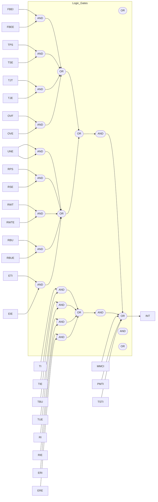

Figure 26-17 Ethernet interrupts

# 26.3 EMAC registers

Table 26-8 shows the Ethernet register map and its reset values.

The peripheral registers can be accessed by bytes (8-bit), half words (16-bit) or words (32-bit).

<u>Table 26-8 Ethernet register map </u>and its reset values

| Register            | Offset | Reset value |
| ------------------- | ------ | ----------- |
| EMAC\_MACCTRL       | 0x00   | 0x0000 8000 |
| EMAC\_MACFRMF       | 0x04   | 0x0000 0000 |
| EMAC\_MACHTH        | 0x08   | 0x0000 0000 |
| EMAC\_MACHTL        | 0x0C   | 0x0000 0000 |
| EMAC\_MACMIIADDR    | 0x10   | 0x0000 0000 |
| EMAC\_MACMIIDT      | 0x14   | 0x0000 0000 |
| EMAC\_MACFCTRL      | 0x18   | 0x0000 0000 |
| EMAC\_MACVLT        | 0x1C   | 0x0000 0000 |
| EMAC\_MACRWFF       | 0x28   | 0x0000 0000 |
| EMAC\_MACPMTCTRLSTS | 0x2C   | 0x0000 0000 |
| EMAC\_MACISTS       | 0x38   | 0x0000 0000 |
| EMAC\_MAIMR      | 0x3C   | 0x0000 0000 |
| EMAC\_MACA0H     | 0x40   | 0x0010 FFFF |
| EMAC\_MACA0L     | 0x44   | 0xFFFF FFFF |
| EMAC\_MACA1H     | 0x48   | 0x0000 FFFF |
| EMAC\_MACA1L     | 0x4C   | 0xFFFF FFFF |
| EMAC\_MACA2H     | 0x50   | 0x0000 FFFF |
| EMAC\_MACA2L     | 0x54   | 0xFFFF FFFF |
| EMAC\_MACA3H     | 0x58   | 0x0000 FFFF |
| EMAC\_MACA3L     | 0x5C   | 0xFFFF FFFF |
| EMAC\_MMCCTRL    | 0x100  | 0x0000 0000 |
| EMAC\_MMCRI      | 0x104  | 0x0000 0000 |
| EMAC\_MMCTI      | 0x108  | 0x0000 0000 |
| EMAC\_MMCRIM     | 0x10C  | 0x0000 0000 |
| EMAC\_MMCTIM     | 0x110  | 0x0000 0000 |
| EMAC\_MMCTFSCC   | 0x14C  | 0x0000 0000 |
| EMAC\_MMCTFMSCC  | 0x150  | 0x0000 0000 |
| EMAC\_MMCTFCNT   | 0x168  | 0x0000 0000 |
| EMAC\_MMCRFCECNT | 0x194  | 0x0000 0000 |
| EMAC\_MMCRFAECNT | 0x198  | 0x0000 0000 |
| EMAC\_MMCRGUFCNT | 0x1C4  | 0x0000 0000 |
| EMAC\_PTPTSCTRL  | 0x700  | 0x0000 2000 |
| EMAC\_PTPSSINC   | 0x704  | 0x0000 0000 |
| EMAC\_PTPTSH     | 0x708  | 0x0000 0000 |
| EMAC\_PTPTSL     | 0x70C  | 0x0000 0000 |
| EMAC\_PTPTSH     | 0x708  | 0x0000 0000 |
| EMAC\_PTPTSL     | 0x70C  | 0x0000 0000 |
| EMAC\_PTPTSHUD   | 0x710  | 0x0000 0000 |
| EMAC\_PTPTSLUD   | 0x714  | 0x0000 0000 |
| EMAC\_PTPTSAD    | 0x718  | 0x0000 0000 |
| EMAC\_PTPTTH     | 0x71C  | 0x0000 0000 |
| EMAC\_PTPTTL     | 0x720  | 0x0000 0000 |
| EMAC\_PTPTSSR    | 0x728  | 0x0000 0000 |
| EMAC\_PTPPPSCR   | 0x72c  | 0x0000 0000 |
| EMAC\_DMABM      | 0x1000 | 0x0002 0101 |
| EMAC\_DMATPD     | 0x1004 | 0x0000 0000 |
| EMAC\_DMARPD     | 0x1008 | 0x0000 0000 |
| EMAC\_DMARDLADDR | 0x100C | 0x0000 0000 |
| EMAC\_DMATDLADDR | 0x1010 | 0x0000 0000 |
| EMAC\_DMASTS     | 0x1014 | 0x0000 0000 |
| EMAC\_DMAOPM     | 0x1018 | 0x0000 0000 |
| EMAC\_DMAIE      | 0x101C | 0x0000 0000 |
| EMAC\_DMAMFBOCNT | 0x1020 | 0x0000 0000 |
| EMAC\_DMACTD     | 0x1048 | 0x0000 0000 |
| EMAC\_DMACRD     | 0x104C | 0x0000 0000 |
| EMAC\_DMACTBADDR | 0x1050 | 0x0000 0000 |
| EMAC\_DMACRBADDR | 0x1054 | 0x0000 0000 |

# 26.3.1 Ethernet MAC configuration register (EMAC_MACCTRL)

The Ethernet MAC configuration register defines the receive and transmit operation modes.

A delay greater than 4μs is required for two consecutive write accesses to this register.

| Bit        | Name     | Reset value | Type | Description                                                                                                                                                                                                                                                                                                                                                                                               |
| ---------- | -------- | ----------- | ---- | --------------------------------------------------------------------------------------------------------------------------------------------------------------------------------------------------------------------------------------------------------------------------------------------------------------------------------------------------------------------------------------------------------- |
| Bit 31: 26 | Reserved | 0x00        | resd | Kept at its default value.                                                                                                                                                                                                                                                                                                                                                                                |
| Bit 25     | CST      | 0x0         | rw   | CRC stripping for type frames When this bit is set, the last four bytes (FCS) of the Ethernet type frame is stripped before being transmitted to the application.                                                                                                                                                                                                                                     |
| Bit 24     | Reserved | 0x0         | resd | Kept at its default value.                                                                                                                                                                                                                                                                                                                                                                                |
| Bit 23     | WD       | 0x0         | rw   | Watchdog Disable When this bit is set, the MAC disables the watchdog timer on the receiver, and can receive frames of up to 16,384 bytes. When this bit is cleared, the MAC allows no more than 2048 bytes of the frames being received.                                                                                                                                                          |
| Bit 22     | JD       | 0x0         | rw   | Jabber Disable When this bit is set, the MAC disables the Jabber timer on the transmitter, and can transfer frames of up to 16,384 bytes. When this bit is cleared, the MAC cuts of the transmitter if the application sends out more than 2048 bytes of data during transmission.                                                                                                                |
| Bit 21: 20 | Reserved | 0x0         | resd | Kept at its default value.                                                                                                                                                                                                                                                                                                                                                                                |
| Bit 19: 17 | IFG      | 0x0         | rw   | InterFrame Gap These bits are used to define the minimum interframe gap between frames during transmission. 000: 96 bit times 001: 88 bit times 010: 80 bit times ... 111: 40 bit times In half-duplex mode, the minimum IFG can be configured *as 64 bit times (IFG=100). Lower values are not allowed.*                                                                     |
| Bit 16     | DCS      | 0x0         | rw   | Disable Carrier Sense When this bit is set, the MAC transmitter will ignore the MII CRS signal during frame transmission in half-duplex mode. No error is reported due to loss of carrier or no carrier during transmission. When this bit is cleared, the MAC transmitter will report errors due to carrier sense and even abort the transmission. This bit is reserved in full-duplex mode. |
| Bit 15     | Reserved | 0x1         | resd | Kept at its default value.                                                                                                                                                                                                                                                                                                                                                                                |
| Bit 14     | FES      | 0x0         | rw   | Fast EMAC Speed This bit indicates the speed of the MII, RMII interface. 0: 10 Mbps 1: 100 Mbps                                                                                                                                                                                                                                                                                               |
| Bit 13     | DRO      | 0x0         | rw   | Disable Receive Own When this bit is set, the MAC disables the frame reception in half-duplex mode if the phy\_txen\_o is enabled. When this bit is cleared, the MAC will receive all packets that are given by the PHY during transmission. *This bit is not applicable when the MAC is in full-duplex*                                                                                      |
|          |          |     |      | mode. This bit is reserved (with default value RO) when the MAC is configured as “For full-duplex mode only” mode.                                                                                                                                                                                                                                                                                                                                                                                                                                                                                                                                                                                                                                                                                                                                                                                                                                                                                |
| Bit 12   | LM       | 0x0 | rw   | Loopback Mode When this bit is set, the MAC MII operates in loopback mode. The MII receive clock input (clk\_rx\_i) is required for the loopback mode to work normally, for the transmit clock is not looped-back internally.                                                                                                                                                                                                                                                                                                                                                                                                                                                                                                                                                                                                                                                                                                                                                                     |
| Bit 11   | DM       | 0x0 | rw   | Duplex Mode When this bit is set, the MAC operates in full-duplex mode, in which it can transmit and receive simultaneously.                                                                                                                                                                                                                                                                                                                                                                                                                                                                                                                                                                                                                                                                                                                                                                                                                                                                      |
| Bit 10   | IPC      | 0x0 | rw   | IPv4 Checksum When this bit is set, the MAC calculates the 16-bit complement sum of all received Ethernet frames and enables IPv4 header checksum (assuming it is bytes 26-26 or 29-30 (VLANtagged)) for received frames, and gives the status in the receive status information. The MAC also appends the 16-bit checksum of the calculated IP header packets (bytes after the IPv4header ), and adds it to the Ethernet frame that has been sent out to the application (when Type 2 COE is deselected). When this bit is cleared, this feature is disabled. When this bit is set, IPv4 header checksum feature and IPv4 or IPv6 TCP, UDP or ICMP payload checksum feature is enabled while the Type 2 COE is selected. When this bit is cleared, the COE function in the receiver is disabled, and the corresponding PCE and IP HCE status bits are always 0. This bit is reserved (with default value RO) if the IP checksum mechanism is disabled during the core configuration. |
| Bit 9    | DR       | 0x0 | rw   | Disable Retry When this bit is set, the MAC attempts only 1 transmission. When a collision occurs on the MII interface, the MAC will ignore the current frame transmission and report a frame abort because of excessive collision error in the transmit frame status. When this bit is cleared, the MAC attempts retries based on the settings of BL (\[6: 5]). This bit is applicable only in half-duplex mode. It is reserved (with default value RO) in “For full-duplex mode only” mode.                                                                                                                                                                                                                                                                                                                                                                                                                                                                                                 |
| Bit 8    | Reserved | 0x0 | resd | Kept at its default value.                                                                                                                                                                                                                                                                                                                                                                                                                                                                                                                                                                                                                                                                                                                                                                                                                                                                                                                                                                            |
| Bit 7    | ACS      | 0x0 | rw   | Automatic pad/CRC Stripping When this bit is set, the MAC strips the pad/FCS field on received frames only when the frame length is shorter than 1536 bytes. All received frame with length field greater than or equal to 1536 bytes are passed on to the application without stripping the Pad or FCS field. When this bit is cleared, the MAC will forward all received frames to the master without changing its contents.                                                                                                                                                                                                                                                                                                                                                                                                                                                                                                                                                                |
| Bit 6: 5 | BL       | 0x0 | rw   | Back-off Limit The Back-off limit defines the random integer number (r) of slot time delays (512 bit times for 10/100 Mbps) the MAC waits before retries after a collision. This field is applicable only in the half-duplex mode. It is reserved (RO) in “For full-duplex mode only” mode. 00: k= min (n, 10) 01: k = min (n, 8) 10: k = min (n, 4) 11: k = min (n, 1) Where n = the number of slot time delays for retransmission attempt, and r takes the random integer value in the range 0 ≤ r < 2k.                                                                                                                                                                                                                                                                                                                                                                                                                                                                    |
| Bit 4    | DC       | 0x0 | rw   | Deferral Check                                                                                                                                                                                                                                                                                                                                                                                                                                                                                                                                                                                                                                                                                                                                                                                                                                                                                                                                                                                        |
|          |          |     |      | When this bit is set, the deferral check function is enabled in the MAC. The MAC issues a frame abort status and sets the excessive deferral error flag bit in the transmit frame status when the transmit state machine is delayed for more than 24288 bit times in 10/100 Mbit/s mode. If the Jumbo frame mode is enabled in 10/100 Mbps mode, the deferral threshold is 155680 bit times. Deferral begins when the transmitter is ready to transmit, but is prevented when an active carrier sense signals is detected on the MII. Deferral time is not cumulative. For instance, if the transmitter is deferred for 10000 bit times because that the CRS signals is active first, but then becomes inactive, then transmits, collides, backs off because of collision, and then has to defer again after the completion of back-off, the deferral times resets to 0 and restarts. When this bit is cleared, the deferral check function is disabled. The MAC defers until the CRS signal becomes inactive. This bit is applicable only in the half-duplex mode. It is reserved (RO) in “For full-duplex mode only” mode. |
| Bit 3    | TE       | 0x0 | rw   | Transmitter Enable When this bit is set, the transmit state machine of the MAC is enabled. when this bit is cleared, the MAC disables the transmit state machine after the completion of the current frame transmission, and does not transmit any further frames (To modify this bit through consecutive commands, if needed, a deferral value greater than 4us is required between two consecutive operations)                                                                                                                                                                                                                                                                                                                                                                                                                                                                                                                                                                                                                                                                                                                 |
| Bit 2    | RE       | 0x0 | rw   | Receiver Enable When this bit is set, the receive state machine of the MAC is enabled. when this bit is cleared, the MAC disables the receive state machine after the completion of the current frame reception, and does not receive any further frames (To modify this bit through consecutive commands, if needed, a deferral value greater than 4us is required between two consecutive operations).                                                                                                                                                                                                                                                                                                                                                                                                                                                                                                                                                                                                                                                                                                                         |
| Bit 1: 0 | Reserved | 0x0 | resd | Kept at its default value.                                                                                                                                                                                                                                                                                                                                                                                                                                                                                                                                                                                                                                                                                                                                                                                                                                                                                                                                                                                                                                                                                                           |

## 26.3.2 Ethernet MAC frame filter register (EMAC_MACFRMF)

The Ethernet MAC frame filter register contains the filter control bits for receiving frames. Some of the control bits got to the address check block of the MAC to perform the first level of address filtering.

The second level of filtering is performed on the incoming frames based on other control bits (such as pass bad frames and pass control frames).

| Bit        | Name     | Reset value | Type | Description                                                                                                                                                                                                                                                                                                                                                                                                                                                                  |
| ---------- | -------- | ----------- | ---- | ---------------------------------------------------------------------------------------------------------------------------------------------------------------------------------------------------------------------------------------------------------------------------------------------------------------------------------------------------------------------------------------------------------------------------------------------------------------------------- |
| Bit 31     | RA       | 0x0         | rw   | Receive All When this bit is set, the MAC passes all received frames onto the application, irrespective of whether they have passed through the address filter. The result (pass or fail) of the source address or destination address filtering is updated in the corresponding bits of the receive status word. When this bit is cleared, the MAC passes on to the application only those frames that have passed the source address or destination address filtering. |
| Bit 30: 11 | Reserved | 0x00000     | resd | Kept at its default value.                                                                                                                                                                                                                                                                                                                                                                                                                                                   |
| Bit 10     | HPF      | 0x0         | rw   | Hash or Perfect Filter When this bit is set, the address filter passes frames that match the perfect filter or hash filter set by the HMC or HUC bit. When this bit is cleared, if the HUC or HMC bit is set, only frames that match the hash filter can pass address filter.                                                                                                                                                                                        |
| Bit 9      | SAF      | 0x0         | rw   | Source Address Filter When this bit is set, the MAC compares the source address of the received frame with the value programmed in the enabled source address registers. If the comparison                                                                                                                                                                                                                                                                               |
|          |      |     |    | mismatches, the MAC will drop this frame. (SAF). When this bit is cleared, the MAC forwards the received frame to the application and updates the source address filter bit (SAF) in the receive status based on the source address comparison.                                                                                                                                                                                                                                                                                                                                                                                                                                                                                                                                                                                                                                                                                                                                                                   |
| Bit 8    | SAIF | 0x0 | rw | Source Address Inverse Filtering When this bit is set, the address check block operates in inverse filtering mode. The frame whose source address matches the source address register is marked as failing the source address filter. When this bit is cleared, the frame whose source address does not match the source address register is marked as failing the source address filter.                                                                                                                                                                                                                                                                                                                                                                                                                                                                                                                                                                                                                     |
| Bit 7: 6 | PCF  | 0x0 | rw | Pass Control Frames These bits control the forwarding of all control frames (including unicast and multicast Pause frames). 00: MAC filters all control frames and prevents them from reaching the application 01: MAC forwards all control frames, except Pause frame, to the application even if they fail the address filter 10: MAC forwards all control frames to the application even if they fail the address filter 11: MAC forwards control frames that pass the address filter to the application The following conditions must be met when dealing with a Pause frame: 1: When the MAC is in full-duplex mode, the bit 2 (REF) is set in the register 6 (flow control register) to enable flow control. 2: When the bit 3 (UP) is set in the register 6 (flow control register), the destination address of the received frames matches the specific multicast address or MAC address 0. 3: Type field of the receive frame is 0x8808, and the OPCODE field is 0x0001. |
| Bit 5    | DBF  | 0x0 | rw | Disable Broadcast Frames When this bit is set, the address filters filter all incoming broadcast frames. In addition, all other filter settings will also be overwritten. When this bit is set, the address filters pass all incoming broadcast frames.                                                                                                                                                                                                                                                                                                                                                                                                                                                                                                                                                                                                                                                                                                                                                       |
| Bit 4    | PMC  | 0x0 | rw | Pass MultiCast When this bit is set, all frames with a multicast destination address (first bit in the destination address is set) are passed. When this bit is cleared, the filtering of a multicast frame depends on the HMC bit.                                                                                                                                                                                                                                                                                                                                                                                                                                                                                                                                                                                                                                                                                                                                                                           |
| Bit 3    | DAIF | 0x0 | rw | Destination Address Inverse Filtering When this bit is set, the address check block operates in inverse filtering mode for the destination address comparison for both unicast and multicast frames. When this bit is cleared, the filter work normally.                                                                                                                                                                                                                                                                                                                                                                                                                                                                                                                                                                                                                                                                                                                                                      |
| Bit 2    | HMC  | 0x0 | rw | Hash MultiCast When this bit is set, the MAC performs destination address filtering of the received multicast frames according to the hash table. When this bit is cleared, the MAC performs a perfect destination address filtering for multicast frames, that is, it compares the destination address field with the values programmed in the destination registers. This bit is reserved if Hash filter is not selected during core configuration.                                                                                                                                                                                                                                                                                                                                                                                                                                                                                                                                                     |
| Bit 1    | HUC  | 0x0 | rw | Hash UniCast When this bit is set, the MAC performs destination address filtering for unicast frames according to the hash table. When this bit is cleared, the MAC performs a perfect                                                                                                                                                                                                                                                                                                                                                                                                                                                                                                                                                                                                                                                                                                                                                                                                                        |
| Bit   | Name | Reset value | Type | Description                                                                                                                                                                                                                                                        |
|       |      |             |      | destination address filtering for unicast frames, that is, it compares the destination address field with the values programmed in the destination registers.                                                                                                      |
| Bit 0 | PR   | 0x0         | rw   | **Promiscuous Mode** When this bit is set, the address filters pass all incoming frames regardless of their destination or source address. When the PR is set, the source address or destination *address error bits in the receive status word are always 0.* |

## 26.3.3 Ethernet MAC Hash table high register (EMAC_MACHTH)

The 64-bit Hash table is used for group address filtering. For Hash filtering, the contents of the destination address of the incoming frame pass through the CRC logic, and the upper 6 bits in the CRC register are used to index the Hash table. The most significant bit of the CRC determines the register to be used (EMAC_MACHTH or EMAC_MACHTL), and the other 5 bits determine which bit in the register is to be used. The Hash value 5b'00000 uses the bit 0 in the selected register, while the Hash value 5b'11111 uses the bit 31 in the selected register.

The Hash value of the destination address is calculated according to the following steps:

1. Calculate a 32-bit CRC value of the destination address (see IEEE 802.3, and refer to 3.2.8 section for more details)
2. Bit invert the value obtained in Step 1
3. Take the upper 6 bits from the values obtained in Step 2

For example, if the destination address of the incoming frame is 0x1F52419CB6AF (0x1F is the first byte received on the MII interface), the calculated 6-bit Hash value is 0x2C and the bit 12 in the EMAC_MACHTH registers checked for filtering. If the destination address of the incoming frame is 0xA00A98000045, the calculated 6-bit Hash value is 0x07, and the bit 7 in the EMAC_MACHTL register is checked for filtering.

| Bit    | Name | Reset value | Type | Description                                            |
| ------ | ---- | ----------- | ---- | ------------------------------------------------------ |
| Bit 31 | HTH  | 0x0000 0000 | rw   | This bit contains the upper 32 bits of the Hash table. |

## 26.3.4 Ethernet MAC Hash table low register (EMAC_MACHTL)

The EMAC_MACHTL register contains the lower 32 bits of the Hash table. If the Hash filter is disabled or either 128-bit or 256-bit Hash table is selected, both register 2 and register 3 are reserved.

| Bit    | Name | Reset value | Type | Description                                                                   |
| ------ | ---- | ----------- | ---- | ----------------------------------------------------------------------------- |
| Bit 31 | HTL  | 0x0000 0000 | rw   | **Hash Table Low** This bit contains the lower 32 bits of the Hash table. |

## 26.3.5 Ethernet MAC MII address register (EMAC_MACMIIADDR)

The Ethernet MAC MII address register controls the <u>external PHY through the management interface.</u>

| Bit        | Name     | Reset value | Type | Description                                                                                                                                                                                                                                                                                                                                                                                                                                                                                                                                                                                                                |
| ---------- | -------- | ----------- | ---- | -------------------------------------------------------------------------------------------------------------------------------------------------------------------------------------------------------------------------------------------------------------------------------------------------------------------------------------------------------------------------------------------------------------------------------------------------------------------------------------------------------------------------------------------------------------------------------------------------------------------------- |
| Bit 31: 16 | Reserved | 0x0000      | resd | Kept at its default value.                                                                                                                                                                                                                                                                                                                                                                                                                                                                                                                                                                                                 |
| Bit 15: 11 | PA       | 0x00        | rw   | **PHY Address** This field indicates which of the 32 possible PHY devices are being accessed.                                                                                                                                                                                                                                                                                                                                                                                                                                                                                                                          |
| Bit 10: 6  | MII      | 0x00        | rw   | **MII Register** *This field select the desired MII register in the PHY device.*                                                                                                                                                                                                                                                                                                                                                                                                                                                                                                                                       |
| Bit 5: 2   | CR       | 0x0         | rw   | **Clock Range** The CSR clock range selection determines the MDC clock frequency based on the used CSR clock frequency. Each value (when bit 5=0) has its corresponding CSR clock frequency range in order to ensure that the MDC clock frequency is roughly between 1.0 MHz and 2.5 MHz. 0000: CSR clock frequency is 60–100 MHz, and MDC clock frequency is CSR clock/42 0001: CSR clock frequency is 100–150 MHz, and MDC clock frequency is CSR clock/62 0010: CSR clock frequency is 20–35 MHz, and MDC clock frequency is CSR clock/16 0011: CSR clock frequency is 35–60 MHz, and MDC clock |
|       |      |             |      | frequency is CSR clock/26 0100: CSR clock frequency is 150–250 MHz, and MDC clock frequency is CSR clock/102 0101: CSR clock frequency is 250–288 MHz, and MDC clock frequency is CSR clock/124 0110, 0111: Reserved                                                                                                                                                                                                                                                                                                                                                                                                                                                                                                                                                                                                                                  |
| Bit 1 | MW   | 0x0         | rw   | MII Write When this bit is set, it indicates that the EMAC\_MACMIIDT register is used for a write operation to the PHY. When this bit is not set, it is a read operation, and the data is loaded to the EMAC\_MACMIIDT register.                                                                                                                                                                                                                                                                                                                                                                                                                                                                                                                                                                                                                          |
| Bit 0 | MB   | 0x0         | rw   | MII Busy This bit should read a logic 0 before writing to the EMAC\_MACMIIADDR and EMAC\_MACMIIDT register. During a PHY register access, this bit is set to 1'b1 by software, indicating that a read or write access is in progress. The EMAC\_MACMIIDT register is invalid before this bit is cleared by the MAC. Thus, the MII data should be kept valid until this bit is cleared by the MAC during a PHY write operation. Similarly, the EMAC\_MACMIIDT value is invalid until this bit is cleared by the MAC during a PHY read operation. The previous operation must be completed before performing subsequent read or write operations. This is because that there will be no acknowledgement from PHY to MAC after the completion of a read or write operation, the function of this bit will not change even if the PHY is not present. |

## 26.3.6 Ethernet MAC MII data register (EMAC_MACMIIDT)

The Ethernet MAC MII data register stores data to be written to the PHY register located at the address specified in the EMAC_MACMIIADDR register. EMAC_MACMIIDT register also stores data read out from the PHY registers.

| Bit        | Name     | Reset value | Type | Description                                                                                                                                                   |
| ---------- | -------- | ----------- | ---- | ------------------------------------------------------------------------------------------------------------------------------------------------------------- |
| Bit 31: 16 | Reserved | 0x0000      | resd | Kept at its default value.                                                                                                                                    |
| Bit 15: 0  | MD       | 0x0000      | rw   | MII Data This field contains the 16-bit value from the PHY after a read operation, or the 16-bit value to be written to the PHY before a write operation. |

## 26.3.7 Ethernet MAC flow control register (EMAC_MACFCTRL)

The Ethernet MAC flow control register controls the generation and reception of the control frames by the MAC flow control block. Writing 1 to the Busy bit triggers the flow control block to generate a Pause frame. The field of the control frame is selected as defined in the 802.3x specification, and the Pause Time value from this register is used in the Pause Time field of the control frame. The Busy bit remains set before the control frame is transferred onto the cable. The host must make sure that the Busy bit is cleared before writing to the register.

| Bit        | Name     | Reset value | Type | Description                                                                                                                                                                                                                                                                                                                                |
| ---------- | -------- | ----------- | ---- | ------------------------------------------------------------------------------------------------------------------------------------------------------------------------------------------------------------------------------------------------------------------------------------------------------------------------------------------ |
| Bit 31: 16 | PT       | 0x0000      | rw   | Pause Time This field contains the value to be used in the Pause Time field of the control frame. If the Pause Time bit is configured to be double-synchronized to the MII clock domain, then consecutive write operations to this register should be performed only after at least four clock cycles in the destination clock domain. |
| Bit 15: 8  | Reserved | 0x00        | resd | Kept at its default value.                                                                                                                                                                                                                                                                                                                 |
| Bit 7      | DZQP     | 0x0         | rw   | Disable Zero-Quanta Pause When this bit is set, it disables the automatic generation of Zero-quanta Pause frame while the flow control signal of the FIFO layer is disabled.                                                                                                                                                           |

When this bit is cleared, normal operation resumes. The automatic generation of Zero-quanta Pause frame is enabled.

| Bit 6    | Reserved | 0x0 | resd    | Kept at its default value.                                                                                                                                                                                                                                                                                                                                                                                                                                                                                                                                                                                                                                                                                                                                                                                                                                                                                                                                                                            |
| -------- | -------- | --- | ------- | ----------------------------------------------------------------------------------------------------------------------------------------------------------------------------------------------------------------------------------------------------------------------------------------------------------------------------------------------------------------------------------------------------------------------------------------------------------------------------------------------------------------------------------------------------------------------------------------------------------------------------------------------------------------------------------------------------------------------------------------------------------------------------------------------------------------------------------------------------------------------------------------------------------------------------------------------------------------------------------------------------- |
| Bit 5: 4 | PLT      | 0x0 | rw      | Pause Low Threshold This field defines the threshold of the Pause timer. The threshold values should always be less than the Pause time defined in the \[31: 16] bit. For example, if PT = 100H (256 slot times), and PLT = 01, then a second Pause frame is automatically transmitted if initiated at 228 (256-28) slot times after the first Pause frame is transmitted. Threshold selection as follows: 00: Pause time minus 4 slot times (PT minus 4 slot times) 01: Pause time minus 28 slot times (PT minus 28 slot times) 10: Pause time minus 144 slot times (PT minus 144 slot times) 11: Pause time minus 256 slot times (PT minus 256 slot times) Slot time is defined as the time taken to transmit 512 bits (64 bytes) on the MII interface.                                                                                                                                                                                                             |
| Bit 3    | DUP      | 0x0 | rw      | Detect Unicast Pause Frame The Pause frame with a unique multicast address as specified in the IEEE 802.3 will be processed. When this bit is set, the MAC detects the Pause frames with a unicast address specified in the MAC address0 high and MAC address0 low registers. When this bit is cleared, the MAC detects only a Pause frame with a unique multicast address. Note: If the multicast address of the received frame does not match the unique multicast address, the MAC will not process the Pause frame.                                                                                                                                                                                                                                                                                                                                                                                                                                                                   |
| Bit 2    | ERF      | 0x0 | rw      | Enable Receive Flow control When this bit is set, the MAC decodes the received Pause frame and disables the transmitter for a period of time. When this bit is cleared, the decode function of the Pause frame is disabled.                                                                                                                                                                                                                                                                                                                                                                                                                                                                                                                                                                                                                                                                                                                                                                   |
| Bit 1    | ETF      | 0x0 | rw      | Enable Transmit Flow control In full-duplex mode, when this bit is set, the MAC enables the flow control operation to transmit Pause frames. When this bit is cleared, the flow control of the MAC is disabled, and the MAC does not transmit any Pause frames. In half-duplex mode, when this bit is set, the MAC enables the back-pressure feature. When this bit is cleared, the back-pressure feature is disabled.                                                                                                                                                                                                                                                                                                                                                                                                                                                                                                                                                                        |
| Bit 0    | FCB/BPA  | 0x0 | rw1c/rw | Flow Control Busy/Back Pressure Activate In full-duplex mode, this bit initiates a Pause frame; in half-duplex mode, the back-pressure feature is activated if the TFE bit is set. In full-duplex mode, this bit is read as 1'b0 before writing to the EMAC\_MACFCTRL register. The application must set this bit to 1'b1 to initiate a Pause frame. During a control frame transmission, this bit remains set, indicating that a frame transmission is in progress. After the completion of the Pause frame, the MAC resets this bit to 1'b0. The Ethernet MAC flow control register (EMAC\_MACFCTRL) should not be written until this bit is cleared. In half-duplex mode, when this bit is set (and the TFE is set), the back-pressure feature is activated by the MAC. During back pressure, when the MAC receives a new frame, the transmitter starts sending a JAM mode, resulting a collision. When the MAC is configured to full-duplex mode, the back-pressure (BPA) function is |

automatically disabled.

# 26.3.8 Ethernet MAC VLAN tag register (EMAC_MACVLT)

The Ethernet MAC VLAN tag register contains the IEEE 802.1Q VLAN tag to identify the VLAN frames. The MAC compares the 13ᵗʰ and 14ᵗʰ bytes of the received frame (length/type) with 16’h8100, and the following 2 bytes are compared with the VLAN tag. If the comparison matches, the VLAN bit is set in the receive frame status. The legal length of the VLAN frame is increased from 1518 bytes to 1522 bytes.

If the EMAC_MACVLT register is configured to be double-synchronized to the (G)MII clock domain, then consecutive write operations to this register should be performed at least four clock cycles in the destination clock domain.

| Bit        | Name     | Reset value | Type | Description                                                                                                                                                                                                                                                                                                                                                                                                                                                                                                                                                                                                                                                                                      |
| ---------- | -------- | ----------- | ---- | ------------------------------------------------------------------------------------------------------------------------------------------------------------------------------------------------------------------------------------------------------------------------------------------------------------------------------------------------------------------------------------------------------------------------------------------------------------------------------------------------------------------------------------------------------------------------------------------------------------------------------------------------------------------------------------------------ |
| Bit 31: 17 | Reserved | 0x0000      | resd | Kept at its default value.                                                                                                                                                                                                                                                                                                                                                                                                                                                                                                                                                                                                                                                                       |
| Bit 16     | ETV      | 0x0         | ro   | Enable 12-bit VLAN tag comparison When this bit is set, a 12-bit VLAN identifier, rather than a 16-bit VLAN tag, is used for comparison and filtering. The bit \[11: 0] of the VLAN tag is compared with the corresponding filed in the received VLAN-tagged frame. Similarly, if enabled, only a 12-bit VLAN tag is used for hash VLAN filtering. When this bit is cleared, the 16 bits of the received VLAN frame’s 15th and 16th bytes are used for comparison and VLAN hash filtering.                                                                                                                                                                                               |
| Bit 15: 0  | VTI      | 0x0000      | rw   | VLAN Tag Identifier (for receive frames) This field contains the 802.1Q VLAN tag to identify VLAN frames, which is compared with the 15th and 16th bytes of the received VLAN frames, described as follows: Bit \[15: 13]: User priority Bit 12: Canonical format indicator (CFI) or drop eligible indicator (DEI) Bit \[11: 0]: VLAN tag’s VLAN identifier field When the ETV bit is set, only the VID (\[11: 0]) is used for comparison. If the VL is all zero (if the ETV is set, then VL\[11: 0] is all zero), the MAC does not check the 15th and 16th bytes for VLAN tag comparison, and treats all frames with a type field value of 0x8100 or 0x88a8 as VLAN frames. |

# 26.3.9 Ethernet MAC remote wakeup frame filter register (EMAC_MACRWFF)

The PMT CSR sets the request wakeup events and detects the wakeup events.

Figure 26-18 Ethernet MAC remote wakeup frame filter register (EMAC_MACRWFF)

| Wkuppktfilter\_reg0 | Filter 0 Byte Mask |              |                 |              |                 |              |                 |              |
| ------------------- | ------------------ | ------------ | --------------- | ------------ | --------------- | ------------ | --------------- | ------------ |
| Wkuppktfilter\_reg1 | Filter 1 Byte Mask |              |                 |              |                 |              |                 |              |
| Wkuppktfilter\_reg2 | Filter 2 Byte Mask |              |                 |              |                 |              |                 |              |
| Wkuppktfilter\_reg3 | Filter 3 Byte Mask |              |                 |              |                 |              |                 |              |
| Wkuppktfilter\_reg4 | RESD               | Filter 3 Cmd | RESD            | Filter 2 Cmd | RESD            | Filter 1 Cmd | RESD            | Filter 0 Cmd |
| Wkuppktfilter\_reg5 | Filter 3 Offset    |              | Filter 2 Offset |              | Filter 1 Offset |              | Filter 0 Offset |              |
| Wkuppktfilter\_reg6 | Filter 1 CRC-16    |              |                 |              | Filter 0 CRC-16 |              |                 |              |
| Wkuppktfilter\_reg7 | Filter 3 CRC-16    |              |                 |              | Filter 2 CRC-16 |              |                 |              |

# 26.3.10 Ethernet MAC PMT control and status register (EMAC_MACPMTCTRLSTS)

The Ethernet MAC PMT control and status register sets the request wakeup events and detects the wakeup events.

| Bit        | Name     | Reset value | Type | Description                                                                                                                                                                                                                                                                                                                                                                                                                                                                                                                                                                 |
| ---------- | -------- | ----------- | ---- | --------------------------------------------------------------------------------------------------------------------------------------------------------------------------------------------------------------------------------------------------------------------------------------------------------------------------------------------------------------------------------------------------------------------------------------------------------------------------------------------------------------------------------------------------------------------------- |
| Bit 31     | RWFFPR   | 0x0         | rw1s | Remote Wakeup Frame Filter Register Pointer Reset When this bit is set, it resets the remote frame filter register pointer to 3'b000. This bit is automatically cleared after one clock cycle.                                                                                                                                                                                                                                                                                                                                                                          |
| Bit 30: 10 | Reserved | 0x000000    | resd | Kept at its default value.                                                                                                                                                                                                                                                                                                                                                                                                                                                                                                                                                  |
| Bit 9      | GUC      | 0x0         | rw   | Global UniCast When this bit is set, it enables all unicast packets filtered by the MAC address filtering to be remote wakeup frames.                                                                                                                                                                                                                                                                                                                                                                                                                                   |
| Bit 8: 7   | Reserved | 0x0         | resd | Kept at its default value.                                                                                                                                                                                                                                                                                                                                                                                                                                                                                                                                                  |
| Bit 6      | RRWF     | 0x0         | rrc  | Received Remote Wakeup Frame When this bit is set, it indicates that the power management event was generated because of the reception of a remote wakeup frame. This bit is cleared by a read access to this register.                                                                                                                                                                                                                                                                                                                                                 |
| Bit 5      | RMP      | 0x0         | rrc  | Received Magic Packet When this bit is set, it indicates that the power management event is generated because of the reception of a Magic packet. This bit is cleared by a read access to this register.                                                                                                                                                                                                                                                                                                                                                                |
| Bit 4: 3   | Reserved | 0x0         | resd | Kept at its default value.                                                                                                                                                                                                                                                                                                                                                                                                                                                                                                                                                  |
| Bit 2      | ERWF     | 0x0         | rw   | Enable Remote Wakeup Frame When this bit is set, it indicates that the power management event is generated due to a remote wakeup frame reception.                                                                                                                                                                                                                                                                                                                                                                                                                      |
| Bit 1      | EMP      | 0x0         | rw   | Enable Magic Packet When this bit is set, it indicates that the power management event is generated due to a Magic packet reception.                                                                                                                                                                                                                                                                                                                                                                                                                                    |
| Bit 0      | PD       | 0x0         | rw1s | Power Down When this bit is set, the MAC receiver will drop all received frames after receiving the expected Magic packet or a remote wakeup frame. Then this bit is automatically cleared and power-down mode is disabled. This bit can also be cleared by software before the expected Magic packet or a remote wakeup frame is received. After this bit is cleared, the MAC forwards the receive frames to the application. This bit must only be set when either the Magic Packet enable bit, global unicast bit or the remote wakeup frame enable bit is set high. |

# 26.3.11 Ethernet MAC interrupt status register (EMAC_MACISTS)

The Ethernet MAC interrupt status register identify the events in the MAC that can generate an interrupt.

| Bit        | Name     | Reset value | Type | Description                                                                                                                                                                                                                                      |
| ---------- | -------- | ----------- | ---- | ------------------------------------------------------------------------------------------------------------------------------------------------------------------------------------------------------------------------------------------------ |
| Bit 15: 10 | Reserved | 0x00        | resd | Kept at its default value.                                                                                                                                                                                                                       |
| Bit 9      | TIS      | 0x0         | rrc  | Timestamp Interrupt Status When this bit is set, it indicates that the system time value equals or exceeds the value programmed in the destination time registers. This bit is cleared after the completion of a read operation to this bit. |
| Bit 8: 7   | Reserved | 0x0         | resd | Kept at its default value.                                                                                                                                                                                                                       |
| Bit 6      | MTIS     | 0x0         | ro   | MMC Transmit Interrupt Status This bit is set when an interrupt event is generated in the EMAC\_MMCTI register. This bit is cleared when all bits in the transmit interrupt register are cleared.                                            |
| Bit 5      | MRIS     | 0x0         | ro   | MMC Receive Interrupt Status This bit is set when an interrupt is generated in the                                                                                                                                                           |
|          |          |             |      | EMAC\_MMCRI register. This bit is cleared when all bits in the receive interrupt register are cleared.                                                                                                                                                                                        |
| Bit 4    | MIS      | 0x0         | ro   | MMC Interrupt Status This bit is set whenever any bit of the \[7: 5] bit is set high. This bit is cleared only when these bits are set low.                                                                                                                                               |
| Bit 3    | PIS      | 0x0         | ro   | PMT Interrupt Status This bit is set when a Magic packet or a remote wakeup event is received in power-down mode (see bits 5 and 6 in the EMAC\_MACPMTCTRLSTS register). This bit is cleared when both bits \[6: 5] are cleared due to a read access to the EMAC\_MACPMTCTRLSTS register. |
| Bit 2: 0 | Reserved | 0x0         | resd | Kept at its default value.                                                                                                                                                                                                                                                                    |

## 26.3.12 Ethernet MAC interrupt mask register (EMAC_MAIMR)

The Ethernet MAC interrupt mask register is used to mask the interrupt signal generated due to the corresponding event in the EMAC_MACISTS register.

| Bit        | Name     | Reset value | Type | Description                                                                                                                                                                                                                                                                |
| ---------- | -------- | ----------- | ---- | -------------------------------------------------------------------------------------------------------------------------------------------------------------------------------------------------------------------------------------------------------------------------- |
| Bit 15: 10 | Reserved | 0x00        | resd | Kept at its default value.                                                                                                                                                                                                                                                 |
| Bit 9      | TIM      | 0x0         | rw   | Timestamp Interrupt Mask When this bit is set, it masks the interrupt signal generated in the time stamp interrupt status bit of the EMAC\_MACISTS register. This bit is applicable only when the IEEE1588 time stamp is enabled. This bit is reserved in other modes. |
| Bit 8: 4   | Reserved | 0x00        | resd | Kept at its default value.                                                                                                                                                                                                                                                 |
| Bit 3      | PIM      | 0x0         | rw   | PMT Interrupt Mask. When this bit is set, it masks the interrupt signal generated in the MPT interrupt status bit of the EMAC\_MACISTS register.                                                                                                                       |
| Bit 2: 0   | Reserved | 0x0         | resd | Kept at its default value.                                                                                                                                                                                                                                                 |

## 26.3.13 Ethernet MAC address 0 high register (EMAC_MACA0H)

The EMAC_MACA0H register contains the upper 6 bits of the first 6-byte MAC address of the station. The first DA byte received on the MII interface corresponds to the LS byte (bit [7: 0]) of the MAC address low register. For example, if the 0x112233445566 (0x11 in channel 0 of the first column) is received on the MII interface as the destination address, then the MacAddress0 register [47: 0] is compared with 0x665544332211.

If the MAC address register is configured to be double-synchronized with the MII domain, the synchronization can be enabled only by writing the bit [31: 24] (in little endian mode) or the bit [7: 0] (in big-endian mode) in the Ethernet MAC address 0 low register (EMAC_MACA0L). Consecutive write operations to this address low register must be performed after at least 4 cycles in the destination clock domain so as to achieve an accurate synchronous update.

| Bit        | Name     | Reset value | Type | Description                                                                                                                                                                                                                             |
| ---------- | -------- | ----------- | ---- | --------------------------------------------------------------------------------------------------------------------------------------------------------------------------------------------------------------------------------------- |
| Bit 31     | AE       | 0x0         | rrc  | Adrress Always 1.                                                                                                                                                                                                                   |
| Bit 30: 16 | Reserved | 0x0010      | resd | Kept at its default value.                                                                                                                                                                                                              |
| Bit 15: 0  | MA0H     | 0xFFFF      | rw   | MAC Address0 \[47: 32] This field contains the upper 16 bits of the first 6-byte MCU address. This is used by the MAC for filtering received frames, and for inserting the MAC address in the transmit flow control frames (Pause). |

# 26.3.14 Ethernet MAC address 0 low register (EMAC_MACA0L)

The Ethernet MAC address 0 low register contains the lower 32 bits of the 6-byte first MAC address.

| Bit       | Name | Reset value | Type | Description                                                                                                                                                                                                                            |
| --------- | ---- | ----------- | ---- | -------------------------------------------------------------------------------------------------------------------------------------------------------------------------------------------------------------------------------------- |
| Bit 31: 0 | MA0L | 0xFFFF FFFF | rw   | MAC Address0 \[31: 0] This field contains the lower 16 bits of the first 6-byte MCU address. This is used by the MAC for filtering received frames, and for inserting the MAC address in the transmit flow control frames (Pause). |

# 26.3.15 Ethernet MAC address 1 high register (EMAC_MACA1H)

The Ethernet MAC address 1 high register holds the upper 16 bits of the 6-byte second MAC address. If the MAC address register is configured to be double-synchronized with the MII domain, the synchronization can be enabled only by writing the bit [31: 24] (in little endian mode) or the bit [7: 0] (in big-endian mode) in the Ethernet MAC address 1 low register (EMAC_MACA1L) . Consecutive write operations to this address low register must be performed after at least 4 cycles in the destination clock domain so as to achieve an accurate synchronous update.

| Bit        | Name     | Reset value | Type | Description                                                                                                                                                                                                                                                                                                                                                                                                                                                                                                                                                                                                     |
| ---------- | -------- | ----------- | ---- | --------------------------------------------------------------------------------------------------------------------------------------------------------------------------------------------------------------------------------------------------------------------------------------------------------------------------------------------------------------------------------------------------------------------------------------------------------------------------------------------------------------------------------------------------------------------------------------------------------------- |
| Bit 31     | AE       | 0x0         | rw   | Address Enable When this bit is set, the address filter uses the second MAC address for a perfect filtering. When this bit is cleared, the address filter will ignore the address for filtering.                                                                                                                                                                                                                                                                                                                                                                                                        |
| Bit 30     | SA       | 0x0         | rw   | Source Address When this bit is set, the MAC address 1 \[47: 0] is used for comparison with the source address field of the received frame. When this bit is cleared, the MAC address 1 \[47: 0] is used for comparison with the destination address field of the received frame.                                                                                                                                                                                                                                                                                                                       |
| Bit 29: 24 | MBC      | 0x00        | rw   | Mask Byte Control These bits are mask control bits for comparison with each of the MAC address bytes. When this bit is set, the MAC does not compare the corresponding byte of the received DA/SA with the contents of the MAC address 1 register. Each control bit is used for controlling the mask of the bytes as follows: Bit 29: EMAC\_MACA1H \[15: 8] Bit 28: EMAC\_MACA1H \[7: 0] Bit 27: EMAC\_MACA1L\[31: 24] ... Bit 24: EMAC\_MACA1L\[7: 0] It is possible to filter group addresses (that is, group address filtering) by masking one or more bytes of the address. |
| Bit 23: 16 | Reserved | 0x00        | resd | Kept at its default value.                                                                                                                                                                                                                                                                                                                                                                                                                                                                                                                                                                                      |
| Bit 15: 0  | MA1H     | 0xFFFF      | rw   | MAC Address1 \[47: 32] These bits contain the upper 16 bits (47: 32) of the 6-byte second MAC address.                                                                                                                                                                                                                                                                                                                                                                                                                                                                                                      |

# 26.3.16 Ethernet MAC address 1 low register (EMAC_MACA1H)

The Ethernet MAC address 1 low register contains the lower 32 bits of the 6-byte second MAC address.

| Bit       | Name | Reset value | Type | Description                                                                                                                                                                                                |
| --------- | ---- | ----------- | ---- | ---------------------------------------------------------------------------------------------------------------------------------------------------------------------------------------------------------- |
| Bit 31: 0 | MA1L | 0xFFFF FFFF | rw   | MAC Address1 \[31: 0] These bits contain the lower 32 bits of the 6-byte second MAC address. The contents of this field is undefined until loaded by the application after the initialization process. |

# 26.3.17 Ethernet MAC address 2 high register (EMAC_MACA2H)

The Ethernet MAC address 2 high register holds the upper 16 bits of the 6-byte second MAC address. If the MAC address register is configured to be double-synchronized with the MII domain, the synchronization can be enabled only by writing the bit [31: 24] (in little endian mode) or the bit [7: 0] (in big-endian mode) in the Ethernet MAC address 2 low register (EMAC_MACA2L). Consecutive write operations to this address low register must be performed after at least 4 cycles in the destination clock domain so as to achieve an accurate synchronous update.

| Bit        | Name     | Reset value | Type | Description                                                                                                                                                                                                                                                                                                                                                                                                                                                                                                                                                                                                     |
| ---------- | -------- | ----------- | ---- | --------------------------------------------------------------------------------------------------------------------------------------------------------------------------------------------------------------------------------------------------------------------------------------------------------------------------------------------------------------------------------------------------------------------------------------------------------------------------------------------------------------------------------------------------------------------------------------------------------------- |
| Bit 31     | AE       | 0x0         | rw   | Address Enable When this bit is set, the address filter uses the second MAC address for a perfect filtering. When this bit is cleared, the address filter will ignore the address for filtering.                                                                                                                                                                                                                                                                                                                                                                                                        |
| Bit 30     | SA       | 0x0         | rw   | Source Address When this bit is set, the MAC address2 \[47: 0] is used for comparison with the source address field of the received frame. When this bit is cleared, the MAC address 2 \[47: 0] is used for comparison with the destination address field of the received frame.                                                                                                                                                                                                                                                                                                                        |
| Bit 29: 24 | MBC      | 0x00        | rw   | Mask Byte Control These bits are mask control bits for comparison with each of the MAC address bytes. When this bit is set, the MAC does not compare the corresponding byte of the received DA/SA with the contents of the MAC address 2 register. Each control bit is used for controlling the mask of the bytes as follows: Bit 29: EMAC\_MACA2H \[15: 8] Bit 28: EMAC\_MACA2H \[7: 0] Bit 27: EMAC\_MACA2L\[31: 24] ... Bit 24: EMAC\_MACA2L\[7: 0] It is possible to filter group addresses (that is, group address filtering) by masking one or more bytes of the address. |
| Bit 23: 16 | Reserved | 0x00        | resd | Kept at its default value.                                                                                                                                                                                                                                                                                                                                                                                                                                                                                                                                                                                      |
| Bit 15: 0  | MA2H     | 0xFFFF      | rw   | MAC Address2 High \[47: 32] These bits contain the upper 16 bits (47: 32) of the 6-byte second MAC address.                                                                                                                                                                                                                                                                                                                                                                                                                                                                                                 |

# 26.3.18 Ethernet MAC address 2 low register (EMAC_MACA2L)

The Ethernet MAC address 2 low register holds the lower 32 bits of the 6-byte second MAC address.

| Bit       | Name | Reset value | Type | Description                                                                                                                                                                                                    |
| --------- | ---- | ----------- | ---- | -------------------------------------------------------------------------------------------------------------------------------------------------------------------------------------------------------------- |
| Bit 31: 0 | MA2L | 0xFFFF FFFF | rw   | MAC Address2 Low \[31: 0] These bits contain the lower 32 bits of the 6-byte second MAC address. The contents of this field is undefined until loaded by the application after the initialization process. |

# 26.3.19 Ethernet MAC address 3 high register (EMAC_MACA3H)

The Ethernet MAC address 3 high register holds the upper 16 bits of the 6-byte second MAC address. If the MAC address register is configured to be double-synchronized with the MII domain, the synchronization can be enabled only by writing the bit [31: 24] (in little endian mode) or the bit [7: 0] (in big-endian mode) in the Ethernet MAC address 3 low register (EMAC_MACA3L). Consecutive write operations to this address low register must be performed after at least 4 cycles in the destination clock domain so as to achieve an accurate synchronous update.

| Bit    | Name | Reset value | Type | Description                                                                                                      |
| ------ | ---- | ----------- | ---- | ---------------------------------------------------------------------------------------------------------------- |
| Bit 31 | AE   | 0x0         | rw   | Address Enable When this bit is set, the address filter uses the second MAC address for a perfect filtering. |
| Bit 30     | SA       | 0x0    | rw   | When this bit is cleared, the address filter will ignore the address for filtering. Source Address When this bit is set, the MAC address 3 \[47: 0] is used for comparison with the source address field of the received frame. When this bit is cleared, the MAC address 3 \[47: 0] is used for comparison with the destination address field of the received frame.                                                                                                                                                                                                                               |
| Bit 29: 24 | MBC      | 0x00   | rw   | Mask Byte Control These bits are mask control bits for comparison with each of the MAC address bytes. When this bit is set, the MAC does not compare the corresponding byte of the received DA/SA with the contents of the MAC address 3 register. Each control bit is used for controlling the mask of the bytes as follows: Bit 29: EMAC\_MACA3H \[15: 8] Bit 28: EMAC\_MACA3H \[7: 0] Bit 27: EMAC\_MACA3L\[31: 24] ... Bit 24: EMAC\_MACA3L\[7: 0] It is possible to filter group addresses (that is, group address filtering) by masking one or more bytes of the address. |
| Bit 23: 16 | Reserved | 0x00   | resd | Kept at its default value.                                                                                                                                                                                                                                                                                                                                                                                                                                                                                                                                                                                      |
| Bit 15: 0  | MA3H     | 0xFFFF | rw   | MAC Address3 High \[47: 32] These bits contain the lower 16 bits (47: 32) of the 6-byte second MAC address.                                                                                                                                                                                                                                                                                                                                                                                                                                                                                                 |

# 26.3.20 Ethernet MAC address 3 low register (EMAC_MACA3L)

The Ethernet MAC address 3 low register holds the lower 32 bits of the 6-byte second MAC address.

| Bit       | Name | Reset value | Type | Description                                                                                                                                                                                                    |
| --------- | ---- | ----------- | ---- | -------------------------------------------------------------------------------------------------------------------------------------------------------------------------------------------------------------- |
| Bit 31: 0 | MA3L | 0xFFFF FFFF | rw   | MAC Address3 Low \[31: 0] These bits contain the lower 32 bits of the 6-byte second MAC address. The contents of this field is undefined until loaded by the application after the initialization process. |

# 26.3.21 Ethernet DMA bus mode register (EMAC_DMABM)

The Ethernet DMA bus mode register defines the bus operation modes for the DMA.

| Bit        | Name     | Reset value | Type | Description                                                                                                                                                                                                                                                                                                                                                                                                                                        |
| ---------- | -------- | ----------- | ---- | -------------------------------------------------------------------------------------------------------------------------------------------------------------------------------------------------------------------------------------------------------------------------------------------------------------------------------------------------------------------------------------------------------------------------------------------------- |
| Bit 31: 26 | Reserved | 0x00        | resd | Kept at its default value.                                                                                                                                                                                                                                                                                                                                                                                                                         |
| Bit 25     | AAB      | 0x0         | rw   | Address-Aligned Beats When this bit is set and the FB bit equals 1, the AHB interface generates burst transfers aligned to the start address LS bits. If the FB bit equals 0, the first burst transfer (accessing the data buffer’s start address) is not aligned, but subsequent burst transfers are aligned to the address. This bit is applicable to GMAC-AHB and GMAC-AXI configurations only. It is reserved in other configurations. |
| Bit 24     | PBLx8    | 0x0         | rw   | PBLx8 Mode When this bit is set, this bit multiples the PBL value programmed (bits \[22: 17] and bits \[13: 8] ) by 8. Thus the DMA transfers data at 8, 16, 32, 64, 128 and 256 beats depending on the PBL value.                                                                                                                                                                                                                             |
| Bit 23     | USP      | 0x0         | rw   | Use separate PBL When this bit is set, the Rx DMA uses the value programmed in bit \[22: 17] as PBL. The PBL value in bit \[13: 8] is applicable to Tx DMA operations only. When this bit is cleared, the PBL value in bit \[13: 8] is applicable to both Tx DMA and Rx DMA operations.                                                                                                                                                    |
| Bit 22: 17 | RDP      | 0x01        | rw   | Rx DMA PBL                                                                                                                                                                                                                                                                                                                                                                                                                                         |
|            |     |      |    | This field indicates the maximum number of beats to be transferred in one Rx DMA operation. This is the maximum value that is used for a single write or read operation. The Rx DMA always attempts to perform burst transfer as specified in RPBL each time it starts a burst transfer on the host bus. The RPBL can be programmed with 1, 2, 4, 8, 16 and 32. Any other value result in unexpected behavior. These bits are applicable only when the USP bit is set.                                                                                                                                                                                                                                                                                                                                                                                                                                                                                                                                                                                                                                                                  |
| Bit 16     | FB  | 0x0  | rw | **Fixed Burst** This bit controls whether the AHB master interface performs fixed burst transfers or not. When this bit is set, the AHB uses only SINGLE, INCR4, INCR8 or INCR16 during start of normal burst transfers. When this bit is cleared, the AHB or AXI interface uses SINGLE and INCR burst transfer operations.                                                                                                                                                                                                                                                                                                                                                                                                                                                                                                                                                                                                                                                                                                                                                                                                         |
| Bit 15: 14 | PR  | 0x0  | rw | **Priority Ratio** These bits control the priority ratio of the round-robin arbitration between Rx DMA and Tx DMA. These bits are valid only when the bit 1 (destination address) is reset. The priority ratio is either Rx: Tx or Tx: Rx, depending on whether the bit 27 (TXPR) is set or reset. 00: 1: 1 01: 2: 1 10: 3: 1 11: 4: 1                                                                                                                                                                                                                                                                                                                                                                                                                                                                                                                                                                                                                                                                                                                                                                              |
| Bit 13: 8  | PBL | 0x01 | rw | **Programmable Burst Length** These bits indicate the maximum number of beats to be transferred in one DMA transaction. This is the maximum that is used for a single write or read operation. The DMA always attempts to perform burst transfer as specified in PBL each time it starts a burst transfer on the host bus. The RPBL can be programmed with 1, 2, 4, 8, 16 and 32. Any other value result in unexpected behavior. When the USP is set, the PBL value is applicable to Tx DMA operations only. If the number of beats to be transferred is greater than 32, the following steps are required: 1. Set PBLx8 mode 2. Set PBL For example, if the maximum value to be transferred is greater than 64, then the PBLx8 should be set first, and then the PBL is set to 8. The PBL values have the following limitations: The maximum number of beats possible is limited by the size of the Tx FIFO and Rx FIFO on the MTL layer, as well as the data bus width on the DMA. FIFO constraint: The maximum beat supported by the FIFO is half the depth of the FIFO, unless otherwise specified. |
| Bit 7      | EDE | 0x0  | rw | **Enhanced descriptor enable** When this bit is set to 1, the enhanced descriptor format is enabled and the descriptor size is increased to 8 words. For details, refer to TX enhanced descriptors and RX enhanced descriptors.                                                                                                                                                                                                                                                                                                                                                                                                                                                                                                                                                                                                                                                                                                                                                                                                                                                                                                     |
| Bit 6: 2   | DSL | 0x00 | rw | **Descriptor Skip Length** These bits define the number of words to skip between two unchained descriptors. The address skip starts from the end of the current descriptor to the start of next descriptor. When the DSL value equals 0, the descriptor is regarded as contiguous by the DMA in ring mode.                                                                                                                                                                                                                                                                                                                                                                                                                                                                                                                                                                                                                                                                                                                                                                                                                          |
| Bit 1      | DA  | 0x0  | rw | **DMA Arbitration** These bits specify the arbitration scheme between the transmit path and receive path of channel 0. 0: Rx: Tx or Tx: Rx The priority between round-robin channels depends on the                                                                                                                                                                                                                                                                                                                                                                                                                                                                                                                                                                                                                                                                                                                                                                                                                                                                                                                         |
|       |     |     |    | priority as specified in the bit \[15: 14] (PR) and the priority weight as specified in bit 27(TXPR). 1: Fixed priority When the bit 27 (TXPR) is set, Tx has priority over Rx. Otherwise, Rx has priority over Tx. |
| Bit 0 | SWR | 0x1 | rw | Software Reset When this bit is set, the MAC DMA controller resets all internal registers and MAC logic. This bit is automatically cleared after all reset operations have been completed.                              |

## 26.3.22 Ethernet DMA transmit poll demand register (EMAC_DMATPD)

The EMAC_DMATPD register enables the Tx DMA to check whether or not the current descriptor is owned by the DMA. The Transmit Poll Demand is used to wake up the Tx DMA from suspend mode. The Tx DMA can go into suspend mode due to an underflow error in a transmitted frame or due to the unavailability of descriptors owned by transmit DMA. The Poll demand can be issued at any time, and the Tx DMA will reset this command once it starts re-fetching the current descriptor from the host memory. This register is always read 0.

| Bit       | Name | Reset value | Type | Description                                                                                                                                                                                                                                                                                                                          |
| --------- | ---- | ----------- | ---- | ------------------------------------------------------------------------------------------------------------------------------------------------------------------------------------------------------------------------------------------------------------------------------------------------------------------------------------ |
| Bit 31: 0 | TPD  | 0x0000 0000 | rrc  | Transmit Poll Demand When these bits are written with any value, the DMA reads the current descriptor pointed to by the EMAC\_DMACTD. If the descriptor is not available (owned by host), the transmission suspends, and the bit 2 (TU) is set in the status register. If the descriptor is available, the transmission resumes. |

## 26.3.23 Ethernet DMA receive poll demand register (EMAC_DMARPD)

The EMAC_DMARPD register enables the Rx DMA to check new descriptors. The Receive Poll Demand is used to wake up the Rx DMA from suspend mode. The Rx DMA can enter suspend mode due to the unavailability of descriptors owned by it.

| Bit       | Name | Reset value | Type | Description                                                                                                                                                                                                                                                                                                                   |
| --------- | ---- | ----------- | ---- | ----------------------------------------------------------------------------------------------------------------------------------------------------------------------------------------------------------------------------------------------------------------------------------------------------------------------------- |
| Bit 31: 0 | RPD  | 0x0000 0000 | rrc  | Receive Poll Demand When these bits are written with any value, the DMA reads the current descriptor pointed to by the EMAC\_DMACRD. If the descriptor is not available (owned by host), the reception suspends, and the bit 7 (RU) is set in the status register. If the descriptor is available, the reception resumes. |

## 26.3.24 Ethernet DMA receive descriptor list address register (EMAC_DMARDLADDR)

The EMAC_DMARDLADDR register points to the start of the receive descriptor list. The descriptor list is located in the host’s physical memory and must be word-aligned. The DMA enables bus-width aligned address by making the corresponding LS bit low. Writing to the register is permitted only when the Rx DMA stops. After the Rx DMA stops, this register must be written before the receive start command is given.

Writing to the register is permitted only when the Rx DMA stops. In other words, the bit 1 (SR) is set 0 in the operation mode register. After the Rx DMA stops, this register can be written with a new descriptor list address.

When the SR bit is set, the DMA uses the newly programmed descriptor base address.

If the SR is cleared and this register remains unchanged, then the DMA will use the previous descriptor address when the Rx DMA stops.

| Bit       | Name | Reset value | Type | Description           |
| --------- | ---- | ----------- | ---- | --------------------- |
| Bit 31: 0 | SRL  | 0x0000 0000 | rw   | Start of Receive List |

These bits contain the base address of the first descriptor in the receive descriptor list. The LSB bits (1: 0, 2: 0 or 3: 0) for 32/64/128-bit bus width are ignored and taken as <u>zero by the DMA. Therefore these LSB bits are read only.</u>

# 26.3.25 Ethernet DMA transmit descriptor list address register (EMAC_DMATDLADDR)

The EMAC_DMATDLADDR register points to the start of the transmit descriptor list. The descriptor list is located in the host’s physical memory and must be word-aligned. The DMA enables bus-width aligned address by making the corresponding LS bit low.

Writing to the register is permitted only when the Tx DMA stops. In other words, the bit 13 (ST) is set 0 in the register 6 (operation mode register). After the Tx DMA stops, this register can be written with a new descriptor list address.

When the SR bit is set, the DMA uses the newly programmed descriptor base address.

If the SR is cleared and this register remains unchanged, then the DMA will use the previous descriptor address when the Tx DMA stops.

| Bit       | Name | Reset value | Type | Description                                                                                                                                                                                                                                                               |
| --------- | ---- | ----------- | ---- | ------------------------------------------------------------------------------------------------------------------------------------------------------------------------------------------------------------------------------------------------------------------------- |
| Bit 31: 0 | STL  | 0x0000 0000 | rw   | Start of Transmit List These bits contain the base address of the first descriptor in the transmit descriptor list. The LSB bits (1: 0, 2: 0 or 3: 0) for 32/64/128-bit bus width are ignored and taken as *zero by the DMA. Therefore these LSB bits are read only.* |

# 26.3.26 Ethernet DMA status register (EMAC_DMASTS)

The EMAC_DMASTS register contains all the status bits the DMA reports to the host. This register is read by the software driver during an interrupt service routine or polling. Most of the bits in this register can trigger the host to be interrupted. The bits in this register cannot be cleared when read. Writing 1’b1 to the bit [16: 0] (unreserved) in this register clears them. Writing 1’b0 has no effect. Each bit (bit [16: 0]) can be masked through the corresponding bit in the interrupt enable mask register.

| Bit        | Name     | Reset value | Type | Description                                                                                                                                                                                                                                                                                                                                         |
| ---------- | -------- | ----------- | ---- | --------------------------------------------------------------------------------------------------------------------------------------------------------------------------------------------------------------------------------------------------------------------------------------------------------------------------------------------------- |
| Bit 31: 30 | Reserved | 0x0         | resd | Kept at its default value.                                                                                                                                                                                                                                                                                                                          |
| Bit 29     | TTI      | 0x0         | ro   | Timestamp Trigger Interrupt This bit indicates an interrupt event in the time stamp generator block. The software must read the corresponding register to get interrupt sources. This bit is applicable only when the IEEE1588 time stamp feature is enabled. Otherwise, this bit is reserved.                                              |
| Bit 28     | MPI      | 0x0         | ro   | MAC PMT Interrupt This bit indicates an interrupt even in the PMT. The software must read the Ethernet PMT control and status register (EMAC\_MACPMTCTRLSTS) to get the interrupt sources and clear them in order to reset this bit to 1'b0. This bit is applicable only when the PMT function is enabled. Otherwise, this bit is reserved. |
| Bit 27     | MMI      | 0x0         | ro   | MAC MMC Interrupt This bit indicates an interrupt event in the MMC. The software must read the corresponding register to get interrupt sources and clear them in order to reset this bit to 1'b0. This bit is applicable only when the MAC MMC is enabled. Otherwise, this bit is reserved.                                                 |
| Bit 26     | Reserved | 0x0         | resd | Kept at its default value.                                                                                                                                                                                                                                                                                                                          |
| Bit 25: 23 | EB       | 0x0         | ro   | Error Bits These bits indicate the type of error that caused a bus error. They are applicable only when the bit 13 (FBI) is set. This filed does not generate an interrupt. 000: Error during data transfer by Rx DMA 011: Error during read transfer by Tx DMA 100: Error during Rx DMA descriptor write access                    |
|            |      |     |      | 101: Error during Tx DMA descriptor write access 110: Error during Rx DMA descriptor read access 111: Error during Tx DMA descriptor read access Note: 001 and 010 are reserved.                                                                                                                                                                                                                                                                                                                                                                                                                                                                                                                                                                                                                                         |
| Bit 22: 20 | TS   | 0x0 | ro   | Transmit Process State This field indicates the Tx DMA FSM state. This field does not generate an interrupt. 3'b000: Stopped; Rest or Stop transmit command issued 3'b001: Running; Fetching transmit descriptor 3'b010: Running; Waiting for status 3'b011: Running; Reading data from host memory buffer and queuing it to Tx FIFO 3'b100: Time stamp write status 3'b101: Reserved for future use 3'b110: Suspended; Transmit descriptor unavailable or transmit buffer underflow 3'b111: Running; Closing transmit descriptor                                                                                                                                                                                                                                                                |
| Bit 19: 17 | RS   | 0x0 | ro   | Receive Process State This field indicates the Rx DMA FSM state. This field does not generate an interrupt. 3'b000: Stopped; Rest or Stop transmit command issued 3'b001: Running; Fetching receive descriptor 3'b010: Reserved for future use 3'b011: Running; Waiting for receive packet 3'b100: Suspended; Receive descriptor unavailable 3'b101: Running; Closing receive descriptor 3'b110: Time stamp write status 3'b111: Running; Transferring the receive buffer data to host memory                                                                                                                                                                                                                                                                                                    |
| Bit 16     | NIS  | 0x0 | rw1c | Normal Interrupt Summary The normal interrupt summary value is the logic OR of the following bits when the corresponding interrupt bits are enabled in the interrupt enable registers. EMAC\_DMASTS\[0]: Transmit interrupt EMAC\_DMASTS\[2]: Transmit buffer unavailable EMAC\_DMASTS\[6]: Receive interrupt EMAC\_DMASTS\[14]: Early receive interrupt Only unmasked bits affect the normal interrupt summary. This is a sticky bit and it must be cleared (by writing 1 to this bit) each time a corresponding bit (causes NIS to be set) is cleared.                                                                                                                                                                                                                                                 |
| Bit 15     | AIS  | 0x0 | rw1c | Abnormal Interrupt Summary The abnormal interrupt summary value is the logic OR of the following bits when the corresponding interrupt bits are enabled in the interrupt enable registers. EMAC\_DMASTS\[1]: Transmit process stopped EMAC\_DMASTS\[3]: Transmit Jabber timeout EMAC\_DMASTS\[4]: Receive FIFO overflow EMAC\_DMASTS\[5]: Transmit data underflow EMAC\_DMASTS\[7]: Receive buffer unavailable EMAC\_DMASTS\[8]: Receive process stopped EMAC\_DMASTS\[9]: Receive watchdog timeout EMAC\_DMASTS\[10]: Early transmit interrupt EMAC\_DMASTS\[13]: Fatal bus error Only unmasked bits affect the abnormal interrupt summary. This is a sticky bit and it must be cleared (by writing 1 to this bit) each time a corresponding bit (causes AIS to be set) is cleared. |
| Bit 14     | ERI  | 0x0 | rw1c | Early Receive Interrupt This bit indicates that the DMA has filled the first data buffer of the packet. This bit is cleared when the software writes 1 to this bit or when the bit 6 (RI) bit is set in this register. (Whichever occurs first)                                                                                                                                                                                                                                                                                                                                                                                                                                                                                                                                                                                  |
| Bit 13     | FBEI | 0x0 | rw1c | Fatal Bus Error Interrupt                                                                                                                                                                                                                                                                                                                                                                                                                                                                                                                                                                                                                                                                                                                                                                                                            |
|            |          |     |      | This bit indicates that a bus error occurred as defined in bit \[25: 23]. When this bit is set, the corresponding DMA will disable all its bus accesses.                                                                                                                                                                                                                                                                                                                                                                                        |
| Bit 12: 11 | Reserved | 0x0 | resd | Kept at its default value.                                                                                                                                                                                                                                                                                                                                                                                                                                                                                                                      |
| Bit 10     | ETI      | 0x0 | rw1c | **Early Transmit Interrupt** This bit indicates that the frame to be transmitted was fully sent to the MTL Tx FIFO.                                                                                                                                                                                                                                                                                                                                                                                                                         |
| Bit 9      | RWT      | 0x0 | rw1c | **Receive Watchdog Timeout** When this bit is set, it indicates that the receive watchdog timer timeout occurs while receiving the current frame, and the current frame is cut off after the watchdog timeout happens.                                                                                                                                                                                                                                                                                                                      |
| Bit 8      | RPS      | 0x0 | rw1c | **Receive Process Stopped** This bit is set when the receive process enters the stop state.                                                                                                                                                                                                                                                                                                                                                                                                                                                 |
| Bit 7      | RBU      | 0x0 | rw1c | **Receive Buffer Unavailable** This bit indicates that the next descriptor in the receive list is owned by the host and cannot be acquired by the DMA. Thus the receive process is suspended. The host should change the ownership of the descriptor and release the receive poll demand command in order to resume receive process. If no receive poll demand command is issued, the receive process resumes when the DMA receives the next incoming frame. This bit is set only when the previous receive descriptor is owned by the DMA. |
| Bit 6      | RI       | 0x0 | rw1c | **Receive Interrupt** This bit indicates the completion of a frame reception. After the completion of a frame reception, the bit 31 of the RDES1 (interrupt disabled after reset operation) is reset in the last descriptor. Specific frame status information will be posted in the descriptor. Receive process remains in the running state.                                                                                                                                                                                              |
| Bit 5      | UNF      | 0x0 | rw1c | **Transmit Underflow** This bit indicates that the transmit buffer has an underflow during a frame transmission. Transmit process is suspended and the underflow error bit TDES0\[1] is set.                                                                                                                                                                                                                                                                                                                                                |
| Bit 4      | OVF      | 0x0 | rw1c | **Receive Overflow** This bit indicates that the receive buffer has an overflow during a frame reception. If the partial frame has been transferred to the application, the overflow status is set in the RDES0\[11].                                                                                                                                                                                                                                                                                                                       |
| Bit 3      | TJT      | 0x0 | rw1c | **Transmit Jabber Timeout** This bit indicates that the transmit Jabber timer will expire when the current frame is greater than 2048 bytes (it is 10240 bytes if Jumbo frame is enabled). After the Jabber is expired, the transmit process is aborted and enters stop state, which causes the transmit Jabber timeout flag bit TDES0\[14] to be set.                                                                                                                                                                                  |
| Bit 2      | TBU      | 0x0 | rw1c | **Transmit Buffer Unavailable** This bit indicates that the next descriptor in the transmit list is owned by the host and cannot be acquired by the DMA. Then the transmit process is suspended. Bit \[22: 20] explains the transmit process state. To resume transmit process, the host should change the ownership of the descriptor by setting the TDES0\[31] and issue the transmit poll demand command                                                                                                                                 |
| Bit 1      | TPS      | 0x0 | rw1c | **Transmit Process Stopped** This bit is set when the transmit process stops.                                                                                                                                                                                                                                                                                                                                                                                                                                                               |
| Bit 0      | TI       | 0x0 | rw1c | **Transmit Interrupt** This bit indicates the completion of a frame transmission. The bit 31 (OWN) is reset in the TDES0. Specific frame status information will be posted in the descriptor.                                                                                                                                                                                                                                                                                                                                               |

# 26.3.27 Ethernet DMA operation mode register (EMAC_DMAOPM)

The EMAC_DMAOPM register defines the receive and transmit operation modes and commands. This register should be the last CSR to be written during DMA initialization. This register is also applicable to GMAC-MTL configuration where the unused and reserved bits are 24, 13, 2 and 1. A delay value greater than 4us is required between two consecutive write accesses to this register.

| Bit        | Name     | Reset value | Type | Description                                                                                                                                                                                                                                                                                                                                                                                                                                                                                                                                                                                                                 |
| ---------- | -------- | ----------- | ---- | --------------------------------------------------------------------------------------------------------------------------------------------------------------------------------------------------------------------------------------------------------------------------------------------------------------------------------------------------------------------------------------------------------------------------------------------------------------------------------------------------------------------------------------------------------------------------------------------------------------------------- |
| Bit 31: 27 | Reserved | 0x00        | resd | Kept at its default value.                                                                                                                                                                                                                                                                                                                                                                                                                                                                                                                                                                                                  |
| Bit 26     | DT       | 0x0         | rw   | Disable Dropping of TCP/IP Checksum Error Frames When this bit is set, the MAC does not drop the frames that only have errors detected by the receive checksum offload engine. Such frames have errors in the encapsulated payload only but do not have errors (including FCS error) in the Ethernet frames received by the MAC. When this bit is cleared, all error frames are dropped if the FEF bit is reset.                                                                                                                                                                                                        |
| Bit 25     | RSF      | 0x0         | rw   | Receive Store and Forward When this bit is set, the MTL reads the Rx FIFO only after a full frame is written to the Rx FIFO, ignoring the RTC bit. When this bit is cleared, the Rx FIFO operates in cut-through mode and will be subject to the threshold defined by the RTC.                                                                                                                                                                                                                                                                                                                                          |
| Bit 24     | DFRF     | 0x0         | rw   | Disable Flushing of Received Frames When this bit is set, the Rx DMA does not flush any receive frame due to the unavailability of receive descriptors or receive buffers. When this bit is cleared, the DMA will flush receive frames in case of the above-mentioned circumstances.                                                                                                                                                                                                                                                                                                                                    |
| Bit 23: 22 | Reserved | 0x000       | resd | Kept at its default value.                                                                                                                                                                                                                                                                                                                                                                                                                                                                                                                                                                                                  |
| Bit 21     | TSF      | 0x0         | rw   | Transmit Store and Forward When this bit is set, transmission starts when a full frame resides in the Tx FIFO, and the TTC values specified in the bit \[16: 14] are ignored. This bit can be changed only when the transmit process stops.                                                                                                                                                                                                                                                                                                                                                                             |
| Bit 20     | FTF      | 0x0         | rw   | Flush Transmit FIFO When this bit is set, the Tx FIFO controller logic is reset of its default values and thus all data in the Tx FIFO are either lost or flushed. This bit is cleared after the completion of the flushing operation. The operation mode register should not be written before this bit is cleared. The data that has been received by the MAC transmitter is not flushed and is going to be transferred, causing data underflow and runt frame transfer (If you want to change this bit through consecutive commands, a delay value greater than 4us is required between two consecutive operations.) |
| Bit 19: 17 | Reserved | 0x0         | resd | Kept at its default value.                                                                                                                                                                                                                                                                                                                                                                                                                                                                                                                                                                                                  |
| Bit 16: 14 | TTC      | 0x0         | rw   | Transmit Threshold Control These bits control the threshold of the Tx FIFO. Transmission starts when the frame size in the Tx FIFO is greater than the threshold. In addition, full frames with a length less than the threshold are also transmitted. These bits are applicable only when the bit 21 (TSF) is reset. 000: 64 001: 128 010: 192 011: 256 100: 40 101: 32 110: 24 111: 16                                                                                                                                                                                                |
| Bit 13     | SSTC     | 0x0         | rw   | Start or Stop Transmission Command When this bit is set, transmission is in the running state, and the DMA checks the transmit list at the current location                                                                                                                                                                                                                                                                                                                                                                                                                                                             |
|           |          |      |      | and determines the frame to be transmitted. The DMA acquires the descriptor either from the current position in the list (the transmit list base address set by the transmit descriptor list address register) or from the position where the transmit process was stopped previously. If the current descriptor is owned by the DMA, the transmit process enters suspend state, and the bit 2 (transmit buffer unavailable) is set in the statue register. Transmission command is valid only when the transmission is stopped. If the transmit command were issued before setting the transmit descriptor list address register, the DMA will show unpredictable behavior. |
|           |          |      |      | When this bit is cleared, transmit process enters stop state after the completion of a frame transmission. The next descriptor position in the transmit list is saved, and becomes the current position when transmission gets started. To change the list address, write a new value to the transmit descriptor list address register when this bit is reset. The newly written value becomes effective only when this bit is set again. The Stop Transmission Command is effective only when the current frame transmission is complete or transmit process enters suspend state.                                                                                          |
| Bit 12: 8 | Reserved | 0x00 | resd | Kept at its default value.                                                                                                                                                                                                                                                                                                                                                                                                                                                                                                                                                                                                                                                   |
| Bit 7     | FEF      | 0x0  | rw   | Forward Error Frames 1: All frames except runt error frames are forwarded to the DMA 0: Rx FIFO drops error frames (CRC error, collision error, giant frame, watchdog timeout and overflow). However, if the frame’s start byte point has already been transferred to the application in Threshold mode, then the frames are not dropped. The Rx FIFO drops the error frames whose start bytes have not been transferred to the AHB bus.                                                                                                                                                                                                                             |
| Bit 6     | FUGF     | 0x0  | rw   | Forward Undersized Good Frames When this bit is set, the Rx FIFO forwards undersized good frames including pad bytes and CRC (with no error and length less than 64 bytes). When this bit is cleared, the Rx FIFO drops all frames with a length less than 64 bytes, unless such a frame has already been transferred to the application due to a lower value than the receive threshold (e.g. RTC=01).                                                                                                                                                                                                                                                              |
| Bit 5     | Reserved | 0x0  | resd | Kept at its default value.                                                                                                                                                                                                                                                                                                                                                                                                                                                                                                                                                                                                                                                   |
| Bit 4: 3  | RTC      | 0x0  | rw   | Receive Threshold Control These two bits control the threshold of the Rx FIFO. Transfer to DMA starts when the frame in the Rx FIFO is larger than the threshold. In addition, full frames with a length less than the threshold are also automatically transferred. Value 11 is not applicable if the Rx FIFO size is configured to be 128 bytes. These bits are applicable only when the RSF bit equals 0. These bits are ignored when the RSF bit is set. 00: 64 01: 32 10: 96 11: 128                                                                                                                                                        |
| Bit 2     | OSF      | 0x0  | rw   | Operate on Second Frame When this bit is set, it instructs the DMA to process a second frame of transmit data even before the status of the first frame is obtained.                                                                                                                                                                                                                                                                                                                                                                                                                                                                                                     |
| Bit 1     | SSR      | 0x0  | rw   | Start or Stop Receive When this bit is set, the receive process is in the running state, and the DMA attempts to acquire the descriptor from the receive list and processes incoming frames. The DMA acquires the descriptor either from the current position in                                                                                                                                                                                                                                                                                                                                                                                                         |

the list (the receive list base address set by the receive descriptor list address register) or from the position where the receive process was stopped previously. If the current descriptor is owned by the DMA, the receive process enters suspend state, and the bit 7 (receive buffer unavailable) is set in the statue register. Reception command is valid only when the reception is stopped. If the reception command were issued before setting the receive descriptor list address register, the DMA will show unpredictable behavior.

When this bit is cleared, Rx DMA operation is stopped after the completion of a frame reception. The next descriptor position in the receive list is saved, and becomes the current position when reception process is restarted. The Stop Rece[topm Command is effective only when the receive process enters in the running state (waiting for receive packet) or the suspend state.

| Bit   | Name     | Reset value | Type | Description                |
| ----- | -------- | ----------- | ---- | -------------------------- |
| Bit 0 | Reserved | 0x0         | resd | Kept at its default value. |

# 26.3.28 Ethernet DMA interrupt enable register (EMAC_DMAIE)

The EMAC_DMAIE register enables the interrupts reported by the status register. Setting a bit to 1’b1 enables a corresponding interrupt. All interrupts are disabled after a software or hardware reset.

| Bit        | Name     | Reset value | Type | Description                                                                                                                                                                                                                                                                                                                                                                                                                                                                                                                                                                                                                                                |
| ---------- | -------- | ----------- | ---- | ---------------------------------------------------------------------------------------------------------------------------------------------------------------------------------------------------------------------------------------------------------------------------------------------------------------------------------------------------------------------------------------------------------------------------------------------------------------------------------------------------------------------------------------------------------------------------------------------------------------------------------------------------------- |
| Bit 31: 17 | Reserved | 0x0000      | resd | Kept at its default value.                                                                                                                                                                                                                                                                                                                                                                                                                                                                                                                                                                                                                                 |
| Bit 16     | NIE      | 0x0         | rw   | Normal Interrupt enable When this bit is set, a normal interrupt summary is enabled. When this bit is cleared, a normal interrupt summary is disabled. This bit enables the following bits (in the statue register) EMAC\_DMASTS\[0]: Transmit interrupt EMAC\_DMASTS\[2]: Transmit buffer unavailable EMAC\_DMASTS\[6]: Receive interrupt EMAC\_DMASTS\[14]: Early receive interrupt                                                                                                                                                                                                                                                  |
| Bit 15     | AIE      | 0x0         | rw   | Abnormal interrupt enable When this bit is set, an abnormal interrupt summary is enabled. When this bit is cleared, an abnormal interrupt summary is disabled. This bit enables the following bits (in the status register) EMAC\_DMASTS\[1]: Transmit process stopped EMAC\_DMASTS\[3]: Transmit Jabber timeout EMAC\_DMASTS\[4]: Transmit overflow EMAC\_DMASTS\[5]: Transmit data underflow EMAC\_DMASTS\[7]: Transmit buffer u unavailable EMAC\_DMASTS\[8]: Receive process stopped EMAC\_DMASTS\[9]: Receive watchdog timeout EMAC\_DMASTS\[10]: Early transmit interrupt EMAC\_DMASTS\[13]: Fatal bus error |
| Bit 14     | ERE      | 0x0         | rw   | Early Receive interrupt Enable When this bit is set with the normal interrupt summary enable bit, the early receive interrupt is enabled. When this bit is cleared, the early receive interrupt is disabled.                                                                                                                                                                                                                                                                                                                                                                                                                                           |
| Bit 13     | FBEE     | 0x0         | rw   | Fatal Bus Error Enable When this bit is set with the abnormal interrupt summary enable bit, the fatal bus error interrupt is enabled. When this bit is cleared, the fatal bus error enable interrupt is disabled.                                                                                                                                                                                                                                                                                                                                                                                                                                      |
| Bit 12: 11 | Reserved | 0x0         | resd | Kept at its default value.                                                                                                                                                                                                                                                                                                                                                                                                                                                                                                                                                                                                                                 |
| Bit 10     | EIE      | 0x0         | rw   | Early transmit Interrupt Enable When this bit is set with the abnormal interrupt summary enable bit, the early transmit interrupt is enabled. When *this bit is cleared, the early transmit interrupt is disabled.*                                                                                                                                                                                                                                                                                                                                                                                                                                    |
| Bit 9      | RWTE     | 0x0         | rw   | Receive Watchdog Timeout Enable *When this bit is set with the abnormal interrupt summary*                                                                                                                                                                                                                                                                                                                                                                                                                                                                                                                                                             |
|       |      |             |      | enable bit, the receive watchdog timeout interrupt is enabled. When this bit is cleared, the receive watchdog timeout interrupt is disabled.                                                                                                     |
| Bit 8 | RSE  | 0x0         | rw   | Receive Stopped Enable When this bit is set with the abnormal interrupt summary enable bit, the receive stopped interrupt is enabled. When *this bit is cleared, the receive stopped interrupt is disabled.*                                 |
| Bit 7 | RBUE | 0x0         | rw   | Receive Buffer Unavailable Enable When this bit is set with the abnormal interrupt summary enable bit, the receive buffer unavailable interrupt is enabled. When this bit is cleared, the receive buffer unavailable interrupt is disabled.  |
| Bit 6 | RIE  | 0x0         | rw   | Receive Interrupt Enable When this bit is set with the normal interrupt summary enable bit, the receive interrupt is enabled. When this bit is cleared, the receive interrupt is disabled.                                                   |
| Bit 5 | UNE  | 0x0         | rw   | Underflow Interrupt Enable When this bit is set with the abnormal interrupt summary enable bit, the underflow interrupt is enabled. When this bit is cleared, the underflow interrupt is disabled.                                           |
| Bit 4 | OVE  | 0x0         | rw   | Overflow Interrupt Enable When this bit is set with the abnormal interrupt summary enable bit, the overflow interrupt is enabled. When this bit is cleared, the overflow interrupt is disabled.                                              |
| Bit 3 | TJE  | 0x0         | rw   | Transmit Jabber Timeout Enable When this bit is set with the abnormal interrupt summary enable bit, the transmit Jabber timeout interrupt is enabled. When this bit is cleared, the transmit Jabber timeout interrupt is disabled.           |
| Bit 2 | TUE  | 0x0         | rw   | Transmit Buffer Unavailable Enable When this bit is set with the normal interrupt summary enable bit, the transmit buffer unavailable interrupt is enabled. When this bit is cleared, the transmit buffer unavailable interrupt is disabled. |
| Bit 1 | TSE  | 0x0         | rw   | Transmit Stopped Enable When this bit is set with the abnormal interrupt summary enable bit, the transmit stopped interrupt is enabled. When this bit is cleared, the transmit stopped interrupt is disabled.                                |
| Bit 0 | TIE  | 0x0         | rw   | Transmit Interrupt Enable When this bit is set with the normal interrupt summary enable bit, the transmit interrupt is enabled. When this bit is cleared, the transmit interrupt is disabled.                                                |

\* The Ethernet interrupt is generated only when the TST or PMT bit is set in the DMA status register with other interrupts unmasked, ow when the NIS/AIS is enabled with other interrupts enabled.

## 26.3.29 Ethernet DMA missed frame and buffer overflow counter register (EMAC_DMAMFBOCNT)

The DMA contains two counters to track the number of missed frames during reception. Tis register reports the current value of the counter. The counter is used for the purpose of diagnosis. The bit [15: 0] indicates the number of missed frames due to the host buffer being unavailable. The bit [27: 17] indicate the number of missed frames due to buffer overflow (MTL and MAC) and runt frames dropped by the MTL.

| Bit        | Name     | Reset value | Type | Description                                                                                                                                                                                                                                                                                                                                   |
| ---------- | -------- | ----------- | ---- | --------------------------------------------------------------------------------------------------------------------------------------------------------------------------------------------------------------------------------------------------------------------------------------------------------------------------------------------- |
| Bit 31: 29 | Reserved | 0x0         | resd | Kept at its default value.                                                                                                                                                                                                                                                                                                                    |
| Bit 28     | OBFOC    | 0x0         | rrc  | Overflow Bit for FIFO Overflow Counter This bit is set whenever an overflow occurs on the overflow frame counter (\[27: 17]), that is, the Rx FIFO overflows, and the overflow frame counter reaches its maximum value. In this case, the overflow frame counter is reset to all zero, and this bit indicates that a toggle has occurred. |
| Bit 27: 17 | OFC      | 0x000       | rrc  | Overflow Frame Counter                                                                                                                                                                                                                                                                                                                        |
| Bit 16    | OBMFC | 0x0    | rrc | These bits indicate the number of frames missed by the application. Overflow Bit for Missed Frame Counter This bit is set whenever an overflow occurs on the missed frame counter (\[15: 0]), that is, the DMA ignores incoming frames due to the host receive buffer being unavailable, and the missed frame counter reaches its maximum value. In this case, the missed frame counter is reset to all zero, and this bit indicates that a toggle has occurred. |
| Bit 15: 0 | MFC   | 0x0000 | rrc | Missed Frame Counter This field indicates the number of frames missed by the controller due to the host receive buffer being unavailable. This counter is incremented each time the DMA discards an incoming frame.                                                                                                                                                                                                                                                  |

## 26.3.30 Ethernet DMA current transmit descriptor register (EMAC_DMACTD)

The EMAC_DMACTD register points to the start address of the transmit descriptor being read by the DMA.

| Bit       | Name  | Reset value | Type | Description                                                                                                                   |
| --------- | ----- | ----------- | ---- | ----------------------------------------------------------------------------------------------------------------------------- |
| Bit 31: 0 | HTDAP | 0x0000 0000 | ro   | Host Transmit Descriptor Address Pointer These bits are cleared when reset. The DMA updates the pointer during operation. |

## 26.3.31 Ethernet DMA current receive descriptor register (EMAC_DMACRD)

The EMAC_DMACRD register points to the start address of the receive descriptor being read by the DMA.

| Bit       | Name  | Reset value | Type | Description                                                                                                                  |
| --------- | ----- | ----------- | ---- | ---------------------------------------------------------------------------------------------------------------------------- |
| Bit 31: 0 | HRDAP | 0x0000 0000 | ro   | Host Receive Descriptor Address Pointer These bits are cleared when reset. The DMA updates the pointer during operation. |

## 26.3.32 Ethernet DMA current transmit buffer address register (EMAC_DMACTBADDR)

The EMAC_DMACTBADDR register points to the transmit buffer address being read by the DMA.

| Bit       | Name  | Reset value | Type | Description                                                                                                               |
| --------- | ----- | ----------- | ---- | ------------------------------------------------------------------------------------------------------------------------- |
| Bit 31: 0 | HTBAP | 0x0000 0000 | ro   | Host Transmit Buffer Address Pointer These bits are cleared when reset. The DMA updates the pointer during operation. |

## 26.3.33 Ethernet DMA current receive buffer address register (EMAC_DMACRBADDR)

The EMAC_DMACRBADDR register points to the receive buffer address being read by the DMA.

| Bit       | Name  | Reset value | Type | Description                                                                                                              |
| --------- | ----- | ----------- | ---- | ------------------------------------------------------------------------------------------------------------------------ |
| Bit 31: 0 | HRBAP | 0x0000 0000 | ro   | Host Receive Buffer Address Pointer These bits are cleared when reset. The DMA updates the pointer during operation. |

## 26.3.34 Ethernet MMC control register (EMAC_MMCCTRL)

The EMAC_MMCCTRL register defines the operating mode of the management counters.

| Bit       | Name     | Reset value | Type | Description                                                                                                                                   |
| --------- | -------- | ----------- | ---- | --------------------------------------------------------------------------------------------------------------------------------------------- |
| Bit 31: 4 | Reserved | 0x00000000  | resd | Kept at its default value.                                                                                                                    |
| Bit 3     | FMC      | 0x0         | rw   | Freeze MMC Counter When this bit is set, it freezes all the MMC counters to their current value. None of the MMC counters are updated due |
|       |      |             |      | to any transmitted or received frame until this bit is set to 0. If the Reset on Read bit is set while the MMC counter is being read, the counter is also cleared.      |
| Bit 2 | RR   | 0x0         | rw   | **Reset on Read** When this bit is set, the MMC counter is reset to 0 after being read. The counter is cleared when the least significant byte bit \[7: 0] is read. |
| Bit 1 | SCR  | 0x0         | rw   | **Stop Counter Rollover** When this bit is set, the counter does not roll over to 0 after it reaches the maximum value.                                             |
| Bit 0 | RC   | 0x0         | rw   | **Reset Counter** When this bit is set, all counters are reset. This bit is cleared automatically after 1 clock cycle.                                              |

## 26.3.35 Ethernet MMC receive interrupt register (EMAC_MMCRI)

The EMAC_MMCRI register contains the interrupts generated in the following conditions:

* Receive statistic counters reaches half their maximum values (32-bit counter corresponds to 0x8000_0000, and 16-bit counter corresponds to 0x8000)

* Receive statistic counters exceed their maximum values (32-bit counter corresponds to 0xFFFF_FFFF, and 16-bit counter corresponds to 0xFFFF)

When the counter stops rolling, an interrupt is set but the counter is still all 1. The EMAC_MMCRI is a 32-bit register. An interrupt bit is cleared when the MMC counter that generates the interrupt is read. The least significant byte bit [7: 0] of the corresponding counter must be read in order to clear the interrupt bit.

| Bit        | Name     | Reset value | Type | Description                                                                                                                                                       |
| ---------- | -------- | ----------- | ---- | ----------------------------------------------------------------------------------------------------------------------------------------------------------------- |
| Bit 31: 18 | Reserved | 0x0000      | resd | Kept at its default value.                                                                                                                                        |
| Bit 17     | RGUF     | 0x0         | rrc  | **Received Good Unicast Frames** This bit is set when the received good unicast frame counter reaches the maximum value or half the maximum value.            |
| Bit 16: 7  | Reserved | 0x000       | resd | Kept at its default value.                                                                                                                                        |
| Bit 6      | RFAE     | 0x0         | rrc  | **Received Frames Alignment Error** This bit is set when the received frame counter with alignment error reaches the maximum value or half the maximum value. |
| Bit 5      | RFCE     | 0x0         | rrc  | **Received Frames CRC Error** This bit is set when the receive frame with CRC error reaches the maximum value or half the maximum value.                      |
| Bit 4: 0   | Reserved | 0x00        | resd | Kept at its default value.                                                                                                                                        |

## 26.3.36 Ethernet MMC transmit interrupt register (EMAC_MMCTI)

The EMAC_MMCTI register contains the interrupts generated in the following conditions: when the transmit statistic counters reach half their maximum values (32-bit counter corresponds to 0x8000_0000, and 16-bit counter corresponds to 0x8000), and when the transmit statistic counters exceed their maximum values (32-bit counter corresponds to 0xFFFF_FFFF, and 16-bit counter corresponds to 0xFFFF). When the counter stops rolling, an interrupt is set but the counter is still all 1. The EMAC_MMCTI is a 32-bit register. An interrupt bit is cleared when the MMC counter that generates the interrupt is read. The least significant byte bit [7: 0] of the corresponding counter must be read in order to clear the interrupt bit.

| Bit        | Name     | Reset value | Type | Description                                                                                                                                                                                           |
| ---------- | -------- | ----------- | ---- | ----------------------------------------------------------------------------------------------------------------------------------------------------------------------------------------------------- |
| Bit 31: 22 | Reserved | 0x000       | resd | Kept at its default value.                                                                                                                                                                            |
| Bit 21     | TGF      | 0x0         | rrc  | **Transmitted Good Frames** This bit is set when the transmitted good frame counter reaches its maximum value or half its maximum value.                                                          |
| Bit 20: 16 | Reserved | 0x00        | resd | Kept at its default value.                                                                                                                                                                            |
| Bit 15     | TGFMSC   | 0x0         | rrc  | **Transmitted Good Frames More Single Collision** This bit is set when the transmitted good frame after more than a single collision counter reaches its maximum value or half its maximum value. |
| Bit 14    | TSCGFCI  | 0x0    | rrc  | Transmitted Single Collision Good Frame Counter Interrupt This bit is set when the transmitted good frame after a single collision counter reaches its maximum value or half its maximum value. |
| Bit 13: 0 | Reserved | 0x0000 | resd | Kept at its default value.                                                                                                                                                                          |

## 26.3.37 Ethernet MMC receive interrupt register (EMAC_MMCRIM)

The EMAC_MMCRIM contains the masks for interrupts generate when the receive statistic counters reach half their maximum values or their maximum values. This register is a 32-bit register.

| Bit        | Name     | Reset value | Type | Description                                                                                                                                                                                                   |
| ---------- | -------- | ----------- | ---- | ------------------------------------------------------------------------------------------------------------------------------------------------------------------------------------------------------------- |
| Bit 31: 18 | Reserved | 0x0000      | resd | Kept at its default value.                                                                                                                                                                                    |
| Bit 17     | RUGFCIM  | 0x0         | rw   | Received Unicast Good Frame Counter Interrupt Mask Setting this bit masks the interrupt when the received good unicast frame counter reaches half its maximum value or its maximum value.                 |
| Bit 16: 7  | Reserved | 0x000       | resd | Kept at its default value.                                                                                                                                                                                    |
| Bit 6      | RAEFACIM | 0x0         | rw   | Received Alignment Error Frame Alignment Counter Interrupt Mask Setting this bit masks the interrupt when the received alignment error frame counter reaches half its maximum value or its maximum value. |
| Bit 5      | RCEFCIM  | 0x0         | rw   | Received CRC Error Frame Counter Interrupt Mask Setting this bit masks the interrupt when the received CRC error frame counter reaches half its maximum value or its maximum value.                       |
| Bit 4: 0   | Reserved | 0x00        | resd | Kept at its default value.                                                                                                                                                                                    |

## 26.3.38 Ethernet MMC transmit interrupt register (EMAC_MMCTIM)

The EMAC_MMCTIM contains the masks for interrupts generate when the transmit statistic counters reach half their maximum values or their maximum values. This register is a 32-bit register.

| Bit        | Name     | Reset value | Type | Description                                                                                                                                                                                                                               |
| ---------- | -------- | ----------- | ---- | ----------------------------------------------------------------------------------------------------------------------------------------------------------------------------------------------------------------------------------------- |
| Bit 31: 22 | Reserved | 0x000       | resd | Kept at its default value.                                                                                                                                                                                                                |
| Bit 21     | TGFCIM   | 0x0         | rw   | Transmitted Good Frame Counter Interrupt Mask Setting this bit masks the interrupt when the transmitted good frame counter reaches half its maximum value or its maximum value.                                                       |
| Bit 20: 16 | Reserved | 0x00        | resd | Kept at its default value.                                                                                                                                                                                                                |
| Bit 15     | TMCGFCIM | 0x0         | rw   | Transmitted Multiple Collision Good Frame Counter Interrupt Mask Setting this bit masks the interrupt when the transmitted good frame after more than a single collision counter reaches half its maximum value or its maximum value. |
| Bit 14     | TSCGFCIM | 0x0         | rw   | Transmitted Single Collision Good Frame Counter Interrupt Mask Setting this bit masks the interrupt when the transmitted good frame after a single collision counter reaches half its maximum value or its maximum value.             |
| Bit 13: 0  | Reserved | 0x0000      | resd | Kept at its default value.                                                                                                                                                                                                                |

## 26.3.39 Ethernet MMC transmitted good frame single collision counter register (EMAC_MMCTFSCC)

This register maintains the number of successfully transmitted frames after a single collision in half-duplex mode.

| Bit       | Name   | Reset value | Type | Description                                                                                                                              |
| --------- | ------ | ----------- | ---- | ---------------------------------------------------------------------------------------------------------------------------------------- |
| Bit 31: 0 | TGFSCC | 0x0000 0000 | ro   | Transmitted Good Frames Single Collision Counter) This field maintains the transmitted good frames after a single collision counter. |

### 26.3.40 Ethernet MMC transmitted good frame more than a single collision counter register (EMAC_MMCTFMSCC)

This register maintains the number of successfully transmitted frames after more than a single collision in half-duplex mode.

| Bit       | Name    | Reset value | Type | Description                                                                                                                                                  |
| --------- | ------- | ----------- | ---- | ------------------------------------------------------------------------------------------------------------------------------------------------------------ |
| Bit 31: 0 | TGFMSCC | 0x0000 0000 | ro   | Transmitted Good Frame More Than a Single Collision Counter This field maintains the transmitted good frames after more than a single collision counter. |

### 26.3.41 Ethernet MMC transmitted good frames counter register (EMAC_MMCTFCNT)

This register maintains the number of the transmitted good frames.

| Bit       | Name | Reset value | Type | Description                     |
| --------- | ---- | ----------- | ---- | ------------------------------- |
| Bit 31: 0 | TGFC | 0x0000 0000 | ro   | Transmitted Good Frames Counter |

### 26.3.42 Ethernet MMC received frames with CRC error counter register (EMAC_MMCRFCECR)

This register maintains the number of the received good frames with CRC error.

| Bit       | Name  | Reset value | Type | Description                                                           |
| --------- | ----- | ----------- | ---- | --------------------------------------------------------------------- |
| Bit 31: 0 | RFCEC | 0x0000 0000 | ro   | Received Frames CRC Error Counter Received frames with CRC error. |

### 26.3.43 Ethernet MMC received frames with alignment error counter register (EMAC_MMCRFAECNT)

This register maintains the number of the received frames with alignment error.

| Bit       | Name  | Reset value | Type | Description                                                                       |
| --------- | ----- | ----------- | ---- | --------------------------------------------------------------------------------- |
| Bit 31: 0 | RFAEC | 0x0000 0000 | ro   | Received Frames Alignment Error Counter Received frames with alignment error. |

### 26.3.44 Ethernet MMC received good unicast frames counter register (EMAC_MMCRGUFCNT)

This register maintains the number of the received good unicast frames.

| Bit       | Name  | Reset value | Type | Description                          |
| --------- | ----- | ----------- | ---- | ------------------------------------ |
| Bit 31: 0 | RGUFC | 0x0000 0000 | ro   | Received Good Unicast Frames Counter |

### 26.3.45 Ethernet PTP time stamp control register (EMAC_PTPTSCTRL)

This register controls the generation of system time in the receiver and the generation of time stamp in a PTP packet.

| Bit        | Name     | Reset value | Type | Description                                                                                                                                                                                                     |
| ---------- | -------- | ----------- | ---- | --------------------------------------------------------------------------------------------------------------------------------------------------------------------------------------------------------------- |
| Bit 31: 19 | Reserved | 0x0000      | resd | Kept at its default value.                                                                                                                                                                                      |
| Bit 18     | EMAFPFF  | 0x0         | rw   | Enable MAC Address For PTP Frame Filtering When this bit is set, the MAC address (matches any of the MAC address registers) is used for PTP frame filtering while the PTP is directly sent by the Ethernet. |
| Bit 17: 16 | SPPFTS   | 0x0         | rw   | Select PTP Packets For Taking Snapshot 00: Normal clock 01: Boundary clock 10: End-to-End Transparent Clock 11: Point-to-Point Transparent Clock                                                |
| Bit 15     | ESFMRTM  | 0x0         | rw   | Enable Snapshot For Message Relevant To Master When this bit is set, it enables snapshots for messages relevant to master. Otherwise, it enables snapshots for                                              |
|          |           |     |      | messages relevant to slave.                                                                                                                                                                                                                                                                                                                                                                                            |
| Bit 14   | ETSFEM    | 0x0 | rw   | Enable Timestamp Snapshot For Event Messages When this bit is set, it enables time stamp snapshots for event messages only (SYNC, Delay\_Req, Pdelay\_Req, or Pdelay\_Resp). When this bit is cleared, time stamp snapshots are applicable to all the messages except Announce, Management and Signaling.                                                                                                          |
| Bit 13   | EPPFSIP4U | 0x1 | rw   | Enable Processing of PTP Frames Sent over IPv4-UDP When this bit is set, the MAC receiver processes the PTP encapsulated in UDP over IPv4 packet. When this bit is cleared, the MAC ignores the PTP transferred over UDP-IPv4 packet. This bit is set by default.                                                                                                                                                  |
| Bit 12   | EPPFSIP6U | 0x0 | rw   | Enable Processing of PTP Frames Sent over IPv6-UDP When this bit is set, the MAC receiver processes the PTP encapsulated in UDP over IPv6 packet. When this bit is cleared, the MAC ignores the PTP sent over UDP-IPv6 packet.                                                                                                                                                                                     |
| Bit 11   | EPPEF     | 0x0 | rw   | Enable Processing of PTP over EMAC Frames When this bit is set, the MAC receiver processes the PTP that is directly encapsulated in the Ethernet frames. When this bit is cleared, the MAC ignores the PTP over EMAC frames.                                                                                                                                                                                       |
| Bit 10   | EPPV2F    | 0x0 | rw   | Enable PTP packet Processing for Version 2 Format When this bit is set, it enables PTP packet processing in the format of 1588 V2. Otherwise, 1588 V1 format is used for PTP packet processing. Refer to *PTP process and control* on page 155 for more details on IEEE 1588 V1 and V2.                                                                                                                            |
| Bit 9    | TDBRC     | 0x0 | rw   | Timestamp Digital or Binary Rollover Control When this bit is set, time stamp low register starts rolling after the 0x3B9A\_C9FF value (1 ns precision), and the time stamp (high) second is incremented. When this bit is cleared, the rollover value of the subsecond register is 0x7FFF\_FFFF. The subsecond increment must be configured according to PTP reference clock frequency and the value of this bit. |
| Bit 8    | ETAF      | 0x0 | rw   | Enable Timestamp for All Frames When this bit is set, it enables time stamp snapshot for all received frames on the MAC.                                                                                                                                                                                                                                                                                           |
| Bit 7: 6 | Reserved  | 0x0 | resd | Kept at its default value.                                                                                                                                                                                                                                                                                                                                                                                             |
| Bit 5    | ARU       | 0x0 | rw   | Addend Register Update When this bit is set, the Ethernet PTP time stamp addend register’s contents are updated on the PTP block for fine correction. This bit is cleared when the update is completed. This register bit must be read as 0 before being set.                                                                                                                                                      |
| Bit 4    | TITE      | 0x0 | rw   | Timestamp Interrupt Trigger Enable When this bit is set, a time stamp interrupt is enabled if the system time becomes greater than the value written in the target time register. This bit is cleared when the time stamp trigger interrupt is generated.                                                                                                                                                          |
| Bit 3    | TU        | 0x0 | rw   | Timestamp Update When this bit is set, the system time is updated (added or subtracted from) with the value programmed in the system time second update register and system time nanosecond update register. This bit must be read as 0 before being updated. This bit is cleared after the hardware update is completed. Time stamp high word register (if enabled) is not updated.                           |
| Bit 2    | TI        | 0x0 | rw   | Timestamp Initialize When this bit is set, the system time is initialized (overwritten) with the value specified in the system time second update register and system time nanosecond update register.                                                                                                                                                                                                             |
|       |      |             |      | This bit must be read as 0 before being updated. This bit is cleared after the initialization. Time stamp high word register (if enabled) is not updated.                                                                                                                                                                                                                                          |
| Bit 1 | TFCU | 0x0         | rw   | Timestamp Fine or Coarse Update When this bit is set, it indicates that the system time is updated using a fine update method. When this bit is cleared, it indicates that the system time is updated using a coarse update method.                                                                                                                                                            |
| Bit 0 | TE   | 0x0         | rw   | Timestamp Enable When this bit is set, time stamp function is enabled for transmit and receive frames. Once disabled, the time stamp function is not added for transmit and receive frames, and the time stamp generator is suspended as well. Once enabled, the time stamp (system time) should be initialized. On the receive side, the MAC processes 1588 frames only when this bit is set. |

## Correlation between time stamp snapshot and register bits

| SPPFTS Bit 17: 16 | ESFMRTM Bit 15 | ETSFEM Bit 14 | PTP message                                                          |
| ----------------- | -------------- | ------------- | -------------------------------------------------------------------- |
| 00 or 01          | X              | 0             | SYNC, Follow\_Up, Delay\_Req, Delay\_Resp                            |
| 00 or 01          | 1              | 1             | Delay\_Req                                                           |
| 00 or 01          | 0              | 1             | SYNC                                                                 |
| 10                | N/A            | 0             | SYNC, Follow\_Up, Delay\_Req, Delay\_Resp                            |
| 10                | N/A            | 1             | SYNC, Follow\_Up                                                     |
| 11                | N/A            | 0             | SYNC, Follow\_Up, Delay\_Req, Delay\_Resp, Pdelay\_Req, Pdelay\_Resp |
| 11                | N/A            | 1             | SYNC, Pdelay\_Req, Pdelay\_Resp                                      |

\* 1 : N/A= Not applicable

\* 2 : X=Irrelevant

# 26.3.46 Ethernet PTP subsecond increment register (EMAC_PTPSSINC)

This register is present only when the IEEE1588 time stamp function is selected without an external time stamp input. In Coarse Update mode (TSCFUPDT bit), the value in this register is added to the system time every clk_ptp_ref_i clock cycle. In Fine Update mode, the value in this register is added to the system time whenever the accumulator has an overflow.

| Bit       | Name     | Reset value | Type | Description                                                                                                                                                                                                                                                                                                                                                                                                                                                                                                                                                                       |
| --------- | -------- | ----------- | ---- | --------------------------------------------------------------------------------------------------------------------------------------------------------------------------------------------------------------------------------------------------------------------------------------------------------------------------------------------------------------------------------------------------------------------------------------------------------------------------------------------------------------------------------------------------------------------------------- |
| Bit 31: 8 | Reserved | 0x000000    | resd | Kept at its default value.                                                                                                                                                                                                                                                                                                                                                                                                                                                                                                                                                        |
| Bit 7: 0  | SSIV     | 0x00        | rw   | Sub-Second Increment Value The value programmed in this field is incremented with the value of the subsecond register at every clock cycle (of clk\_ptp\_i). For example, if the PTP clock is 50 MHz (20 ns), when the system time nanosecond register is 1 ns accuracy (by setting the bit 9 in the EMAC\_PTPSTCTRL register), the value of these bits should be configured to 20 (0x14). When the TSCTRLSSR is cleared, nanosecond register resolution is \~0.465ns accuracy. In this case, the value of these bits should be configured to 43 (0x2B), that is, 20ns/0.465. |

# 26.3.47 Ethernet PTP time stamp high register (EMAC_PTPTSH)

System time second register and system time nanosecond register indicate the current value of the system time maintained by the MAC. This value is updated on a continuous basis.

| Bit       | Name | Reset value | Type | Description                                                                                                  |
| --------- | ---- | ----------- | ---- | ------------------------------------------------------------------------------------------------------------ |
| Bit 31: 0 | TS   | 0x0000 0000 | ro   | Timestamp Second This field indicates the second value of the current system time maintained by the MAC. |

# 26.3.48 Ethernet PTP time stamp low register (EMAC_PTPTSL)

This register contains the lower 32 time bits. It is a read-only register containing the subsecond system time value.

| Bit       | Name | Reset value | Type | Description                                                                                                                                                                                                                                |
| --------- | ---- | ----------- | ---- | ------------------------------------------------------------------------------------------------------------------------------------------------------------------------------------------------------------------------------------------ |
| Bit 31    | AST  | 0x0         | ro   | Add or Subtract Time When this bit is set, the time value is subtracted from the value of the update register. When this bit is cleared, the time value is added to the value of the update register.                                  |
| Bit 30: 0 | TSS  | 0x0000 0000 | ro   | Timestamp Sub Seconds This field indicates the subsecond system time with 0.46 ns accuracy. When the bit 9 is set in the EMAC\_PTPTSCTRL register, each bit represents 1 ns, with the value programmed not exceeding the 0x3B9A\_C9FF. |

# 26.3.49 Ethernet PTP time stamp high update register (EMAC_PTPTSHUD)

System time second update register and system nanosecond update register initializes or updates the system time maintained by the MAC. It is required to write both registers before setting the TSINIT or TSUPDT bit in the EMAC_PTPTSCTRL register.

| Bit       | Name | Reset value | Type | Description                                                                                                       |
| --------- | ---- | ----------- | ---- | ----------------------------------------------------------------------------------------------------------------- |
| Bit 31: 0 | TS   | 0x0000 0000 | rw   | Timestamp Second This field indicates the second value that is to be initialized or added to the system time. |

# 26.3.50 Ethernet PTP time stamp low update register (EMAC_PTPTSLUD)

This register is present only when the IEEE1588 time stamp function is selected without an external time stamp input.

| Bit       | Name | Reset value | Type | Description                                                                                                                                                                                                                                |
| --------- | ---- | ----------- | ---- | ------------------------------------------------------------------------------------------------------------------------------------------------------------------------------------------------------------------------------------------ |
| Bit 31    | AST  | 0x0         | rw   | Add or Subtract Time When this bit is set, the time value is subtracted from the value of the update register. When this bit is cleared, the time value is added to the value of the update register.                                  |
| Bit 30: 0 | TSS  | 0x0000 0000 | rw   | Timestamp Sub Seconds This field indicates the subsecond system time with 0.46 ns accuracy. When the bit 9 is set in the EMAC\_PTPTSCTRL register, each bit represents 1 ns, with the value programmed not exceeding the 0x3B9A\_C9FF. |

# 26.3.51 Ethernet PTP time stamp addend register (EMAC_PTPTSAD)

This register value is used only when the system time is configured for Fine update mode. This register value is added to a 32-bit accumulator at every clock cycle (of clk_ptp_ref_i). The system time is updated whenever the accumulator overflows.

| Bit       | Name | Reset value | Type | Description                                                                                                                                       |
| --------- | ---- | ----------- | ---- | ------------------------------------------------------------------------------------------------------------------------------------------------- |
| Bit 31: 0 | TAR  | 0x0000 0000 | rw   | Timestamp Addend Register This field indicates the 32-bit time value to be added to the accumulator in order to achieve time synchronization. |

# 26.3.52 Ethernet PTP target time high register (EMAC_PTPTTH)

Target time second register and target time subsecond register are used to schedule an interrupt event when the system time exceeds the value programmed in these registers.

| Bit       | Name | Reset value | Type | Description                                                                                                                                                                                                                                                                                              |
| --------- | ---- | ----------- | ---- | -------------------------------------------------------------------------------------------------------------------------------------------------------------------------------------------------------------------------------------------------------------------------------------------------------- |
| Bit 31: 0 | TTSR | 0x0000 0000 | rw   | Target Time Seconds Register This register stores the time value in seconds. When the time stamp value equals or exceeds both target time stamp registers, the MAC starts or stops PPS signal output depending on the bit \[6: 5] of the PPS control register. An interrupt is generated if enabled. |

# 26.3.53 Ethernet PTP target time low register (EMAC_PTPTTL)

| Bit       | Name | Reset value | Type | Description                                                                                                                                                                                                                                                                                                                                                                                                                                                                                                                                                        |
| --------- | ---- | ----------- | ---- | ------------------------------------------------------------------------------------------------------------------------------------------------------------------------------------------------------------------------------------------------------------------------------------------------------------------------------------------------------------------------------------------------------------------------------------------------------------------------------------------------------------------------------------------------------------------ |
| Bit 31: 0 | TTLR | 0x0000 0000 | rw   | Target Timestamp Low Register This register stores the time (signed) in nanoseconds. When the value of the time stamp equals both target time stamp registers, the MAC starts or stops PPS signal output depending on the TRGTMODSEL0 (bit \[6: 5]) of the PPS control register. An interrupt is generated if enabled. When the bit 9 (TSCTRLSSR) is set in the MAC\_PTPTSCTR register, the value of this field cannot exceed the 0x3B9A\_C9FF. The actual time that starts or stops PPT signal output may have an error of up to 1 subsecond increment value. |

# 26.3.54 Ethernet PTP time stamp status register (EMAC_PTPTSSR)

| Bit       | Name     | Reset value | Type | Description                                                                                                                                                                                           |
| --------- | -------- | ----------- | ---- | ----------------------------------------------------------------------------------------------------------------------------------------------------------------------------------------------------- |
| Bit 31: 2 | Reserved | 0x0000 0000 | resd | Kept at its default value.                                                                                                                                                                            |
| Bit 1     | TTTR     | 0x0         | ro   | Timestamp Target Time Reached When this bit is set, it indicates the value programmed when the system time equals or exceeds the target time second register and target time nanosecond register. |
| Bit 0     | TSO      | 0x0         | ro   | Timestamp Seconds Overflow When this bit is set, it indicates that the time stamp value (V2 format supported) overflows and has exceeded the 32’hFFFF\_FFFF.                                      |

# 26.3.55 Ethernet PTP PPS register (EMAC_PTPPPSCR)

| Bit       | Name     | Reset value | Type | Description                                                                                                                                                                                                                                                                                                                                                                                                                                                                                                                                                                                                                                                                                                                                                                                                                                                                                                                                  |
| --------- | -------- | ----------- | ---- | -------------------------------------------------------------------------------------------------------------------------------------------------------------------------------------------------------------------------------------------------------------------------------------------------------------------------------------------------------------------------------------------------------------------------------------------------------------------------------------------------------------------------------------------------------------------------------------------------------------------------------------------------------------------------------------------------------------------------------------------------------------------------------------------------------------------------------------------------------------------------------------------------------------------------------------------- |
| Bit 31: 4 | Reserved | 0x00000000  | resd | Kept at its default value.                                                                                                                                                                                                                                                                                                                                                                                                                                                                                                                                                                                                                                                                                                                                                                                                                                                                                                                   |
| Bit 3: 0  | POFC     | 0x0         | rw   | PPS0 Output Frequency Control The output of this field depends on the emac\_pps\_sel bit (bit 15 in the CRM\_MISC2 register) Emac\_pps\_sel=0: 0000: 1 Hz, use binary rollover control, pulse width is 125 ms; use digital rollover, pulse width is 100 ms 0001: 2 Hz, use binary rollover control, duty cycle is 50% (digital rollover is not recommended) 0010: 4 Hz, se binary rollover control, duty cycle is 50% (digital rollover is not recommended) 0011: 8 Hz, use binary rollover control, duty cycle is 50%(digital rollover is not recommended) 0100: 16 Hz, use binary rollover control, duty cycle is 50% (digital rollover is not recommended) 1111: 32.768 kHz, use binary rollover control, duty cycle is 50% (digital rollover is not recommended) Emac\_pps\_sel=1: 0000: 1 Hz, pulse width is one clk\_ptp cycle 0001: For binary rollover, 2hz, duty cycle 50%; For digital |
rollover, 1hz (digital rollover is not recommended)
0010: For binary rollover, 4hz, duty cycle 50%; For digital rollover, 2hz (digital rollover is not recommended)
0011: For binary rollover, 8hz, duty cycle 50%; For digital rollover, 4hz (digital rollover is not recommended)
1111: For binary rollover, 32.768khz, duty cycle 50%; For digital rollover, 16.384khz (digital rollover is not recommended)
Digital rollover is not recommended when the PPS is non-zero value, because PPS output waveforms will be irregular (although its average frequency is always correct in any one-second window ) in these cases.

