ARTERY logo # AT32F435/437 Series Reference Manual

## 14.1.3.3 Debug mode

When the microcontroller enters debug mode (Cortex ®-M4F core halted), the TMRx counter stops counting when the TMRx_PAUSE bit is set. Refer to section 30.2 for details.

## 14.1.4 TMR6 and TMR7 registers

These peripheral registers must be accessed by words (32 bits).

Table 14-2 TMR6 and TMR7 register map and reset value

| Register    | Offset | Reset value |
| ----------- | ------ | ----------- |
| TMRx\_CTRL1 | 0x00   | 0x0000 0000 |
| TMRx\_CTRL2 | 0x04   | 0x0000 0000 |
| TMRx\_IDEN  | 0x0C   | 0x0000 0000 |
| TMRx\_ISTS  | 0x10   | 0x0000 0000 |
| TMRx\_SWEVT | 0x14   | 0x0000 0000 |
| TMRx\_CVAL  | 0x24   | 0x0000 0000 |
| TMRx\_DIV   | 0x28   | 0x0000 0000 |
| TMRx\_PR    | 0x2C   | 0x0000 FFFF |


## 14.1.4.1 TMR6 and TMR7 control register 1 (TMRx_CTRL1)

| Bit       | Name     | Reset value | Type | Description                                                                                                                                                                                                                                                                                                                                                                                                                                      |
| --------- | -------- | ----------- | ---- | ------------------------------------------------------------------------------------------------------------------------------------------------------------------------------------------------------------------------------------------------------------------------------------------------------------------------------------------------------------------------------------------------------------------------------------------------ |
| Bit 31: 8 | Reserved | 0x00 0000   | resd | Kept at its default value.                                                                                                                                                                                                                                                                                                                                                                                                                       |
| Bit 7     | PRBEN    | 0x0         | rw   | Period buffer enable<br/>0: Period buffer is disabled.<br/>1: Period buffer is enabled.                                                                                                                                                                                                                                                                                                                                                          |
| Bit 6: 4  | Reserved | 0x0         | resd | Kept at its default value.                                                                                                                                                                                                                                                                                                                                                                                                                       |
| Bit 3     | OCMEN    | 0x0         | rw   | One cycle mode enable<br/>This bit is used to select whether to stop the counter at overflow event.<br/>0: Disabled<br/>1: Enabled                                                                                                                                                                                                                                                                                                               |
| Bit 2     | OVFS     | 0x0         | rw   | Overflow event source<br/>This bit is used to configure overflow event or DMA request source.<br/>0: Counter overflow or setting the OVFSWTR bit generates an overflow event<br/>1: Only counter overflow generates an overflow event.                                                                                                                                                                                                           |
| Bit 1     | OVFEN    | 0x0         | rw   | Overflow event enable<br/>This bit is used to enable or disable OEV event generation.<br/>0: OEV event is enabled. An overflow event is generated by any of the following events:<br/>- Counter overflow<br/>- Setting the OVFSWTR bit to 1<br/>1: OEV event is disabled.<br/>If the OVFSWTR bit is set, a software reset is generated, then the counter and the prescaler are reinitialized.<br/>Note: This bit is set and cleared by software. |
| Bit 0     | TMREN    | 0x0         | rw   | TMR enable<br/>0: Disabled<br/>1: Enabled                                                                                                                                                                                                                                                                                                                                                                                                        |


2025.05.28 Page 256 Rev 2.07


ARTERY logo
AT32F435/437 Series Reference Manual

# 14.1.4.2 TMR6 and TMR7 control register 2 (TMRx_CTRL2)

| Bit       | Name     | Reset value | Type | Description                                                                                                                                                        |
| --------- | -------- | ----------- | ---- | ------------------------------------------------------------------------------------------------------------------------------------------------------------------ |
| Bit 31: 7 | Reserved | 0x000 0000  | resd | Kept at its default value.                                                                                                                                         |
| Bit 6: 4  | PTOS     | 0x0         | rw   | Master TMR output selection<br/>This field is used to select the signals in master mode to be sent to slave timers.<br/>000: Reset<br/>001: Enable<br/>010: Update |
| Bit 3: 0  | Reserved | 0x0         | resd | Kept at its default value.                                                                                                                                         |


# 14.1.4.3 TMR6 and TMR7 DMA/interrupt enable register (TMRx_IDEN)

| Bit       | Name     | Reset value | Type | Description                                                      |
| --------- | -------- | ----------- | ---- | ---------------------------------------------------------------- |
| Bit 31: 9 | Reserved | 0x00 0000   | resd | Kept at its default value.                                       |
| Bit 8     | OVFDEN   | 0x0         | rw   | Overflow event DMA request enable<br/>0: Disabled<br/>1: Enabled |
| Bit 7: 1  | Reserved | 0x00        | resd | Kept at its default value.                                       |
| Bit 0     | OVFIEN   | 0x0         | rw   | Overflow interrupt enable<br/>0: Disabled<br/>1: Enabled         |


# 14.1.4.4 TMR6 and TMR7 interrupt status register (TMRx_ISTS)

| Bit       | Name     | Reset value | Type | Description                                                                                                                                                                                                                                                                                                                                                                                              |
| --------- | -------- | ----------- | ---- | -------------------------------------------------------------------------------------------------------------------------------------------------------------------------------------------------------------------------------------------------------------------------------------------------------------------------------------------------------------------------------------------------------- |
| Bit 31: 1 | Reserved | 0x0000 0000 | resd | Kept at its default value.                                                                                                                                                                                                                                                                                                                                                                               |
| Bit 0     | OVFIF    | 0x0         | rw0c | Overflow interrupt flag<br/>This bit is set by hardware at an overflow event. It is cleared by software.<br/>0: No overflow event occurs.<br/>1: Overflow event occurs, and OVFEN=0, and OVFS=0 in the TMRx\_CTRL1 register:<br/>- An overflow event occurs when OVFSWTR=1 in the TMRx\_SWEVT register<br/>- An overflow event occurs when the counter value (CVAL) is reinitialized by a trigger event. |


# 14.1.4.5 TMR6 and TMR7 software event register (TMRx_SWEVT)

| Bit       | Name     | Reset value | Type | Description                                                                                                                                                        |
| --------- | -------- | ----------- | ---- | ------------------------------------------------------------------------------------------------------------------------------------------------------------------ |
| Bit 31: 1 | Reserved | 0x0000 0000 | resd | Kept at its default value.                                                                                                                                         |
| Bit 0     | OVFSWTR  | 0x0         | rw0c | Overflow event triggered by software<br/>An overflow event is trigged by software.<br/>0: No effect<br/>1: Generate an overflow event by software write operation. |


# 14.1.4.6 TMR6 and TMR7 counter value (TMRx_CVAL)

| Bit        | Name     | Reset value | Type | Description                |
| ---------- | -------- | ----------- | ---- | -------------------------- |
| Bit 31: 16 | Reserved | 0x0000      | resd | Kept at its default value. |
| Bit 15: 0  | CVAL     | 0x0000      | rw   | Counter value              |


2025.05.28
Page 257
Rev 2.07


ARTERY logo AT32F435/437 Series Reference Manual

### 14.1.4.7 TMR6 and TMR7 division (TMRx_DIV)

| Bit        | Name     | Reset value | Type | Description                                                                                                                                              |
| ---------- | -------- | ----------- | ---- | -------------------------------------------------------------------------------------------------------------------------------------------------------- |
| Bit 31: 16 | Reserved | 0x0000      | resd | Kept at its default value.                                                                                                                               |
| Bit 15: 0  | DIV      | 0x0000      | rw   | Divider value<br/>The counter clock frequency fCK\_CNT = fTMR\_CLK / (DIV\[15: 0]+1).<br/>At each overflow event, DIV value is sent to the DIV register. |


### 14.1.4.8 TMR6 and TMR7 period register (TMRx_PR)

| Bit        | Name     | Reset value | Type | Description                                                                                                               |
| ---------- | -------- | ----------- | ---- | ------------------------------------------------------------------------------------------------------------------------- |
| Bit 31: 16 | Reserved | 0x0000      | resd | Kept at its default value.                                                                                                |
| Bit 15: 0  | PR       | 0xFFFF      | rw   | Period value<br/>This indicates the period value of the TMRx counter. The timer stops working when the period value is 0. |


## 14.2 General-purpose timers (TMR2 to TMR5)

### 14.2.1 TMR2 to TMR5 introduction

The general-purpose timer (TMR2 to TMR5) consists of a 16-bit counter supporting up, down, up/down (bidirectional) counting modes, four capture/compare registers, and four independent channels to achieve input capture and programmable PWM output.

### 14.2.2 TMR2 to TMR5 main features

* Source of count clock is selectable : internal clock, external clock and internal trigger
* 16-bit up, down, up/down and encoder mode counter (TMR2/5 can be extended to 32-bit)
* 4 independent channels for input capture, output compare, PWM generation and one-pulse mode output
* Synchronization control between master and slave timers
* Interrupt/DMA is generated at overflow event, trigger event and channel event
* Support TMR burst DMA transfer

Figure 14-7 General-purpose timer block diagram

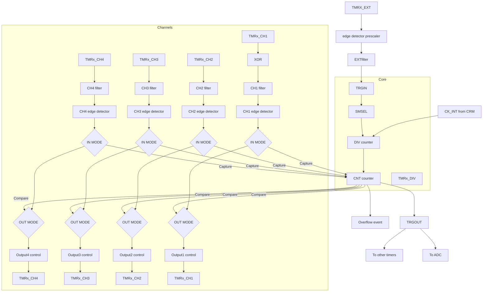

2025.05.28 Page 258 Rev 2.07


ARTERY logo AT32F435/437 Series Reference Manual

# 14.2.3 TMR2 to TMR5 functional overview

## 14.2.3.1 Counting clock

The count clock of TMR2~TMR5 can be provided by the internal clock (CK_INT), external clock (external clock mode A and B) and internal trigger input (ISx).

### Figure 14-8 Count clock

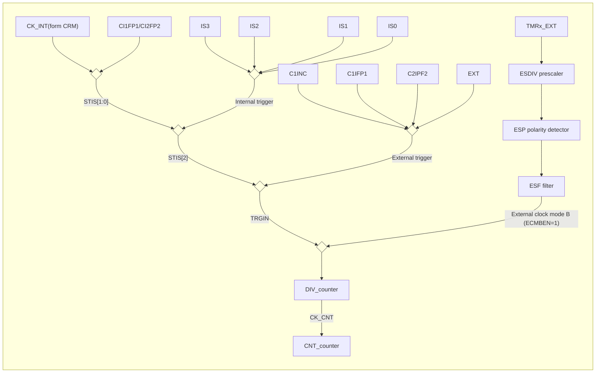

### Internal clock (CK_INT)

By default, the CK_INT divided by a prescaler is used to drive the counter to start counting. When TMR’s APB clock prescaler factor is 1, the CK_INT frequency is equal to that of APB; otherwise, it doubles the APB clock frequency.

The configuration process is as follows:

* Set the CLKDIV[1:0] bit in the TMRx_CTRL1 register to set the CK_INT frequency;
* Set the TWCMSEL[1:0] bit in the TMRx_CTRL1 register to select count mode. If the one-way count direction is set, configure OWCDIR bit in the TMRx_CTRL1 register to select the specific direction;
* Set the TMRx_DIV register to set the counting frequency;
* Set the TMRx_PR register to set the counting period;
* Set the TMREN bit in the TMRx_CTRL1 register to enable the counter.

### Figure 14-9 Use CK_INT to drive counter with TMRx_DIV=0x0 and TMRx_PR=0x16

Timing diagram showing CK_INT, TMREN, COUNTER values from 11 to 16 then 00 to 07, overflow, and OVFIF signal

### External clock (TRGIN/EXT)

The counter clock can be provided by two external clock sources, namely, TRGIN and EXT signals.

**SMSEL=3’b111**: External clock mode A is selected. Select an external clock source TRGIN signal by setting the STIS[2:0] bit to drive the counter to start counting. The external clock sources include: C1INC (STIS=3’b100, channel 1 rising edge and falling edge), C1IFP1 (STIS=3’b101, channel 1 signal with filtering and polarity selection), C2IFP2 (STIS=3’b110, channel 2 signal with filtering and polarity selection) and EXT (STIS=3’b111, external input signal with polarity selection, frequency division and filtering).

**ECMBEN=1**: External clock mode B is selected. The counter is driven by external input that has gone through polarity selection, frequency division and filtering. The external clock mode B is equivalent to the external clock mode A which selects EXT signal as an external force TRGIN.

### To use external clock mode A, follow the steps below:

* Set external source TRGIN parameters.
    - If the TMRx_CH1 is used as a source of TRGIN, it is necessary to configure channel 1 input filter (C1DF[3:0] in TMRx_CM1 register) and channel 1 input polarity (C1P/C1CP in TMRx_CCTRL register);

2025.05.28 Page 259 Rev 2.07


ARTERY logo
AT32F435/437 Series Reference Manual

If the TMRx_CH2 is used as source of TRGIN, it is necessary to configure channel 1 input filter (C2DF[3:0] in TMRx_CM1 register) and channel 2 input polarity (C2P/C2CP in TMRx_CCTR register);

If the TMRx_EXT is used as a source of TRGIN, it is necessary to configure the external signal polarity (ESP in TMRx_STCTRL register), external signal frequency division (ESDIV[1:0] in TMRx_STCTRL) and external signal filter (ESF[3:0] in TMRx_STCTRL register).

- Set TRGIN signal source using the STIS[1:0] bit in TMRx_STCTRL register;
- Enable external clock mode A by setting SMSEL=3’b111 in TMRx_STCTR register;
- Set counting frequency through the DIV[15:0] in TMRx_DIV register;
- Set counting period through the PR[15:0] in TMRx_PR register;
- Enable counter through the TMREN bit in TMRx_CTRL1 register.

To use external clock mode B, follow the steps below:

- Set external signal polarity through the ESP bit in TMRx_STCTRL register;
- Set external signal frequency division through the ESDIV[1:0] bit in TMRx_STCTRL register;
- Set external signal filter through the ESF[3:0] bit in TMRx_STCTRL register;
- Enable external clock mode B through the ECMBEN bit in TMRx_STCTR register;
- Set counting frequency through the DIV[15:0] bit in TMRx_DIV register;
- Set counting period through the PR[15:0] bit in TMRx_PR register;
- Enable counter through the TMREN in TMRx_CTRL1 register.

Figure 14-10 Block diagram of external clock mode A

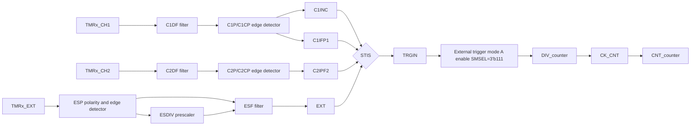

Note: The delay between the signal on the input side and the actual clock of the counter is due to the synchronization circuit.

Figure 14-11 Counting in external clock mode A, with PR=0x32 and DIV=0x0

Counting in external clock mode A timing diagram

Figure 14-12 Block diagram of external clock mode B

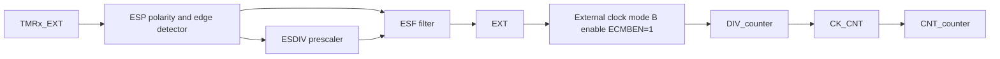

Note: The delay between the EXT signal on the input side and the actual clock of the counter is due to the synchronization circuit.

2025.05.28
Page 260
Rev 2.07


ARTERY logo # AT32F435/437 Series Reference Manual

## Figure 14-13 Counting in external clock mode B, with PR=0x32 and DIV=0x0

Timing diagram showing TMR_CLK, EXT, CNT_CLK, COUNTER (values 30, 31, 32, 0, 1, 2, 3, 4), ESDIV

## Internal trigger input (ISx)

Timer synchronization allows interconnection between several timers. The TMR_CLK of one timer can be provided by the TRGOUT signal output by another timer. Set the STIS[2: 0] bit to select internal trigger signal to enable counting.

Each timer (TMR2 to TMR5) consists of a 16-bit prescaler, which is used to generate the CK_CNT that enables the counter to count. The frequency division relationship between the CK_CNT and TMR_CLK can be adjusted by setting the value of the TMRx_DIV register. The prescaler value can be modified at any time, but it takes effect only when the next overflow event occurs.

The internal trigger input is configured as follows:

- Set the TMRx_PR register to set the counting period;
- Set the TMRx_DIV register to set the counting frequency;
- Set the TWCMSEL[1:0] bit in the TMRx_CTRL1 register to set the count mode;
- Set the STIS[2:0] bit (range: 3’b000~3’b011) in the TMRx_STCTRL register and select internal trigger;
- Set SMSEL[2:0]=3’b111 in the TMRx_STCTRL register and select external clock mode A;
- Set the TMREN bit in the TMRx_CTRL1 register to enable TMRx counter.

## Table 14-3 TMRx internal trigger connection

| Slave controller | IS0 (STIS = 000) | IS1 (STIS = 001) | IS2 (STIS = 010) | IS3 (STIS = 011) |
| ---------------- | ---------------- | ---------------- | ---------------- | ---------------- |
| TMR2             | TMR1             | TMR8/USB\_SOF(2) | TMR3             | TMR4             |
| TMR3             | TMR1             | TMR2             | TMR5             | TMR4             |
| TMR4             | TMR1             | TMR2             | TMR3             | TMR8             |
| TMR5             | TMR2             | TMR3             | TMR4             | TMR8             |


Note: If there is no corresponding timer in a device, the corresponding trigger signal ISx is not present.

## Figure 14-14 Counter timing with prescaler value changing from 0 to 3

Timing diagram showing TMR_CLK, CK_CNT, COUNTER (values 17, 18, 19, 1A, 1B, 1C, 00, 01), DIV

2025.05.28 Page 261 Rev 2.07


ARTERY logo # AT32F435/437 Series Reference Manual

## 14.2.3.2 Counting mode

The timer (TMR2 to TMR5) supports several counting modes to meet different application scenarios. Each timer has an internal 16-bit upcounter, downcounter, upcounter/downcounter. TMR2/5 can be extended to 32-bit by setting the PMEN bit to 1.

The TMRx_PR register is used to set the counting period. The value in the TMRx_PR is immediately moved to the shadow register by default. When the periodic buffer is enabled (PRBEN=1), the value in the TMRx_PR register is transferred to the shadow register only at an overflow event.

The TMRx_DIV register is used to configure the counting frequency. The counter counts once every count clock period (DIV[15:0]+1). The value in the TMRx_DIV register is updated to the shadow register at an overflow event.

An overflow event is generated by default. Set OVFEN=1 in the TMRx_CTRL1 to disable generation of update events. The OVFS bit in the TMRx_CTRL1 register is used to select overflow event source. By default, counter overflow/underflow, setting OVFSWTR bit and the reset signal generated by the slave timer controller in reset mode trigger the generation of an overflow event. When the OVFS bit is set, only counter overflow/underflow triggers an overflow event.

Setting the TMREN bit (TMREN=1) enables the timer to start counting. Base on synchronization logic, however, the actual enable signal TMR_EN is set 1 clock cycle after the TMREN is set.

Figure 14-15 Counter basic structure

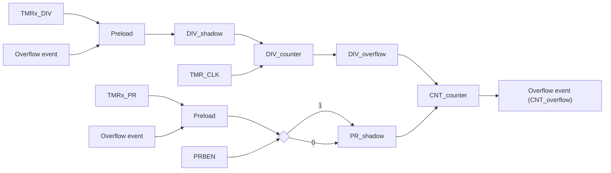

### Upcounting mode

Set TWCMSEL[1:0]=2’b00 and OWCDIR=1’b0 in the TMRx_CTRL1 register to enable upcounting mode. In this mode, the counter counts from 0 to the value programmed in the TMRx_PR register, then restarts from 0, and generates a counter overflow event, with the OVFIF bit being set to 1. If the overflow event is disabled, the counter is no longer reloaded with the preload value and period value at a counter overflow event; otherwise, the counter is updated with the preload value and period value on an overflow event.

Figure 14-16 Overflow event when PRBEN=0

Timing diagram showing overflow event when PRBEN=0

Figure 14-17 Overflow event when PRBEN=1

| Signal     | Values / Events       | Values / Events | Values / Events | Values / Events | Values / Events | Values / Events | Values / Events | Values / Events | Values / Events | Values / Events | Values / Events | Values / Events | Values / Events | Values / Events | Values / Events | Values / Events | Values / Events | Values / Events | Values / Events | Values / Events | Values / Events | Values / Events | Values / Events | Values / Events |
| ---------- | --------------------- | --------------- | --------------- | --------------- | --------------- | --------------- | --------------- | --------------- | --------------- | --------------- | --------------- | --------------- | --------------- | --------------- | --------------- | --------------- | --------------- | --------------- | --------------- | --------------- | --------------- | --------------- | --------------- | --------------- |
| TMR\_CLK   | \[Square wave pulses] |                 |                 |                 |                 |                 |                 |                 |                 |                 |                 |                 |                 |                 |                 |                 |                 |                 |                 |                 |                 |                 |                 |                 |
| COUNTER    | 0                     | 1               | 2               | 3               | ...             | 21              | 22              | 0               | 1               | 2               | 3               | ...             | 31              | 32              | 0               | 1               | 2               | 3               | ...             | 31              | 32              | 0               | 1               |                 |
| PR\[15:0]  | 22                    |                 |                 |                 |                 |                 |                 | 32              |                 |                 |                 |                 |                 |                 |                 |                 |                 |                 |                 |                 |                 |                 |                 |                 |
| DIV\[15:0] | 0                     |                 |                 |                 |                 |                 |                 |                 |                 |                 |                 |                 |                 |                 |                 |                 |                 |                 |                 |                 |                 |                 |                 |                 |
| OVFIF      | Low                   |                 |                 |                 |                 |                 | High (Clear)    |                 |                 |                 |                 |                 |                 | High (Clear)    |                 |                 |                 |                 |                 |                 | High (Clear)    |                 |                 |                 |


2025.05.28 Page 262 Rev 2.07


ARTERY logo # AT32F435/437 Series Reference Manual

## Downcounting mode

TWCMSEL[1:0]=2’b00 and OWCDIR=1’b1 in the TMRx_CTRL1register to enable downcounting mode. In this mode, the counter counts from the value programmed in the TMRx_PR register down to 0, and restarts from the value programmed, and generates a counter underflow event.

Figure 14-18 Counter timing diagram with internal clock divided by 3

| Signal      | T1         | T2       | T3       | T4           | T5       | T6       | T7         |
| ----------- | ---------- | -------- | -------- | ------------ | -------- | -------- | ---------- |
| TMR\_CLK    | \[pulse]   | \[pulse] | \[pulse] | \[pulse]     | \[pulse] | \[pulse] | \[pulse]   |
| CNT\_CLK    | \[pulse/3] |          |          | \[pulse/3]   |          |          | \[pulse/3] |
| COUNTER     | 3          | 2        | 1        | 0            | 32       | 31       | 30         |
| PR\[15: 0]  | 32         |          |          |              |          |          |            |
| DIV\[15: 0] | 3          |          |          |              |          |          |            |
| OVFIF       | LOW        | LOW      | LOW      | HIGH (Clear) | LOW      | LOW      | LOW        |


## Up/down counting mode

Set TWCMSEL[1:0]≠2’b00 in the TMRx_CTRL1 register to enable up/down counting mode. In this mode, the counter counts up/down alternatively. When the counter counts from the value programmed in the TMRx_PR register down to 1, an underflow event is generated, and then restarts counting from 0; When the counter counts from 0 to the value of the TMRx_PR register -1, an overflow event is generated, and then restarts counting from the value of the TMRx_PR register. The OWCDIR bit indicates the current counting direction.

The TWCMSEL[1:0] bit in the TMRx_CTRL1 register is also used to select the CxIF flag setting method in up/down counting mode. In up/down counting mode 1 (TWCMSEL[1:0]=2’b01), CxIF flag can only be set when the counter counts down; in up/down counting mode 2 (TWCMSEL[1:0]=2’b10), CxIF flag can only be set when the counter counts up; in up/down counting mode 3 (TWCMSEL[1:0]=2’b11), CxIF flag can be set when the counter counts up/down.

Note: The OWCDIR is read-only in up/down counting mode.

Figure 14-19 Counter timing diagram with internal clock divided by 0 and TMRx_PR=0x32

| Signal          | T1       | T2       | T3       | T4       | T5       | T6       | T7           | T8       | T9       | T10      | T11      | T12      | T13      | T14      | T15          | T16      | T17      | T18      |
| --------------- | -------- | -------- | -------- | -------- | -------- | -------- | ------------ | -------- | -------- | -------- | -------- | -------- | -------- | -------- | ------------ | -------- | -------- | -------- |
| TMR\_CLK        | \[pulse] | \[pulse] | \[pulse] | \[pulse] | \[pulse] | \[pulse] | \[pulse]     | \[pulse] | \[pulse] | \[pulse] | \[pulse] | \[pulse] | \[pulse] | \[pulse] | \[pulse]     | \[pulse] | \[pulse] | \[pulse] |
| COUNTER         | 0        | 1        | 2        | 3        | ...      | 31       | 32           | 31       | 30       | 2F       | 2E       | ...      | 2        | 1        | 0            | 1        | 2        | 3        |
| OWCDIR          | LOW      | LOW      | LOW      | LOW      | LOW      | LOW      | HIGH         | HIGH     | HIGH     | HIGH     | HIGH     | HIGH     | HIGH     | HIGH     | LOW          | LOW      | LOW      | LOW      |
| PR\[15:0]       | 32       |          |          |          |          |          |              |          |          |          |          |          |          |          |              |          |          |          |
| DIV\[15:0]      | 0        |          |          |          |          |          |              |          |          |          |          |          |          |          |              |          |          |          |
| TWCMSEL \[1: 0] | 11       |          |          |          |          |          |              |          |          |          |          |          |          |          |              |          |          |          |
| OVFIF           | LOW      | LOW      | LOW      | LOW      | LOW      | LOW      | HIGH (Clear) | LOW      | LOW      | LOW      | LOW      | LOW      | LOW      | LOW      | HIGH (Clear) | LOW      | LOW      | LOW      |


## Encoder interface mode

To enable the encoder interface mode, write SMSEL[2: 0]= 3’b001/3’b010/3’b011. In this mode, the two inputs (C1IN/C2IN) are required. Depending on the level on one input, the counter counts up or down on the edge of the other input. The OWCDIR bit indicates the direction of the counter.

2025.05.28 Page 263 Rev 2.07


ARTERY logo

# AT32F435/437 Series Reference Manual

## Figure 14-20 Encoder mode structure

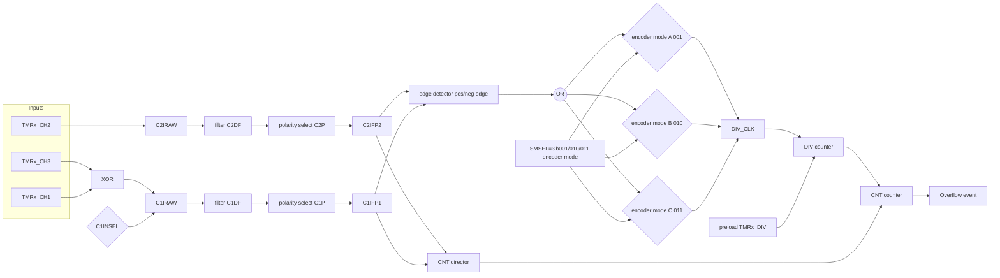

**Encoder mode A**: SMSEL=3’b001. The counter counts on the selected C1IFP1 edge (rising and falling edges), and the counting direction is dependent on the edge direction of C1IFP1 and the level of C2IFP2.

**Encoder mode B**: SMSEL=3’b010. The counter counts on the selected C2IFP2 edge (rising and falling edges), and the counting direction is dependent on the edge direction of C2IFP2 and the level of C1IFP1.

**Encoder mode C**: SMSEL=3’b011. The counter counts on both C1IFP1 and C2IFP2 edges (rising and falling edges). The counting direction is dependent on the C1IFP1 edge direction and C2IFP2 level, and C2IFP2 edge direction and C1IFP1 level.

To use encoder mode, follow the procedures below:

- Set channel 1 input signal filtering through the C1DF[3:0] bit in the TMRx_CM1 register;
  Set channel 1 input signal active level through the C1P bit in the TMRx_CCTRL register.

- Set channel 2 input signal filtering through the C2DF[3:0] bit in the TMRx_CM1 register;
  Set channel 2 input signal active level through the C2P bit in the TMRx_CCTRL register.

- Set channel 1 as input mode through the C1C[1:0] bit in the TMRx_CM1 register;
  Set channel 2 as input mode through the C2C[1:0] bit in the TMRx_CM1 register.

- Select encoder mode A (SMSEL=3’b001), encoder mode B (SMSEL=3’b010), or encoder mode C (SMSEL=3’b011) by setting the SMSEL[2:0] bit in the TMRx_STCTRL register.

- Set counting cycles through the PR[15:0] bit in the TMRx_PR register.

- Set counting frequency through the DIV[15:0] bit in the TMRx_DIV register.

- Configure the corresponding IOs of TMRx_CH1 and TMRx_CH2 as multiplexed mode.

- Enable counter through the TMREN bit in the TMRx_CTRL1 register.

### Table 14-4 Counting direction versus encoder signals

| Active edge       | Level on opposite signal(C1IFP1 to C2IFP2, C2IFP2to C1IFP1) | C1IFP1 signal<br/>Rising | C1IFP1 signal<br/>Falling | C2IFP2 signal<br/>Rising | C2IFP2 signal<br/>Falling |
| ----------------- | ----------------------------------------------------------- | ------------------------ | ------------------------- | ------------------------ | ------------------------- |
| C1IFP1            | High                                                        | Down                     | Up                        | No count                 | No count                  |
|                   | Low                                                         | Up                       | Down                      | No count                 | No count                  |
| C2IFP2            | High                                                        | No count                 | No count                  | Up                       | Down                      |
|                   | Low                                                         | No count                 | No count                  | Down                     | Up                        |
| C1IFP1 and C2IFP2 | High                                                        | Down                     | Up                        | Up                       | Down                      |
|                   | Low                                                         | Up                       | Down                      | Down                     | Up                        |


2025.05.28
Page 264
Rev 2.07


ARTERY logo
AT32F435/437 Series Reference Manual

Figure 14-21 Example of counter behavior in encoder interface mode (encoder mode C)

Timing diagram showing counter behavior in encoder mode C with UP and DOWN counting phases.

### 14.2.3.3 TMR input function

Each of TMR2~TMR5 timers has four independent channels, with each channel being configured as input or output.

As input, each channel input signal is handled as follows:

- TMRx_CHx outputs the pre-processed CxIRAW. The C1INSEL bit is used to select the source of C1IRAW from TMRx_CH1 or the XOR-ed TMRx_CH1, TMRx_CH2 and TMRx_CH3. The sources of C2IRAW, C3IRAW and C4IRAW are TMRx_CH2, TMRx_CH3 and TMRx_CH4, respectively.

- CxIRAW inputs digital filter and outputs filtered CxIF signal. The digital filter uses the CxDF bit to program sampling frequency and sampling times.

- CxIF inputs edge detector, and outputs the CxIFPx signal after edge selection. The edge selection depends on both CxP and CxCP bits. It is possible to select input rising edge, falling edge or both edges.

- CxIFPx inputs capture signal selector, and outputs the CxIN signal after capture signal selection. The capture signal selection is defined by CxC bit. It is possible to select CxIFPx, CyIFPx or STCI as CxIN source. Of those, CyIFPx (x≠y) is the CyIFPy signal that is from Y channel; The STCI comes from slave timer controller, and its source is selected by STIS bit.

- CxIN outputs the CxIPS signal that is divided by input channel divider. The divider factor can be defined as No division, /2, /4 or /8, by the CxIDIV bit. It can be used for filtering, selection, division and input capture of input signals.

Figure 14-22 Input/output channel 1 main circuit

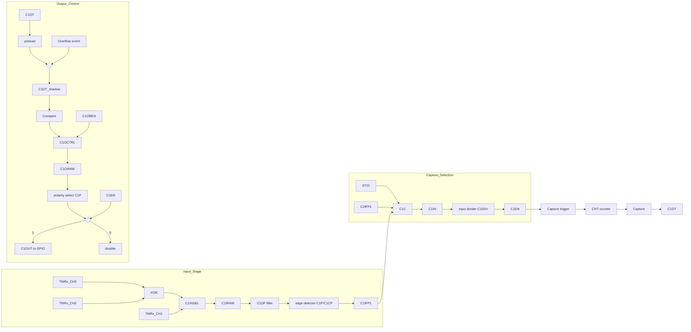

Figure 14-23 Channel 1 input stage

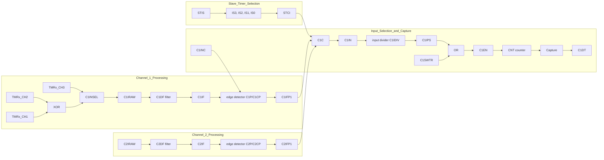

2025.05.28
Page 265
Rev 2.07


ARTERY logo **AT32F435/437 Series Reference Manual**

### Input mode

In input mode, the TMRx_CxDT registers latch the current counter values after the selected trigger signal is detected, and the capture compare interrupt flag bit (CxIF) is set to 1. An interrupt or a DMA request will be generated if the CxIEN or CxDEN bit is enabled. If the selected trigger signal is detected when the CxIF is set, a capture overflow event occurs. The TMRx_CxDT register overwrites the recorded value with the current counter value, and the CxRF is set to 1.

To capture the rising edge of C1IN input, following the configuration procedure mentioned below:

* Set C1C=01 in the TMRx_CxDT register to select the C1IN as channel 1 input.
* Set the filter bandwidth of C1IN signal (CxDF[3: 0]).
* Set the active edge on the C1IN channel by writing C1P=0 (rising edge) in the TMRx_CCTR register.
* Program the capture frequency division of C1IN signal (C1DIV[1: 0]).
* Enable channel 1 input capture (C1EN=1).
* If needed, enable the relevant interrupt or DMA request by setting the C1IEN bit in the TMRx_IDEN register or the C1DEN bit in the TMRx_IDEN register.

### Timer Input XOR function

The 3 timer input pins (TMRx_CH1, TMRx_CH2 and TMRx_CH3) are connected to the channel 1 (selected by setting the C1INSE in the TMRx_CTRL2 register) through an XOR gate.

The XOR gate can be used to connect Hall sensors. For example, connect the three XOR inputs to the three Hall sensors respectively so as to calculate the position and speed of the rotation by analyzing three Hall sensor signals.

### Input selection

The TMR2 IS1 (internal trigger input 1) and TMR5 channel 4 are mappable through the TMRx_RMP register. The TMR2 IS1 can be configured as TMR8_TRGO, Ethernet PTP output, OTG1_FS_SOF or OTG2_FS_SOF. TMR5 channel 4 input can be configured as GPIO, LICK, LEXT or ERTC.

### PWM input

The PWM input mode applies to channel 1 and channel 2. To enable this mode, map the C1IN and C2IN to the same TMRx_CHx, and configure the CxIFPx of channel 1/2 to trigger slave timer controller reset.

The PWM input mode can be used to measure the period and duty cycle of input signal. The period and duty cycle of channel 1 can be measured as follows:

* Set C1C=2‘b01 to set C1IN as C1IFP1;
* Set C1P=1’b0 to set C1IFP1 rising edge active;
* Set C2C=2‘b10 to set C2IN as C1IFP2;
* Set C2P=1’b1 to set C1IFP2 falling edge active;
* Set STIS=3’b101 to set C1IFP1 as the slave timer trigger signal;
* Set SMSEL=3‘b110 to set the slave timer in reset mode;
* Set C1EN=1’b1 and C2EN=1’b1 to enable channel 1 and input capture.

In these configurations, the rising edge of channel 1 input signal triggers capture and saves captured values to the C1DT register, and channel 1 input signal rising edge resets the counter. The falling edge of channel 1 input signal triggers capture and saves captured values to the C2DT register. The period and duty of channel 1 input signal can be calculated through C1DT and C2DT respectively.

2025.05.28 Page 266 Rev 2.07


ARTERY logo
AT32F435/437 Series Reference Manual

# Figure 14-24 Example of PWM input mode configuration

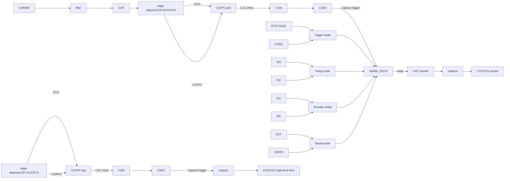

Figure 14-25 PWM input mode

PWM input mode timing diagram

# 14.2.3.4 TMR output function

The TMR output consists of a comparator and an output controller. It is used to program the period, duty cycle and polarity of the output signal.

Figure 14-26 Capture/compare channel output stage (channel 1 to 4)

Capture/compare channel output stage diagram

## Output mode

Write CxC[1 0]≠2’b00 to configure the channel as output to implement multiple output modes. In this case, the counter value is compared with the value in the TMRx_CxDT register, and the intermediate signal CxORAW is generated according to the output mode selected by CxOCTRL[2: 0], which is sent to IO after being processed by the output control circuit. The period of the output signal is configured by the TMRx_PR register, while the duty cycle by the TMRx_CxDT register.

Output compare modes include:

2025.05.28
Page 267
Rev 2.07


ARTERY logo # AT32F435/437 Series Reference Manual

● **PWM mode A**: Set CxOCTRL=3’b110 to enable PWM mode A. In upcounting, when TMRx_C1DT>TMRx_CVAL, C1ORAW outputs high; otherwise, outputs low. In downcounting, when TMRx_C1DT<TMRx_CVAL, C1ORAW outputs low; otherwise, outputs high. Figure 14-27 presents an example of upcounting and PWM mode A, PR=0x32, CxDT with different values. To set PWM mode A, the following process is recommended:

- Set the TMRx_PR register to set PWM period;
- Set the TMRx_CxDT register to set PWM duty cycle;
- Set CxOCTRL=3’b110 in TMRx_CM1/CM2 register and set output mode as PWM mode A;
- Set the TMRx_DIV register to set the counting frequency;
- Set the TWCMSEL[1:0] bit in the TMRx_CTRL1 to set the count mode;
- Set the CxP and CxCP bits in the TMRx_CCTRL register to set the output polarity;
- Set the CxEN and CxCEN bits in the TMRx_CCTRL register to enable channel output;
- Set the OEN bit in the TMRx_BRK register to enable TMRx output;
- Set the corresponding GPIO of TMR output channel as the multiplexed mode;
- Set the TMREN bit in the TMRx_CTRL1 register to enable TMRx counter.

## Figure 14 -27 PWM mode A in upcounting mode

| Signal        | Value 1  | Value 2  | Value 3  | Value 4  | Value 5  | Value 6  | Value 7  | Value 8  | Value 9  | Value 10 |
| ------------- | -------- | -------- | -------- | -------- | -------- | -------- | -------- | -------- | -------- | -------- |
| TMR\_CLK      | \[pulse] | \[pulse] | \[pulse] | \[pulse] | \[pulse] | \[pulse] | \[pulse] | \[pulse] | \[pulse] | \[pulse] |
| COUNTER       | 0        | 1        | 2        | 3        | ...      | 31       | 32       | 0        | 1        | 2        |
| PR\[15:0]     | 32       |          |          |          |          |          |          |          |          |          |
| DIV\[15:0]    | 0        |          |          |          |          |          |          |          |          |          |
| C1OCTRL\[2:0] | 110      |          |          |          |          |          |          |          |          |          |
| C1DT\[15:0]   | 3        |          |          |          |          |          |          |          |          |          |
| C1ORAW        | High     | High     | High     | Low      | Low      | Low      | Low      | High     | High     | High     |
| C1DT\[15:0]   | 0        |          |          |          |          |          |          |          |          |          |
| C1ORAW        | 0        |          |          |          |          |          |          |          |          |          |
| C1DT\[15:0]   | 32       |          |          |          |          |          |          |          |          |          |
| C1ORAW        | High     | High     | High     | High     | High     | High     | Low      | High     | High     | High     |
| C1DT\[15:0]   | >32      |          |          |          |          |          |          |          |          |          |
| C1ORAW        | 1        |          |          |          |          |          |          |          |          |          |


● **PWM mode B**: Set CxOCTRL=3’b111 to enable PWM mode B. In upcounting, when TMRx_C1DT>TMRx_CVAL, C1ORAW outputs low; otherwise, outputs high. In downcounting, when TMRx_C1DT<TMRx_CVAL, C1ORAW outputs high; otherwise, outputs low. Figure 14-28 presents an example of center-alinged counting mode and PWM mode B, PR=0x32, CxDT with different values

2025.05.28
Page 268
Rev 2.07


ARTERY logo AT32F435/437 Series Reference Manual

Figure 14-28 PWM mode B in up/down counting mode

Timing diagram showing PWM mode B in up/down counting mode with various C1DT values

* **Forced output mode:** Set CxOCTRL=3’b100/101 to enable forced output mode. In this case, the CxORAW is forced to be the programmed level, irrespective of the counter value. Despite this, the channel flag bit and DMA request still depend on the compare result.

* **Output compare mode:** Set CxOCTRL=3’b001/010/011 to enable output compare mode. In this case, when the counter value matches the value of the CxDT register, the CxORAW is forced high (CxOCTRL=3’b001), low (CxOCTRL=3’b010) or toggling (CxOCTRL=3’b011). Figure 14-29 presents an example of output compare mode (toggle), C1DT=0x3. When counter value=0x3, C1OUT toggles.

Figure 14-29 C1ORAW toggles when counter value matches the C1DT value

| Signal        | Value / Waveform | Value / Waveform | Value / Waveform | Value / Waveform | Value / Waveform | Value / Waveform | Value / Waveform | Value / Waveform | Value / Waveform | Value / Waveform | Value / Waveform | Value / Waveform | Value / Waveform | Value / Waveform | Value / Waveform | Value / Waveform | Value / Waveform | Value / Waveform | Value / Waveform | Value / Waveform | Value / Waveform | Value / Waveform | Value / Waveform |
| ------------- | ---------------- | ---------------- | ---------------- | ---------------- | ---------------- | ---------------- | ---------------- | ---------------- | ---------------- | ---------------- | ---------------- | ---------------- | ---------------- | ---------------- | ---------------- | ---------------- | ---------------- | ---------------- | ---------------- | ---------------- | ---------------- | ---------------- | ---------------- |
| TMR\_CLK      | \[square wave]   |                  |                  |                  |                  |                  |                  |                  |                  |                  |                  |                  |                  |                  |                  |                  |                  |                  |                  |                  |                  |                  |                  |
| COUNTER       | 0                | 1                | 2                | 3                | ...              | 31               | 32               | 0                | 1                | 2                | 3                | ...              | 31               | 32               | 0                | 1                | 2                | 3                | ...              | 31               | 32               | 0                | 1                |
| PR\[15:0]     | 32               |                  |                  |                  |                  |                  |                  |                  |                  |                  |                  |                  |                  |                  |                  |                  |                  |                  |                  |                  |                  |                  |                  |
| DIV\[15:0]    | 0                |                  |                  |                  |                  |                  |                  |                  |                  |                  |                  |                  |                  |                  |                  |                  |                  |                  |                  |                  |                  |                  |                  |
| C1OCTRL\[2:0] | 011              |                  |                  |                  |                  |                  |                  |                  |                  |                  |                  |                  |                  |                  |                  |                  |                  |                  |                  |                  |                  |                  |                  |
| C1DT\[15:0]   | 3                |                  |                  |                  |                  |                  |                  |                  |                  |                  |                  |                  |                  |                  |                  |                  |                  |                  |                  |                  |                  |                  |                  |
| C1ORAW        | \[low]           | \[low]           | \[low]           | \[toggle high]   | \[high]          | \[high]          | \[high]          | \[high]          | \[high]          | \[high]          | \[toggle low]    | \[low]           | \[low]           | \[low]           | \[low]           | \[low]           | \[toggle high]   | \[high]          | \[high]          | \[high]          | \[high]          | \[high]          |                  |


* **One-pulse mode:** This is a particular case of PWM mode. Set OCMEN=1 to enable one-pulse mode. In this mode, the comparison match is performed in the current counting period. The TMREN bit is cleared as soon as the current counting is completed. Therefore, only one pulse is output. When configured as in upcounting mode, the configuration must follow the rule: CVAL<CxDT≤PR; in downcounting mode, CVAL>CxDT is required. Figure 14-30 presents an example of PWM mode B in upcounting mode and one-pulse mode. The counter only counts for a single cycle, and only a pulse is output.

2025.05.28 Page 269 Rev 2.07


ARTERY logo **AT32F435/437 Series Reference Manual**

# Figure 14-30 One-pulse mode

Timing diagram for One-pulse mode showing COUNTER, PR, C1DT, TRGIN, C1ORAW, and C1OUT signals.

*   **Fast output mode**: Set CxOIEN=1 to enable this mode. If enabled, the CxORAW signal will not change when the counter value matches the CxDT, but at the beginning of the current counting period. In other words, the comparison result is advanced, so the comparison result between the counter value and the TMRx_CxDT register will determine the level of CxORAW in advance.

## Master timer event output

When TMR is selected as the master timer, the following signal sources can be selected as TRGOUT signal to output to the slave timer, by setting the PTOS bit in the TMRxCTRL2 register.

- PTOS=3’b000, TRGOUT outputs software overflow event (OVFSWTR bit in the TMRx_SWEVT register);
- PTOS=3’b001, TRGOUT outputs counter enable signal;
- PTOS=3’b010, TRGOUT outputs counter overflow event;
- PTOS=3’b011, TRGOUT outputs capture and compare event; (C1DT)
- PTOS=3’b100, TRGOUT outputs C1ORAW signal;
- PTOS=3’b101, TRGOUT outputs C2ORAW signal;
- PTOS=3’b110, TRGOUT outputs C3ORAW signal;
- PTOS=3’b111, TRGOUT outputs C4ORAW signal.

## CxORAW clear

When the CxOSEN bit is set to 1, the CxORAW signal for a given channel is cleared by applying a high level to the EXT input. The CxORAW signal remains unchanged until the next overflow event.

This function can only be used in output capture or PWM modes, and does not work in forced mode. Figure 14-31 shows the example of clearing CxORAW signal. When the EXT input is high, the CxORAW signal, which was originally high, is driven low; when the EXT is low, the CxORAW signal outputs the corresponding level according to the comparison result between the counter value and CxDT value.

# Figure 14-31 Clearing CxORAW (PWM mode B) by EXT input

Timing diagram showing CxORAW clearing by EXT input with signals COUNTER, CxDT, CxOSEN, EXT, and CxORAW.

2025.05.28 Page 270 Rev 2.07


ARTERY logo # AT32F435/437 Series Reference Manual

## 14.2.3.5 TMR synchronization

The timers are linked together internally for timer synchronization. Master timer is selected by setting the PTOS[2: 0] bit; Slave timer is selected by setting the SMSEL[2: 0] bit.

Slave mode include:

## Slave mode: Reset mode

The counter and its prescaler can be reset by a selected trigger signal. An overflow event is generated when OVFS=0.

Figure 14-32 Example of reset mode

Timing diagram showing TMR_CLK, COUNTER, PR

## Slave mode: Suspend mode

In this mode, the counter is controlled by a selected trigger input. The counter starts counting when the trigger input is high and stops as soon as the trigger input is low.

Figure 14-33 Example of suspend mode

Timing diagram showing TMR_CLK, CI1F1, TMR_EN, CNT_CLK, COUNTER, PR

## Slave mode: Trigger mode

The counter can start counting on the rising edge of a selected trigger input (TMR_EN=1).

2025.05.28 Page 271 Rev 2.07


Artery logo AT32F435/437 Series Reference Manual

Figure 14-34 Example of trigger mode

Timing diagram showing TMR_CLK, CI1F1, TMR_EN, COUNTER, PR

**Master/slave timer interconnection**

Both Master and slave timer can be configured in different master and slave modes respectively. The combination of both them can be used for various purposes. The figure below provides an example of interconnection between master timer and slave timer.

Figure 14-35 Master/slave timer connection

Block diagram of Master/slave timer connection showing Master Timer with UEV, TMREN, CxORAW inputs to Master mode selection (MMSEL) producing TRGOUT, which feeds into Slave Timer's Input trigger selection (STIS) along with ISx, C1INC, C1IFP1, C2IFP2, and EXT. The selected trigger goes to Slave mode Select (SMSEL) which controls CK_DIV, Prescaler, and Counter.

Using master timer to clock the slave timer:

* Configure master timer output signal TRGOUT as an overflow event (PTOS[2: 0]=3’b010). The master timer outputs a pulse signal at each counter overflow event, which is used as the counting clock of the slave timer.

* Configure the master timer counting period (TMRx_PR registers).

* Configure the slave timer trigger input signal TRGIN as master timer output (STIS[2: 0] in the TMRx_STCTRL register).

* Configure the slave timer to use external clock mode A (SMSEL[2: 0]=3’b111 in the TMRx_STCTRL register).

* Set TMREN =1 in both master timer and slave timer to enable them.

Using master timer to start slave timer:

* Configure master timer output signal TRGOUT as an overflow event (PTOS[2: 0]=3’b010). The master timer outputs a pulse signal at each counter overflow event, which is used as the counting clock of the slave timer.

* Configure master timer counting period (TMRx_PR registers).

* Configure slave timer trigger input signal TRGIN as master timer input.

* Configure slave timer as trigger mode (SMSEL=3’b110 in the TMR2_STCTRL register).

* Set TMREN=1 to enable master timer.

2025.05.28 Page 272 Rev 2.07


ARTERY logo

# AT32F435/437 Series Reference Manual

Figure 14-36 Using master timer to start slave timer

Timing diagram showing master timer starting slave timer

Starting master and slave timers synchronously by an external trigger:

In this example, configure the master timer as master/slave mode synchronously and enable its slave timer synchronization function. This mode is used for synchronization between master timer and slave timer.

* Set the STS bit of the master timer.

* Configure master timer output signal TRGOUT as an overflow event (PTOS[2: 0]=3’b010). The master timer outputs a pulse signal at each counter overflow event, which is used as the counting clock of the slave timer.

* Configure the slave timer mode of the master timer as trigger mode, and select C1IN as trigger source.

* Configure slave timer trigger input signal TRGIN as master timer output.

* Configure slave timer as trigger mode (SMSEL=3’b110 in the TMR2_STCTRL register).

Figure 14-37 Starting master and slave timers synchronously by an external trigger

Timing diagram showing master and slave timers starting synchronously by an external trigger

# 14.2.3.6 TMR DMA

TMR has the following events for DMA transfer request: overflow event DMA request, trigger event DMA rquest, Hall sensor DMA request and chanel event DMA request. It is possible to enable DMA request by setting the TMRx_IDEN register. Once enabled, upon an event generated, a DMA request is triggered and ouput to the DMA peripheral.

## TMR DMA Burst feature

TMR also supports TMR DMA Burst feature. Thanks to this feature, DMA can be triggered to rewrite multiple TMR consecutive registers by enabling a certain DMA request through the TMRx_IDEN register.

As an overflow event to trigger TMR DMA Burst as an example:

* Enable overflow event to trigger DMA request using the OVFDEN bit in the TMRx_IDEN reigster

* Configure Burst transfer times using the DTB bit in the TMRx_DMACTRL register

2025.05.28
Page 273
Rev 2.07


ARTERY logo
# AT32F435/437 Series Reference Manual

* Configure the start address of Burst transfer using the ADDR bit in the TMRx_DMACTRL reigster
* Enable counter

After the above-mentioned configurations, here is the whole process of TMR DMA Burst transfer:

Upon an overflow event, the TMR will send a DMA request to the DMA peripheral. Then the DMA writes the data into the TMRx_DMADT register as requested. Inside TMR, the DMADT bit data is written into the start address register of Burst thransfer and an ACK single is sent to TMR. After receiving this ACK, the TMR clears the current DMA request; when the Burst transfer is detected by the TMR not to complete fully, a new overflow event for DMA request is released to the DMA so tthat the DMA writes the requested dta into the TMRx_DMADT again. In this case, inside tmr, the DMADT register data is written into the Burst transfer start address + 0x4 address register, and a new ACK is sent to TMR, and so on, and so on, until the last operation of Burst transfer. When a full Burst transfer is complete, the REQ for overflow event DMA request would not be set any more until the next overflow event.

Note: when using TMR DMA Burst feature, an empty register is prohibited and the TMRx_DMACTRL as well as TMRx_DMADT registers should not be available during the period from the start address to the end address.

## 14.2.3.7 Debug mode

When the microcontroller enters debug mode (Cortex®-M4F core halted), the TMRx counter stops counting by setting the TMRx_PAUSE in the DEBUG module. Refer to Chapter 30.2 for more information.

## 14.2.4 TMRx registers

These peripheral registers must be accessed by words (32 bits).

Table 14-5 TMR2 and TMR 5 register map and reset value

| Register      | Offset | Reset value |
| ------------- | ------ | ----------- |
| TMRx\_CTRL1   | 0x00   | 0x0000 0000 |
| TMRx\_CTRL2   | 0x04   | 0x0000 0000 |
| TMRx\_STCTRL  | 0x08   | 0x0000 0000 |
| TMRx\_IDEN    | 0x0C   | 0x0000 0000 |
| TMRx\_ISTS    | 0x10   | 0x0000 0000 |
| TMRx\_SWEVT   | 0x14   | 0x0000 0000 |
| TMRx\_CM1     | 0x18   | 0x0000 0000 |
| TMRx\_CM2     | 0x1C   | 0x0000 0000 |
| TMRx\_CCTRL   | 0x20   | 0x0000 0000 |
| TMRx\_CVAL    | 0x24   | 0x0000 0000 |
| TMRx\_DIV     | 0x28   | 0x0000 0000 |
| TMRx\_PR      | 0x2C   | 0x0000 FFFF |
| TMRx\_C1DT    | 0x34   | 0x0000 0000 |
| TMRx\_C2DT    | 0x38   | 0x0000 0000 |
| TMRx\_C3DT    | 0x3C   | 0x0000 0000 |
| TMRx\_C4DT    | 0x40   | 0x0000 0000 |
| TMRx\_DMACTRL | 0x48   | 0x0000 0000 |
| TMRx\_DMADT   | 0x4C   | 0x0000 0000 |
| TMR2\_RMP     | 0x50   | 0x0000 0000 |
| TMR5\_RMP     | 0x50   | 0x0000 0000 |


2025.05.28
Page 274
Rev 2.07


ARTERY logo AT32F435/437 Series Reference Manual

# 14.2.4.1 TMR2 to TMR5 control register 1 (TMRx_CTRL1)

| Bit        | Name     | Reset value | Type | Description                                                                                                                                                                                                                                                                                                                                                                                                                                                                  |
| ---------- | -------- | ----------- | ---- | ---------------------------------------------------------------------------------------------------------------------------------------------------------------------------------------------------------------------------------------------------------------------------------------------------------------------------------------------------------------------------------------------------------------------------------------------------------------------------- |
| Bit 31: 11 | Reserved | 0x00 0000   | resd | Kept at its default value.                                                                                                                                                                                                                                                                                                                                                                                                                                                   |
| Bit 10     | PMEN     | 0x0         | rw   | Plus Mode Enable<br/>This bit is used to enable TMRx plus mode. In this mode, TMRx\_CVAL, TMRx\_PR and TMRx\_CxDT are extended from 16-bit to 32-bit.<br/>0: Disabled<br/>1: Enabled<br/>*Note: This function is only valid for TMR2 and TMR5. It is not applicable to other TMRs.*<br/>*In plus mode or when disabled, only 16-bit value can be written to TMRx\_CVAL, TMRx\_PR and TMRx\_CxDT registers.*                                                                  |
| Bit 9: 8   | CLKDIV   | 0x0         | rw   | Clock division<br/>This field is used to set the division ratio between digital filter sampling frequency (fDTS) and timer clock frequency (fCK\_INT).<br/>00: No division, fDTS=fCK\_INT<br/>01: Divided by 2, fDTS=fCK\_INT/2<br/>10: Divided by 4, fDTS=fCK\_INT/4<br/>11: Reserved                                                                                                                                                                                       |
| Bit 7      | PRBEN    | 0x0         | rw   | Period buffer enable<br/>0: Period buffer is disabled<br/>1: Period buffer is enabled                                                                                                                                                                                                                                                                                                                                                                                        |
| Bit 6: 5   | TWCMSEL  | 0x0         | rw   | Two-way counting mode selection<br/>00: One-way counting mode, depending on the OWCDIR bit<br/>01: Two-way counting mode1, count up and down alternately, the output flag bit is set only when the counter counts down<br/>10: Two-way counting mode2, count up and down alternately, the output flag bit is set only when the counter counts up<br/>11: Two-way counting mode3, count up and down alternately, the output flag bit is set when the counter counts up / down |
| Bit 4      | OWCDIR   | 0x0         | rw   | One-way count direction<br/>0: Up<br/>1: Down                                                                                                                                                                                                                                                                                                                                                                                                                                |
| Bit 3      | OCMEN    | 0x0         | rw   | One cycle mode enable<br/>This bit is use to select whether to stop counting at an overflow event<br/>0: The counter does not stop at an overflow event<br/>1: The counter stops at an overflow event                                                                                                                                                                                                                                                                        |
| Bit 2      | OVFS     | 0x0         | rw   | Overflow event source<br/>This bit is used to select overflow event or DMA request sources.<br/>0: Counter overflow, setting the OVFSWTR bit or overflow event generated by slave timer controller<br/>1: Only counter overflow generates an overflow event                                                                                                                                                                                                                  |
| Bit 1      | OVFEN    | 0x0         | rw   | Overflow event enable<br/>0: Enabled<br/>1: Disabled                                                                                                                                                                                                                                                                                                                                                                                                                         |
| Bit 0      | TMREN    | 0x0         | rw   | TMR enable<br/>0: Disabled<br/>1: Enabled                                                                                                                                                                                                                                                                                                                                                                                                                                    |


2025.05.28 Page 275 Rev 2.07


Artery logo AT32F435/437 Series Reference Manual

# 14.2.4.2 TMR2 to TMR5 control register 2 (TMRx_CTRL2)

| Bit       | Name     | Reset value | Type | Description                                                                                                                                                                                                                                                                    |
| --------- | -------- | ----------- | ---- | ------------------------------------------------------------------------------------------------------------------------------------------------------------------------------------------------------------------------------------------------------------------------------ |
| Bit 31: 8 | Reserved | 0x00 0000   | resd | Kept at its default value.                                                                                                                                                                                                                                                     |
| Bit 7     | C1INSEL  | 0x0         | rw   | C1IN selection<br/>0: CH1 pin is connected to C1IRAW input<br/>1: The XOR result of CH1, CH2 and CH3 pins is connected to C1IRAW input                                                                                                                                         |
| Bit 6: 4  | PTOS     | 0x0         | rw   | Master TMR output selection<br/>This field is used to select the TMRx signal sent to the slave timer.<br/>000: Reset<br/>001: Enable<br/>010: Update<br/>011: Compare pulse (C1DT)<br/>100: C1ORAW signal<br/>101: C2ORAW signal<br/>110: C3ORAW signal<br/>111: C4ORAW signal |
| Bit 3     | DRS      | 0x0         | rw   | DMA request source<br/>0: Capture/compare event<br/>1: Overflow event                                                                                                                                                                                                          |
| Bit 2: 0  | Reserved | 0x0         | resd | Kept at its default value.                                                                                                                                                                                                                                                     |


# 14.2.4.3 TMR2 to TMR5 slave timer control register (TMRx_STCTRL)

| Bit        | Name     | Reset value | Type | Description                                                                                                                                                                                                                                                                                                                                                                                                                                                                                                                                                                                                                                                                                                                                                                                                                                                                               |
| ---------- | -------- | ----------- | ---- | ----------------------------------------------------------------------------------------------------------------------------------------------------------------------------------------------------------------------------------------------------------------------------------------------------------------------------------------------------------------------------------------------------------------------------------------------------------------------------------------------------------------------------------------------------------------------------------------------------------------------------------------------------------------------------------------------------------------------------------------------------------------------------------------------------------------------------------------------------------------------------------------- |
| Bit 31: 16 | Reserved | 00000       | resd | Kept at its default value.                                                                                                                                                                                                                                                                                                                                                                                                                                                                                                                                                                                                                                                                                                                                                                                                                                                                |
| Bit 15     | ESP      | 0x0         | rw   | External signal polarity<br/>0: High or rising edge<br/>1: Low or falling edge                                                                                                                                                                                                                                                                                                                                                                                                                                                                                                                                                                                                                                                                                                                                                                                                            |
| Bit 14     | ECMBEN   | 0x0         | rw   | External clock mode B enable<br/>This bit is used to enable external clock mode B<br/>0: Disabled<br/>1: Enabled                                                                                                                                                                                                                                                                                                                                                                                                                                                                                                                                                                                                                                                                                                                                                                          |
| Bit 13: 12 | ESDIV    | 0x0         | rw   | External signal divide<br/>This field is used to select the frequency division of an external trigger<br/>00: Normal<br/>01: Divided by 2<br/>10: Divided by 4<br/>11: Divided by 8                                                                                                                                                                                                                                                                                                                                                                                                                                                                                                                                                                                                                                                                                                       |
| Bit 11: 8  | ESF      | 0x0         | rw   | External signal filter<br/>This field is used to filter an external signal. The external signal can be sampled only after it has been generated N times<br/>0000: No filter, sampling by $f\_{DTS}$<br/>0001: $f\_{SAMPLING}=f\_{CK\\\_INT}$, N=2;<br/>0010: $f\_{SAMPLING}=f\_{CK\\\_INT}$, N=4;<br/>0011: $f\_{SAMPLING}=f\_{CK\\\_INT}$, N=8;<br/>0100: $f\_{SAMPLING}=f\_{DTS}/2$, N=6;<br/>0101: $f\_{SAMPLING}=f\_{DTS}/2$, N=8;<br/>0110: $f\_{SAMPLING}=f\_{DTS}/4$, N=6;<br/>0111: $f\_{SAMPLING}=f\_{DTS}/4$, N=8;<br/>1000: $f\_{SAMPLING}=f\_{DTS}/8$, N=6;<br/>1001: $f\_{SAMPLING}=f\_{DTS}/8$, N=8;<br/>1010: $f\_{SAMPLING}=f\_{DTS}/16$, N=5;<br/>1011: $f\_{SAMPLING}=f\_{DTS}/16$, N=6;<br/>1100: $f\_{SAMPLING}=f\_{DTS}/16$, N=8;<br/>1101: $f\_{SAMPLING}=f\_{DTS}/32$, N=5;<br/>1110: $f\_{SAMPLING}=f\_{DTS}/32$, N=6;<br/>1111: $f\_{SAMPLING}=f\_{DTS}/32$, N=8 |
| Bit 7      | STS      | 0x0         | rw   | Subordinate TMR synchronization                                                                                                                                                                                                                                                                                                                                                                                                                                                                                                                                                                                                                                                                                                                                                                                                                                                           |


2025.05.28 Page 276 Rev 2.07


ARTERY logo AT32F435/437 Series Reference Manual

|          |          |     |      | If enabled, master and slave timer can be synchronized.<br/>0: Disabled<br/>1: Enabled                                                                                                                                                                                                                                                                                                                                                                                                                                                                            |
| -------- | -------- | --- | ---- | ----------------------------------------------------------------------------------------------------------------------------------------------------------------------------------------------------------------------------------------------------------------------------------------------------------------------------------------------------------------------------------------------------------------------------------------------------------------------------------------------------------------------------------------------------------------- |
| Bit 6: 4 | STIS     | 0x0 | rw   | Subordinate TMR input selection<br/>This field is used to select the subordinate TMR input.<br/>000: Internal selection 0 (IS0)<br/>001: Internal selection 1 (IS1)<br/>010: Internal selection 2 (IS2)<br/>011: Internal selection 3 (IS3)<br/>100: C1IRAW input detector (C1INC)<br/>101: Filtered input 1 (C1IF1)<br/>110: Filtered input 2 (C1IF2)<br/>111: External input (EXT)<br/>Please refer to Table 14-3 for more information on ISx for each timer.                                                                                                   |
| Bit 3    | Reserved | 0x0 | resd | Kept at its default value                                                                                                                                                                                                                                                                                                                                                                                                                                                                                                                                         |
| Bit 2: 0 | SMSEL    | 0x0 | rw   | Subordinate TMR mode selection<br/>000: Slave mode is disabled<br/>001: Encoder mode A<br/>010: Encoder mode B<br/>011: Encoder mode C<br/>100: Reset mode —Rising edge of the TRGIN input reinitializes the counter<br/>101: Suspend mode — The counter starts counting when the TRGIN is high<br/>110: Trigger mode — A trigger event is generated at the rising edge of the TRGIN input<br/>111: External clock mode A — Rising edge of the TRGIN input clocks the counter<br/>Note: Please refer to count mode section for the details on encoder mode A/B/C. |


# 14.2.4.4 TMR2 to TMR5 DMA/interrupt enable register (TMRx_IDEN)

| Bit<br/>Bit 31:15<br/>Bit 14<br/>Bit 13<br/>Bit 12<br/>Bit 11<br/>Bit 10<br/>Bit 9<br/>Bit 8<br/>Bit 7<br/>Bit 6<br/>Bit 5<br/>Bit 4<br/>Bit 3 | Name<br/>Reserved<br/>TDEN<br/>Reserved<br/>C4DEN<br/>C3DEN<br/>C2DEN<br/>C1DEN<br/>OVFDEN<br/>Reserved<br/>TIEN<br/>Reserved<br/>C4IEN<br/>C3IEN | Reset value<br/>0x0 0000<br/>0x0<br/>0x0<br/>0x0<br/>0x0<br/>0x0<br/>0x0<br/>0x0<br/>0x0<br/>0x0<br/>0x0<br/>0x0<br/>0x0 | Type<br/>resd<br/>rw<br/>resd<br/>rw<br/>rw<br/>rw<br/>rw<br/>rw<br/>resd<br/>rw<br/>resd<br/>rw<br/>rw | Description<br/>Kept at its default value<br/>Trigger DMA request enable0: Disabled1: Enabled<br/>Kept at its default value<br/>Channel 4 DMA request enable0: Disabled1: Enabled<br/>Channel 3 DMA request enable0: Disabled1: Enabled<br/>Channel 2 DMA request enable0: Disabled1: Enabled<br/>Channel 1 DMA request enable0: Disabled1: Enabled<br/>Overflow event DMA request enable0: Disabled1: Enabled<br/>Kept at its default value<br/>Trigger interrupt enable0: Disabled1: Enabled<br/>Kept at its default value<br/>Channel 4 interrupt enable0: Disabled1: Enabled<br/>Channel 3 interrupt enable |
| ---------------------------------------------------------------------------------------------------------------------------------------------- | ------------------------------------------------------------------------------------------------------------------------------------------------- | ------------------------------------------------------------------------------------------------------------------------ | ------------------------------------------------------------------------------------------------------- | --------------------------------------------------------------------------------------------------------------------------------------------------------------------------------------------------------------------------------------------------------------------------------------------------------------------------------------------------------------------------------------------------------------------------------------------------------------------------------------------------------------------------------------------------------------------------------------------------------------- |


2025.05.28 Page 277 Rev 2.07


Artery logo AT32F435/437 Series Reference Manual

| Bit   | Name   | Reset value | Type | Description                                               |
| ----- | ------ | ----------- | ---- | --------------------------------------------------------- |
|       |        |             |      | 0: Disabled<br/>1: Enabled                                |
| Bit 2 | C2IEN  | 0x0         | rw   | Channel 2 interrupt enable<br/>0: Disabled<br/>1: Enabled |
| Bit 1 | C1IEN  | 0x0         | rw   | Channel 1 interrupt enable<br/>0: Disabled<br/>1: Enabled |
| Bit 0 | OVFIEN | 0x0         | rw   | Overflow interrupt enable<br/>0: Disabled<br/>1: Enabled  |


# 14.2.4.5 TMR2 to TMR5 interrupt status register (TMRx_ISTS)

| Bit        | Name     | Reset value | Type | Description                                                                                                                                                                                                                                                                                                                                                                                                                                                   |
| ---------- | -------- | ----------- | ---- | ------------------------------------------------------------------------------------------------------------------------------------------------------------------------------------------------------------------------------------------------------------------------------------------------------------------------------------------------------------------------------------------------------------------------------------------------------------- |
| Bit 31: 13 | Reserved | 0x0 0000    | resd | Kept at its default value                                                                                                                                                                                                                                                                                                                                                                                                                                     |
| Bit 12     | C4RF     | 0x0         | rw0c | Channel 4 recapture flag<br/>Please refer to C1RF description.                                                                                                                                                                                                                                                                                                                                                                                                |
| Bit 11     | C3RF     | 0x0         | rw0c | Channel 3 recapture flag<br/>Please refer to C1RF description.                                                                                                                                                                                                                                                                                                                                                                                                |
| Bit 10     | C2RF     | 0x0         | rw0c | Channel 2 recapture flag<br/>Please refer to C1RF description.                                                                                                                                                                                                                                                                                                                                                                                                |
| Bit 9      | C1RF     | 0x0         | rw0c | Channel 1 recapture flag<br/>This bit indicates whether a recapture is detected when C1IF=1. This bit is set by hardware, and cleared by writing “0”.<br/>0: No capture is detected<br/>1: Capture is detected.                                                                                                                                                                                                                                               |
| Bit 8: 7   | Reserved | 0x0         | resd | Kept at its default value                                                                                                                                                                                                                                                                                                                                                                                                                                     |
| Bit 6      | TRGIF    | 0x0         | rw0c | Trigger interrupt flag<br/>This bit is set by hardware on a trigger event. It is cleared by writing “0”.<br/>0: No trigger event occurs<br/>1: Trigger event is generated.<br/>Trigger event: an active edge is detected on TRGIN input, or any edge in suspend mode.                                                                                                                                                                                         |
| Bit 5      | Reserved | 0x0         | resd | Kept at its default value                                                                                                                                                                                                                                                                                                                                                                                                                                     |
| Bit 4      | C4IF     | 0x0         | rw0c | Channel 4 interrupt flag<br/>Please refer to C1IF description.                                                                                                                                                                                                                                                                                                                                                                                                |
| Bit 3      | C3IF     | 0x0         | rw0c | Channel 3 interrupt flag<br/>Please refer to C1IF description.                                                                                                                                                                                                                                                                                                                                                                                                |
| Bit 2      | C2IF     | 0x0         | rw0c | Channel 2 interrupt flag<br/>Please refer to C1IF description.                                                                                                                                                                                                                                                                                                                                                                                                |
| Bit 1      | C1IF     | 0x0         | rw0c | Channel 1 interrupt flag<br/>If the channel 1 is configured as input mode:<br/>This bit is set by hardware on a capture event. It is cleared by software or read access to the TMRx\_C1DT<br/>0: No capture event occurs<br/>1: Capture event is generated<br/>If the channel 1 is configured as output mode:<br/>This bit is set by hardware on a compare event. It is cleared by software.<br/>0: No compare event occurs<br/>1: Compare event is generated |
| Bit 0      | OVFIF    | 0x0         | rw0c | Overflow interrupt flag<br/>This bit is set by hardware on an overflow event. It is cleared by software.<br/>0: No overflow event occurs<br/>1: Overflow event is generated. If OVFEN=0 and OVFS=0 in the TMRx\_CTRL1 register:<br/>− An overflow event is generated when OVFSWTR= 1 in the TMRx\_SWEVT register;<br/>− An overflow event is generated when the counter CVAL is reinitialized by a trigger event.                                             |


2025.05.28 Page 278 Rev 2.07


ARTERY logo
AT32F435/437 Series Reference Manual

# 14.2.4.6 TMR2 to TMR5 software event register (TMRx_SWEVT)

| Bit       | Name     | Reset value | Type | Description                                                                                                                                              |
| --------- | -------- | ----------- | ---- | -------------------------------------------------------------------------------------------------------------------------------------------------------- |
| Bit 31: 7 | Reserved | 0x000 0000  | resd | Kept at its default value.                                                                                                                               |
| Bit 6     | TRGSWTR  | 0x0         | rw   | Trigger event triggered by software<br/>This bit is set by software to generate a trigger event.<br/>0: No effect<br/>1: Generate a trigger event.       |
| Bit 5     | Reserved | 0x0         | resd | Kept at its default value.                                                                                                                               |
| Bit 4     | C4SWTR   | 0x0         | wo   | Channel 4 event triggered by software<br/>Please refer to C1SWTR description.                                                                            |
| Bit 3     | C3SWTR   | 0x0         | wo   | Channel 3 event triggered by software<br/>Please refer to C1SWTR description.                                                                            |
| Bit 2     | C2SWTR   | 0x0         | wo   | Channel 2 event triggered by software<br/>Please refer to C1SWTR description                                                                             |
| Bit 1     | C1SWTR   | 0x0         | wo   | Channel 1 event triggered by software<br/>This bit is set by software to generate a channel 1 event.<br/>0: No effect<br/>1: Generate a channel 1 event. |
| Bit 0     | OVFSWTR  | 0x0         | wo   | Overflow event triggered by software<br/>This bit is set by software to generate an overflow event.<br/>0: No effect<br/>1: Generate an overflow event.  |


# 14.2.4.7 TMR2 to TMR5 channel mode register 1 (TMRx_CM1)

Output compare mode:

| Bit        | Name     | Reset value | Type | Description                                                                                                                                                                                                                                                                                                                                                                                                                                                                                                                                                          |
| ---------- | -------- | ----------- | ---- | -------------------------------------------------------------------------------------------------------------------------------------------------------------------------------------------------------------------------------------------------------------------------------------------------------------------------------------------------------------------------------------------------------------------------------------------------------------------------------------------------------------------------------------------------------------------- |
| Bit 31: 16 | Reserved | 0x0000      | resd | Kept at its default value.                                                                                                                                                                                                                                                                                                                                                                                                                                                                                                                                           |
| Bit 15     | C2OSEN   | 0x0         | rw   | Channel 2 output switch enable                                                                                                                                                                                                                                                                                                                                                                                                                                                                                                                                       |
| Bit 14: 12 | C2OCTRL  | 0x0         | rw   | Channel 2 output control                                                                                                                                                                                                                                                                                                                                                                                                                                                                                                                                             |
| Bit 11     | C2OBEN   | 0x0         | rw   | Channel 2 output buffer enable                                                                                                                                                                                                                                                                                                                                                                                                                                                                                                                                       |
| Bit 10     | C2OIEN   | 0x0         | rw   | Channel 2 output enable immediately                                                                                                                                                                                                                                                                                                                                                                                                                                                                                                                                  |
| Bit 9: 8   | C2C      | 0x0         | rw   | Channel 2 configuration<br/>This field is used to define the direction of the channel 2 (input or output), and the selection of input pin when C2EN='0':<br/>00: Output<br/>01: Input, C2IN is mapped on C2IFP2<br/>10: Input, C2IN is mapped on C1IFP2<br/>11: Input, C2IN is mapped on STCI. This mode works only when the internal trigger input is selected by STIS register.                                                                                                                                                                                    |
| Bit 7      | C1OSEN   | 0x0         | rw   | Channel 1 output switch enable<br/>0: C1ORAW is not affected by EXT<br/>1: Once high level is detect on EXT input, clear C1ORAW.                                                                                                                                                                                                                                                                                                                                                                                                                                     |
| Bit 6: 4   | C1OCTRL  | 0x0         | rw   | Channel 1 output control<br/>This field defines the behavior of the original signal C1ORAW.<br/>000: Disconnected. C1ORAW is disconnected from C1OUT;<br/>001: C1ORAW is high when TMRx\_CVAL=TMRx\_C1DT<br/>010: C1ORAW is low when TMRx\_CVAL=TMRx\_C1DT<br/>011: Switch C1ORAW level when TMRx\_CVAL=TMRx\_C1DT<br/>100: C1ORAW is forced low<br/>101: C1ORAW is forced high.<br/>110: PWM mode A<br/>- OWCDIR=0, C1ORAW is high once TMRx\_C1DT>TMRx\_CVAL, else low;<br/>- OWCDIR=1, C1ORAW is low once TMRx\_C1DT \<TMRx\_CVAL, else high;<br/>111: PWM mode B |


2025.05.28
Page 279
Rev 2.07


ARTERY logo
AT32F435/437 Series Reference Manual

- OWCDIR=0, C1ORAW is low once TMRx_ C1DT >TMRx_CVAL, else high;
- OWCDIR=1, C1ORAW is high once TMRx_ C1DT <TMRx_CVAL, else low.

Note: In the configurations other than 000’, the C1OUT is connected to C1ORAW. The C1OUT output level is not only subject to the changes of C1ORAW, but also the output polarity set by CCTRL.

| Bit 3    | C1OBEN | 0x0 | rw | Channel 1 output buffer enable<br/>0: Buffer function of TMRx\_C1DT is disabled. The new value written to the TMRx\_C1DT takes effect immediately.<br/>1: Buffer function of TMRx\_C1DT is enabled. The value to be written to the TMRx\_C1DT is stored in the buffer register, and can be sent to the TMRx\_C1DT register only on an overflow event.                      |
| -------- | ------ | --- | -- | -------------------------------------------------------------------------------------------------------------------------------------------------------------------------------------------------------------------------------------------------------------------------------------------------------------------------------------------------------------------------- |
| Bit 2    | C1OIEN | 0x0 | rw | Channel 1 output enable immediately<br/>In PWM mode A or B, this bit is used to accelerate the channel 1 output’s response to the trigger event.<br/>0: Need to compare the CVAL with C1DT before generating an output<br/>1: No need to compare the CVAL and C1DT. An output is generated immediately when a trigger event occurs.                                        |
| Bit 1: 0 | C1C    | 0x0 | rw | Channel 1 configuration<br/>This field is used to define the direction of the channel 1 (input or output), and the selection of input pin when C1EN=’0’:<br/>00: Output<br/>01: Input, C1IN is mapped on C1IFP1<br/>10: Input, C1IN is mapped on C2IFP1<br/>11: Input, C1IN is mapped on STCI. This mode works *only when the internal trigger input is selected by STIS.* |


**Input capture mode:**

| Bit        | Name     | Reset value | Type | Description                                                                                                                                                                                                                                                                                                                                                                                                                                                                                                                                                                                                                                                                |
| ---------- | -------- | ----------- | ---- | -------------------------------------------------------------------------------------------------------------------------------------------------------------------------------------------------------------------------------------------------------------------------------------------------------------------------------------------------------------------------------------------------------------------------------------------------------------------------------------------------------------------------------------------------------------------------------------------------------------------------------------------------------------------------- |
| Bit 31: 16 | Reserved | 0x0000      | resd | Kept at its default value.                                                                                                                                                                                                                                                                                                                                                                                                                                                                                                                                                                                                                                                 |
| Bit 15: 12 | C2DF     | 0x0         | rw   | Channel 2 digital filter                                                                                                                                                                                                                                                                                                                                                                                                                                                                                                                                                                                                                                                   |
| Bit 11: 10 | C2IDIV   | 0x0         | rw   | Channel 2 input divider                                                                                                                                                                                                                                                                                                                                                                                                                                                                                                                                                                                                                                                    |
| Bit 9: 8   | C2C      | 0x0         | rw   | Channel 2 configuration<br/>This field is used to define the direction of the channel 2 (input or output), and the selection of input pin when C2EN=’0’:<br/>00: Output<br/>01: Input, C2IN is mapped on C2IFP2<br/>10: Input, C2IN is mapped on C1IFP2<br/>11: Input, C2IN is mapped on STCI. This mode works only when the internal trigger input is selected by STIS.                                                                                                                                                                                                                                                                                                   |
| Bit 7: 4   | C1DF     | 0x0         | rw   | Channel 1 digital filter<br/>This field defines the digital filter of the channel 1. “N” refers to the number of filtering, meaning that N consecutive events are needed to validate a transition on the output.<br/>0000: No filter, sampling is done at $f\_{DTS}$<br/>0001: $f\_{SAMPLING}=f\_{CK\\\_INT}$, N=2<br/>0010: $f\_{SAMPLING}=f\_{CK\\\_INT}$, N=4<br/>0011: $f\_{SAMPLING}=f\_{CK\\\_INT}$, N=8<br/>0100: $f\_{SAMPLING}=f\_{DTS}/2$, N=6<br/>0101: $f\_{SAMPLING}=f\_{DTS}/2$, N=8<br/>0110: $f\_{SAMPLING}=f\_{DTS}/4$, N=6<br/>0111: $f\_{SAMPLING}=f\_{DTS}/4$, N=8<br/>1000: $f\_{SAMPLING}=f\_{DTS}/8$, N=6<br/>1001: $f\_{SAMPLING}=f\_{DTS}/8$, N=8 |


2025.05.28
Page 280
Rev 2.07


ARTERY logo # AT32F435/437 Series Reference Manual

| Bit      | Name   | Reset value | Type | Description                                                                                                                                                                                                                                                                                                                                                                  |
| -------- | ------ | ----------- | ---- | ---------------------------------------------------------------------------------------------------------------------------------------------------------------------------------------------------------------------------------------------------------------------------------------------------------------------------------------------------------------------------- |
|          |        |             |      | 1010: fSAMPLING=fDTS/16, N=5<br/>1011: fSAMPLING=fDTS/16, N=6<br/>1100: fSAMPLING=fDTS/16, N=8<br/>1101: fSAMPLING=fDTS/32, N=5<br/>1110: fSAMPLING=fDTS/32, N=6<br/>1111: fSAMPLING=fDTS/32, N=8                                                                                                                                                                            |
| Bit 3: 2 | C1IDIV | 0x0         | rw   | Channel 1 input divider<br/>This field defines Channel 1 input divider.<br/>00: No divider. An input capture is generated at each active edge.<br/>01: An input compare is generated every 2 active edges<br/>10: An input compare is generated every 4 active edges<br/>11: An input compare is generated every 8 active edges<br/>Note: the divider is reset once C1EN='0' |
| Bit 1: 0 | C1C    | 0x0         | rw   | Channel 1 configuration<br/>This field is used to define the direction of the channel 1 (input or output), and the selection of input pin when C1EN='0':<br/>00: Output<br/>01: Input, C1IN is mapped on C1IFP1<br/>10: Input, C1IN is mapped on C2IFP1<br/>11: Input, C1IN is mapped on STCI. This mode works only when the internal trigger input is selected by STIS.     |


# 14.2.4.8 TMR2 to TMR5 channel mode register 2 (TMRx_CM2)

Output compare mode:

| Bit        | Name     | Reset value | Type | Description                                                                                                                                                                                                                                                                                                                                                              |
| ---------- | -------- | ----------- | ---- | ------------------------------------------------------------------------------------------------------------------------------------------------------------------------------------------------------------------------------------------------------------------------------------------------------------------------------------------------------------------------ |
| Bit 31: 16 | Reserved | 0x0000      | resd | Kept at its default value.                                                                                                                                                                                                                                                                                                                                               |
| Bit 15     | C4OSEN   | 0x0         | rw   | Channel 4 output switch enable                                                                                                                                                                                                                                                                                                                                           |
| Bit 14: 12 | C4OCTRL  | 0x0         | rw   | Channel 4 output control                                                                                                                                                                                                                                                                                                                                                 |
| Bit 11     | C4OBEN   | 0x0         | rw   | Channel 4 output buffer enable                                                                                                                                                                                                                                                                                                                                           |
| Bit 10     | C4OIEN   | 0x0         | rw   | Channel 4 output enable immediately                                                                                                                                                                                                                                                                                                                                      |
| Bit 9: 8   | C4C      | 0x0         | rw   | Channel 4 configuration<br/>This field is used to define the direction of the channel 1 (input or output), and the selection of input pin when C4EN='0':<br/>00: Output<br/>01: Input, C4IN is mapped on C4IFP4<br/>10: Input, C4IN is mapped on C3IFP4<br/>11: Input, C4IN is mapped on STCI. This mode works only when the internal trigger input is selected by STIS. |
| Bit 7      | C3OSEN   | 0x0         | rw   | Channel 3 output switch enable                                                                                                                                                                                                                                                                                                                                           |
| Bit 6: 4   | C3OCTRL  | 0x0         | rw   | Channel 3 output control                                                                                                                                                                                                                                                                                                                                                 |
| Bit 3      | C3OBEN   | 0x0         | rw   | Channel 3 output buffer enable                                                                                                                                                                                                                                                                                                                                           |
| Bit 2      | C3OIEN   | 0x0         | rw   | Channel 3 output enable immediately                                                                                                                                                                                                                                                                                                                                      |
| Bit 1: 0   | C3C      | 0x0         | rw   | Channel 3 configuration<br/>This field is used to define the direction of the channel 1 (input or output), and the selection of input pin when C3EN='0':<br/>00: Output<br/>01: Input, C3IN is mapped on C3IFP3<br/>10: Input, C3IN is mapped on C4IFP3<br/>11: Input, C3IN is mapped on STCI. This mode works only when the internal trigger input is selected by STIS. |


Input capture mode:

| Bit        | Name     | Reset value | Type | Description                |
| ---------- | -------- | ----------- | ---- | -------------------------- |
| Bit 31: 16 | Reserved | 0x0000      | resd | Kept at its default value. |
| Bit 15: 12 | C4DF     | 0x0         | rw   | Channel 4 digital filter   |
| Bit 11: 10 | C4IDIV   | 0x0         | rw   | Channel 4 input divider    |
| Bit 9: 8   | C4C      | 0x0         | rw   | Channel 4 configuration    |


2025.05.28 | Page 281 | Rev 2.07


ARTERY logo # AT32F435/437 Series Reference Manual

This field is used to define the direction of the channel 1 (input or output), and the selection of input pin when C4EN=’0’:
00: Output
01: Input, C4IN is mapped on C4IFP4
10: Input, C4IN is mapped on C3IFP4
11: Input, C4IN is mapped on STCI. This mode works only when the internal trigger input is selected by STIS.

| Bit 7: 4 | C3DF   | 0x0 | rw | Channel 3 digital filter                                                                                                                                                                                                                                                                                                                                                 |
| -------- | ------ | --- | -- | ------------------------------------------------------------------------------------------------------------------------------------------------------------------------------------------------------------------------------------------------------------------------------------------------------------------------------------------------------------------------ |
| Bit 3: 2 | C3IDIV | 0x0 | rw | Channel 3 input divider                                                                                                                                                                                                                                                                                                                                                  |
| Bit 1: 0 | C3C    | 0x0 | rw | Channel 3 configuration<br/>This field is used to define the direction of the channel 1 (input or output), and the selection of input pin when C3EN=’0’:<br/>00: Output<br/>01: Input, C3IN is mapped on C3IFP3<br/>10: Input, C3IN is mapped on C4IFP3<br/>11: Input, C3IN is mapped on STCI. This mode works only when the internal trigger input is selected by STIS. |


## 14.2.4.9 TMR2 to TMR5 channel control register (TMRx_CCTRL)

| Bit        | Name     | Reset value | Type | Description                                                                                                                                                                                                                                                                                                                                                                             |
| ---------- | -------- | ----------- | ---- | --------------------------------------------------------------------------------------------------------------------------------------------------------------------------------------------------------------------------------------------------------------------------------------------------------------------------------------------------------------------------------------- |
| Bit 31: 14 | Reserved | 0x0 0000    | resd | Kept at its default value.                                                                                                                                                                                                                                                                                                                                                              |
| Bit 13     | C4P      | 0x0         | rw   | Channel 4 polarity<br/>Please refer to C1P description.                                                                                                                                                                                                                                                                                                                                 |
| Bit 12     | C4EN     | 0x0         | rw   | Channel 4 enable<br/>Please refer to C1EN description.                                                                                                                                                                                                                                                                                                                                  |
| Bit 11: 10 | Reserved | 0x0         | resd | Default value                                                                                                                                                                                                                                                                                                                                                                           |
| Bit 9      | C3P      | 0x0         | rw   | Channel 3 polarity<br/>Please refer to C1P description.                                                                                                                                                                                                                                                                                                                                 |
| Bit 8      | C3EN     | 0x0         | rw   | Channel 3 enable<br/>Please refer to C1EN description.                                                                                                                                                                                                                                                                                                                                  |
| Bit 7: 6   | Reserved | 0x0         | resd | Kept at its default value.                                                                                                                                                                                                                                                                                                                                                              |
| Bit 5      | C2P      | 0x0         | rw   | Channel 2 polarity<br/>Please refer to C1P description.                                                                                                                                                                                                                                                                                                                                 |
| Bit 4      | C2EN     | 0x0         | rw   | Channel 2 enable<br/>Please refer to C1EN description.                                                                                                                                                                                                                                                                                                                                  |
| Bit 3: 2   | Reserved | 0x0         | resd | Kept at its default value.                                                                                                                                                                                                                                                                                                                                                              |
| Bit 1      | C1P      | 0x0         | rw   | Channel 1 polarity<br/>When the channel 1 is configured as output mode:<br/>0: C1OUT is active high<br/>1: C1OUT is active low<br/>When the channel 1 is configured as input mode:<br/>0: C1IN active edge is on its rising edge. When used as external trigger, C1IN is not inverted.<br/>1: C1IN active edge is on its falling edge. When used as external trigger, C1IN is inverted. |
| Bit0       | C1EN     | 0x0         | rw   | Channel 1 enable<br/>0: Input or output is disabled<br/>1: Input or output is enabled                                                                                                                                                                                                                                                                                                   |


Table 14-6 Standard CxOUT channel output control bit

| CxEN bit | CxOUT output state                  |
| -------- | ----------------------------------- |
| 0        | Output disabled (CxOUT=0, Cx\_EN=0) |
| 1        | CxOUT = CxORAW + polarity, Cx\_EN=1 |


Note: The state of the external I/O pins connected to the standard CxOUT channel depends on the CxOUT channel state and the GPIO and IOMUX registers.

2025.05.28 Page 282 Rev 2.07


Artery logo
AT32F435/437 Series Reference Manual

# 14.2.4.10 TMR2 to TMR5 counter value register (TMRx_CVAL)

| Bit        | Name | Reset value | Type | Description                                                                                                                       |
| ---------- | ---- | ----------- | ---- | --------------------------------------------------------------------------------------------------------------------------------- |
| Bit 31: 16 | CVAL | 0x0000      | rw   | Counter value<br/>When TMR2 or TMR5 enables plus mode (the PMEN bit in the TMR\_CTRL1 register), the CVAL is expanded to 32 bits. |
| Bit 15: 0  | CVAL | 0x0000      | rw   | Counter value                                                                                                                     |


# 14.2.4.11 TMR2 to TMR5 division value register (TMRx_DIV)

| Bit        | Name     | Reset value | Type | Description                                                                                                                                   |
| ---------- | -------- | ----------- | ---- | --------------------------------------------------------------------------------------------------------------------------------------------- |
| Bit 31: 16 | Reserved | 0x0000      | resd | Kept at its default value.                                                                                                                    |
| Bit 15: 0  | DIV      | 0x0000      | rw   | Divider value<br/>The counter clock frequency fCK\_CNT = fTMR\_CLK /(DIV\[15: 0]+1).<br/>DIV contains the value written at an overflow event. |


# 14.2.4.12 TMR2 to TMR5 period register (TMRx_PR)

| Bit        | Name | Reset value | Type | Description                                                                                                                    |
| ---------- | ---- | ----------- | ---- | ------------------------------------------------------------------------------------------------------------------------------ |
| Bit 31: 16 | PR   | 0x0000      | rw   | Period value<br/>When TMR2 or TMR5 enables plus mode (the PMEN bit in the TMR\_CTRL1 register), the PR is expanded to 32 bits. |
| Bit 15: 0  | PR   | 0xFFFF      | rw   | Period value<br/>This defines the period value of the TMRx counter. The timer stops working when the period value is 0.        |


# 14.2.4.13 TMR2 to TMR5 channel 1 data register (TMRx_C1DT)

| Bit        | Name | Reset value | Type | Description                                                                                                                                                                                                                                                                                                                                                                                                                   |
| ---------- | ---- | ----------- | ---- | ----------------------------------------------------------------------------------------------------------------------------------------------------------------------------------------------------------------------------------------------------------------------------------------------------------------------------------------------------------------------------------------------------------------------------- |
| Bit 31: 16 | C1DT | 0x0000      | rw   | Channel 1 data register<br/>When TMR2 or TMR5 enables plus mode (the PMEN bit in the TMR\_CTRL1 register), the C1DT is expanded to 32 bits.                                                                                                                                                                                                                                                                                   |
| Bit 15: 0  | C1DT | 0x0000      | rw   | Channel 1 data register<br/>When the channel 1 is configured as input mode:<br/>The C1DT is the CVAL value stored by the last channel 1 input event (C1IN).<br/>When the channel 1 is configured as output mode:<br/>C1DT is the value to be compared with the CVAL value. Whether the written value takes effective immediately depends on the C1OBEN bit, and the corresponding output is generated on C1OUT as configured. |


# 14.2.4.14 TMR2 to TMR5 channel 2 data register (TMRx_C2DT)

| Bit        | Name | Reset value | Type | Description                                                                                                                                                                                                                                                                                                                                                                                                                   |
| ---------- | ---- | ----------- | ---- | ----------------------------------------------------------------------------------------------------------------------------------------------------------------------------------------------------------------------------------------------------------------------------------------------------------------------------------------------------------------------------------------------------------------------------- |
| Bit 31: 16 | C2DT | 0x0000      | rw   | Channel 2 data register<br/>When TMR2 or TMR5 enables plus mode (the PMEN bit in the TMR\_CTRL1 register), the C2DT is expanded to 32 bits.                                                                                                                                                                                                                                                                                   |
| Bit 15: 0  | C2DT | 0x0000      | rw   | Channel 2 data register<br/>When the channel 2 is configured as input mode:<br/>The C2DT is the CVAL value stored by the last channel 2 input event (C2IN).<br/>When the channel 2 is configured as output mode:<br/>C2DT is the value to be compared with the CVAL value. Whether the written value takes effective immediately depends on the C2OBEN bit, and the corresponding output is generated on C2OUT as configured. |


2025.05.28
Page 283
Rev 2.07


Artery logo AT32F435/437 Series Reference Manual

# 14.2.4.15 TMR2 to TMR5 channel 3 data register (TMRx_C3DT)

| Bit        | Name | Reset value | Type | Description                                                                                                                                                                                                                                                                                                                                                                                                                   |
| ---------- | ---- | ----------- | ---- | ----------------------------------------------------------------------------------------------------------------------------------------------------------------------------------------------------------------------------------------------------------------------------------------------------------------------------------------------------------------------------------------------------------------------------- |
| Bit 31: 16 | C3DT | 0x0000      | rw   | Channel 3 data register<br/>When TMR2 or TMR5 enables plus mode (the PMEN bit in the TMR\_CTRL1 register), the C3DT is expanded to 32 bits.                                                                                                                                                                                                                                                                                   |
| Bit 15: 0  | C3DT | 0x0000      | rw   | Channel 3 data register<br/>When the channel 3 is configured as input mode:<br/>The C3DT is the CVAL value stored by the last channel 3 input event (C3IN).<br/>When the channel 3 is configured as output mode:<br/>C3DT is the value to be compared with the CVAL value. Whether the written value takes effective immediately depends on the C3OBEN bit, and the corresponding output is generated on C3OUT as configured. |


# 14.2.4.16 TMR2 to TMR5 channel 4 data register (TMRx_C4DT)

| Bit        | Name | Reset value | Type | Description                                                                                                                                                                                                                                                                                                                                                                                                                   |
| ---------- | ---- | ----------- | ---- | ----------------------------------------------------------------------------------------------------------------------------------------------------------------------------------------------------------------------------------------------------------------------------------------------------------------------------------------------------------------------------------------------------------------------------- |
| Bit 31: 16 | C4DT | 0x0000      | rw   | Channel 4 data register<br/>When TMR2 or TMR5 enables plus mode (the PMEN bit in the TMR\_CTRL1 register), the C4DT is expanded to 32 bits.                                                                                                                                                                                                                                                                                   |
| Bit 15: 0  | C4DT | 0x0000      | rw   | Channel 4 data register<br/>When the channel 4 is configured as input mode:<br/>The C4DT is the CVAL value stored by the last channel 4 input event (C4IN).<br/>When the channel 4 is configured as output mode:<br/>C4DT is the value to be compared with the CVAL value. Whether the written value takes effective immediately depends on the C4OBEN bit, and the corresponding output is generated on C4OUT as configured. |


# 14.2.4.17 TMR2 to TMR5 DMA control register (TMRx_DMACTRL)

| Bit        | Name     | Reset value | Type | Description                                                                                                                                                                                          |
| ---------- | -------- | ----------- | ---- | ---------------------------------------------------------------------------------------------------------------------------------------------------------------------------------------------------- |
| Bit 31: 13 | Reserved | 0x0 0000    | resd | Kept at its default value.                                                                                                                                                                           |
| Bit 12: 8  | DTB      | 0x00        | rw   | DMA transfer bytes<br/>This field defines the number of DMA transfers:<br/>00000: 1 byte 00001: 2 bytes<br/>00010: 3 bytes 00011: 4 bytes<br/>...... ......<br/>10000: 17 bytes 10001: 18 bytes      |
| Bit 7: 5   | Reserved | 0x0         | resd | Kept at its default value.                                                                                                                                                                           |
| Bit 4: 0   | ADDR     | 0x00        | rw   | DMA transfer address offset<br/>ADDR is defined as an offset starting from the address of the TMRx\_CTRL1 register.<br/>00000: TMRx\_CTRL1<br/>00001: TMRx\_CTRL2<br/>00010: TMRx\_STCTRL<br/>...... |


# 14.2.4.18 TMR2 to TMR5 DMA data register (TMRx_DMADT)

| Bit        | Name     | Reset value | Type | Description                                                                                                                                                                                                   |
| ---------- | -------- | ----------- | ---- | ------------------------------------------------------------------------------------------------------------------------------------------------------------------------------------------------------------- |
| Bit 31: 16 | Reserved | 0x0000      | resd | Kept at its default value.                                                                                                                                                                                    |
| Bit 15: 0  | DMADT    | 0x0000      | rw   | DMA data register<br/>A read or write operation to the DMADT register accesses the TMR registers at the following address:<br/>TMRx peripheral address + ADDR*4 to TMRx peripheral address + ADDR*4 + DTB\*4. |


2025.05.28 Page 284 Rev 2.07


ARTERY logo **AT32F435/437 Series Reference Manual**

## 14.2.4.19 TMR5 channel input remapping register (TMR2_RMP)

| Bit        | Name            | Reset value | Type | Description                                                                                                            |
| ---------- | --------------- | ----------- | ---- | ---------------------------------------------------------------------------------------------------------------------- |
| Bit 31: 12 | Reserved        | 0x0 0000    | resd | Kept at its default value.                                                                                             |
| Bit 11: 10 | TMR2\_IS1\_IRMP | 0x0         | rw   | TMR2 IS1 input remap<br/>00: TMR8\_TRGO output<br/>01: Ethernet PTP output<br/>10: OTG1\_FS\_SOF<br/>11: OTG2\_FS\_SOF |
| Bit 9: 0   | Reserved        | 0x000       | resd | Kept at its default value.                                                                                             |


## 14.2.4.20 TMR2 channel input remapping register (TMR5_RMP)

| Bit       | Name            | Reset value | Type | Description                                                                                                                                                     |
| --------- | --------------- | ----------- | ---- | --------------------------------------------------------------------------------------------------------------------------------------------------------------- |
| Bit 31: 8 | Reserved        | 0x00 0000   | resd | Kept at its default value.                                                                                                                                      |
| Bit 7: 6  | TMR5\_CH4\_IRMP | 0x0         | rw   | TMR5 channel 4 input remap<br/>00: TMR5 channel 4 input connected to GPIO<br/>01: Internal clock LICK<br/>10: Internal clock LEXT<br/>11: ERTC wakeup interrupt |
| Bit 5: 0  | Reserved        | 0x00        | resd | Kept at its default value.                                                                                                                                      |


# 14.3 General-purpose timers (TMR9 to TMR14)

## 14.3.1 TMR9 to TMR14 introduction

The general-purpose timer (TMR9 to TMR14) consists of a 16-bit counter supporting upcounting mode. These timers can be synchronized.

## 14.3.2 TMR9 to TMR14 main features

### 14.3.2.1 TMR9 and TMR12 main features

The main functions of general-purpose TMR9 and TMR12 include:

* Source of counter clock: internal clock and external clock
* 16-bit upcounter
* 2 independent channels for input capture, output compare, PWM generation and one-pulse mode output
* Synchronization control between master and slave timers
* Interrupt is generated at overflow event, trigger event and channel event

Figure 14-38 Block diagram of general-purpose TMR9/12

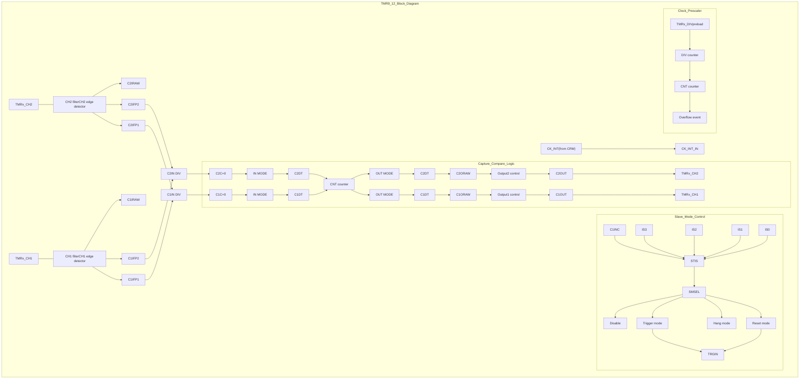

2025.05.28 Page 285 Rev 2.07


ARTERY logo

# AT32F435/437 Series Reference Manual

## 14.3.2.2 TMR10, TMR11, TMR13 and TMR14 main features

The main functions of general-purpose TMRx (TMR10, TMR11, TMR13 and TMR14) include:

* Source of counter clock: internal clock
* 16-bit upcounter
* 1 independent channel for input capture, output compare, PWM generation
* Synchronization control between master and slave timers
* Interrupt is generated at overflow event and channel event

### Figure 14-39 Block diagram of general-purpose TMR10/11/13/14

Block diagram of general-purpose TMR10/11/13/14 showing signal flow from TMRx_CH1 through filter, edge detector, and divider to capture/compare logic, and CK_INT through DIV counter to CNT counter.

## 14.3.3 TMR9 to TMR14 functional overview

### 14.3.3.1 Counting clock

The count clock of general-purpose timers can be provided by the internal clock (CK_INT), external clock (external clock mode A) and internal trigger input (ISx).

### Figure 14-40 Count clock

Flow chart diagram of count clock selection logic showing inputs for Encoder mode, CK_INT, Internal trigger (IS0-IS3), and External trigger (C1INC, C1IFP1, C2IPF2) feeding into DIV_counter and CNT_counter.

### Internal clock (CK_INT)

By default, the CK_INT divided by the prescaler is used to drive the counter to start counting. When TMR's APB clock prescaler factor is 1, the CK_INT frequency is equal to that of APB; otherwise, it doubles the APB clock frequency.

The configuration process is as follows:

- Set the CLKDIV[1:0] bit in the TMRx_CTRL1 register to set the CK_INT frequency;
- Set the TWCMSEL[1:0] bit in the TMRx_CTRL1 register to select count mode. If the one-way count direction is set, configure OWCDIR bit in the TMRx_CTRL1 register to select the specific direction;
- Set the TMRx_DIV register to set the counting frequency;
- Set the TMRx_PR register to set the counting period;
- Set the TMREN it in the TMRx_CTRL1 register to enable the counter.

2025.05.28
Page 286
Rev 2.07


ARTERY logo # AT32F435/437 Series Reference Manual

Figure 14-41 Use CK_INT to drive counter, with TMRx_DIV=0x0 and TMRx_PR=0x16

Timing diagram showing CK_INT, TMREN, COUNTER, overflow, and OVFIF signals. The counter increments from 11 to 16, then wraps to 00.

## External clock (TMR9/12 only)

The counter clock can be provided by TRGIN signal.

**SMSEL=3’b111**: External clock mode A is selected. Select an external clock source TRGIN signal by setting the STIS[2:0] bit to drive the counter to start counting. The external clock sources include: C1INC (STIS=3’b100, channel 1 rising edge and falling edge), C1IFP1 (STIS=3’b101, channel 1 signal with filtering and polarity selection) and C2IFP2 (STIS=3’b110, channel 2 signal with filtering and polarity selection).

## To use external clock mode A, follow the steps below:

- Set external source TRGIN parameters
  If the TMRx_CH1 is used as a source of TRGIN, it is necessary to configure channel 1 input filter (C1DF[3:0] in TMRx_CM1 register) and channel 1 input polarity (C1P/C1CP in TMRx_CCTRL register);
  If the TMRx_CH2 is used as source of TRGIN, it is necessary to configure channel 1 input filter (C2DF[3:0] in TMRx_CM1 register) and channel 2 input polarity (C2P/C2CP in TMRx_CCTR register);
- Set TRGIN signal source using the STIS[1:0] bit in TMRx_STCTRL register
- Enable external clock mode A by setting SMSEL=3’b111 in TMRx_STCTR register
- Set counting frequency through the DIV[15:0] in TMRx_DIV register
- Set counting period through the PR[15:0] in TMRx_PR register
- Enable counter through the TMREN bit in TMRx_CTRL1 register

Figure 14-42 Block diagram of external clock mode A

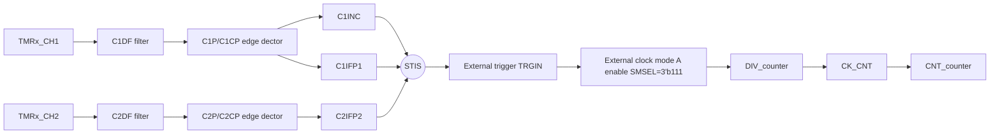

Note: The delay between the signal on the input side and the actual clock of the counter is due to the synchronization circuit.

Figure 14-43 Counting in external clock mode A, with PR=0x32 and DIV=0x0

Timing diagram for external clock mode A showing TMR_CLK, C2IRAW, CNT_CLK, COUNTER, STIS

2025.05.28
Page 287
Rev 2.07


ARTERY logo # AT32F435/437 Series Reference Manual

## Internal trigger input (ISx)

Timer synchronization allows interconnection between several timers. The TMR_CLK of one timer can be provided by the TRGOUT signal output by another timer. Set the STIS[2: 0] bit to select internal trigger signal to enable counting.

Each timer (TMR9 ~TMR14) consists of a 16-bit prescaler, which is used to generate the CK_CNT that enables the counter to count. The frequency division relationship between the CK_CNT and TMR_CLK can be adjusted by setting the value of the TMRx_DIV register. The prescaler value can be modified at any time, but it takes effect only when the next overflow event occurs.

The internal trigger input is configured as follows:

- Set the TMRx_PR register to set the counting period;

- Set the TMRx_DIV register to set the counting frequency;

- Set the STIS[2:0] bit (range: 3’b000~3’b011) in the TMRx_STCTRL register and select internal trigger;

- Set SMSEL[2:0]=3’b111 in the TMRx_STCTRL register and select external clock mode A;

- Set the TMREN bit in the TMRx_CTRL1 register to enable TMRx counter.

Figure 14-44 Counter timing with prescaler value changing from 0 to 3

| Signal      | T1    | T2    | T3    | T4    | T5    | T6    | T7    | T8    |
| ----------- | ----- | ----- | ----- | ----- | ----- | ----- | ----- | ----- |
| TMR\_CLK    | Pulse | Pulse | Pulse | Pulse | Pulse | Pulse | Pulse | Pulse |
| CK\_CNT     | Pulse | Pulse | Pulse | Pulse | Pulse | Pulse |       | Pulse |
| COUNTER     | 17    | 18    | 19    | 1A    | 1B    | 1C    | 00    | 01    |
| DIV\[15: 0] | 0     | 0     | 0     | 0     | 0     | 0     | 3     | 3     |
| PR\[15: 0]  | 1C    | 1C    | 1C    | 1C    | 1C    | 1C    | 1C    | 1C    |
| OVFIF       | 0     | 0     | 0     | 0     | 0     | 1     | 0     | 0     |


Table 14-7 TMRx internal trigger connection

| Slave controller | IS0(STIS=000) | IS1(STIS = 001) | IS2(STIS = 010) | IS3(STIS = 011) |
| ---------------- | ------------- | --------------- | --------------- | --------------- |
| TMR9             | TMR2          | TMR3            | TMR10\_C1OUT    | TMR11\_C1OUT    |
| TMR12            | TMR4          | TMR5            | TMR13\_C1OUT    | TMR14\_C1OUT    |


Note: If there is no corresponding timer in a device, the corresponding trigger signal ISx is not present.

2025.05.28 Page 288 Rev 2.07


ARTERY logo AT32F435/437 Series Reference Manual

### 14.3.3.2 Counting mode

The general-purpose timer only supports upcounting mode, and it consists of a 16-bit counter.

The TMRx_PR register issued to set the counting period. The value in the TMRx_PR is immediately moved to the shadow register by default. When the periodic buffer is enabled (PRBEN=1), the value in the TMRx_PR register is transferred to the shadow register only at an overflow event.

The TMRx_DIV register is used to configure the counting frequency. The counter counts once every count clock period (DIV[15:0]+1). The value in the TMRx_DIV register is updated to the shadow register at an overflow event.

Reading the TMRx_CNT register returns to the current counter value, and writing to the TMRx_CNT register updates the current counter value to the value being written.

An overflow event is generated by default. Set OVFEN=1 in the TMRx_CTRL1 to disable generation of update events. The OVFS bit in the TMRx_CTRL1 register is used to select overflow event source. By default, counter overflow/underflow, setting OVFSWTR bit and the reset signal generated by the slave timer controller in reset mode trigger the generation of an overflow event. When the OVFS bit is set, only counter overflow/underflow triggers an overflow event.

Setting TMREN=1 to enable the timer to start counting. Base on synchronization logic, however, the actual enable signal TMR_EN is set 1 clock cycle after the TMREN is set.

Figure 14-45 Counter basic structure

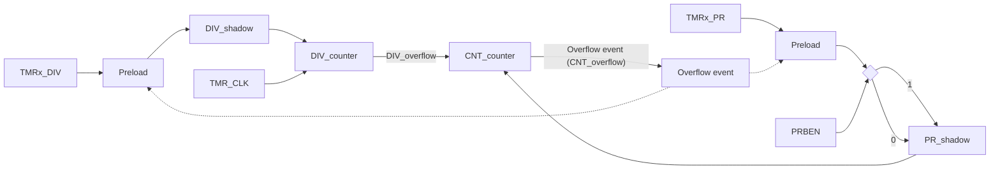

Upcounting mode

Set TWCMSEL[1:0]=2’b00 and OWCDIR=1’b0 in the TMRx_CTRL1 register to enable upcounting mode. In this mode, the counter counts from 0 to the value programmed in the TMRx_PR register, then restarts from 0, and generates a counter overflow event, with the OVFIF bit being set to 1. If the overflow event is disabled, the counter is no longer reloaded with the preload value and period value at a counter overflow event; otherwise, the counter is updated with the preload value and period value on an overflow event.

Figure 14-46 Overflow event when PRBEN=0

Timing diagram showing TMR_CLK, COUNTER, PR

2025.05.28 Page 289 Rev 2.07


ARTERY logo AT32F435/437 Series Reference Manual

Figure 14-47 Overflow event when PRBEN=1

Timing diagram showing TMR_CLK, COUNTER, PR

# 14.3.3.3 TMR input function

Each timer of TMR9 and TMR12 has two independent channels, while each of TMR10, TMR11, TMR13 and TMR14 has an independent channel. Each channel can be configured as input or output.

As input, each channel input signal is handled as follows:

- TMRx_CHx outputs the pre-processed CxIRAW. Set the C1INSEL bit to select TMRx_CH1 as the source of C1IRAW.

- CxIRAW inputs digital filter and outputs filtered CxIF signal. The digital filter uses the CxDF bit to program sampling frequency and sampling times.

- CxIF inputs edge detector, and outputs the CxIFPx signal after edge selection. The edge selection depends on both CxP and CxCP bits. It is possible to select input rising edge, falling edge or both edges.

- CxIFPx inputs capture signal selector, and outputs the CxIN signal after capture signal selection. The capture signal selection is defined by CxC bit. It is possible to select CxIFPx, CyIFPx or STCI as CxIN source. Of those, CyIFPx (x≠y) is the CyIFPy signal that is from Y channel. The STCI comes from slave timer controller, and its source is selected by STIS bit.

- CxIN outputs the CxIPS signal that is divided by input channel divider. The divider factor can be defined as No division, /2, /4 or /8, by the CxIDIV bit. It can be used for filtering, selection, division and input capture of input signals.

Figure 14-48 Input/output channel 1 main circuit

```mermaid
graph LR
    TMRx_CH1[TMRx_CH1] --> C1IRAW[C1IRAW]
    C1IRAW --> C1DF[C1DF filter]
    C1DF --> EdgeDet[edge detector C1P/C1CP]
    EdgeDet --> C1IFP1[C1IFP1]
    C1IFP1 --> Mux1{C1C}
    STCI[STCI] --> Mux1
    C2IFP1[C2IFP1] --> Mux1
    Mux1 --> C1IN[C1IN]
    C1IN --> C1IDIV[input divider C1IDIV]
    C1IDIV --> C1EN[C1EN]
    C1EN --> CaptureTrigger[Capture trigger]
    
    CaptureTrigger --> CNT[CNT counter]
    CNT --> Capture[Capture]
    Capture --> C1DT[C1DT]
    
    C1DT --> Preload[preload]
    Preload --> Mux2{0/1}
    Mux2 --> C1DT_shadow[C1DT_shadow]
    C1DT_shadow --> Compare[Compare]
    
    Overflow[Overflow event] --> Mux2
    Overflow --> C1OBEN[C1OBEN]
    
    Compare --> C1OCTRL[C1OCTRL]
    C1OCTRL --> C1ORAW[C1ORAW]
    C1ORAW --> Polarity{polarity select C1P}
    Polarity --> C1EN_Out[C1EN]
    C1EN_Out -- 1 --> C1OUT[C1OUT to GPIO]
    C1EN_Out -- 0 --> Disable[disable]
```

Figure 14-49 Channel 1 input stage

Block diagram of Channel 1 input stage showing signal flow from TMRx_CH1 and TMRx_CH2 through filters, edge detectors, and multiplexers to the CNT counter and C1DT register.

## Input mode

In input mode, the TMRx_CxDT registers latch the current counter values after the selected trigger signal

2025.05.28 Page 290 Rev 2.07


ARTERY logo # AT32F435/437 Series Reference Manual

is detected, and the capture compare interrupt flag bit (CxIF) is set. An interrupt or a DMA request will be generated if the CxIEN or CxDEN bit is enabled. If the selected trigger signal is detected when the CxIF is set to 1, a capture overflow event occurs. The TMRx_CxDT register overwrites the recorded value with the current counter value, and the CxRF is set to 1.

To capture the rising edge of C1IN input, following the configuration procedure mentioned below:

* Set C1C=01 in the TMRx_CxDT register to select the C1IN as channel 1 input;
* Set the filter bandwidth of C1IN signal (CxDF[3: 0]);
* Set the active edge on the C1IN channel by writing C1P=0 (rising edge) in the TMRx_CCTR Register;
* Program the capture frequency division of C1IN signal (C1DIV[1: 0]);
* Enable channel 1 input capture (C1EN=1);
* If needed, enable the relevant interrupt by setting the C1IEN bit in the TMRx_IDEN register.

## PWM input (TMR9/12)

The PWM input mode applies to channel 1 and channel 2. To enable this mode, map the C1IN and C2IN to the same TMRx_CHx, and configure the CxIFPx of channel 1/2 to trigger slave timer controller reset.

The PWM input mode can be used to measure the period and duty cycle of input signal. The period and duty cycle of channel 1 can be measured as follows:

* Set C1C=2‘b01 to set C1IN as C1IFP1;
* Set C1P=1’b0 to set C1IFP1 rising edge active;
* Set C2C=2‘b10 to set C2IN as C1IFP2;
* Set C2P=1’b1 to set C1IFP2 falling edge active;
* Set STIS=3’b101 to set C1IFP1 as the slave timer trigger signal;
* Set SMSEL=3‘b110 to set the slave timer in reset mode;
* Set C1EN=1’b1 and C2EN=1’b1 to enable channel 1 and input capture.

In these configurations, the rising edge of channel 1 input signal triggers capture and saves captured values to the C1DT register, and channel 1 input signal rising edge resets the counter. The falling edge of channel 1 input signal triggers capture and saves captured values to the C2DT register. The period and duty of channel 1 input signal can be calculated through C1DT and C2DT respectively.

Figure 14-50 Example of PWM input mode configuration

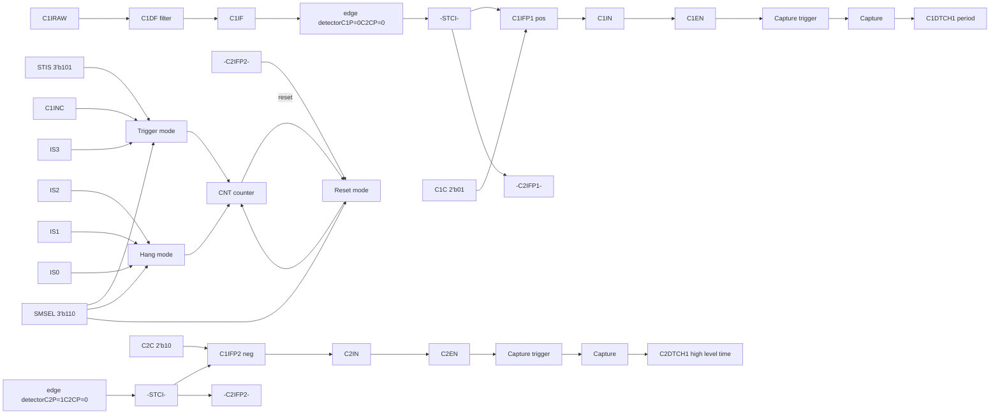

2025.05.28
Page 291
Rev 2.07


Artery logo AT32F435/437 Series Reference Manual

Figure 14-51 PWM input mode

PWM input mode timing diagram

### 14.3.3.4 TMR output function

The TMR output consists of a comparator and an output controller. It is used to program the period, duty cycle and polarity of the output signal.

Figure 14-52 Capture/compare channel output stage (channel 1)

Capture/compare channel output stage block diagram

**Output mode**

Write CxC[1: 0]≠2’b00 to configure the channel as output to implement multiple output modes. In this case, the counter value is compared with the value in the TMRx_CxDT register, and the intermediate signal CxORAW is generated according to the output mode selected by CxOCTRL[2: 0], which is sent to IO after being processed by the output control circuit. The period of the output signal is configured by the TMRx_PR register, while the duty cycle by the TMRx_CxDT register.

Output compare modes include:

● **PWM mode A**: Set CxOCTRL=3’b110 to enable PWM mode A. In upcounting, when TMRx_C1DT>TMRx_CVAL, C1ORAW outputs high; otherwise, outputs low. In downcounting, when TMRx_C1DT<TMRx_CVAL, C1ORAW outputs low; otherwise, outputs high. Figure 14-53 presents an example of upcounting and PWM mode A, PR=0x32, CxDT with different values. To set PWM mode A, the following process is recommended:

- Set the TMRx_PR register to set PWM period;
- Set the TMRx_CxDT register to set PWM duty cycle;
- Set CxOCTRL=3’b110 in TMRx_CM1/CM2 register and set output mode as PWM mode A;
- Set the TMRx_DIV register to set the counting frequency;
- Set the TWCMSEL[1:0] bit in the TMRx_CTRL1 to set the count mode;
- Set the CxP and CxCP bits in the TMRx_CCTRL register to set the output polarity;
- Set the CxEN and CxCEN bits in the TMRx_CCTRL register to enable channel output;
- Set the OEN bit in the TMRx_BRK register to enable TMRx output;
- Set the corresponding GPIO of TMR output channel as the multiplexed mode;

2025.05.28 Page 292 Rev 2.07


ARTERY logo # AT32F435/437 Series Reference Manual

- Set the TMREN bit in the TMRx_CTRL1 register to enable TMRx counter.

Figure 14-53 PWM mode A in upcounting mode

Timing diagram for PWM mode A in upcounting mode showing TMR_CLK, COUNTER, PR, DIV, C1OCTRL, and multiple C1DT/C1ORAW scenarios

* **PWM mode B:** Set CxOCTRL=3’b111 to enable PWM mode B. In upcounting, when TMRx_C1DT>TMRx_CVAL, C1ORAW outputs low; otherwise, outputs high. In downcounting, when TMRx_C1DT<TMRx_CVAL, C1ORAW outputs high; otherwise, outputs low.

* **Forced output mode:** Set CxOCTRL=3’b100/101 to enable forced output mode. In this case, the CxORAW is forced to be the programmed level, irrespective of the counter value. Despite this, the channel flag bit and DMA request still depend on the compare result.

* **Output compare mode:** Set CxOCTRL=2’b001/010/011 to enable output compare mode. In this case, when the counter value matches the value of the CxDT register, the CxORAW is forced high (CxOCTRL=3’b001), low (CxOCTRL=3’b010) or toggling (CxOCTRL=3’b011). Figure 14-54 presents an example of output compare mode (toggle), C1DT=0x3. When counter value=0x3, C1OUT toggles.

Figure 14-54 C1ORAW toggles when counter value matches C1DT value

| Signal        | Value/State at Counter Ticks | Value/State at Counter Ticks | Value/State at Counter Ticks | Value/State at Counter Ticks | Value/State at Counter Ticks | Value/State at Counter Ticks | Value/State at Counter Ticks | Value/State at Counter Ticks | Value/State at Counter Ticks | Value/State at Counter Ticks | Value/State at Counter Ticks | Value/State at Counter Ticks | Value/State at Counter Ticks | Value/State at Counter Ticks | Value/State at Counter Ticks | Value/State at Counter Ticks | Value/State at Counter Ticks | Value/State at Counter Ticks | Value/State at Counter Ticks | Value/State at Counter Ticks | Value/State at Counter Ticks | Value/State at Counter Ticks | Value/State at Counter Ticks |
| ------------- | ---------------------------- | ---------------------------- | ---------------------------- | ---------------------------- | ---------------------------- | ---------------------------- | ---------------------------- | ---------------------------- | ---------------------------- | ---------------------------- | ---------------------------- | ---------------------------- | ---------------------------- | ---------------------------- | ---------------------------- | ---------------------------- | ---------------------------- | ---------------------------- | ---------------------------- | ---------------------------- | ---------------------------- | ---------------------------- | ---------------------------- |
| TMR\_CLK      | \[Clock Pulses]              |                              |                              |                              |                              |                              |                              |                              |                              |                              |                              |                              |                              |                              |                              |                              |                              |                              |                              |                              |                              |                              |                              |
| COUNTER       | 0                            | 1                            | 2                            | 3                            | ...                          | 31                           | 32                           | 0                            | 1                            | 2                            | 3                            | ...                          | 31                           | 32                           | 0                            | 1                            | 2                            | 3                            | ...                          | 31                           | 32                           | 0                            | 1                            |
| PR\[15:0]     | 32                           |                              |                              |                              |                              |                              |                              |                              |                              |                              |                              |                              |                              |                              |                              |                              |                              |                              |                              |                              |                              |                              |                              |
| DIV\[15:0]    | 0                            |                              |                              |                              |                              |                              |                              |                              |                              |                              |                              |                              |                              |                              |                              |                              |                              |                              |                              |                              |                              |                              |                              |
| C1OCTRL\[2:0] | 011                          |                              |                              |                              |                              |                              |                              |                              |                              |                              |                              |                              |                              |                              |                              |                              |                              |                              |                              |                              |                              |                              |                              |
| C1DT\[15:0]   | 3                            |                              |                              |                              |                              |                              |                              |                              |                              |                              |                              |                              |                              |                              |                              |                              |                              |                              |                              |                              |                              |                              |                              |
| C1ORAW        | L                            | L                            | L                            | H                            | H                            | H                            | H                            | L                            | L                            | L                            | H                            | H                            | H                            | H                            | L                            | L                            | L                            | H                            | H                            | H                            | H                            | L                            |                              |


* **One-pulse mode (TMR9/12 only):** This is a particular case of PWM mode. Set OCMEN=1 to enable one-pulse mode. In this mode, the comparison match is performed in the current counting period. The TMREN bit is cleared as soon as the current counting is completed. Therefore, only one pulse is output. When configured as in upcounting mode, the configuration must follow the rule: CVAL<CxDT≤PR; in downcounting mode, CVAL>CxDT is required. Figure 14-55 presents an example of PWM mode B in upcounting mode and one-pulse mode. The counter only counts for a single cycle, and only a pulse is output.

2025.05.28 Page 293 Rev 2.07


ARTERY logo
AT32F435/437 Series Reference Manual

Figure 14-55 One-pulse mode

| Signal       | Value 1 | Value 2 | Value 3 | Value 4 | Value 5 | Value 6 | Value 7 | Value 8 | Value 9 | Value 10 | Value 11 | Value 12 | Value 13 | Value 14 | Value 15 | Value 16 | Value 17 | Value 18 |
| ------------ | ------- | ------- | ------- | ------- | ------- | ------- | ------- | ------- | ------- | -------- | -------- | -------- | -------- | -------- | -------- | -------- | -------- | -------- |
| COUNTER      | 0       | 1       | 2       | 3       | 4       | 5       | 6       | ...     | 40      | 41       | 42       | 43       | 44       | ...      | 5F       | 60       | 61       | 0        |
| PR\[15: 0]   | 61      |         |         |         |         |         |         |         |         |          |          |          |          |          |          |          |          |          |
| C1DT\[15: 0] | 42      |         |         |         |         |         |         |         |         |          |          |          |          |          |          |          |          |          |
| TRGIN        | 0       | 1       | 0       | 0       | 0       | 0       | 0       | 0       | 0       | 0        | 0        | 0        | 0        | 0        | 0        | 0        | 0        | 0        |
| C1ORAW       | 0       | 0       | 0       | 0       | 0       | 0       | 0       | 0       | 0       | 0        | 1        | 1        | 1        | 1        | 1        | 1        | 1        | 0        |
| C1OUT        | 0       | 0       | 0       | 0       | 0       | 0       | 0       | 0       | 0       | 0        | 1        | 1        | 1        | 1        | 1        | 1        | 1        | 0        |


\* **Fast output mode (TMR9/12 only):** Set CxOIEN=1 to enable this mode. If enabled, the CxORAW signal will not change when the counter value matches the CxDT, but at the beginning of the current counting period. In other words, the comparison result is advanced, so the comparison result between the counter value and the TMRx_CxDT register will determine the level of CxORAW in advance.

## 14.3.3.5 TMR synchronization

TMR9 and TMR12 are linked together internally for timer synchronization. Slave timer is selected by setting the SMSEL[2: 0] bit.

**Slave mode: Reset mode**

The counter and its prescaler can be reset by a selected trigger signal. An overflow event is generated when OVFS=0.

Figure 14-56 Example of reset mode

| Signal       | Value                     | Value | Value | Value | Value | Value | Value | Value | Value | Value | Value | Value | Value | Value | Value | Value | Value | Value | Value | Value | Value | Value | Value |
| ------------ | ------------------------- | ----- | ----- | ----- | ----- | ----- | ----- | ----- | ----- | ----- | ----- | ----- | ----- | ----- | ----- | ----- | ----- | ----- | ----- | ----- | ----- | ----- | ----- |
| TMR\_CLK     | \[Pulse Train]            |       |       |       |       |       |       |       |       |       |       |       |       |       |       |       |       |       |       |       |       |       |       |
| COUNTER      | 0                         | 1     | 2     | 3     | 4     | 5     | 6     | 7     | 8     | 9     | 0     | 1     | 2     | 3     | 4     | 5     | 6     | 7     | ...   | 30    | 31    | 32    | 0     |
| PR\[15:0]    | 32                        |       |       |       |       |       |       |       |       |       |       |       |       |       |       |       |       |       |       |       |       |       |       |
| DIV\[15:0]   | 0                         |       |       |       |       |       |       |       |       |       |       |       |       |       |       |       |       |       |       |       |       |       |       |
| STIS\[2: 0]  | 101                       |       |       |       |       |       |       |       |       |       |       |       |       |       |       |       |       |       |       |       |       |       |       |
| SMSEL\[2: 0] | 100                       |       |       |       |       |       |       |       |       |       |       |       |       |       |       |       |       |       |       |       |       |       |       |
| CI1F1        | \[Low to High transition] |       |       |       |       |       |       |       |       |       |       |       |       |       |       |       |       |       |       |       |       |       |       |
| OVFIF        | \[Pulse at reset]         |       |       |       |       |       |       |       |       |       |       |       |       |       |       |       |       |       |       |       |       |       |       |
| TRGIF        | \[Pulse at reset]         |       |       |       |       |       |       |       |       |       |       |       |       |       |       |       |       |       |       |       |       |       |       |


**Slave mode: Suspend mode**

In this mode, the counter is controlled by a selected trigger input. The counter starts counting when the trigger input is high and stops as soon as the trigger input is low.

2025.05.28
Page 294
Rev 2.07


ARTERY logo AT32F435/437 Series Reference Manual

Figure 14-57 Example of suspend mode

Timing diagram showing suspend mode with TMR_CLK, CI1F1, TMR_EN, CNT_CLK, and COUNTER signals. PR

**Slave mode: Trigger mode**

The counter can start counting on the rising edge of a selected trigger input (TMR_EN=1).

Figure 14-58 Example of trigger mode

Timing diagram showing trigger mode with TMR_CLK, CI1F1, TMR_EN, COUNTER, and OVFIF signals. PR

### 14.3.3.6 Debug mode

When the microcontroller enters debug mode (Cortex®-M4F core halted), the TMRx counter stops counting by setting the TMRx_PAUSE in the DEBUG module. Refer to Chapter 30.2 for more information.

### 14.3.4 TMR9 and TMR12 registers

These peripheral registers must be accessed by words (32 bits).

Table 14-8 TMR9 and TMR12 register map and reset value

| Register     | Offset | Reset value |
| ------------ | ------ | ----------- |
| TMRx\_CTRL1  | 0x00   | 0x0000 0000 |
| TMRx\_STCTRL | 0x08   | 0x0000 0000 |
| TMRx\_IDEN   | 0x0C   | 0x0000 0000 |
| TMRx\_ISTS   | 0x10   | 0x0000 0000 |
| TMRx\_SWEVT  | 0x14   | 0x0000 0000 |
| TMRx\_CM1    | 0x18   | 0x0000 0000 |
| TMRx\_CCTRL  | 0x20   | 0x0000 0000 |
| TMRx\_CVAL   | 0x24   | 0x0000 0000 |
| TMRx\_DIV    | 0x28   | 0x0000 0000 |
| TMRx\_PR     | 0x2C   | 0x0000 FFFF |


2025.05.28 Page 295 Rev 2.07


ARTERY logo AT32F435/437 Series Reference Manual

| TMRx\_C1DT | 0x34 | 0x0000 0000 |
| ---------- | ---- | ----------- |
| TMRx\_C2DT | 0x38 | 0x0000 0000 |


# 14.3.4.1 TMR9 and TMR12 control register 1 (TMRx_CTRL1)

| Bit        | Name     | Reset value | Type | Description                                                                                                                                                                                                                                                                              |
| ---------- | -------- | ----------- | ---- | ---------------------------------------------------------------------------------------------------------------------------------------------------------------------------------------------------------------------------------------------------------------------------------------- |
| Bit 31: 10 | Reserved | 0x00 0000   | resd | Kept at its default value                                                                                                                                                                                                                                                                |
| Bit 9: 8   | CLKDIV   | 0x0         | rw   | Clock divider<br/>This field is used to define the division ratio between digital filter sampling frequency (fDTS) and timer clock frequency (fCK\_INT).<br/>00: No division, fDTS=fCK\_INT<br/>01: Divided by 2, fDTS=fCK\_INT/2<br/>10: Divided by 4, fDTS=fCK\_INT/4<br/>11: Reserved |
| Bit 7      | PRBEN    | 0x0         | rw   | Period buffer enable<br/>0: Period buffer is disabled<br/>1: Period buffer is enabled                                                                                                                                                                                                    |
| Bit 6: 4   | Reserved | 0x0         | resd | Kept at its default value                                                                                                                                                                                                                                                                |
| Bit 3      | OCMEN    | 0x0         | rw   | One cycle mode enable<br/>This bit is use to select whether to stop counting at an update event<br/>0: The counter does not stop at an update event<br/>1: The counter stops at an update event                                                                                          |
| Bit 2      | OVFS     | 0x0         | rw   | Overflow event source<br/>This bit is used to select overflow event or DMA request sources.<br/>0: Counter overflow, setting the OVFSWTR bit or overflow event generated by slave timer controller<br/>1: Only counter overflow generates an overflow event                              |
| Bit 1      | OVFEN    | 0x0         | rw   | Overflow event enable<br/>0: Enabled<br/>1: Disabled                                                                                                                                                                                                                                     |
| Bit 0      | TMREN    | 0x0         | rw   | TMR enable<br/>0: Enabled<br/>1: Disabled                                                                                                                                                                                                                                                |


# 14.3.4.2 TMR9 and TMR12 slave timer control register (TMRx_STCTRL)

| Bit      | Name     | Reset value | Type | Description                                                                                                                                                                                                                                                                                                                                                                                                                                         |
| -------- | -------- | ----------- | ---- | --------------------------------------------------------------------------------------------------------------------------------------------------------------------------------------------------------------------------------------------------------------------------------------------------------------------------------------------------------------------------------------------------------------------------------------------------- |
| Bit 31:7 | Reserved | 0x000 0000  | resd | Kept at its default value                                                                                                                                                                                                                                                                                                                                                                                                                           |
| Bit 6: 4 | STIS     | 0x0         | rw   | Subordinate TMR input selection<br/>This field is used to select the subordinate TMR input.<br/>000: Internal selection 0 (IS0)<br/>001: Internal selection 1 (IS1)<br/>010: Internal selection 2 (IS2)<br/>011: Internal selection 3 (IS3)<br/>100: C1IRAW input detector (C1INC)<br/>101: Filtered input 1 (C1IF1)<br/>110: Filtered input 2 (C1IF2)<br/>111: Reserved<br/>Please refer to Table 14-7 for more information on ISx for each timer. |
| Bit 3    | Reserved | 0x0         | resd | Kept at its default value                                                                                                                                                                                                                                                                                                                                                                                                                           |
| Bit 2: 0 | SMSEL    | 0x0         | rw   | Subordinate TMR mode selection<br/>000: Slave mode is disabled<br/>001: Reserved<br/>010: Reserved<br/>011: Reserved<br/>100: Reset mode — Rising edge of the TRGIN input reinitializes the counter<br/>101: Suspend mode — The counter starts counting when                                                                                                                                                                                        |


2025.05.28 | Page 296 | Rev 2.07


ARTERY logo
# AT32F435/437 Series Reference Manual

the TRGIN is high
110: Trigger mode — A trigger event is generated at the rising edge of the TRGIN input
111: External clock mode A — Rising edge of the TRGIN input clocks the counter

# 14.3.4.3 TMR9 and TMR12 DMA/interrupt enable register (TMRx_IDEN)

| Bit      | Name     | Reset value | Type | Description                                               |
| -------- | -------- | ----------- | ---- | --------------------------------------------------------- |
| Bit 31:7 | Reserved | 0x000 0000  | resd | Kept at its default value.                                |
| Bit 6    | TIEN     | 0x0         | rw   | Trigger interrupt enable<br/>0: Disabled<br/>1: Enabled   |
| Bit 5:3  | Reserved | 0x0         | resd | Kept at its default value.                                |
| Bit 2    | C2IEN    | 0x0         | rw   | Channel 2 interrupt enable<br/>0: Disabled<br/>1: Enabled |
| Bit 1    | C1IEN    | 0x0         | rw   | Channel 1 interrupt enable<br/>0: Disabled<br/>1: Enabled |
| Bit 0    | OVFIEN   | 0x0         | rw   | Overflow interrupt enable<br/>0: Disabled<br/>1: Enabled  |


# 14.3.4.4 TMR9 and TMR12 interrupt status register (TMRx_ISTS)

| Bit        | Name     | Reset value | Type | Description                                                                                                                                                                                                                                                                                                                                                                                                                                                   |
| ---------- | -------- | ----------- | ---- | ------------------------------------------------------------------------------------------------------------------------------------------------------------------------------------------------------------------------------------------------------------------------------------------------------------------------------------------------------------------------------------------------------------------------------------------------------------- |
| Bit 31: 11 | Reserved | 0x00 0000   | resd | Kept at its default value.                                                                                                                                                                                                                                                                                                                                                                                                                                    |
| Bit 10     | C2RF     | 0x0         | rw0c | Channel 2 recapture flag<br/>Please refer to C1RF description.                                                                                                                                                                                                                                                                                                                                                                                                |
| Bit 9      | C1RF     | 0x0         | rw0c | Channel 1 recapture flag<br/>This bit indicates whether a recapture is detected when C1IF=1. This bit is set by hardware, and cleared by writing “0”.<br/>0: No capture is detected<br/>1: Capture is detected.                                                                                                                                                                                                                                               |
| Bit 8: 7   | Reserved | 0x0         | resd | Kept at its default value.                                                                                                                                                                                                                                                                                                                                                                                                                                    |
| Bit 6      | TRGIF    | 0x0         | rw0c | Trigger interrupt flag<br/>This bit is set by hardware on a trigger event. It is cleared by writing “0”.<br/>0: No trigger event occurs<br/>1: Trigger event is generated.<br/>Trigger event: an active edge is detected on TRGIN input, or any edge in suspend mode.                                                                                                                                                                                         |
| Bit 5:3    | Reserved | 0x0         | resd | Kept at its default value.                                                                                                                                                                                                                                                                                                                                                                                                                                    |
| Bit 2      | C2IF     | 0x0         | rw0c | Channel 2 interrupt flag<br/>Please refer to C1IF description.                                                                                                                                                                                                                                                                                                                                                                                                |
| Bit 1      | C1IF     | 0x0         | rw0c | Channel 1 interrupt flag<br/>If the channel 1 is configured as input mode:<br/>This bit is set by hardware on a capture event. It is cleared by software or read access to the TMRx\_C1DT<br/>0: No capture event occurs<br/>1: Capture event is generated<br/>If the channel 1 is configured as output mode:<br/>This bit is set by hardware on a compare event. It is cleared by software.<br/>0: No compare event occurs<br/>1: Compare event is generated |
| Bit 0      | OVFIF    | 0x0         | rw0c | Overflow interrupt flag<br/>This bit is set by hardware on an overflow event. It is cleared by software.<br/>0: No overflow event occurs<br/>1: Overflow event is generated.                                                                                                                                                                                                                                                                                  |


2025.05.28
Page 297
Rev 2.07


ARTERY logo AT32F435/437 Series Reference Manual

# 14.3.4.5 TMR9 and TMR12 software event register (TMRx_SWEVT)

| Bit       | Name     | Reset value | Type | Description                                                                                                                                              |
| --------- | -------- | ----------- | ---- | -------------------------------------------------------------------------------------------------------------------------------------------------------- |
| Bit 31: 7 | Reserved | 0x000 0000  | resd | Kept at its default value.                                                                                                                               |
| Bit 6     | TRGSWTR  | 0x0         | rw   | Trigger event triggered by software<br/>This bit is set by software to generate a trigger event.<br/>0: No effect<br/>1: Generate a trigger event.       |
| Bit 5:3   | Reserved | 0x0         | resd | Kept at its default value.                                                                                                                               |
| Bit 2     | C2SWTR   | 0x0         | wo   | Channel 2 event triggered by software<br/>Please refer to C1SWTR description                                                                             |
| Bit 1     | C1SWTR   | 0x0         | wo   | Channel 1 event triggered by software<br/>This bit is set by software to generate a channel 1 event.<br/>0: No effect<br/>1: Generate a channel 1 event. |
| Bit 0     | OVFSWTR  | 0x0         | wo   | Overflow event triggered by software<br/>This bit is set by software to generate an overflow event.<br/>0: No effect<br/>1: Generate an overflow event.  |


# 14.3.4.6 TMR9 and TMR12 channel mode register1 (TMRx_CM1)

The channel can be used in input (capture mode) or output (compare mode). The direction of a channel is defined by the corresponding CxC bits. All the other bits of this register have different functions in input and output modes. The CxOx describes its function in output mode when the channel is in output mode, while the CxIx describes its function in output mode when the channel is in input mode. Attention must be given to the fact that the same bit can have different functions in input mode and output mode.

Output compare mode:

| Bit        | Name     | Reset value | Type | Description                                                                                                                                                                                                                                                                                                                                                                                                                                                                                                                                                                                                                                |
| ---------- | -------- | ----------- | ---- | ------------------------------------------------------------------------------------------------------------------------------------------------------------------------------------------------------------------------------------------------------------------------------------------------------------------------------------------------------------------------------------------------------------------------------------------------------------------------------------------------------------------------------------------------------------------------------------------------------------------------------------------ |
| Bit 31:15  | Reserved | 0x0 0000    | resd | Kept at its default value.                                                                                                                                                                                                                                                                                                                                                                                                                                                                                                                                                                                                                 |
| Bit 14: 12 | C2OCTRL  | 0x0         | rw   | Channel 2 output control                                                                                                                                                                                                                                                                                                                                                                                                                                                                                                                                                                                                                   |
| Bit 11     | C2OBEN   | 0x0         | rw   | Channel 2 output buffer enable                                                                                                                                                                                                                                                                                                                                                                                                                                                                                                                                                                                                             |
| Bit 10     | C2OIEN   | 0x0         | rw   | Channel 2 output enable immediately                                                                                                                                                                                                                                                                                                                                                                                                                                                                                                                                                                                                        |
| Bit 9: 8   | C2C      | 0x0         | rw   | Channel 2 configuration<br/>This field is used to define the direction of the channel 2 (input or output), and the selection of input pin when C2EN=’0’:<br/>00: Output<br/>01: Input, C2IN is mapped on C2IFP2<br/>10: Input, C2IN is mapped on C1IFP2<br/>11: Input, C2IN is mapped on STCI. This mode works only when the internal trigger input is selected by STIS register.                                                                                                                                                                                                                                                          |
| Bit 7      | Reserved | 0x0         | resd | Kept at its default value.                                                                                                                                                                                                                                                                                                                                                                                                                                                                                                                                                                                                                 |
| Bit 6: 4   | C1OCTRL  | 0x0         | rw   | Channel 1 output control<br/>This field defines the behavior of the original signal C1ORAW.<br/>000: Disconnected. C1ORAW is disconnected from C1OUT;<br/>001: C1ORAW is high when TMRx\_CVAL=TMRx\_C1DT<br/>010: C1ORAW is low when TMRx\_CVAL=TMRx\_C1DT<br/>011: Switch C1ORAW level when TMRx\_CVAL=TMRx\_C1DT<br/>100: C1ORAW is forced low<br/>101: C1ORAW is forced high.<br/>110: PWM mode A<br/>- OWCDIR=0, C1ORAW is high once TMRx\_C1DT>TMRx\_CVAL, else low;<br/>- OWCDIR=1, C1ORAW is low once TMRx\_C1DT \<TMRx\_CVAL, else high;<br/>111: PWM mode B<br/>- OWCDIR=0, C1ORAW is low once TMRx\_C1DT >TMRx\_CVAL, else high; |


2025.05.28 | Page 298 | Rev 2.07


Artery logo
AT32F435/437 Series Reference Manual

| Bit       | Name   | Reset value | Type | Description                                                                                                                                                                                                                                                                                                                                                              |
| --------- | ------ | ----------- | ---- | ------------------------------------------------------------------------------------------------------------------------------------------------------------------------------------------------------------------------------------------------------------------------------------------------------------------------------------------------------------------------ |
|           |        |             |      | - OWCDIR=1, C1ORAW is high once TMRx\_ C1DT \<TMRx\_CVAL, else low.<br/>*Note: In the configurations other than 000’, the C1OUT is connected to C1ORAW. The C1OUT output level is not only subject to the changes of C1ORAW, but also the output polarity set by CCTRL.*                                                                                                 |
| Bit 3     | C1OBEN | 0x0         | rw   | Channel 1 output buffer enable<br/>0: Buffer function of TMRx\_C1DT is disabled. The new value written to the TMRx\_C1DT takes effect immediately.<br/>1: Buffer function of TMRx\_C1DT is enabled. The value to be written to the TMRx\_C1DT is stored in the buffer register, and can be sent to the TMRx\_C1DT register only on an overflow event.                    |
| Bit 2     | C1OIEN | 0x0         | rw   | Channel 1 output enable immediately<br/>In PWM mode A or B, this bit is used to accelerate the channel 1 output’s response to the trigger event.<br/>0: Need to compare the CVAL with C1DT before generating an output<br/>1: No need to compare the CVAL and C1DT. An output is generated immediately when a trigger event occurs.                                      |
| Bit 1 : 0 | C1C    | 0x0         | rw   | Channel 1 configuration<br/>This field is used to define the direction of the channel 1 (input or output), and the selection of input pin when C1EN=’0’:<br/>00: Output<br/>01: Input, C1IN is mapped on C1IFP1<br/>10: Input, C1IN is mapped on C2IFP1<br/>11: Input, C1IN is mapped on STCI. This mode works only when the internal trigger input is selected by STIS. |


**Input capture mode:**

| Bit        | Name     | Reset value | Type | Description                                                                                                                                                                                                                                                                                                                                                                                                                                                                                                                                                                                                                                                                                                           |
| ---------- | -------- | ----------- | ---- | --------------------------------------------------------------------------------------------------------------------------------------------------------------------------------------------------------------------------------------------------------------------------------------------------------------------------------------------------------------------------------------------------------------------------------------------------------------------------------------------------------------------------------------------------------------------------------------------------------------------------------------------------------------------------------------------------------------------- |
| Bit 31:16  | Reserved | 0x0000      | resd | Kept at its default value.                                                                                                                                                                                                                                                                                                                                                                                                                                                                                                                                                                                                                                                                                            |
| Bit 15: 12 | C2DF     | 0x0         | rw   | Channel 2 digital filter                                                                                                                                                                                                                                                                                                                                                                                                                                                                                                                                                                                                                                                                                              |
| Bit 11: 10 | C2IDIV   | 0x0         | rw   | Channel 2 input divider                                                                                                                                                                                                                                                                                                                                                                                                                                                                                                                                                                                                                                                                                               |
| Bit 9: 8   | C2C      | 0x0         | rw   | Channel 2 configuration<br/>This field is used to define the direction of the channel 2 (input or output), and the selection of input pin when C2EN=’0’:<br/>00: Output<br/>01: Input, C2IN is mapped on C2IFP2<br/>10: Input, C2IN is mapped on C1IFP2<br/>11: Input, C2IN is mapped on STCI. This mode works only when the internal trigger input is selected by STIS.                                                                                                                                                                                                                                                                                                                                              |
| Bit 7: 4   | C1DF     | 0x0         | rw   | Channel 1 digital filter<br/>This field defines the digital filter of the channel 1. “N” refers to the number of filtering, meaning that N consecutive events are needed to validate a transition on the output.<br/>0000: No filter, sampling is done at $f\_{DTS}$<br/>0001: $f\_{SAMPLING}=f\_{CK\\\_INT}$, N=2<br/>0010: $f\_{SAMPLING}=f\_{CK\\\_INT}$, N=4<br/>0011: $f\_{SAMPLING}=f\_{CK\\\_INT}$, N=8<br/>0100: $f\_{SAMPLING}=f\_{DTS}/2$, N=6<br/>0101: $f\_{SAMPLING}=f\_{DTS}/2$, N=8<br/>0110: $f\_{SAMPLING}=f\_{DTS}/4$, N=6<br/>0111: $f\_{SAMPLING}=f\_{DTS}/4$, N=8<br/>1000: $f\_{SAMPLING}=f\_{DTS}/8$, N=6<br/>1001: $f\_{SAMPLING}=f\_{DTS}/8$, N=8<br/>1010: $f\_{SAMPLING}=f\_{DTS}/16$, N=5 |


2025.05.28
Page 299
Rev 2.07


ARTERY logo
AT32F435/437 Series Reference Manual

| Bit 3: 2 | C1IDIV | 0x0 | rw | 1011: fSAMPLING=fDTS/16, N=6<br/>1100: fSAMPLING=fDTS/16, N=8<br/>1101: fSAMPLING=fDTS/32, N=5<br/>1110: fSAMPLING=fDTS/32, N=6<br/>1111: fSAMPLING=fDTS/32, N=8<br/>**Channel 1 input divider**<br/>This field defines Channel 1 input divider.<br/>00: No divider. An input capture is generated at each active edge.<br/>01: An input compare is generated every 2 active edges<br/>10: An input compare is generated every 4 active edges<br/>11: An input compare is generated every 8 active edges<br/>Note: the divider is reset once C1EN=’0’ |
| -------- | ------ | --- | -- | ----------------------------------------------------------------------------------------------------------------------------------------------------------------------------------------------------------------------------------------------------------------------------------------------------------------------------------------------------------------------------------------------------------------------------------------------------------------------------------------------------------------------------------------------------- |
| Bit 1: 0 | C1C    | 0x0 | rw | **Channel 1 configuration**<br/>This field is used to define the direction of the channel 1 (input or output), and the selection of input pin when C1EN=’0’:<br/>00: Output<br/>01: Input, C1IN is mapped on C1IFP1<br/>10: Input, C1IN is mapped on C2IFP1<br/>11: Input, C1IN is mapped on STCI. This mode works only when the internal trigger input is selected by STIS.                                                                                                                                                                          |


## 14.3.4.7 TMR9 and TMR12 channel control register (TMRx_CCTRL)

| Bit       | Name     | Reset value | Type | Description                                                                                                                                                                                                                                                                                                                                                                                 |
| --------- | -------- | ----------- | ---- | ------------------------------------------------------------------------------------------------------------------------------------------------------------------------------------------------------------------------------------------------------------------------------------------------------------------------------------------------------------------------------------------- |
| Bit 31: 8 | Reserved | 0x00 0000   | resd | Kept at its default value.                                                                                                                                                                                                                                                                                                                                                                  |
| Bit 5     | C2P      | 0x0         | rw   | **Channel 2 polarity**<br/>Please refer to C1P description.                                                                                                                                                                                                                                                                                                                                 |
| Bit 4     | C2EN     | 0x0         | rw   | **Channel 2 enable**<br/>Please refer to C1EN description.                                                                                                                                                                                                                                                                                                                                  |
| Bit 3: 2  | Reserved | 0x0         | resd | Kept at its default value.                                                                                                                                                                                                                                                                                                                                                                  |
| Bit 1     | C1P      | 0x0         | rw   | **Channel 1 polarity**<br/>When the channel 1 is configured as output mode:<br/>0: C1OUT is active high<br/>1: C1OUT is active low<br/>When the channel 1 is configured as input mode:<br/>0: C1IN active edge is on its rising edge. When used as external trigger, C1IN is not inverted.<br/>1: C1IN active edge is on its falling edge. When used as external trigger, C1IN is inverted. |
| Bit0      | C1EN     | 0x0         | rw   | **Channel 1 enable**<br/>0: Input or output is disabled<br/>1: Input or output is enabled                                                                                                                                                                                                                                                                                                   |


### Table 14-9 Standard CxOUT channel output control bit

| CxEN bit | CxOUT output state        |
| -------- | ------------------------- |
| 0        | Output disabled (CxOUT=0) |
| 1        | CxOUT = CxORAW + polarity |


Note: The state of the external I/O pins connected to the standard CxOUT channel depends on the CxOUT channel state and the GPIO and IOMUX registers.

## 14.3.4.8 TMR9 and TMR12 counter value register (TMRx_CVAL)

| Bit        | Name     | Reset value | Type | Description                |
| ---------- | -------- | ----------- | ---- | -------------------------- |
| Bit 31: 16 | Reserved | 0x0000      | resd | Kept at its default value. |
| Bit 15: 0  | CVAL     | 0x0000      | rw   | Counter value              |


## 14.3.4.9 TMR9 and TMR12 division value register (TMRx_DIV)

| Bit | Name | Reset value | Type | Description |
| --- | ---- | ----------- | ---- | ----------- |


2025.05.28
Page 300
Rev 2.07


ARTERY logo # AT32F435/437 Series Reference Manual

| Bit 31: 16 | Reserved | 0x0000 | resd | Kept at its default value.                                                                                                                     |
| ---------- | -------- | ------ | ---- | ---------------------------------------------------------------------------------------------------------------------------------------------- |
| Bit 15: 0  | DIV      | 0x0000 | rw   | Divider value<br/>The counter clock frequency fCK\_CNT = fTMR\_CLK / (DIV\[15: 0]+1).<br/>DIV contains the value written at an overflow event. |


## 14.3.4.10 TMR9 and TMR12 period register (TMRx_PR)

| Bit        | Name     | Reset value | Type | Description                                                                                                             |
| ---------- | -------- | ----------- | ---- | ----------------------------------------------------------------------------------------------------------------------- |
| Bit 31: 16 | Reserved | 0x0000      | resd | Kept at its default value.                                                                                              |
| Bit 15: 0  | PR       | 0xFFFF      | rw   | Period value<br/>This defines the period value of the TMRx counter. The timer stops working when the period value is 0. |


## 14.3.4.11 TMR9 and TMR12 channel 1 data register (TMRx_C1DT)

| Bit        | Name     | Reset value | Type | Description                                                                                                                                                                                                                                                                                                                                                                                                                   |
| ---------- | -------- | ----------- | ---- | ----------------------------------------------------------------------------------------------------------------------------------------------------------------------------------------------------------------------------------------------------------------------------------------------------------------------------------------------------------------------------------------------------------------------------- |
| Bit 31: 16 | Reserved | 0x0000      | resd | Kept at its default value.                                                                                                                                                                                                                                                                                                                                                                                                    |
| Bit 15: 0  | C1DT     | 0x0000      | rw   | Channel 1 data register<br/>When the channel 1 is configured as input mode:<br/>The C1DT is the CVAL value stored by the last channel 1 input event (C1IN).<br/>When the channel 1 is configured as output mode:<br/>C1DT is the value to be compared with the CVAL value. Whether the written value takes effective immediately depends on the C1OBEN bit, and the corresponding output is generated on C1OUT as configured. |


## 14.3.4.12 TMR9 and TMR12 channel 2 data register (TMRx_C2DT)

| Bit        | Name | Reset value | Type | Description                                                                                                                                                                                                                                                                                                                                                                                                                   |
| ---------- | ---- | ----------- | ---- | ----------------------------------------------------------------------------------------------------------------------------------------------------------------------------------------------------------------------------------------------------------------------------------------------------------------------------------------------------------------------------------------------------------------------------- |
| Bit 31: 16 | C2DT | 0x0000      | resd | Kept at its default value.                                                                                                                                                                                                                                                                                                                                                                                                    |
| Bit 15: 0  | C2DT | 0x0000      | rw   | Channel 2 data register<br/>When the channel 2 is configured as input mode:<br/>The C2DT is the CVAL value stored by the last channel 2 input event (C2IN).<br/>When the channel 2 is configured as output mode:<br/>C2DT is the value to be compared with the CVAL value. Whether the written value takes effective immediately depends on the C2OBEN bit, and the corresponding output is generated on C2OUT as configured. |


## 14.3.5 TMR10, TMR11, TMR13 and TMR14 registers

These peripheral registers must be accessed by words (32 bits).

Table 14-10 TMR10, TMR11, TMR13 and TMR14 register map and reset value

| Register    | Offset | Reset value |
| ----------- | ------ | ----------- |
| TMRx\_CTRL1 | 0x00   | 0x0000 0000 |
| TMRx\_IDEN  | 0x0C   | 0x0000 0000 |
| TMRx\_ISTS  | 0x10   | 0x0000 0000 |
| TMRx\_SWEVT | 0x14   | 0x0000 0000 |
| TMRx\_CM1   | 0x18   | 0x0000 0000 |
| TMRx\_CCTRL | 0x20   | 0x0000 0000 |
| TMRx\_CVAL  | 0x24   | 0x0000 0000 |
| TMRx\_DIV   | 0x28   | 0x0000 0000 |
| TMRx\_PR    | 0x2C   | 0x0000 FFFF |
| TMRx\_C1DT  | 0x34   | 0x0000 0000 |


2025.05.28
Page 301
Rev 2.07


ARTERY logo AT32F435/437 Series Reference Manual

# 14.3.5.1 TMR10, TMR11, TMR13 and TMR14 control register 1 (TMRx_CTRL1)

| Bit        | Name     | Reset value | Type | Description                                                                                                                                                                                                                                                                              |
| ---------- | -------- | ----------- | ---- | ---------------------------------------------------------------------------------------------------------------------------------------------------------------------------------------------------------------------------------------------------------------------------------------- |
| Bit 31: 10 | Reserved | 0x00 0000   | resd | Kept at its default value                                                                                                                                                                                                                                                                |
| Bit 9: 8   | CLKDIV   | 0x0         | rw   | Clock divider<br/>This field is used to define the division ratio between digital filter sampling frequency (fDTS) and timer clock frequency (fCK\_INT).<br/>00: No division, fDTS=fCK\_INT<br/>01: Divided by 2, fDTS=fCK\_INT/2<br/>10: Divided by 4, fDTS=fCK\_INT/4<br/>11: Reserved |
| Bit 7      | PRBEN    | 0x0         | rw   | Period buffer enable<br/>0: Period buffer is disabled<br/>1: Period buffer is enabled                                                                                                                                                                                                    |
| Bit 6: 4   | Reserved | 0x0         | resd | Default value                                                                                                                                                                                                                                                                            |
| Bit 3      | OCMEN    | 0x0         | rw   | One cycle mode enable<br/>This bit is use to select whether to stop counting at an overflow event<br/>0: The counter does not stop at an overflow event<br/>1: The counter stops at an overflow event                                                                                    |
| Bit 2      | OVFS     | 0x0         | rw   | Overflow event source<br/>This bit is used to select overflow event or DMA request source.<br/>0: Counter overflow, setting the OVFSWTR bit generates an overflow event<br/>*1: Only counter overflow can generate an overflow event*                                                    |
| Bit 1      | OVFEN    | 0x0         | rw   | Overflow event enable<br/>0: Enabled<br/>1: Disabled                                                                                                                                                                                                                                     |
| Bit 0      | TMREN    | 0x0         | rw   | TMR enable<br/>0: Enabled<br/>1: Disabled                                                                                                                                                                                                                                                |


# 14.3.5.2 TMR10, TMR11, TMR13 and TMR14 DMA/interrupt enable register (TMRx_IDEN)

| Bit      | Name     | Reset value | Type | Description                                               |
| -------- | -------- | ----------- | ---- | --------------------------------------------------------- |
| Bit 31:2 | Reserved | 0x0000 0000 | resd | Kept at its default value                                 |
| Bit 1    | C1IEN    | 0x0         | rw   | Channel 1 interrupt enable<br/>0: Disabled<br/>1: Enabled |
| Bit 0    | OVFIEN   | 0x0         | rw   | Overflow interrupt enable<br/>0: Disabled<br/>1: Enabled  |


# 14.3.5.3 TMR10, TMR11, TMR13 and TMR14 interrupt status register (TMRx_ISTS)

| Bit        | Name     | Reset value | Type | Description                                                                                                                                                                                                     |
| ---------- | -------- | ----------- | ---- | --------------------------------------------------------------------------------------------------------------------------------------------------------------------------------------------------------------- |
| Bit 31: 10 | Reserved | 0x00 0000   | resd | Kept at its default value.                                                                                                                                                                                      |
| Bit 9      | C1RF     | 0x0         | rw0c | Channel 1 recapture flag<br/>This bit indicates whether a recapture is detected when C1IF=1. This bit is set by hardware, and cleared by writing "0".<br/>0: No capture is detected<br/>1: Capture is detected. |
| Bit 8: 2   | Reserved | 0x0         | resd | Kept at its default value.                                                                                                                                                                                      |
| Bit 1      | C1IF     | 0x0         | rw0c | Channel 1 interrupt flag<br/>If the channel 1 is configured as input mode:<br/>This bit is set by hardware on a capture event. It is cleared by software or read access to the TMRx\_C1DT                       |


2025.05.28 Page 302 Rev 2.07


ARTERY logo
AT32F435/437 Series Reference Manual

| Bit   | Name  | Reset value | Type | Description<br/>0: No capture event occurs1: Capture event is generatedIf the channel 1 is configured as output mode:This bit is set by hardware on a compare event. It is cleared by software.0: No compare event occurs1: Compare event is generated |
| ----- | ----- | ----------- | ---- | ------------------------------------------------------------------------------------------------------------------------------------------------------------------------------------------------------------------------------------------------------ |
| Bit 0 | OVFIF | 0x0         | rw0c | Overflow interrupt flag<br/>This bit is set by hardware on an overflow event. It is cleared by software.<br/>0: No overflow event occurs                                                                                                               |
|       |       |             |      | 1: Overflow event is generated. When OVFEN=0 and OVFS=0 in the TMRx\_CTRL1 register:<br/>Overflow event is generated when OVFSWTR=1 in the TMRx\_SWEVT register;<br/>Overflow event is generated when CVAL is re-initialized by a trigger event.       |


# 14.3.5.4 TMR10, TMR11, TMR13 and TMR14 software event register (TMRx_SWEVT)

| Bit       | Name     | Reset value | Type | Description                                                                                                                                              |
| --------- | -------- | ----------- | ---- | -------------------------------------------------------------------------------------------------------------------------------------------------------- |
| Bit 31: 2 | Reserved | 0x0000 0000 | resd | Kept at its default value.                                                                                                                               |
| Bit 1     | C1SWTR   | 0x0         | wo   | Channel 1 event triggered by software<br/>This bit is set by software to generate a channel 1 event.<br/>0: No effect<br/>1: Generate a channel 1 event. |
| Bit 0     | OVFSWTR  | 0x0         | wo   | Overflow event triggered by software<br/>This bit is set by software to generate an overflow event.<br/>0: No effect<br/>1: Generate an overflow event.  |


# 14.3.5.5 TMR10, TMR11, TMR13 and TMR14 channel mode register 1 (TMRx_CM1)

The channel can be used in input (capture mode) or output (compare mode). The direction of a channel is defined by the corresponding CxC bits. All the other bits of this register have different functions in input and output modes. The CxOx describes its function in output mode when the channel is in output mode, while the CxIx describes its function in output mode when the channel is in input mode. Attention must be given to the fact that the same bit can have different functions in input mode and output mode.

**Output compare mode:**

| Bit      | Name     | Reset value | Type | Description                                                                                                                                                                                                                                                                                                                                                                                                                                                                                                                                                                                                                                |
| -------- | -------- | ----------- | ---- | ------------------------------------------------------------------------------------------------------------------------------------------------------------------------------------------------------------------------------------------------------------------------------------------------------------------------------------------------------------------------------------------------------------------------------------------------------------------------------------------------------------------------------------------------------------------------------------------------------------------------------------------ |
| Bit 31:7 | Reserved | 0x000 0000  | resd | Kept at its default value.                                                                                                                                                                                                                                                                                                                                                                                                                                                                                                                                                                                                                 |
| Bit 6: 4 | C1OCTRL  | 0x0         | rw   | Channel 1 output control<br/>This field defines the behavior of the original signal C1ORAW.<br/>000: Disconnected. C1ORAW is disconnected from C1OUT;<br/>001: C1ORAW is high when TMRx\_CVAL=TMRx\_C1DT<br/>010: C1ORAW is low when TMRx\_CVAL=TMRx\_C1DT<br/>011: Switch C1ORAW level when TMRx\_CVAL=TMRx\_C1DT<br/>100: C1ORAW is forced low<br/>101: C1ORAW is forced high.<br/>110: PWM mode A<br/>- OWCDIR=0, C1ORAW is high once TMRx\_C1DT>TMRx\_CVAL, else low;<br/>- OWCDIR=1, C1ORAW is low once TMRx\_C1DT \<TMRx\_CVAL, else high;<br/>111: PWM mode B<br/>- OWCDIR=0, C1ORAW is low once TMRx\_C1DT >TMRx\_CVAL, else high; |


2025.05.28
Page 303
Rev 2.07


ARTERY logo # AT32F435/437 Series Reference Manual

| Bit      | Name   | Reset value | Type | Description                                                                                                                                                                                                                                                                                                                                               |
| -------- | ------ | ----------- | ---- | --------------------------------------------------------------------------------------------------------------------------------------------------------------------------------------------------------------------------------------------------------------------------------------------------------------------------------------------------------- |
|          |        |             |      | - OWCDIR=1, C1ORAW is high once TMRx\_ C1DT \<TMRx\_CVAL, else low.                                                                                                                                                                                                                                                                                       |
|          |        |             |      | Note: In the configurations other than 000’, the C1OUT is connected to C1ORAW. The C1OUT output level is not only subject to the changes of C1ORAW, but also the output polarity set by CCTRL.                                                                                                                                                            |
|          |        |             |      | **Channel 1 output buffer enable**<br/>0: Buffer function of TMRx\_C1DT is disabled. The new value written to the TMRx\_C1DT takes effect immediately.<br/>1: Buffer function of TMRx\_C1DT is enabled. The value to be written to the TMRx\_C1DT is stored in the buffer register, and can be sent to the TMRx\_C1DT register only on an overflow event. |
| Bit 3    | C1OBEN | 0x0         | rw   |                                                                                                                                                                                                                                                                                                                                                           |
| Bit 2    | C1OIEN | 0x0         | rw   | **Channel 1 output enable immediately**<br/>In PWM mode A or B, this bit is used to accelerate the channel 1 output’s response to the trigger event.<br/>0: Need to compare the CVAL with C1DT before generating an output<br/>1: No need to compare the CVAL and C1DT. An output is generated immediately when a trigger event occurs.                   |
| Bit 1: 0 | C1C    | 0x0         | rw   | **Channel 1 configuration**<br/>This field is used to define the direction of the channel 1 (input or output), and the selection of input pin when C1EN=’0’:<br/>00: Output<br/>01: Input, C1IN is mapped on C1IFP1<br/>10: Reserved<br/>11: Reserved                                                                                                     |


**Input capture mode:**

| Bit       | Name     | Reset value | Type | Description                                                                                                                                                                                                                                                                                                                                                                                                                                                                                                                                                                                                                                                                                                                                                                                                                                                                                                                                      |
| --------- | -------- | ----------- | ---- | ------------------------------------------------------------------------------------------------------------------------------------------------------------------------------------------------------------------------------------------------------------------------------------------------------------------------------------------------------------------------------------------------------------------------------------------------------------------------------------------------------------------------------------------------------------------------------------------------------------------------------------------------------------------------------------------------------------------------------------------------------------------------------------------------------------------------------------------------------------------------------------------------------------------------------------------------ |
| Bit 31: 8 | Reserved | 0x00 0000   | resd | Kept at its default value.                                                                                                                                                                                                                                                                                                                                                                                                                                                                                                                                                                                                                                                                                                                                                                                                                                                                                                                       |
| Bit 7: 4  | C1DF     | 0x0         | rw   | **Channel 1 digital filter**<br/>This field defines the digital filter of the channel 1. “N” refers to the number of filtering, meaning that N consecutive events are needed to validate a transition on the output.<br/>0000: No filter, sampling is done at $f\_{DTS}$<br/>0001: $f\_{SAMPLING}=f\_{CK\\\_INT}$, N=2<br/>0010: $f\_{SAMPLING}=f\_{CK\\\_INT}$, N=4<br/>0011: $f\_{SAMPLING}=f\_{CK\\\_INT}$, N=8<br/>0100: $f\_{SAMPLING}=f\_{DTS}/2$, N=6<br/>0101: $f\_{SAMPLING}=f\_{DTS}/2$, N=8<br/>0110: $f\_{SAMPLING}=f\_{DTS}/4$, N=6<br/>0111: $f\_{SAMPLING}=f\_{DTS}/4$, N=8<br/>1000: $f\_{SAMPLING}=f\_{DTS}/8$, N=6<br/>1001: $f\_{SAMPLING}=f\_{DTS}/8$, N=8<br/>1010: $f\_{SAMPLING}=f\_{DTS}/16$, N=5<br/>1011: $f\_{SAMPLING}=f\_{DTS}/16$, N=6<br/>1100: $f\_{SAMPLING}=f\_{DTS}/16$, N=8<br/>1101: $f\_{SAMPLING}=f\_{DTS}/32$, N=5<br/>1110: $f\_{SAMPLING}=f\_{DTS}/32$, N=6<br/>1111: $f\_{SAMPLING}=f\_{DTS}/32$, N=8 |
| Bit 3: 2  | C1IDIV   | 0x0         | rw   | **Channel 1 input divider**<br/>This field defines Channel 1 input divider.<br/>00: No divider. An input capture is generated at each active edge.<br/>01: An input compare is generated every 2 active edges<br/>10: An input compare is generated every 4 active edges<br/>11: An input compare is generated every 8 active edges                                                                                                                                                                                                                                                                                                                                                                                                                                                                                                                                                                                                              |


2025.05.28 Page 304 Rev 2.07


ARTERY logo # AT32F435/437 Series Reference Manual

| Bit 1: 0 | C1C | 0x0 | rw | Note: the divider is reset once C1EN=’0’<br/>\*\*Channel 1 configuration\*\*<br/>This field is used to define the direction of the channel 1 (input or output), and the selection of input pin when C1EN=’0’:<br/>00: Output<br/>01: Input, C1IN is mapped on C1IFP1<br/>10: Reserved<br/>11: Reserved |
| -------- | --- | --- | -- | ------------------------------------------------------------------------------------------------------------------------------------------------------------------------------------------------------------------------------------------------------------------------------------------------------ |


## 14.3.5.6 TMR10, TMR11, TMR13 and TMR14 channel control register (TMRx_CCTRL)

| Bit       | Name     | Reset value | Type | Description                                                                                                                                                                                                                                                                                                                                                                                                                                                                                                                                                                                            |
| --------- | -------- | ----------- | ---- | ------------------------------------------------------------------------------------------------------------------------------------------------------------------------------------------------------------------------------------------------------------------------------------------------------------------------------------------------------------------------------------------------------------------------------------------------------------------------------------------------------------------------------------------------------------------------------------------------------ |
| Bit 31: 4 | Reserved | 0x000 0000  | resd | Kept at its default value.                                                                                                                                                                                                                                                                                                                                                                                                                                                                                                                                                                             |
| Bit 3     | C1CP     | 0x0         | rw   | **Channel 1 complementary polarity**<br/>Defines the active edge of input signals. See C1P for details.                                                                                                                                                                                                                                                                                                                                                                                                                                                                                                |
| Bit 2     | Reserved | 0x0         | resd | Kept at its default value.                                                                                                                                                                                                                                                                                                                                                                                                                                                                                                                                                                             |
| Bit 1     | C1P      | 0x0         | rw   | **Channel 1 polarity**<br/>When the channel 1 is configured as output mode:<br/>0: C1OUT is active high<br/>1: C1OUT is active low<br/>When the channel 1 is configured as input mode:<br/>C1CP/C1P both are used to define the active edge of the input signal.<br/>00: C1IN active edge is on its rising edge. When used as external trigger, C1IN is not inverted.<br/>01: C1IN active edge is on its falling edge. When used as external trigger, C1IN is inverted.<br/>10: Reserved<br/>11: C1IN active edge is on rising edge/falling edge. When used as external trigger, C1IN is not inverted. |
| Bit0      | C1EN     | 0x0         | rw   | **Channel 1 enable**<br/>0: Input or output is disabled<br/>1: Input or output is enabled                                                                                                                                                                                                                                                                                                                                                                                                                                                                                                              |


Table 14-11 Standard CxOUT channel output control bit

| CxEN bit | CxOUT output state        |
| -------- | ------------------------- |
| 0        | Output disabled (CxOUT=0) |
| 1        | CxOUT = CxORAW + polarity |


Note: The state of the external I/O pins connected to the standard CxOUT channel depends on the CxOUT channel state and the GPIO and IOMUX registers.

## 14.3.5.7 TMR10, TMR11, TMR13 and TMR14 counter value register (TMRx_CVAL)

| Bit        | Name     | Reset value | Type | Description                |
| ---------- | -------- | ----------- | ---- | -------------------------- |
| Bit 31: 16 | Reserved | 0x0000      | resd | Kept at its default value. |
| Bit 15: 0  | CVAL     | 0x0000      | rw   | Counter value              |


## 14.3.5.8 TMR10, TMR11, TMR13 and TMR14 division value (TMRx_DIV)

| Bit        | Name     | Reset value | Type | Description                                                                                                                                       |
| ---------- | -------- | ----------- | ---- | ------------------------------------------------------------------------------------------------------------------------------------------------- |
| Bit 31: 16 | Reserved | 0x0000      | resd | Kept at its default value.                                                                                                                        |
| Bit 15: 0  | DIV      | 0x0000      | rw   | **Divider value**<br/>The counter clock frequency fCK\_CNT = fTMR\_CLK /(DIV\[15: 0]+1).<br/>DIV contains the value written at an overflow event. |


2025.05.28 Page 305 Rev 2.07


ARTERY logo
AT32F435/437 Series Reference Manual

# 14.3.5.9 TMR10, TMR11, TMR13 and TMR14 period register (TMRx_PR)

| Bit        | Name     | Reset value | Type | Description                                                                                                             |
| ---------- | -------- | ----------- | ---- | ----------------------------------------------------------------------------------------------------------------------- |
| Bit 31: 16 | Reserved | 0x0000      | resd | Kept at its default value.                                                                                              |
| Bit 15: 0  | PR       | 0xFFFF      | rw   | Period value<br/>This defines the period value of the TMRx counter. The timer stops working when the period value is 0. |


# 14.3.5.10 TMR10, TMR11, TMR13 and TMR14 channel 1 data register (TMRx_C1DT)

| Bit        | Name     | Reset value | Type | Description                                                                                                                                                                                                                                                                                                                                                                                                                   |
| ---------- | -------- | ----------- | ---- | ----------------------------------------------------------------------------------------------------------------------------------------------------------------------------------------------------------------------------------------------------------------------------------------------------------------------------------------------------------------------------------------------------------------------------- |
| Bit 31: 16 | Reserved | 0x0000      | resd | Kept at its default value.                                                                                                                                                                                                                                                                                                                                                                                                    |
| Bit 15: 0  | C1DT     | 0x0000      | rw   | Channel 1 data register<br/>When the channel 1 is configured as input mode:<br/>The C1DT is the CVAL value stored by the last channel 1 input event (C1IN).<br/>When the channel 1 is configured as output mode:<br/>C1DT is the value to be compared with the CVAL value. Whether the written value takes effective immediately depends on the C1OBEN bit, and the corresponding output is generated on C1OUT as configured. |


2025.05.28
Page 306
Rev 2.07


ARTERY logo AT32F435/437 Series Reference Manual

# 14.4 Advanced-control timers (TMR1, TMR8 and TMR20)

## 14.4.1 TMR1 , TMR8 and TMR20 introduction

Each of the advanced-control timer (TMR1, TMR8 and TMR20) consists of a 16-bit counter supporting up and down counting modes, four capture/compare registers, and five independent channels to achieve embedded dead-time, input capture and programmable PWM output.

## 14.4.2 TMR1, TMR8 and TMR20 main features

The main functions of general-purpose TMR1, TMR8 and TMR20 include:

* Source of counter clock: internal clock, external clock an internal trigger input
* 16-bit up, down, up/down, repetition and encoder mode counter
* Five independent channels for input capture, output compare, PWM generation, one-pulse mode output and embedded dead-time
* Three independent channels for complementary output
* TMR brake function
* Synchronization control between master and slave timers
* Interrupt/DMA is generated at overflow event, trigger event, brake signal input and channel event
* Support TMR burst DMA transfer

Figure 14-59 Block diagram of advanced-control timer

Block diagram of advanced-control timer

## 14.4.3 TMR1, TMR8 and TMR20 functional overview

### 14.4.3.1 Counting clock

The count clock of TMR1, TMR8 and TMR20 can be provided by the internal clock (CK_INT), external clock (external clock mode A and B) and internal trigger input (ISx).

2025.05.28 Page 307 Rev 2.07


ARTERY logo # AT32F435/437 Series Reference Manual

Figure 14-60 Count clock

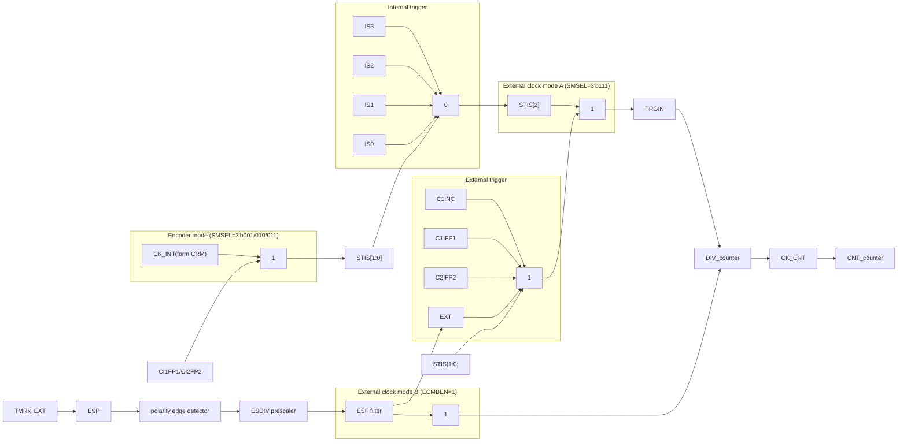

## Internal clock (CK_INT)

By default, the CK_INT divided by the prescaler is used to drive the counter to start counting. When TMR’s APB clock prescaler factor is 1, the CK_INT frequency is equal to that of APB; otherwise, it doubles the APB clock frequency.

The configuration process is as follows:

* Configure the CLKDIV[1:0] bit in the TMRx_CTRL1 register and set CK_INT frequency.
* Configure the TWCMSEL[1:0] bit in the TMRx_CTRL1 register and select count mode. If the one way count direction is set, configure OWCDIR bit in the TMRx_CTRL1 register to select the specific direction.
* Configure the TMRx_DIV register and set counting frequency.
* Configure the TMRx_PR register and set counting period.
* Configure the TMREN bit in the TMRx_CTRL1 register and enable the counter.

Figure 14-61 Use CK_INT to drive counter, with TMRx_DIV=0x0 and TMRx_PR=0x16

| Signal   | T1    | T2    | T3    | T4    | T5    | T6    | T7    | T8    | T9    | T10   | T11   | T12   | T13   | T14   |
| -------- | ----- | ----- | ----- | ----- | ----- | ----- | ----- | ----- | ----- | ----- | ----- | ----- | ----- | ----- |
| CK\_INT  | Pulse | Pulse | Pulse | Pulse | Pulse | Pulse | Pulse | Pulse | Pulse | Pulse | Pulse | Pulse | Pulse | Pulse |
| TMREN    | Low   | High  | High  | High  | High  | High  | High  | High  | High  | High  | High  | High  | High  | High  |
| COUNTER  |       | 11    | 12    | 13    | 14    | 15    | 16    | 00    | 01    | 02    | 03    | 04    | 05    | 06    |
| overflow | Low   | Low   | Low   | Low   | Low   | Low   | High  | Low   | Low   | Low   | Low   | Low   | Low   | Low   |
| OVFIF    | Low   | Low   | Low   | Low   | Low   | Low   | Low   | High  | High  | High  | High  | High  | High  | High  |


## External clock (TRGIN/EXT)

The counter clock can be provided by two external clock sources, namely, TRGIN and EXT signals.

**SMSEL=3’b111**: External clock mode A is selected. Select an external clock source TRGIN signal by setting the STIS[2:0] bit to drive the counter to start counting. The external clock sources include: C1INC (STIS=3’b100, channel 1 rising edge and falling edge), C1IFP1 (STIS=3’b101, channel 1 signal with filtering and polarity selection), C2IFP2 (STIS=3’b110, channel 2 signal with filtering and polarity selection) and EXT (STIS=3’b111, external input signal with polarity selection, frequency division and filtering).

**ECMBEN=1**: External clock mode B is selected. The counter is driven by external input that has gone through polarity selection, frequency division and filtering. The external clock mode B is equivalent to the external clock mode A which selects EXT signal as an external force TRGIN.

## To use external clock mode A, follow the steps below:

* Set external source TRGIN parameters.
    - If the TMRx_CH1 is used as a source of TRGIN, it is necessary to configure channel 1 input filter (C1DF[3:0] in TMRx_CM1 register) and channel 1 input polarity (C1P/C1CP in TMRx_CCTRL register);
    - If the TMRx_CH2 is used as source of TRGIN, it is necessary to configure channel 1 input filter

2025.05.28
Page 308
Rev 2.07


ARTERY logo
AT32F435/437 Series Reference Manual

(C2DF[3:0] in TMRx_CM1 register) and channel 2 input polarity (C2P/C2CP in TMRx_CCTR register);

If the TMRx_EXT is used as a source of TRGIN, it is necessary to configure the external signal polarity (ESP in TMRx_STCTRL register), external signal frequency division (ESDIV[1:0] in TMRx_STCTRL) and external signal filter (ESF[3:0] in TMRx_STCTRL register).

* Set TRGIN signal source using the STIS[1:0] bit in TMRx_STCTRL register.
* Enable external clock mode A by setting SMSEL=3’b111 in TMRx_STCTR register.
* Set counting frequency through the DIV[15:0] in TMRx_DIV register.
* Set counting period through the PR[15:0] in TMRx_PR register.
* Enable counter through the TMREN bit in TMRx_CTRL1 register.

To use external clock mode B, follow the steps below:

* Set external signal polarity through the ESP bit in TMRx_STCTRL register.
* Set external signal frequency division through the ESDIV[1:0] bit in TMRx_STCTRL register.
* Set external signal filter through the ESF[3:0] bit in TMRx_STCTRL register.
* Enable external clock mode B through the ECMBEN bit in TMRx_STCTR register.
* Set counting frequency through the DIV[15:0] bit in TMRx_DIV register.
* Set counting period through the PR[15:0] bit in TMRx_PR register.
* Enable counter through the TMREN in TMRx_CTRL1 register.

Figure 14-62 Block diagram of external clock mode A

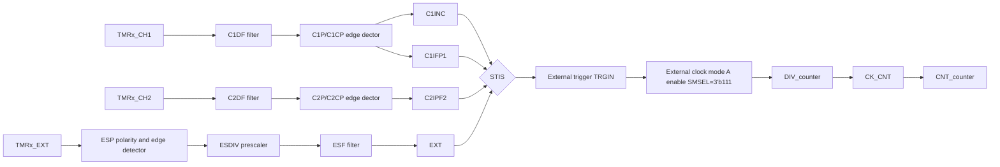

Note: The delay between the signal on the input side and the actual clock of the counter is due to the synchronization circuit.

Figure 14-63 Counting in external clock mode A, with PR=0x32 and DIV=0x0

Timing diagram of counting in external clock mode A

Figure 14-64 Block diagram of external clock mode B

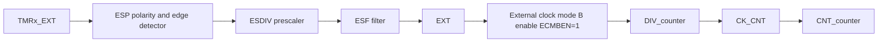

Note: The delay between the signal on the input side and the actual clock of the counter is due to the synchronization circuit.

2025.05.28
Page 309
Rev 2.07


ARTERY logo
AT32F435/437 Series Reference Manual

Figure 14-65 Counting in external clock mode B, with PR=0x32 and DIV=0x0

Timing diagram showing TMR_CLK, EXT, CNT_CLK, and COUNTER values 30, 31, 32, 0, 1, 2, 3, 4. ESDIV

## Internal trigger input (ISx)

Timer synchronization allows interconnection between several timers. The TMR_CLK of one timer can be provided by the TRGOUT signal output by another timer. Set the STIS[2: 0] bit to select internal trigger signal to enable counting.

Each timer consists of a 16-bit prescaler, which is used to generate the CK_CNT that enables the counter to count. The frequency division relationship between the CK_CNT and TMR_CLK can be adjusted by setting the value of the TMRx_DIV register. The prescaler value can be modified at any time, but it takes effect only when the next overflow event occurs.

The internal trigger input is configured as follows:

- Set the TMRx_PR register to set counting period.

- Set the TMRx_DIV register to set counting frequency.

- Set the TWCMSEL[1:0] bit in the TMRx_CTRL1 register to set count mode.

- Set the STIS[2:0] bit (range: 3’b000~3’b011) in the TMRx_STCTRL register and select internal trigger.

- Set SMSEL[2:0]=3’b111 in the TMRx_STCTRL register and select external clock mode A.

- Set the TMREN bit in the TMRx_CTRL1 register to enable TMRx counter.

## Table 14-12 TMRx internal trigger connection

| Slave timer | IS0 (STIS=000) | IS1 (STIS=001) | IS2 (STIS=010) | IS3 (STIS=011) |
| ----------- | -------------- | -------------- | -------------- | -------------- |
| TMR1        | TMR5           | TMR2           | TMR3           | TMR4           |
| TMR8        | TMR1           | TMR2           | TMR4           | TMR5           |
| TMR20       | TMR8           | TMR2           | TMR4           | TMR5           |


Figure 14-66 Counter timing with prescaler value changing from 0 to 3

Timing diagram showing TMR_CLK, CK_CNT, and COUNTER values 17, 18, 19, 1A, 1B, 1C, 00, 01. DIV

2025.05.28
Page 310
Rev 2.07


ARTERY logo **AT32F435/437 Series Reference Manual**

### 14.4.3.2 Counting mode

The advanced-control timer consists of an internal 16-bit counter supporting up, down, up/down counting modes to meet different application scenarios.

The TMRx_PR register is used to set the counting period. The value in the TMRx_PR is immediately moved to the shadow register by default. When the periodic buffer is enabled (PRBEN=1), the value in the TMRx_PR register is transferred to the shadow register only at an overflow event.

The TMRx_DIV register is used to configure the counting frequency. The counter counts once every count clock period (DIV[15:0]+1). The value in the TMRx_DIV register is updated to the shadow register at an overflow event.

Reading the TMRx_CNT register returns to the current counter value, and writing to the TMRx_CNT register updates the current counter value to the value being written.

An overflow event is generated by default. Set OVFEN=1 in the TMRx_CTRL1 to disable generation of update events. The OVFS bit in the TMRx_CTRL1 register is used to select overflow event source. By default, counter overflow/underflow, setting OVFSWTR bit and the reset signal generated by the slave timer controller in reset mode trigger the generation of an overflow event. When the OVFS bit is set, only counter overflow/underflow triggers an overflow event.

Setting TMREN=1 to enable the timer to start counting. Base on synchronization logic, however, the actual enable signal TMR_EN is set 1 clock cycle after the TMREN is set.

Figure 14-67 Counter basic structure

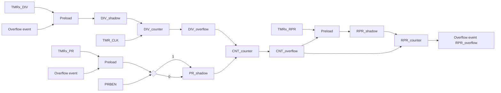

**Upcounting mode**

Set TWCMSEL[1:0]=2’b00 and OWCDIR=1’b0 in the TMRx_CTRL1 register to enable upcounting mode. In this mode, the counter counts from 0 to the value programmed in the TMRx_PR register, then restarts from 0, and generates a counter overflow event, with the OVFIF bit being set to 1. If the overflow event is disabled, the counter is no longer reloaded with the preload value and period value at a counter overflow event; otherwise, the counter is updated with the preload value and period value on an overflow event.

Figure 14-68 Overflow event when PRBEN=0

| Signal     | Value / Event Sequence | Value / Event Sequence | Value / Event Sequence | Value / Event Sequence | Value / Event Sequence | Value / Event Sequence | Value / Event Sequence | Value / Event Sequence | Value / Event Sequence | Value / Event Sequence | Value / Event Sequence | Value / Event Sequence | Value / Event Sequence | Value / Event Sequence | Value / Event Sequence | Value / Event Sequence | Value / Event Sequence | Value / Event Sequence | Value / Event Sequence | Value / Event Sequence | Value / Event Sequence | Value / Event Sequence | Value / Event Sequence |
| ---------- | ---------------------- | ---------------------- | ---------------------- | ---------------------- | ---------------------- | ---------------------- | ---------------------- | ---------------------- | ---------------------- | ---------------------- | ---------------------- | ---------------------- | ---------------------- | ---------------------- | ---------------------- | ---------------------- | ---------------------- | ---------------------- | ---------------------- | ---------------------- | ---------------------- | ---------------------- | ---------------------- |
| TMR\_CLK   | \[Square Wave]         |                        |                        |                        |                        |                        |                        |                        |                        |                        |                        |                        |                        |                        |                        |                        |                        |                        |                        |                        |                        |                        |                        |
| COUNTER    | 0                      | 1                      | 2                      | 3                      | ...                    | 31                     | 32                     | 0                      | 1                      | 2                      | 3                      | ...                    | 31                     | 32                     | 0                      | 1                      | 2                      | 3                      | ...                    | 31                     | 32                     | 0                      | 1                      |
| PR\[15:0]  | 22                     |                        |                        |                        |                        |                        |                        | 32                     |                        |                        |                        |                        |                        |                        |                        |                        |                        |                        |                        |                        |                        |                        |                        |
| DIV\[15:0] | 0                      |                        |                        |                        |                        |                        |                        |                        |                        |                        |                        |                        |                        |                        |                        |                        |                        |                        |                        |                        |                        |                        |                        |
| OVFIF      |                        |                        |                        |                        |                        |                        |                        | Set (at 0)             | Clear                  |                        |                        |                        |                        | Set (at 0)             | Clear                  |                        |                        |                        |                        | Set (at 0)             | Clear                  |                        |                        |


Figure 14-69 Overflow event when PRBEN=1

| Signal     | Value / Event Sequence | Value / Event Sequence | Value / Event Sequence | Value / Event Sequence | Value / Event Sequence | Value / Event Sequence | Value / Event Sequence | Value / Event Sequence | Value / Event Sequence | Value / Event Sequence | Value / Event Sequence | Value / Event Sequence | Value / Event Sequence | Value / Event Sequence | Value / Event Sequence | Value / Event Sequence | Value / Event Sequence | Value / Event Sequence | Value / Event Sequence | Value / Event Sequence | Value / Event Sequence | Value / Event Sequence | Value / Event Sequence |
| ---------- | ---------------------- | ---------------------- | ---------------------- | ---------------------- | ---------------------- | ---------------------- | ---------------------- | ---------------------- | ---------------------- | ---------------------- | ---------------------- | ---------------------- | ---------------------- | ---------------------- | ---------------------- | ---------------------- | ---------------------- | ---------------------- | ---------------------- | ---------------------- | ---------------------- | ---------------------- | ---------------------- |
| TMR\_CLK   | \[Square Wave]         |                        |                        |                        |                        |                        |                        |                        |                        |                        |                        |                        |                        |                        |                        |                        |                        |                        |                        |                        |                        |                        |                        |
| COUNTER    | 0                      | 1                      | 2                      | 3                      | ...                    | 21                     | 22                     | 0                      | 1                      | 2                      | 3                      | ...                    | 31                     | 32                     | 0                      | 1                      | 2                      | 3                      | ...                    | 31                     | 32                     | 0                      | 1                      |
| PR\[15:0]  | 22                     |                        |                        |                        |                        |                        |                        | 32                     |                        |                        |                        |                        |                        |                        |                        |                        |                        |                        |                        |                        |                        |                        |                        |
| DIV\[15:0] | 0                      |                        |                        |                        |                        |                        |                        |                        |                        |                        |                        |                        |                        |                        |                        |                        |                        |                        |                        |                        |                        |                        |                        |
| OVFIF      |                        |                        |                        |                        |                        |                        |                        | Set (at 0)             | Clear                  |                        |                        |                        |                        | Set (at 0)             | Clear                  |                        |                        |                        |                        | Set (at 0)             | Clear                  |                        |                        |


2025.05.28 | Page 311 | Rev 2.07


ARTERY logo # AT32F435/437 Series Reference Manual

## Downcounting mode

Set TWCMSEL[1:0]=2’b00 and OWCDIR=1’b1 in the TMRx_CTRL1 register to enable downcounting mode. In this mode, the counter counts from the value programmed in the TMRx_PR register down to 0, and restarts from the value programmed in the TMRx_PR register, and generates a counter underflow event.

Figure 14-70 Counter timing diagram with internal clock divided by 3

Counter timing diagram with internal clock divided by 3

## Up/down counting mode

Set TWCMSEL[1:0]≠2’b00 in the TMRx_CTRL1 register to enable up/down counting mode. In this mode, the counter counts up/down alternatively. When the counter counts from the value programmed in the TMRx_PR register down to 1, an underflow event is generated, and then restarts counting from 0; when the counter counts from 0 to the value of the TMRx_PR register -1, an overflow event is generated, and then restarts counting from the value of the TMRx_PR register. The OWCDIR bit indicates the current counting direction.

The TWCMSEL[1:0] bit in the TMRx_CTRL1 register is also used to select the CxIF flag setting method in up/down counting mode. In up/down counting mode 1 (TWCMSEL[1:0]=2’b01), CxIF flag can only be set when the counter counts down; in up/down counting mode 2 (TWCMSEL[1:0]=2’b10), CxIF flag can only be set when the counter counts up; in up/down counting mode 3 (TWCMSEL[1:0]=2’b11), CxIF flag can be set when the counter counts up/down.

Note: The OWCDIR is read-only in up/down counting mode.

Figure 14-71 Counter timing diagram with internal clock divided by 0 and TMRx_PR=0x32

| Signal        | Values          | Values | Values | Values | Values | Values | Values | Values  | Values  | Values  | Values  | Values | Values  | Values  | Values | Values | Values | Values | Values | Values | Values | Values  | Values  |
| ------------- | --------------- | ------ | ------ | ------ | ------ | ------ | ------ | ------- | ------- | ------- | ------- | ------ | ------- | ------- | ------ | ------ | ------ | ------ | ------ | ------ | ------ | ------- | ------- |
| TMR\_CLK      | \[Clock pulses] |        |        |        |        |        |        |         |         |         |         |        |         |         |        |        |        |        |        |        |        |         |         |
| COUNTER       | 0               | 1      | 2      | 3      | ...    | 31     | 32     | 31      | 30      | 2F      | 2E      | ...    | 2       | 1       | 0      | 1      | 2      | 3      | ...    | 31     | 32     | 31      | 30      |
| OWCDIR        | \[Up]           | \[Up]  | \[Up]  | \[Up]  | ...    | \[Up]  | \[Up]  | \[Down] | \[Down] | \[Down] | \[Down] | ...    | \[Down] | \[Down] | \[Up]  | \[Up]  | \[Up]  | \[Up]  | ...    | \[Up]  | \[Up]  | \[Down] | \[Down] |
| PR\[15:0]     | 32              | 32     | 32     | 32     | 32     | 32     | 32     | 32      | 32      | 32      | 32      | 32     | 32      | 32      | 32     | 32     | 32     | 32     | 32     | 32     | 32     | 32      | 32      |
| DIV\[15:0]    | 0               | 0      | 0      | 0      | 0      | 0      | 0      | 0       | 0       | 0       | 0       | 0      | 0       | 0       | 0      | 0      | 0      | 0      | 0      | 0      | 0      | 0       | 0       |
| TWCMSEL\[1:0] | 11              | 11     | 11     | 11     | 11     | 11     | 11     | 11      | 11      | 11      | 11      | 11     | 11      | 11      | 11     | 11     | 11     | 11     | 11     | 11     | 11     | 11      | 11      |
| OVFIF         |                 |        |        |        |        |        | Clear  |         |         |         |         |        |         |         | Clear  |        |        |        |        |        | Clear  |         |         |


## Repetition counter mode

The TMRx_RPR register is used to set the counting period of repetition counter. The repetition counter mode is enabled when the repetition counter value is not equal to 0. In this mode, the repetition counter is decremented at each counter overflow (RPR[15:0]+1). An overflow event is generated when the repetition counter reaches 0. The frequency of the overflow event can be adjusted by setting the repetition counter value.

2025.05.28 Page 312 Rev 2.07


ARTERY logo AT32F435/437 Series Reference Manual

Figure 14-72 OVFIF in upcounting mode and up/down counting mode

Timing diagrams showing OVFIF behavior in upcounting and two-way upcounting modes with different RPR values

## Encoder interface mode

To enable the encoder interface mode, write SMSEL[2: 0]= 3’b001/3’b010/3’b011. In this mode, the two inputs (C1IN/C2IN) are required. Depending on the level on one input, the counter counts up or down on the edge of the other input. The OWCDIR bit indicates the direction of the counter.

Figure 14-73 Encoder mode structure

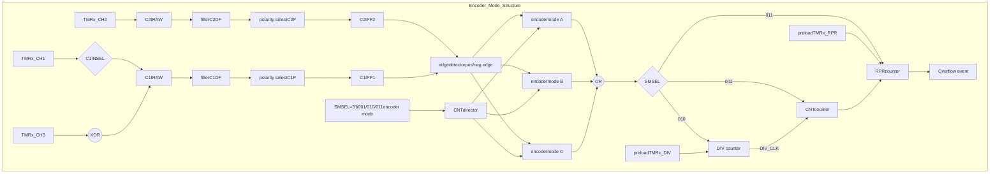

2025.05.28
Page 313
Rev 2.07


ARTERY logo
# AT32F435/437 Series Reference Manual

Encoder mode A: SMSEL=3’b001. The counter counts on the selected C1IFP1 edge (rising and falling edges), and the counting direction is dependent on the edge direction of C1IFP1 and the level of C2IFP2.

Encoder mode B: SMSEL=3’b010. The counter counts on the selected C2IFP2 edge (rising and falling edges), and the counting direction is dependent on the edge direction of C2IFP2 and the level of C1IFP1.

Encoder mode C: SMSEL=3’b011. The counter counts on both C1IFP1 and C2IFP2 edges (rising and falling edges). The counting direction is dependent on the C1IFP1 edge direction and C2IFP2 level, and C2IFP2 edge direction and C1IFP1 level.

To use encoder mode, follow the procedures below:

- Set channel 1 input signal filtering through the C1DF[3:0] bit in the TMRx_CM1 register;
Set channel 1 input signal active level through the C1P bit in the TMRx_CCTRL register.
- Set channel 2 input signal filtering through the C2DF[3:0] bit in the TMRx_CM1 register;
Set channel 2 input signal active level through the C2P bit in the TMRx_CCTRL register.
- Set channel 1 as input mode through the C1C[1:0] bit in the TMRx_CM1 register;
Set channel 2 as input mode through the C2C[1:0] bit in the TMRx_CM1 register.
- Select encoder mode A (SMSEL=3’b001), encoder mode B (SMSEL=3’b010), or the encoder mode C (SMSEL=3’b011) by setting the SMSEL[2:0] bit in the TMRx_STCTRL register.
- Set counting cycles through the PR[15:0] bit in the TMRx_PR register.
- Set counting frequency through the DIV[15:0] bit in the TMRx_DIV register.
- Configure the corresponding IOs of TMRx_CH1 and TMRx_CH2 as multiplexed mode.
- Enable counter through the TMREN bit in the TMRx_CTRL1 register.

## Table 14-13 Counting direction versus encoder signals

| Active edge       | Level on opposite signal(C1IFP1 to C2IFP2, C2IFP2toC1IFP1) | C1IFP1signal<br/>Rising | C1IFP1signal<br/>Falling | C2IFP2signal<br/>Rising | C2IFP2signal<br/>Falling |
| ----------------- | ---------------------------------------------------------- | ----------------------- | ------------------------ | ----------------------- | ------------------------ |
| C1IFP1            | High                                                       | Down                    | Up                       | No count                | No count                 |
|                   | Low                                                        | Up                      | Down                     | No count                | No count                 |
| C2IFP2            | High                                                       | No count                | No count                 | Up                      | Down                     |
|                   | Low                                                        | No count                | No count                 | Down                    | Up                       |
| C1IFP1 and C2IFP2 | High                                                       | Down                    | Up                       | Up                      | Down                     |
|                   | Low                                                        | Up                      | Down                     | Down                    | Up                       |


## Figure 14-74 Example of encoder interface mode C

| Signal         | Values / States | Values / States | Values / States | Values / States | Values / States | Values / States | Values / States | Values / States | Values / States | Values / States | Values / States | Values / States | Values / States | Values / States | Values / States | Values / States |
| -------------- | --------------- | --------------- | --------------- | --------------- | --------------- | --------------- | --------------- | --------------- | --------------- | --------------- | --------------- | --------------- | --------------- | --------------- | --------------- | --------------- |
| Direction      | UP              |                 |                 |                 |                 |                 |                 |                 | DOWN            |                 |                 |                 |                 |                 |                 |                 |
| CI1RAW         | Low             | High            | High            | Low             | Low             | High            | High            | Low             | Low             | High            | High            | Low             | Low             | High            | High            | Low             |
| CI2RAW         | Low             | Low             | High            | High            | Low             | Low             | High            | High            | High            | High            | Low             | Low             | High            | High            | Low             | Low             |
| COUNTER        | 20              | 21              | 22              | 23              | 24              | 25              | 26              | 27              | 26              | 25              | 24              | 23              | 22              | 21              | 20              | 1F              |
| TWCMSEL \[1:0] | 0x3             |                 |                 |                 |                 |                 |                 |                 |                 |                 |                 |                 |                 |                 |                 |                 |


Timing diagram of encoder interface mode C showing CI1RAW, CI2RAW, and COUNTER transitions for UP and DOWN directions

2025.05.28 Page 314 Rev 2.07


Artery logo
# AT32F435/437 Series Reference Manual

## 14.4.3.3 TMR input function

Each timer of TMR1, TMR8 and TMR20 has four independent channels. Each channel can be configured as input or output.

As input, each channel input signal is handled as follows:

- TMRx_CHx outputs the pre-processed CxIRAW. The C1INSEL bit is used to select the source of C1IRAW from TMRx_CH1 or the XOR-ed TMRx_CH1, TMRx_CH2 and TMRx_CH3. The sources of C2IRAW, C3IRAW and C4IRAW are TMRx_CH2, TMRx_CH3 and TMRx_CH4, respectively.

- CxIRAW inputs digital filter and outputs filtered CxIF signal. The digital filter uses the CxDF bit to program sampling frequency and sampling times.

- CxIF inputs edge detector, and outputs the CxIFPx signal after edge selection. The edge selection depends on both CxP and CxCP bits. It is possible to select input rising edge, falling edge or both edges.

- CxIFPx inputs capture signal selector, and outputs the CxIN signal after capture signal selection. The capture signal selection is defined by CxC bit. It is possible to select CxIFPx, CyIFPx or STCI as CxIN source. Of those, CyIFPx (x≠y) is the CyIFPy signal that is from Y channel and processed by channel -x edge detector (for example, C1IFP2 is the channel 1's C1IFP1 signal that passed through channel 2 edge detection). The STCI comes from slave timer controller, and its source is selected by STIS bit.

- CxIN outputs the CxIPS signal that is divided by input channel divider. The divider factor can be defined as No division, /2, /4 or /8, by the CxIDIV bit. It can be used for filtering, selection, division and input capture of input signals.

Figure 14-75 Input/output channel 1 main circuit

Diagram of Input/output channel 1 main circuit showing signal flow through XOR gates, filters, edge detectors, dividers, and capture/compare logic.

Figure 14-76 Channel 1 input stage

Diagram of Channel 1 input stage showing the selection of input sources (TMRx_CHx, STIS) and the processing path through filters and edge detectors.

2025.05.28
Page 315
Rev 2.07


ARTERY logo **AT32F435/437 Series Reference Manual**

# Input mode

In input mode, the TMRx_CxDT registers latch the current counter values after the selected trigger signal is detected, and the capture compare interrupt flag bit (CxIF) is set to 1. An interrupt/DMA request will be generated if the CxIEN or CxDEN bit are enabled. If the selected trigger signal is detected when the CxIF is set, a capture overflow event occurs. The TMRx_CxDT register overwrites the recorded value with the current counter value, and the CxRF is set to 1.

To capture the rising edge of C1IN input, following the configuration procedure mentioned below:

* Set C1C=01 in the TMRx_CxDT register to select the C1IN as channel 1 input.
* Set the filter bandwidth of C1IN signal (CxDF[3: 0]).
* Set the active edge on the C1IN channel by writing C1P=0 (rising edge) in the TMRx_CCTR register.
* Program the capture frequency division of C1IN signal (C1DIV[1: 0]).
* Enable channel 1 input capture (C1EN=1).
* If needed, enable the relevant interrupt or DMA request by setting the C1IEN bit in the TMRx_IDEN register or the C1DEN bit in the TMRx_IDEN register.

# Timer input XOR function

The timer input pins (TMRx_CH1, TMRx_CH2 and TMRx_CH3) are connected to the channel 1 (selected by setting the C1INSE in the TMRx_CTRL2 register) through an XOR gate.

The XOR gate can be used to connect Hall sensors. For example, connect the three XOR inputs to the three Hall sensors respectively so as to calculate the position and speed of the rotation by analyzing three Hall sensor signals.

# PWM input

The PWM input mode applies to channel 1 and channel 2. To enable this mode, map the C1IN and C2IN to the same TMRx_CHx, and configure the CxIFPx of channel 1/2 to trigger slave timer controller reset.

The PWM input mode can be used to measure the period and duty cycle of input signal. The period and duty cycle of channel 1 can be measured as follows:

* Set C1C=2‘b01 to set C1IN as C1IFP1;
* Set C1P=1’b0 to set C1IFP1 rising edge active;
* Set C2C=2‘b10 to set C2IN as C1IFP2;
* Set C2P=1’b1 to set C1IFP2 falling edge active;
* Set STIS=3’b101 to set C1IFP1 as the slave timer trigger signal;
* Set SMSEL=3‘b110 to set the slave timer in reset mode;
* Set C1EN=1’b1 and C2EN=1’b1 to enable channel 1 and input capture.

In these configurations, the rising edge of channel 1 input signal triggers capture and saves captured values to the C1DT register, and channel 1 input signal rising edge resets the counter. The falling edge of channel 1 input signal triggers capture and saves captured values to the C2DT register. The period and duty of channel 1 input signal can be calculated through C1DT and C2DT respectively.

Figure 14-77 Example of PWM input mode configuration

```mermaid
graph LR
    C1IN[C1IN] --> C1EN[C1EN]
    C1EN --> CT1[Capture trigger]
    CT1 --> CAP1[Capture]
    CAP1 --> C1DT[C1DT(CH1 period)]

    C1IRAW[C1IRAW] --> C1DF[C1DFfilter]
    C1DF --> C1IF[C1IF]
    C1IF --> ED1[edge detectorC1P=0C1CP=0]
    ED1 -- -STCI --> C1IFP1[C1IFP1(pos)]
    C1IFP1 --> C1IN
    C1IFP1 --> STIS[STIS(3'b101)]

    STIS --> TM[Trigger mode]
    TM --> CNT[CNT counter]
    
    C1INC[C1INC] --> TM
    IS3[IS3] --> TM
    IS2[IS2] --> TM
    IS1[IS1] --> TM
    IS0[IS0] --> TM
    EXT[EXT] --> TM

    SMSEL[SMSEL(3'b110)] --> HM[Hang mode]
    HM --> CNT
    RM[Reset mode] --> reset[reset]
    reset --> CNT
    EM[Encoder mode] --> CNT

    C2IFP1[C2IFP1] -- C1C(2'b01) --> ED1

    C2IN[C2IN] --> C2EN[C2EN]
    C2EN --> CT2[Capture trigger]
    CT2 --> CAP2[Capture]
    CAP2 --> C2DT[C2DT(CH1 high level time)]

    ED2[edge detectorC2P=1C2CP=0] -- -STCI --> C1IFP2[C1IFP2(neg)]
    C1IFP2 --> C2IN
    C1IFP2 --> C2IFP2_2[C2IFP2]
    C2IFP2_2 -- C2C(2'b10) --> ED2
```

2025.05.28 Page 316 Rev 2.07


ARTERY logo AT32F435/437 Series Reference Manual

Figure 14-78 PWM input mode

| Signal  | Value/State | Value/State | Value/State | Value/State | Value/State | Value/State | Value/State | Value/State | Value/State | Value/State | Value/State | Value/State | Value/State | Value/State | Value/State | Value/State | Value/State | Value/State | Value/State | Value/State | Value/State | Value/State | Value/State | Value/State | Value/State | Value/State | Value/State |
| ------- | ----------- | ----------- | ----------- | ----------- | ----------- | ----------- | ----------- | ----------- | ----------- | ----------- | ----------- | ----------- | ----------- | ----------- | ----------- | ----------- | ----------- | ----------- | ----------- | ----------- | ----------- | ----------- | ----------- | ----------- | ----------- | ----------- | ----------- |
| CH1     | High        | High        | High        | High        | High        | Low         | Low         | Low         | Low         | Low         | Low         | High        | High        | High        | High        | High        | High        | High        | High        | High        | High        | High        | High        | High        | High        |             |             |
| COUNTER | A           | 0           | 1           | 2           | 3           | 4           | 5           | 6           | 7           | 8           | 9           | A           | 0           | 1           | 2           | 3           | 4           | 5           | 6           | 7           | 8           | 9           | A           | 0           | 1           | 2           |             |
| C1C     |             |             |             |             |             |             |             |             |             |             |             |             | 0x1         |             |             |             |             |             |             |             |             |             |             |             |             |             |             |
| C1P     |             |             |             |             |             |             |             |             |             |             |             |             | 0x0         |             |             |             |             |             |             |             |             |             |             |             |             |             |             |
| C2C     |             |             |             |             |             |             |             |             |             |             |             |             | 0x2         |             |             |             |             |             |             |             |             |             |             |             |             |             |             |
| C2P     |             |             |             |             |             |             |             |             |             |             |             |             | 0x1         |             |             |             |             |             |             |             |             |             |             |             |             |             |             |
| STIS    |             |             |             |             |             |             |             |             |             |             |             |             | 0x5         |             |             |             |             |             |             |             |             |             |             |             |             |             |             |
| SMSEL   |             |             |             |             |             |             |             |             |             |             |             |             | 0x6         |             |             |             |             |             |             |             |             |             |             |             |             |             |             |
| C1DT    |             | 0xA         |             |             |             |             |             |             |             |             |             |             | 0xA         |             |             |             |             |             |             |             |             |             |             |             |             |             |             |
| C2DT    |             |             |             |             |             | 0x0         |             |             |             |             |             |             | 0x4         |             |             |             |             |             |             |             |             |             |             |             |             |             |             |


# 14.4.3.4 TMR output function

The TMR output consists of a comparator and an output controller. It is used to program the period, duty cycle and polarity of the output signal. The advanced-control timer output function varies from one channel to one channel.

Figure 14-79 Channel output stage (channel 1 to 3)

Channel output stage (channel 1 to 3) block diagram

Figure 14-80 Channel 4 output stage

Channel 4 output stage block diagram

## Output mode

Write CxC[1: 0]≠2’b00 to configure the channel as output to implement multiple output modes. In this case, the counter value is compared with the value in the TMRx_CxDT register, and the intermediate signal CxORAW is generated according to the output mode selected by CxOCTRL[2: 0], which is sent to IO after being processed by the output control circuit. The period of the output signal is configured by the TMRx_PR register, while the duty cycle by the TMRx_CxDT register.

Output compare modes include:

*   **PWM mode A**: Set CxOCTRL=3’b110 to enable PWM mode A. In upcounting, when TMRx_C1DT>TMRx_CVAL, C1ORAW outputs high; otherwise, outputs low. In downcounting, when TMRx_C1DT<TMRx_CVAL, C1ORAW outputs low; otherwise, outputs high. Figure 14-81

2025.05.28
Page 317
Rev 2.07


ARTERY logo
# AT32F435/437 Series Reference Manual

presents an example of upcounting and PWM mode A, PR=0x32, CxDT with different values. To set PWM mode A, the following process is recommended:

- Set the TMRx_PR register to set PWM period;
- Set the TMRx_CxDT register to set PWM duty cycle;
- Set CxOCTRL=3’b110 in the TMRx_CM1/CM2 register to set output mode as PWM mode A;
- Set the TMRx_DIV register and set the counting frequency;
- Set the TWCMSEL[1:0] bit in the TMRx_CTRL1 register to set the count mode;
- Set CxP bit and CxCP bit in the TMRx_CCTRL register to set output polarity;
- Set CxEN bit and CxCEN bit in the TMRx_CCTRL register to enable channel output;
- Set the OEN bit in the TMRx_BRK register to enable TMRx output;
- Set the corresponding GPIO of TMR output channel as the multiplexed mode;
- Set the TMREN bit in the TMRx_CTRL1 register to enable TMRx counter.

Figure 14-81 PWM mode A in upcounting mode

| Signal        | 0     | 1     | 2     | 3     | ...  | 31    | 32    | 0     | 1     | 2     | 3     | ...  | 31    | 32    | 0     | 1     |
| ------------- | ----- | ----- | ----- | ----- | ---- | ----- | ----- | ----- | ----- | ----- | ----- | ---- | ----- | ----- | ----- | ----- |
| TMR\_CLK      | Pulse | Pulse | Pulse | Pulse | ...  | Pulse | Pulse | Pulse | Pulse | Pulse | Pulse | ...  | Pulse | Pulse | Pulse | Pulse |
| COUNTER       | 0     | 1     | 2     | 3     | ...  | 31    | 32    | 0     | 1     | 2     | 3     | ...  | 31    | 32    | 0     | 1     |
| PR\[15:0]     | 32    |       |       |       |      |       |       |       |       |       |       |      |       |       |       |       |
| DIV\[15:0]    | 0     |       |       |       |      |       |       |       |       |       |       |      |       |       |       |       |
| C1OCTRL\[2:0] | 110   |       |       |       |      |       |       |       |       |       |       |      |       |       |       |       |
| C1DT\[15:0]   | 3     |       |       |       |      |       |       |       |       |       |       |      |       |       |       |       |
| C1ORAW        | High  | High  | High  | Low   | Low  | Low   | Low   | High  | High  | High  | Low   | Low  | Low   | Low   | High  | High  |
| C1DT\[15:0]   | 0     |       |       |       |      |       |       |       |       |       |       |      |       |       |       |       |
| C1ORAW        | 0     |       |       |       |      |       |       |       |       |       |       |      |       |       |       |       |
| C1DT\[15:0]   | 32    |       |       |       |      |       |       |       |       |       |       |      |       |       |       |       |
| C1ORAW        | High  | High  | High  | High  | High | High  | Low   | High  | High  | High  | High  | High | High  | Low   | High  | High  |
| C1DT\[15:0]   | >32   |       |       |       |      |       |       |       |       |       |       |      |       |       |       |       |
| C1ORAW        | 1     |       |       |       |      |       |       |       |       |       |       |      |       |       |       |       |


* **PWM mode B**: Set CxOCTRL=3’b111 to enable PWM mode B. In upcounting, when TMRx_C1DT>TMRx_CVAL, C1ORAW outputs low; otherwise, outputs high. In downcounting, when TMRx_C1DT<TMRx_CVAL, C1ORAW outputs high; otherwise, outputs low. Figure 14-82 presents an example of center-alinged counting mode and PWM mode B, PR=0x32, CxDT with different values

2025.05.28
Page 318
Rev 2.07


ARTERY logo AT32F435/437 Series Reference Manual

Figure 14-82 Up/down counting mode and PWM mode B

Timing diagram showing Up/down counting mode and PWM mode B with various C1DT values

*   **Forced output mode**: Set CxOCTRL=3’b100/101 to enable forced output mode. In this case, the CxORAW is forced to be the programmed level, irrespective of the counter value. Despite this, the channel flag bit and DMA request still depend on the compare result.

*   **Output compare mode**: Set CxOCTRL=3’b001/010/011 to enable output compare mode. In this case, when the counter value matches the value of the CxDT register, the CxORAW is forced high (CxOCTRL=3’b001), low (CxOCTRL=3’b010) or toggling (CxOCTRL=3’b011). Figure 14-83 presents an example of output compare mode (toggle), C1DT=0x3. When counter value=0x3, C1OUT toggles.

Figure 14-83 C1ORAW toggles when counter value matches C1DT value

Timing diagram showing C1ORAW toggling when counter value matches C1DT value

*   **One-pulse mode**: This is a particular case of PWM mode. Set OCMEN=1 to enable one-pulse mode. In this mode, the comparison match is performed in the current counting period. The TMREN bit is cleared as soon as the current counting is completed. Therefore, only one pulse is output. When configured as in upcounting mode, the configuration must follow the rule: CVAL<CxDT≤PR; in downcounting mode, CVAL>CxDT is required. Figure 14-84 presents an example of PWM mode B in upcounting mode and one-pulse mode. The counter only counts for a single cycle, and only a pulse is output.

Figure 14-84 One-pulse mode

Timing diagram showing One-pulse mode with TRGIN, C1ORAW, and C1OUT signals

2025.05.28 Page 319 Rev 2.07


ARTERY logo # AT32F435/437 Series Reference Manual

*   **Fast output mode**: Set CxOIEN=1 to enable this mode. If enabled, the CxORAW signal will not change when the counter value matches the CxDT, but at the beginning of the current counting period. In other words, the comparison result is advanced, so the comparison result between the counter value and the TMRx_CxDT register will determine the level of CxORAW in advance.

## Master timer event output

When TMR is selected as the master timer, the following signal sources can be selected as TRGOUT signal to output to the slave timer, by setting the PTOS bit in the TMRxCTRL2 register.

− PTOS=3’b000, TRGOUT outputs software overflow event (OVFSWTR bit in the TMRx_SWEVT register).

− PTOS=3’b001, TRGOUT outputs counter enable signal.

− PTOS=3’b010, TRGOUT outputs counter overflow event.

− PTOS=3’b011, TRGOUT outputs capture and compare event (C1DT)

− PTOS=3’b100, TRGOUT outputs C1ORAW signal.

− PTOS=3’b101, TRGOUT outputs C2ORAW signal.

− PTOS=3’b110, TRGOUT outputs C3ORAW signal.

− PTOS=3’b111, TRGOUT outputs C4ORAW signal.

## CxORAW clear

When the CxOSEN bit is set to 1, the CxORAW signal for a given channel is cleared by applying a high level to the EXT input. The CxORAW signal remains unchanged until the next overflow event.

This function can only be used in output capture or PWM modes, and does not work in forced mode. Figure 14-85 shows the example of clearing CxORAW. When the EXT input is high, the CxORAW signal, which was originally high, is driven low; when the EXT is low, the CxORAW signal outputs the corresponding level according to the comparison result between the counter value and CxDT value.

Figure 14-85 Clearing CxORAW(PWM mode B) by EXT input

| Signal  | 0 | 1 | 2 | 3 | 4 | 5 | 6 | 7 | 8 | 9 | A | B | C | D | 0 | 1 | 2 | 3 |
| ------- | - | - | - | - | - | - | - | - | - | - | - | - | - | - | - | - | - | - |
| COUNTER | 0 | 1 | 2 | 3 | 4 | 5 | 6 | 7 | 8 | 9 | A | B | C | D | 0 | 1 | 2 | 3 |
| CxDT    |   |   |   |   |   |   |   | 7 | 7 | 7 | 7 | 7 | 7 | 7 |   |   |   |   |
| CxOSEN  | 0 | 1 | 1 | 1 | 1 | 1 | 1 | 1 | 1 | 1 | 1 | 1 | 1 | 1 | 1 | 1 | 1 | 1 |
| EXT     | 0 | 0 | 0 | 0 | 0 | 0 | 0 | 0 | 0 | 1 | 1 | 1 | 0 | 0 | 0 | 0 | 0 | 0 |
| CxORAW  | 0 | 0 | 0 | 0 | 0 | 0 | 0 | 1 | 1 | 0 | 0 | 0 | 0 | 0 | 0 | 0 | 0 | 0 |


## Dead-time insertion

The channel 1 to 3 of the advanced-control timers contains a set of reverse channel output. This function is enabled by the CxCEN bit and its polarity is defined by CxCP. Refer to Table 14-15 for more information about the output state of CxOUT and CxCOUT.

The dead-time is activated when switching to IDLEF state (OEN falling down to 0).

Setting both CxEN and CxCEN bits, and using DTC[7:0] bit to insert dead-time of different durations. After the dead-time insertion, the rising edge of the CxOUT is delayed compared to the rising edge of the reference signal; the rising edge of the CxCOU is delayed compared to the falling edge of the reference signal.

If the delay is greater than the width of the active output, and if C1OUT and C1COUT do not generate corresponding pulses, the dead-time should be less than the width of the active output.

Figure 14-86 gives an example of dead-time insertion when CxP=0, CxCP=0, OEN=1, CxEN=1 and CxCEN=1.

2025.05.28 Page 320 Rev 2.07


ARTERY logo
AT32F435/437 Series Reference Manual

Figure 14-86 Complementary output with dead-time insertion

Timing diagram showing complementary output with dead-time insertion for C1ORAW, C1OUT, and C1COUT signals

# 14.4.3.5 TMR brake function

When the brakaaeunction is enabled (BRKEN=1), the CxOUT and CxCOUT are jointly controlled by OEN, FCSODIS, FCSOEN, CxIOS and CxCIOS. But, CxOUT and CxCOUT cannot be set both to active level at the same time. Please refer to 14-15 for more details.

The brake source can be the brake input pin or a clock failure event. The polarity is controlled by the BRKV bit.

When a brake event occurs, there are the following actions:

* The OEN bit is cleared asynchronously, and the channel output state is selected by setting the FCSODIS bit. This function works even if the MCU oscillator is off.

* Once OEN=0, the channel output level is defined by the CxIOS bit. If FCSODIS=0, the timer output is disabled; otherwise, the output enable remains high.

* When complementary outputs are used:

  - The outputs are first put in reset state, that is, inactive state (depending on the polarity). This is done asynchronously so that it works even if no clock is provided to the timer.

  - If the timer clock is still active, then the dead-time generator is activated. The CxIOS and CxCIOS bits are used to program the level after dead-time. Even in this case, the CxIOS and CxCIOS cannot be driven to their active level at the same time. It should be note that because of synchronization on OEN, the dead-time duration is usually longer than usual (around 2 tmr_clk clock cycles)

  - If FCSODIS=0, the timer releases the enable output; otherwise, it keeps the enable output; the enable output becomes high as soon as one of the CxEN and CxCEN bits becomes high.

* If the brake interrupt or DMA request is enabled, the brake statue flag is set, and a brake interrupt or DMA request can be generated.

* If AOEN=1, the OEN bit is automatically set again at the next overflow event.

Note: When the brake input is active, the OEN cannot be set, nor the status flag, BRKIF can be cleared.

2025.05.28
Page 321
Rev 2.07


ARTERY logo AT32F435/437 Series Reference Manual

# Figure 14-87 TMR output control

```mermaid
graph TD
    subgraph Break_Logic_Top
        CFE1[Clock failure eventFrom clock control CSS] --> OR1[OR]
        TMRx_BRK1[TMRx_BRK] --> BRK1[BRK]
        BRK1 --> BKF1[BKF filter]
        BKF1 --> BRKV1[BRKV polarity selection]
        BRKV1 --> OR1
        OR1 --> BT1[break trigger]
        BT1 --> BRKEN1[break enableBRKEN]
        BRKEN1 --> BE1[break event]
        BE1 --> OEN1[OEN]
        OEN1 --> AE1[auto enable]
        AE1 --> AND1[AND]
        OE1[overflow event] --> AND1
        AOEN1[AOEN] --> AND1
    end

    subgraph Output_Control_CHx
        CxORAW[CxORAW] --> DTC[DTC dead time]
        DTC --> XOR1[XOR]
        DTC --> XOR2[XOR]
        
        CxP1[CxP polarity select] --> RS1[run state 1]
        CxP1 --> FS1[frozen state 0]
        RS1 --> CxEN[CxEN]
        FS1 --> CxEN
        
        CxIOS[CxIOS] --> IS1[inactive state]
        CxP2[CxP] --> AS1[active state]
        FCSOEN1[FCSOEN] --> AS1
        
        XOR1 --> AND2[AND]
        IS1 --> SS1[state select]
        AS1 --> SS1
        SS1 --> HODS1[holistic-out disable state 0]
        CxEN --> HOES1[holistic-out enable state 1]
        
        HOES1 --> CxOUT[CxOUT to GPIO]
        HODS1 --> CxOUT
        CxOUT --> GPIO1[GPIO output enable]
    end

    subgraph Output_Control_CHxC
        CxCP1[CxCP polarity select] --> RS2[run state 1]
        CxCP1 --> FS2[frozen state 0]
        RS2 --> CxCEN[CxCEN]
        FS2 --> CxCEN
        
        CxCIOS[CxCIOS] --> IS2[inactive state]
        CxCP2[CxCP] --> AS2[active state]
        FCSOEN2[FCSOEN] --> AS2
        
        XOR2 --> AND3[AND]
        IS2 --> SS2[state select]
        AS2 --> SS2
        SS2 --> HODS2[holistic-out disable state 0]
        CxCEN --> HOES2[holistic-out enable state 1]
        
        HOES2 --> CxCOUT[CxCOUT to GPIO]
        HODS2 --> CxCOUT
        CxCOUT --> GPIO2[GPIO output enable]
    end

    subgraph Final_Logic
        AND1 --> OR2[OR]
        FCSOEN3[FCSOEN] --> OR2
        OR2 --> AND4[AND]
        AND4 --> CxEN
        
        AND1 --> OR3[OR]
        FCSOEN4[FCSOEN] --> OR3
        OR3 --> AND5[AND]
        AND5 --> CxCEN
        
        FCSODIS[FCSODIS] --> AND4
        FCSODIS --> AND5
    end
```

# Figure 14-88 Example of TMR break function

| Signal | State Over Time                                                                                                            |
| ------ | -------------------------------------------------------------------------------------------------------------------------- |
| BRK    | Low \_\_\_\_\_\_\_\_\_\_\_\_\_\_\_\_\_\_\_\_\| High \_\_\_\_\_\_\_\_\_\_\_\_\_\_\_\_\_\_\_\_\| Low \_\_\_\_\_\_\_\_        |
| AOEN   | High \_\_\_\_\_\_\_\_\_\_\_\_\_\_\_\_\_\_\_\_\_\_\_\_\_\_\_\_\_\_\_\_\_\_\_\_\_\_\_\_\_\_\| Low \_\_\_\_\_\_\_\_           |
| CxORAW | High \_\_\_\| Low \_\_\_\| High \_\_\_\| Low \_\_\_\| High \_\_\_\| Low \_\_\_\| High \_\_\_                               |
| CxEN   | High \_\_\_\_\_\_\_\_\_\_\_\_\_\_\_\_\_\_\_\_\| Low \_\_\_\_\_\_\_\_\_\_\_\_\_\_\_\_\_\_\_\_\| High \_\_\_\_\_\_\_         |
| CxCEN  | High \_\_\_\_\_\_\_\_\_\_\_\_\_\_\_\_\_\_\_\_\| Low \_\_\_\_\_\_\_\_\_\_\_\_\_\_\_\_\_\_\_\_\| High \_\_\_\_\_\_\_         |
| CxIOS  | Low \_\_\_\_\_\_\_\_\_\_\_\_\_\_\_\_\_\_\_\_\_\_\_\_\_\_\_\_\_\_\_\_\_ 0 \_\_\_\_\_\_\_\_\_\_\_\_\_\_\_\_\_\_\_\_\_\_\_    |
| CxCIOS | Low \_\_\_\_\_\_\_\_\_\_\_\_\_\_\_\_\_\_\_\_\_\_\_\_\_\_\_\_\_\_\_\_\_\_\_\_\_\_\_\_\_\_\_\_\_\_\_\_\_\_\_\_\_\_\_\_\_\_\_ |
| CxOUT  | High \_\_\_\| Low \_\_\_\| High \_\| Low \_\_\_\_\_\_\_\_\_\_\_\_\_\_\_\_\_\_\_\_\| High \_\_\_\| Low                      |
| CxCOUT | Low \_\_\_\_\| High \_\_\| Low \_\_\| High (Delay) \| Low (Delay) \| High (Delay)                                          |


## 14.4.3.6 TMR synchronization

The timers are linked together internally for timer synchronization. Master timer is selected by setting the PTOS[2: 0] bit; Slave timer is selected by setting the SMSEL[2: 0] bit.

Slave modes include:

### Slave mode: Reset mode

The counter and its prescaler can be reset by a selected trigger signal. An overflow event can be generated when OVFS=0.

2025.05.28 Page 322 Rev 2.07


ARTERY logo
AT32F435/437 Series Reference Manual

Figure 14-89 Example of reset mode

Timing diagram showing reset mode with TMR_CLK, COUNTER, PR

Slave mode: Suspend mode

In this mode, the counter is controlled by a selected trigger input. The counter starts counting when the trigger input is high and stops as soon as the trigger input is low.

Figure 14-90 Example of suspend mode

Timing diagram showing suspend mode with TMR_CLK, CI1F1, TMR_EN, CNT_CLK, COUNTER, PR

Slave mode: Trigger mode

The counter can start counting on the rising edge of a selected trigger input (TMR_EN=1).

Figure 14-91 Example of trigger mode

Timing diagram showing trigger mode with TMR_CLK, CI1F1, TMR_EN, COUNTER, PR

### 14.4.3.7 TMR DMA

TMR has the following events for DMA transfer request: overflow event DMA request, trigger event DMA rquest, Hall sensor DMA request and chanel event DMA request. It is possible to enable DMA request by setting the TMRx_IDEN register. Once enabled, upon an event generated, a DMA request is triggered and ouput to the DMA peripheral.

2025.05.28
Page 323
Rev 2.07


ARTERY logo # AT32F435/437 Series Reference Manual

## TMR DMA Burst feature

TMR also supports TMR DMA Burst feature. Thanks to this feature, DMA can be triggered to rewrite multiple TMR consecutive registers by enabling a certain DMA request through the TMRx_IDEN register.

As an overflow event to trigger TMR DMA Burst as an example:

* Enable overflow event to trigger DMA request using the OVFDEN bit in the TMRx_IDEN reigster
* Configure Burst transfer times using the DTB bit in the TMRx_DMACTRL register
* Configure the start address of Burst transfer using the ADDR bit in the TMRx_DMACTRL reigster
* Enable counter

After the above-mentioned configurations, here is the whole process of TMR DMA Burst transfer:

Upon an overflow event, the TMR will send a DMA request to the DMA peripheral. Then the DMA writes the data into the TMRx_DMADT register as requested. Inside TMR, the DMADT bit data is written into the start address register of Burst thransfer and an ACK single is sent to TMR. After receiving this ACK, the TMR clears the current DMA request; when the Burst transfer is detected by the TMR not to complete fully, a new overflow event for DMA request is released to the DMA so tthat the DMA writes the requested dta into the TMRx_DMADT again. In this case, inside tmr, the DMADT register data is written into the Burst transfer start address + 0x4 address register, and a new ACK is sent to TMR, and so on, and so on, until the last operation of Burst transfer. When a full Burst transfer is complete, the REQ for overflow event DMA request would not be set any more until the next overflow event.

Note: when using TMR DMA Burst feature, an empty register is prohibited and the TMRx_DMACTRL as well as TMRx_DMADT registers should not be available during the period from the start address to the end address.

### 14.4.3.8 Debug mode

When the microcontroller enters debug mode (Cortex®-M4F core halted), the TMRx counter stops counting by setting the TMRx_PAUSE in the DEBUG module. Refer to Chapter 30.2 for more information.

### 14.4.4 TMR1, TMR8 and TMR20 registers

These peripheral registers must be accessed by words (32 bits).

Table 14-14 TMR1, TMR8 and TMR20 register map and reset value

| Register     | Offset | Reset value |
| ------------ | ------ | ----------- |
| TMRx\_CTRL1  | 0x00   | 0x0000 0000 |
| TMRx\_CTRL2  | 0x04   | 0x0000 0000 |
| TMRx\_STCTRL | 0x08   | 0x0000 0000 |
| TMRx\_IDEN   | 0x0C   | 0x0000 0000 |
| TMRx\_ISTS   | 0x10   | 0x0000 0000 |
| TMRx\_SWEVT  | 0x14   | 0x0000 0000 |
| TMRx\_CM1    | 0x18   | 0x0000 0000 |
| TMRx\_CM2    | 0x1C   | 0x0000 0000 |
| TMRx\_CCTRL  | 0x20   | 0x0000 0000 |
| TMRx\_CVAL   | 0x24   | 0x0000 0000 |
| TMRx\_DIV    | 0x28   | 0x0000 0000 |
| TMRx\_PR     | 0x2C   | 0x0000 FFFF |
| TMRx\_RPR    | 0x30   | 0x0000 0000 |
| TMRx\_C1DT   | 0x34   | 0x0000 0000 |
| TMRx\_C2DT   | 0x38   | 0x0000 0000 |
| TMRx\_C3DT   | 0x3C   | 0x0000 0000 |
| TMRx\_C4DT   | 0x40   | 0x0000 0000 |
| TMRx\_BRK    | 0x44   | 0x0000 0000 |


2025.05.28
Page 324
Rev 2.07


ARTERY logo # AT32F435/437 Series Reference Manual

| TMRx\_DMACTRL | 0x48 | 0x0000 0000 |
| ------------- | ---- | ----------- |
| TMRx\_DMADT   | 0x4C | 0x0000 0000 |
| TMRx\_CM3     | 0x70 | 0x0000 0000 |
| TMRx\_C5DT    | 0x74 | 0x0000 0000 |


## 14.4.4.1 TMR1, TMR8 and TMR20 control register 1 (TMRx_CTRL1)

| Bit        | Name     | Reset value | Type | Description                                                                                                                                                                                                                                                                                                                                                                                                                                                                  |
| ---------- | -------- | ----------- | ---- | ---------------------------------------------------------------------------------------------------------------------------------------------------------------------------------------------------------------------------------------------------------------------------------------------------------------------------------------------------------------------------------------------------------------------------------------------------------------------------- |
| Bit 31: 10 | Reserved | 0x00 0000   | resd | Kept at its default value.                                                                                                                                                                                                                                                                                                                                                                                                                                                   |
| Bit 9: 8   | CLKDIV   | 0x0         | rw   | Clock division<br/>This field is used to define the division ratio between digital filter sampling frequency (fDTS) and timer clock frequency (fCK\_INT). it is also used to set the ratio relationship between dead time base (TDTS) and timer clock period (TCK\_INT)<br/>00: No division, fDTS=fCK\_INT<br/>01: Divided by 2, fDTS=fCK\_INT/2<br/>10: Divided by 4, fDTS=fCK\_INT/4<br/>11: Reserved                                                                      |
| Bit 7      | PRBEN    | 0x0         | rw   | Period buffer enable<br/>0: Period buffer is disabled<br/>1: Period buffer is enabled                                                                                                                                                                                                                                                                                                                                                                                        |
| Bit 6: 5   | TWCMSEL  | 0x0         | rw   | Two-way counting mode selection<br/>00: One-way counting mode, depending on the OWCDIR bit<br/>01: Two-way counting mode1, count up and down alternately, the output flag bit is set only when the counter counts down<br/>10: Two-way counting mode2, count up and down alternately, the output flag bit is set only when the counter counts up<br/>11: Two-way counting mode3, count up and down alternately, the output flag bit is set when the counter counts up / down |
| Bit 4      | OWCDIR   | 0x0         | rw   | One-way count direction<br/>0: Up<br/>1: Down                                                                                                                                                                                                                                                                                                                                                                                                                                |
| Bit 3      | OCMEN    | 0x0         | rw   | One cycle mode enable<br/>This bit is use to select whether to stop counting at an update event<br/>0: The counter does not stop at an update event<br/>1: The counter stops at an update event                                                                                                                                                                                                                                                                              |
| Bit 2      | OVFS     | 0x0         | rw   | Overflow event source<br/>This bit is used to select overflow event or DMA request sources.<br/>0: Counter overflow, setting the OVFSWTR bit or overflow event generated by slave timer controller<br/>1: Only counter overflow generates an overflow event                                                                                                                                                                                                                  |
| Bit 1      | OVFEN    | 0x0         | rw   | Overflow event enable<br/>0: Enabled<br/>1: Disabled                                                                                                                                                                                                                                                                                                                                                                                                                         |
| Bit 0      | TMREN    | 0x0         | rw   | TMR enable<br/>0: Disabled<br/>1: Enabled                                                                                                                                                                                                                                                                                                                                                                                                                                    |


## 14.4.4.2 TMR1, TMR8 and TMR20 control register 2 (TMRx_CTRL2)

| Bit    | Name      | Reset value | Type | Description                                                                                                |
| ------ | --------- | ----------- | ---- | ---------------------------------------------------------------------------------------------------------- |
| Bit 31 | TRGOUT2EN | 0x0         | rw   | TRGOUT2 enable<br/>0: TRGOUT2 remains low<br/>1: TRGOUT2 outputs C4ORAW rising edge or C5ORAW falling edge |


2025.05.28 | Page 325 | Rev 2.07


ARTERY logo AT32F435/437 Series Reference Manual

| Bit 30: 15 | Reserved | 0x0000 | resd | Kept at its default value.                                                                                                                                                                                                                                                                          |
| ---------- | -------- | ------ | ---- | --------------------------------------------------------------------------------------------------------------------------------------------------------------------------------------------------------------------------------------------------------------------------------------------------- |
| Bit 14     | C4IOS    | 0x0    | rw   | Channel 4 idle output state                                                                                                                                                                                                                                                                         |
| Bit 13     | C3CIOS   | 0x0    | rw   | Channel 3 complementary idle output state                                                                                                                                                                                                                                                           |
| Bit 12     | C3IOS    | 0x0    | rw   | Channel 3 idle output state                                                                                                                                                                                                                                                                         |
| Bit 11     | C2CIOS   | 0x0    | rw   | Channel 2 complementary idle output state                                                                                                                                                                                                                                                           |
| Bit 10     | C2IOS    | 0x0    | rw   | Channel 2 idle output state                                                                                                                                                                                                                                                                         |
| Bit 9      | C1CIOS   | 0x0    | rw   | Channel 1 complementary idle output state<br/>OEN = 0 after dead-time:<br/>0: C1OUTL=0<br/>1: C1OUTL=1                                                                                                                                                                                              |
| Bit 8      | C1IOS    | 0x0    | rw   | Channel 1 idle output state<br/>OEN = 0 after dead-time:<br/>0: C1OUT=0<br/>1: C1OUT=1                                                                                                                                                                                                              |
| Bit 7      | C1INSEL  | 0x0    | rw   | C1IN selection<br/>0: CH1 pin is connected to C1IRAW input<br/>1: The XOR result of CH1, CH2 and CH3 pins is connected to C1IRAW input                                                                                                                                                              |
| Bit 6: 4   | PTOS     | 0x0    | rw   | Master TMR output selection<br/>This field is used to select the TMRx signal sent to the slave timer.<br/>000: Reset<br/>001: Enable<br/>010: Update<br/>011: Compare pulse (C1DT)<br/>100: C1ORAW signal<br/>101: C2ORAW signal<br/>110: C3ORAW signal<br/>111: C4ORAW signal                      |
| Bit 3      | DRS      | 0x0    | rw   | DMA request source<br/>0: Capture/compare event<br/>1: Overflow event                                                                                                                                                                                                                               |
| Bit 2      | CCFS     | 0x0    | rw   | Channel control bit flash selection<br/>This bit only acts on channels that have complementary output. If the channel control bits are buffered:<br/>0: Control bits are updated by setting the HALLSWTR bit<br/>1: Control bits are updated by setting the HALLSWTR bit or a rising edge on TRGIN. |
| Bit 1      | Reserved | 0x0    | resd | Kept at its default value.                                                                                                                                                                                                                                                                          |
| Bit 0      | CBCTRL   | 0x0    | rw   | Channel buffer control<br/>This bit acts on channels that have complementary output.<br/>0: CxEN, CxCEN and CxOCTRL bits are not buffered.<br/>1: CxEN, CxCEN and CxOCTRL bits are buffered.<br/>Note: when CBCTRL=”1”, CxEN, CxCEN and *CxOCTRL are updated only upon a HALL event.*               |


# 14.4.4.3 TMR1, TMR8 and TMR20 slave timer control register (TMRx_STCTRL)

| Bit        | Name     | Reset value | Type | Description                                                                                                      |
| ---------- | -------- | ----------- | ---- | ---------------------------------------------------------------------------------------------------------------- |
| Bit 31: 16 | Reserved | 0x0000      | resd | Kept at its default value.                                                                                       |
| Bit 15     | ESP      | 0x0         | rw   | External signal polarity<br/>0: High or rising edge<br/>1: Low or falling edge                                   |
| Bit 14     | ECMBEN   | 0x0         | rw   | External clock mode B enable<br/>This bit is used to enable external clock mode B<br/>0: Disabled<br/>1: Enabled |
| Bit 13: 12 | ESDIV    | 0x0         | rw   | External signal divide<br/>This field is used to select the frequency division of an external trigger            |


2025.05.28 Page 326 Rev 2.07


Artery logo AT32F435/437 Series Reference Manual

| Bit 11: 8 | ESF      | 0x0 | rw   | 00: Normal<br/>01: Divided by 2<br/>10: Divided by 4<br/>11: Divided by 8<br/>External signal filter<br/>This field is used to filter an external signal. The external signal can be sampled only after it has been generated N times<br/>0000: No filter, sampling by fDTS<br/>0001: fSAMPLING =fCK\_INT, N=2<br/>0010: fSAMPLING =fCK\_INT, N=4<br/>0011: fSAMPLING =fCK\_INT, N=8<br/>0100: fSAMPLING =fDTS/2, N=6<br/>0101: fSAMPLING =fDTS/2, N=8<br/>0110: fSAMPLING =fDTS/4, N=6<br/>0111: fSAMPLING =fDTS/4, N=8<br/>1000: fSAMPLING =fDTS/8, N=6<br/>1001: fSAMPLING =fDTS/8, N=8<br/>1010: fSAMPLING =fDTS/16, N=5<br/>1011: fSAMPLING =fDTS/16, N=6<br/>1100: fSAMPLING =fDTS/16, N=8<br/>1101: fSAMPLING =fDTS/32, N=5<br/>1110: fSAMPLING =fDTS/32, N=6<br/>1111: fSAMPLING =fDTS/32, N=8 |
| --------- | -------- | --- | ---- | ------------------------------------------------------------------------------------------------------------------------------------------------------------------------------------------------------------------------------------------------------------------------------------------------------------------------------------------------------------------------------------------------------------------------------------------------------------------------------------------------------------------------------------------------------------------------------------------------------------------------------------------------------------------------------------------------------------------------------------------------------------------------------------------------------ |
| Bit 7     | STS      | 0x0 | rw   | Subordinate TMR synchronization<br/>If enabled, master and slave timer can be synchronized.<br/>0: Disabled<br/>1: Enabled                                                                                                                                                                                                                                                                                                                                                                                                                                                                                                                                                                                                                                                                             |
| Bit 6: 4  | STIS     | 0x0 | rw   | Subordinate TMR input selection<br/>This field is used to select the subordinate TMR input.<br/>000: Internal selection 0 (IS0)<br/>001: Internal selection 1 (IS1)<br/>010: Internal selection 2 (IS2)<br/>011: Internal selection 3 (IS3)<br/>100: C1IRAW input detector (C1INC)<br/>101: Filtered input 1 (C1IF1)<br/>110: Filtered input 2 (C1IF2)<br/>111: External input (EXT)<br/>Please refer to Table 14-12 for more information on ISx for each timer.                                                                                                                                                                                                                                                                                                                                       |
| Bit 3     | Reserved | 0x0 | resd | Kept at its default value.                                                                                                                                                                                                                                                                                                                                                                                                                                                                                                                                                                                                                                                                                                                                                                             |
| Bit 2: 0  | SMSEL    | 0x0 | rw   | Subordinate TMR mode selection<br/>000: Slave mode is disabled<br/>001: Encoder mode A<br/>010: Encoder mode B<br/>011: Encoder mode C<br/>100: Reset mode — Rising edge of the TRGIN input reinitializes the counter<br/>101: Suspend mode — The counter starts counting when the TRGIN is high<br/>110: Trigger mode — A trigger event is generated at the rising edge of the TRGIN input<br/>111: External clock mode A — Rising edge of the TRGIN input clocks the counter<br/>Note: Please refer to count mode section for the details on encoder mode A/B/C.                                                                                                                                                                                                                                     |


### 14.4.4.4 TMR1, TMR8 and TMR20 DMA/interrupt enable register (TMRx_IDEN)

| Bit       | Name     | Reset value | Type | Description                                |
| --------- | -------- | ----------- | ---- | ------------------------------------------ |
| Bit 31:15 | Reserved | 0x0 0000    | resd | Kept at its default value.                 |
| Bit 14    | TDEN     | 0x0         | rw   | Trigger DMA request enable<br/>0: Disabled |


2025.05.28 Page 327 Rev 2.07


ARTERY logo
AT32F435/437 Series Reference Manual

| Bit 13 | HALLDE  | 0x0 | rw | HALL DMA request enable<br/>0: Disabled<br/>1: Enabled           |
| ------ | ------- | --- | -- | ---------------------------------------------------------------- |
| Bit 12 | C4DEN   | 0x0 | rw | Channel 4 DMA request enable<br/>0: Disabled<br/>1: Enabled      |
| Bit 11 | C3DEN   | 0x0 | rw | Channel 3 DMA request enable<br/>0: Disabled<br/>1: Enabled      |
| Bit 10 | C2DEN   | 0x0 | rw | Channel 2 DMA request enable<br/>0: Disabled<br/>1: Enabled      |
| Bit 9  | C1DEN   | 0x0 | rw | Channel 1 DMA request enable<br/>0: Disabled<br/>1: Enabled      |
| Bit 8  | OVFDEN  | 0x0 | rw | Overflow event DMA request enable<br/>0: Disabled<br/>1: Enabled |
| Bit 7  | BRKIE   | 0x0 | rw | Brake interrupt enable<br/>0: Disabled<br/>1: Enabled            |
| Bit 6  | TIEN    | 0x0 | rw | Trigger interrupt enable<br/>0: Disabled<br/>1: Enabled          |
| Bit 5  | HALLIEN | 0x0 | rw | HALL interrupt enable<br/>0: Disabled<br/>1: Enabled             |
| Bit 4  | C4IEN   | 0x0 | rw | Channel 4 interrupt enable<br/>0: Disabled<br/>1: Enabled        |
| Bit 3  | C3IEN   | 0x0 | rw | Channel 3 interrupt enable<br/>0: Disabled<br/>1: Enabled        |
| Bit 2  | C2IEN   | 0x0 | rw | Channel 2 interrupt enable<br/>0: Disabled<br/>1: Enabled        |
| Bit 1  | C1IEN   | 0x0 | rw | Channel 1 interrupt enable<br/>0: Disabled<br/>1: Enabled        |
| Bit 0  | OVFIEN  | 0x0 | rw | Overflow interrupt enable<br/>0: Disabled<br/>1: Enabled         |


# 14.4.4.5 TMR1, TMR8 and TMR20 interrupt status register (TMRx_ISTS)

| Bit        | Name     | Reset value | Type | Description                                                                                                                                                          |
| ---------- | -------- | ----------- | ---- | -------------------------------------------------------------------------------------------------------------------------------------------------------------------- |
| Bit 31: 17 | Reserved | 0x0000      | resd | Kept at its default value.                                                                                                                                           |
| Bit 16     | C5IF     | 0x0         | rw0c | Channel 5interrupt flag<br/>It is set to 1 by hardware upon a compare event, and cleared by software.<br/>0: No campare event occurred<br/>1: Campare event occurred |
| Bit 15: 13 | Reserved | 0x0         | resd | Kept at its default value.                                                                                                                                           |
| Bit 12     | C4RF     | 0x0         | rw0c | Channel 4 recapture flag<br/>Please refer to C1RF description.                                                                                                       |
| Bit 11     | C3RF     | 0x0         | rw0c | Channel 3 recapture flag<br/>Please refer to C1RF description.                                                                                                       |
| Bit 10     | C2RF     | 0x0         | rw0c | Channel 2 recapture flag<br/>Please refer to C1RF description.                                                                                                       |
| Bit 9      | C1RF     | 0x0         | rw0c | Channel 1 recapture flag                                                                                                                                             |


2025.05.28
Page 328
Rev 2.07


Artery logo AT32F435/437 Series Reference Manual

|       |          |     |      | This bit indicates whether a recapture is detected when C1IF=1. This bit is set by hardware, and cleared by writing “0”.<br/>0: No capture is detected<br/>1: Capture is detected.                                                                                                                                                                                                                                                                                |
| ----- | -------- | --- | ---- | ----------------------------------------------------------------------------------------------------------------------------------------------------------------------------------------------------------------------------------------------------------------------------------------------------------------------------------------------------------------------------------------------------------------------------------------------------------------- |
| Bit 8 | Reserved | 0x0 | resd | Default value                                                                                                                                                                                                                                                                                                                                                                                                                                                     |
| Bit 7 | BRKIF    | 0x0 | rw0c | **Brake interrupt flag**<br/>This bit indicates whether the brake input is active or not. It is set by hardware and cleared by writing “0”<br/>0: Inactive level<br/>1: Active level                                                                                                                                                                                                                                                                              |
| Bit 6 | TRGIF    | 0x0 | rw0c | **Trigger interrupt flag**<br/>This bit is set by hardware on a trigger event. It is cleared by writing “0”.<br/>0: No trigger event occurs<br/>1: Trigger event is generated.<br/>Trigger event: an active edge is detected on TRGIN input, or any edge in suspend mode.                                                                                                                                                                                         |
| Bit 5 | HALLIF   | 0x0 | rw0c | **HALL interrupt flag**<br/>This bit is set by hardware on HALL event. It is cleared by writing “0”.<br/>0: No Hall event occurs.<br/>1: Hall event is detected.<br/>HALL even: CxEN, CxCEN and CxOCTRL are updated.                                                                                                                                                                                                                                              |
| Bit 4 | C4IF     | 0x0 | rw0c | **Channel 4 interrupt flag**<br/>Please refer to C1IF description.                                                                                                                                                                                                                                                                                                                                                                                                |
| Bit 3 | C3IF     | 0x0 | rw0c | **Channel 3 interrupt flag**<br/>Please refer to C1IF description.                                                                                                                                                                                                                                                                                                                                                                                                |
| Bit 2 | C2IF     | 0x0 | rw0c | **Channel 2 interrupt flag**<br/>Please refer to C1IF description.                                                                                                                                                                                                                                                                                                                                                                                                |
| Bit 1 | C1IF     | 0x0 | rw0c | **Channel 1 interrupt flag**<br/>If the channel 1 is configured as input mode:<br/>This bit is set by hardware on a capture event. It is cleared by software or read access to the TMRx\_C1DT<br/>0: No capture event occurs<br/>1: Capture event is generated<br/>If the channel 1 is configured as output mode:<br/>This bit is set by hardware on a compare event. It is cleared by software.<br/>0: No compare event occurs<br/>1: Compare event is generated |
| Bit 0 | OVFIF    | 0x0 | rw0c | **Overflow interrupt flag**<br/>This bit is set by hardware on an overflow event. It is cleared by software.<br/>0: No overflow event occurs<br/>1: Overflow event is generated. If OVFEN=0 and OVFS=0 in the TMRx\_CTRL1 register:<br/>− An overflow event is generated when OVFSWTR= 1 in the TMRx\_SWEVT register;<br/>− An overflow event is generated when the counter CVAL is reinitialized by a trigger event.                                             |


### 14.4.4.6 TMR1, TMR8 and TMR20 software event register (TMRx_SWEVT)

| Bit       | Name     | Reset value | Type | Description                                                                                                                                      |
| --------- | -------- | ----------- | ---- | ------------------------------------------------------------------------------------------------------------------------------------------------ |
| Bit 31: 8 | Reserved | 0x00 0000   | resd | Kept at its default value.                                                                                                                       |
| Bit 7     | BRKSWTR  | 0x0         | wo   | **Brake event triggered by software**<br/>This bit is set by software to generate a brake event.<br/>0: No effect<br/>1: Generate a brake event. |
| Bit 6     | TRGSWTR  | 0x0         | rw   | **Trigger event triggered by software**<br/>This bit is set by software to generate a trigger event.<br/>0: No effect                            |


2025.05.28 Page 329 Rev 2.07


ARTERY logo # AT32F435/437 Series Reference Manual

| Bit 5 | HALLSWTR | 0x0 | wo | 1: Generate a trigger event.<br/>HALL event triggered by software<br/>This bit is set by software to generate a HALL event.<br/>0: No effect<br/>1: Generate a HALL event.<br/>Note: This bit acts only on channels that have complementary output. |
| ----- | -------- | --- | -- | --------------------------------------------------------------------------------------------------------------------------------------------------------------------------------------------------------------------------------------------------- |
| Bit 4 | C4SWTR   | 0x0 | wo | Channel 4 event triggered by software<br/>Please refer to C1SWTR description.                                                                                                                                                                       |
| Bit 3 | C3SWTR   | 0x0 | wo | Channel 3 event triggered by software<br/>Please refer to C1SWTR description.                                                                                                                                                                       |
| Bit 2 | C2SWTR   | 0x0 | wo | Channel 2 event triggered by software<br/>Please refer to C1SWTR description                                                                                                                                                                        |
| Bit 1 | C1SWTR   | 0x0 | wo | Channel 1 event triggered by software<br/>This bit is set by software to generate a channel 1 event.<br/>0: No effect<br/>1: Generate a channel 1 event.                                                                                            |
| Bit 0 | OVFSWTR  | 0x0 | wo | Overflow event triggered by software<br/>This bit is set by software to generate an overflow event.<br/>0: No effect<br/>1: Generate an overflow event.                                                                                             |


## 14.4.4.7 TMR1, TMR8 and TMR20 channel mode register 1 (TMRx_CM1)

The channel can be used in input (capture mode) or output (compare mode). The direction of a channel is defined by the corresponding CxC bits. All the other bits of this register have different functions in input and output modes. The CxOx describes its function in output mode when the channel is in output mode, while the CxIx describes its function in output mode when the channel is in input mode. Attention must be given to the fact that the same bit can have different functions in input mode and output mode.

**Output compare mode:**

| Bit        | Name     | Reset value | Type | Description                                                                                                                                                                                                                                                                                                                                                                                          |
| ---------- | -------- | ----------- | ---- | ---------------------------------------------------------------------------------------------------------------------------------------------------------------------------------------------------------------------------------------------------------------------------------------------------------------------------------------------------------------------------------------------------- |
| Bit 31: 16 | Reserved | 0x0000      | resd | Kept at its default value.                                                                                                                                                                                                                                                                                                                                                                           |
| Bit 15     | C2OSEN   | 0x0         | rw   | Channel 2 output switch enable                                                                                                                                                                                                                                                                                                                                                                       |
| Bit 14: 12 | C2OCTRL  | 0x0         | rw   | Channel 2 output control                                                                                                                                                                                                                                                                                                                                                                             |
| Bit 11     | C2OBEN   | 0x0         | rw   | Channel 2 output buffer enable                                                                                                                                                                                                                                                                                                                                                                       |
| Bit 10     | C2OIEN   | 0x0         | rw   | Channel 2 output enable immediately                                                                                                                                                                                                                                                                                                                                                                  |
| Bit 9: 8   | C2C      | 0x0         | rw   | Channel 2 configuration<br/>This field is used to define the direction of the channel 2 (input or output), and the selection of input pin when C2EN='0':<br/>00: Output<br/>01: Input, C2IN is mapped on C2IFP2<br/>10: Input, C2IN is mapped on C1IFP2<br/>11: Input, C2IN is mapped on STCI. This mode works only when the internal trigger input is selected by STIS register.                    |
| Bit 7      | C1OSEN   | 0x0         | rw   | Channel 1 output switch enable<br/>0: C1ORAW is not affected by EXT input.<br/>1: Once a high level is detect on EXT input, clear C1ORAW.                                                                                                                                                                                                                                                            |
| Bit 6: 4   | C1OCTRL  | 0x0         | rw   | Channel 1 output control<br/>This field defines the behavior of the original signal C1ORAW.<br/>000: Disconnected. C1ORAW is disconnected from C1OUT;<br/>001: C1ORAW is high when TMRx\_CVAL=TMRx\_C1DT<br/>010: C1ORAW is low when TMRx\_CVAL=TMRx\_C1DT<br/>011: Switch C1ORAW level when TMRx\_CVAL=TMRx\_C1DT<br/>100: C1ORAW is forced low<br/>101: C1ORAW is forced high.<br/>110: PWM mode A |


2025.05.28
Page 330
Rev 2.07


ARTERY logo # AT32F435/437 Series Reference Manual

- OWCDIR=0, C1ORAW is high once TMRx_C1DT>TMRx_CVAL, else low;
- OWCDIR=1, C1ORAW is low once TMRx_C1DT <TMRx_CVAL, else high;
### 111: PWM mode B
- OWCDIR=0, C1ORAW is low once TMRx_C1DT >TMRx_CVAL, else high;
- OWCDIR=1, C1ORAW is high once TMRx_C1DT <TMRx_CVAL, else low.
Note: In the configurations other than 000’, the C1OUT is connected to C1ORAW. The C1OUT output level is not only subject to the changes of C1ORAW, but also the output polarity set by CCTRL.

| Bit 3    | C1OBEN | 0x0 | rw | Channel 1 output buffer enable<br/>0: Buffer function of TMRx\_C1DT is disabled. The new value written to the TMRx\_C1DT takes effect immediately.<br/>1: Buffer function of TMRx\_C1DT is enabled. The value to be written to the TMRx\_C1DT is stored in the buffer register, and can be sent to the TMRx\_C1DT register only on an overflow event.                    |
| -------- | ------ | --- | -- | ------------------------------------------------------------------------------------------------------------------------------------------------------------------------------------------------------------------------------------------------------------------------------------------------------------------------------------------------------------------------ |
| Bit 2    | C1OIEN | 0x0 | rw | Channel 1 output enable immediately<br/>In PWM mode A or B, this bit is used to accelerate the channel 1 output’s response to the trigger event.<br/>0: Need to compare the CVAL with C1DT before generating an output<br/>1: No need to compare the CVAL and C1DT. An output is generated immediately when a trigger event occurs.                                      |
| Bit 1: 0 | C1C    | 0x0 | rw | Channel 1 configuration<br/>This field is used to define the direction of the channel 1 (input or output), and the selection of input pin when C1EN='0':<br/>00: Output<br/>01: Input, C1IN is mapped on C1IFP1<br/>10: Input, C1IN is mapped on C2IFP1<br/>11: Input, C1IN is mapped on STCI. This mode works only when the internal trigger input is selected by STIS. |


### Input capture mode:

| Bit        | Name     | Reset value | Type | Description                                                                                                                                                                                                                                                                                                                                                                                                                                                                                        |
| ---------- | -------- | ----------- | ---- | -------------------------------------------------------------------------------------------------------------------------------------------------------------------------------------------------------------------------------------------------------------------------------------------------------------------------------------------------------------------------------------------------------------------------------------------------------------------------------------------------- |
| Bit 31: 16 | Reserved | 0x0000      | resd | Kept at its default value.                                                                                                                                                                                                                                                                                                                                                                                                                                                                         |
| Bit 15: 12 | C2DF     | 0x0         | rw   | Channel 2 digital filter                                                                                                                                                                                                                                                                                                                                                                                                                                                                           |
| Bit 11: 10 | C2IDIV   | 0x0         | rw   | Channel 2 input divider                                                                                                                                                                                                                                                                                                                                                                                                                                                                            |
| Bit 9: 8   | C2C      | 0x0         | rw   | Channel 2 configuration<br/>This field is used to define the direction of the channel 2 (input or output), and the selection of input pin when C2EN='0':<br/>00: Output<br/>01: Input, C2IN is mapped on C2IFP2<br/>10: Input, C2IN is mapped on C1IFP2<br/>11: Input, C2IN is mapped on STCI. This mode works only when the internal trigger input is selected by STIS.                                                                                                                           |
| Bit 7: 4   | C1DF     | 0x0         | rw   | Channel 1 digital filter<br/>This field defines the digital filter of the channel 1. “N” refers to the number of filtering, meaning that N consecutive events are needed to validate a transition on the output.<br/>0000: No filter, sampling is done at $f\_{DTS}$<br/>0001: $f\_{SAMPLING}=f\_{CK\\\_INT}$, N=2<br/>0010: $f\_{SAMPLING}=f\_{CK\\\_INT}$, N=4<br/>0011: $f\_{SAMPLING}=f\_{CK\\\_INT}$, N=8<br/>0100: $f\_{SAMPLING}=f\_{DTS}/2$, N=6<br/>0101: $f\_{SAMPLING}=f\_{DTS}/2$, N=8 |


2025.05.28 | Page 331 | Rev 2.07


ARTERY logo AT32F435/437 Series Reference Manual

| Bit      | Name   | Reset value | Type | Description                                                                                                                                                                                                                                                                                                                                                                                                                                                                                                                                                                                                                                                                                                        |
| -------- | ------ | ----------- | ---- | ------------------------------------------------------------------------------------------------------------------------------------------------------------------------------------------------------------------------------------------------------------------------------------------------------------------------------------------------------------------------------------------------------------------------------------------------------------------------------------------------------------------------------------------------------------------------------------------------------------------------------------------------------------------------------------------------------------------ |
| Bit 3: 2 | C1IDIV | 0x0         | rw   | 0110: fSAMPLING=fDTS/4, N=6<br/>0111: fSAMPLING=fDTS/4, N=8<br/>1000: fSAMPLING=fDTS/8, N=6<br/>1001: fSAMPLING=fDTS/8, N=8<br/>1010: fSAMPLING=fDTS/16, N=5<br/>1011: fSAMPLING=fDTS/16, N=6<br/>1100: fSAMPLING=fDTS/16, N=8<br/>1101: fSAMPLING=fDTS/32, N=5<br/>1110: fSAMPLING=fDTS/32, N=6<br/>1111: fSAMPLING=fDTS/32, N=8<br/>Channel 1 input divider<br/>This field defines Channel 1 input divider.<br/>00: No divider. An input capture is generated at each active edge.<br/>01: An input compare is generated every 2 active edges<br/>10: An input compare is generated every 4 active edges<br/>11: An input compare is generated every 8 active edges<br/>Note: the divider is reset once C1EN='0' |
| Bit 1: 0 | C1C    | 0x0         | rw   | Channel 1 configuration<br/>This field is used to define the direction of the channel 1 (input or output), and the selection of input pin when C1EN='0':<br/>00: Output<br/>01: Input, C1IN is mapped on C1IFP1<br/>10: Input, C1IN is mapped on C2IFP1<br/>11: Input, C1IN is mapped on STCI. This mode works only when the internal trigger input is selected by STIS.                                                                                                                                                                                                                                                                                                                                           |


### 14.4.4.8 TMR1, TMR8 and TMR20 channel mode register 2 (TMRx_CM2)

The channel can be used in input (capture mode) or output (compare mode). The direction of a channel is defined by the corresponding CxC bits. All the other bits of this register have different functions in input and output modes. The CxOx describes its function in output mode when the channel is in output mode, while the CxIx describes its function in output mode when the channel is in input mode. Attention must be given to the fact that the same bit can have different functions in input mode and output mode.

Output compare mode:

| Bit        | Name     | Reset value | Type | Description                                                                                                                                                                                                                                                                                                                                                              |
| ---------- | -------- | ----------- | ---- | ------------------------------------------------------------------------------------------------------------------------------------------------------------------------------------------------------------------------------------------------------------------------------------------------------------------------------------------------------------------------ |
| Bit 31: 16 | Reserved | 0x0000      | resd | Kept at its default value.                                                                                                                                                                                                                                                                                                                                               |
| Bit 15     | C4OSEN   | 0x0         | rw   | Channel 4 output switch enable                                                                                                                                                                                                                                                                                                                                           |
| Bit 14: 12 | C4OCTRL  | 0x0         | rw   | Channel 4 output control                                                                                                                                                                                                                                                                                                                                                 |
| Bit 11     | C4OBEN   | 0x0         | rw   | Channel 4 output buffer enable                                                                                                                                                                                                                                                                                                                                           |
| Bit 10     | C4OIEN   | 0x0         | rw   | Channel 4 output enable immediately                                                                                                                                                                                                                                                                                                                                      |
| Bit 9: 8   | C4C      | 0x0         | rw   | Channel 4 configuration<br/>This field is used to define the direction of the channel 1 (input or output), and the selection of input pin when C4EN='0':<br/>00: Output<br/>01: Input, C4IN is mapped on C4IFP4<br/>10: Input, C4IN is mapped on C3IFP4<br/>11: Input, C4IN is mapped on STCI. This mode works only when the internal trigger input is selected by STIS. |
| Bit 7      | C3OSEN   | 0x0         | rw   | Channel 3 output switch enable                                                                                                                                                                                                                                                                                                                                           |
| Bit 6: 4   | C3OCTRL  | 0x0         | rw   | Channel 3 output control                                                                                                                                                                                                                                                                                                                                                 |
| Bit 3      | C3OBEN   | 0x0         | rw   | Channel 3 output buffer enable                                                                                                                                                                                                                                                                                                                                           |
| Bit 2      | C3OIEN   | 0x0         | rw   | Channel 3 output enable immediately                                                                                                                                                                                                                                                                                                                                      |
| Bit 1: 0   | C3C      | 0x0         | rw   | Channel 3 configuration<br/>This field is used to define the direction of the channel 1 (input or output), and the selection of input pin when C3EN='0':<br/>00: Output<br/>01: Input, C3IN is mapped on C3IFP3                                                                                                                                                          |


2025.05.28 Page 332 Rev 2.07


ARTERY logo
AT32F435/437 Series Reference Manual

10: Input, C3IN is mapped on C4IFP3
11: Input, C3IN is mapped on STCI. This mode works only when the internal trigger input is selected by STIS.

**Input capture mode:**

| Bit        | Name     | Reset value | Type | Description                                                                                                                                                                                                                                                                                                                                                              |
| ---------- | -------- | ----------- | ---- | ------------------------------------------------------------------------------------------------------------------------------------------------------------------------------------------------------------------------------------------------------------------------------------------------------------------------------------------------------------------------ |
| Bit 31: 16 | Reserved | 0x0000      | resd | Kept at its default value.                                                                                                                                                                                                                                                                                                                                               |
| Bit 15: 12 | C4DF     | 0x0         | rw   | Channel 4 digital filter                                                                                                                                                                                                                                                                                                                                                 |
| Bit 11: 10 | C4IDIV   | 0x0         | rw   | Channel 4 input divider                                                                                                                                                                                                                                                                                                                                                  |
| Bit 9: 8   | C4C      | 0x0         | rw   | Channel 4 configuration<br/>This field is used to define the direction of the channel 1 (input or output), and the selection of input pin when C4EN=’0’:<br/>00: Output<br/>01: Input, C4IN is mapped on C4IFP4<br/>10: Input, C4IN is mapped on C3IFP4<br/>11: Input, C4IN is mapped on STCI. This mode works only when the internal trigger input is selected by STIS. |
| Bit 7: 4   | C3DF     | 0x0         | rw   | Channel 3 digital filter                                                                                                                                                                                                                                                                                                                                                 |
| Bit 3: 2   | C3IDIV   | 0x0         | rw   | Channel 3 input divider                                                                                                                                                                                                                                                                                                                                                  |
| Bit 1: 0   | C3C      | 0x0         | rw   | Channel 3 configuration<br/>This field is used to define the direction of the channel 1 (input or output), and the selection of input pin when C3EN=’0’:<br/>00: Output<br/>01: Input, C3IN is mapped on C3IFP3<br/>10: Input, C3IN is mapped on C4IFP3<br/>11: Input, C3IN is mapped on STCI. This mode works only when the internal trigger input is selected by STIS. |


# 14.4.4.9 TMR1, TMR8 and TMR20 channel control register (TMRx_CCTRL)

| Bit        | Name     | Reset value | Type | Description                                                                                         |
| ---------- | -------- | ----------- | ---- | --------------------------------------------------------------------------------------------------- |
| Bit 31: 14 | Reserved | 0x0 0000    | resd | Kept its default value.                                                                             |
| Bit 13     | C4P      | 0x0         | rw   | Channel 4 polarity<br/>Please refer to C1P description.                                             |
| Bit 12     | C4EN     | 0x0         | rw   | Channel 4 enable<br/>Please refer to C1EN description.                                              |
| Bit 11     | C3CP     | 0x0         | rw   | Channel 3 complementary polarity<br/>Please refer to C1P description.                               |
| Bit 10     | C3CEN    | 0x0         | rw   | Channel 3 complementary enable<br/>Please refer to C1EN description.                                |
| Bit 9      | C3P      | 0x0         | rw   | Channel 3 polarity<br/>Please refer to C1P description.                                             |
| Bit 8      | C3EN     | 0x0         | rw   | Channel 3 enable<br/>Please refer to C1EN description.                                              |
| Bit 7      | C2CP     | 0x0         | rw   | Channel 2 complementary polarity<br/>Please refer to C1P description.                               |
| Bit 6      | C2CEN    | 0x0         | rw   | Channel 2 complementary enable<br/>Please refer to C1EN description.                                |
| Bit 5      | C2P      | 0x0         | rw   | Channel 2 polarity<br/>Please refer to C1P description.                                             |
| Bit 4      | C2EN     | 0x0         | rw   | Channel 2 enable<br/>Please refer to C1EN description.                                              |
| Bit 3      | C1CP     | 0x0         | rw   | Channel 1 complementary polarity<br/>0: C1COUT is active high.<br/>1: C1COUT is active low.         |
| Bit 2      | C1CEN    | 0x0         | rw   | Channel 1 complementary enable<br/>0: Output is disabled.<br/>1: Output is enabled.                 |
| Bit 1      | C1P      | 0x0         | rw   | Channel 1 polarity<br/>When the channel 1 is configured as output mode:<br/>0: C1OUT is active high |


2025.05.28
Page 333
Rev 2.07


ARTERY logo
AT32F435/437 Series Reference Manual

| Bit0 | C1EN | 0x0 | rw |   | 1: C1OUT is active lowWhen the channel 1 is configured as input mode:0: C1IN active edge is on its rising edge. When used as external trigger, C1IN is not inverted.1: C1IN active edge is on its falling edge. When used as external trigger, C1IN is inverted.<br/>Channel 1 enable0: Input or output is disabled1: Input or output is enabled |
| ---- | ---- | --- | -- | - | ------------------------------------------------------------------------------------------------------------------------------------------------------------------------------------------------------------------------------------------------------------------------------------------------------------------------------------------------ |


## Table 14-15 Complementary output channel CxOUT and CxCOUT control bits with brake function

| Control bit<br/>OEN bit | Control bit<br/>FCSODIS bit | Control bit<br/>FCSOEN bit | Control bit<br/>CxEN bit | Control bit<br/>CxCEN bit | Output state (1)<br/>CxOUT output state                                                                                                                                                                                                   | Output state (1)<br/>CxCOUT output state                                        |
| ----------------------- | --------------------------- | -------------------------- | ------------------------ | ------------------------- | ----------------------------------------------------------------------------------------------------------------------------------------------------------------------------------------------------------------------------------------- | ------------------------------------------------------------------------------- |
| 1                       | X                           | 0                          | 0                        | 0                         | Output disabled<br/>(no driven by the timer)<br/>CxOUT=0, Cx\_EN=0                                                                                                                                                                        | Output disabled<br/>(no driven by the timer)<br/>CxCOUT=0, CxCEN=0              |
|                         |                             | 0                          | 0                        | 1                         | Output disabled<br/>(no driven by the timer)<br/>CxOUT=0, Cx\_EN=0                                                                                                                                                                        | CxORAW + polarity,<br/>CxCOUT= CxORAW xor<br/>CxCP, CxCEN=1                     |
|                         |                             | 0                          | 1                        | 0                         | CxORAW+ polarity<br/>CxOUT= CxORAW xor CxP,<br/>Cx\_EN=1                                                                                                                                                                                  | Output disabled<br/>(no driven by the timer)<br/>CxCOUT=0, CxCEN=0              |
|                         |                             | 0                          | 1                        | 1                         | CxORAW+polarity+dead-time,<br/>Cx\_EN=1                                                                                                                                                                                                   | CxORAW inverted+polarity+dead-time,<br/>CxCEN=1                                 |
|                         |                             | 1                          | 0                        | 0                         | Output disabled<br/>(no driven by the timer)<br/>CxOUT=CxP, Cx\_EN=0                                                                                                                                                                      | Output disabled<br/>(no driven by the timer)<br/>CxCOUT=CxCP,<br/>CxCEN=0       |
|                         |                             | 1                          | 0                        | 1                         | Off-state<br/>(Output enabled with inactive level)<br/>CxOUT=CxP, Cx\_EN=1                                                                                                                                                                | CxORAW + polarity,<br/>CxCOUT= CxORAW xor<br/>CxCP, CxCEN=1                     |
|                         |                             | 1                          | 1                        | 0                         | CxORAW + polarity,<br/>CxOUT= CxORAW xor CxP,<br/>Cx\_EN=1                                                                                                                                                                                | Off-state<br/>(Output enabled with inactive level)<br/>CxCOUT=CxCP,<br/>CxCEN=1 |
|                         |                             | 1                          | 1                        | 1                         | CxORAW+ polarity+dead-time, Cx\_EN=1                                                                                                                                                                                                      | CxORAW inverted+polarity+dead-time,<br/>CxCEN=1                                 |
| 0                       |                             | 0                          | 0                        | 0                         | Output disabled<br/>(the corresponding IO disconnected from timer, IO floating)                                                                                                                                                           |                                                                                 |
|                         |                             | 0                          | 0                        | 1                         |                                                                                                                                                                                                                                           |                                                                                 |
|                         |                             | 0                          | 1                        | 0                         | Asynchronously: CxOUT=CxP, Cx\_EN=0,<br/>CxCOUT=CxCP, CxCEN=0;<br/>If the clock is present: after a dead-time,<br/>CxOUT=CxIOS, CxCOUT=CxCIOS, assuming that<br/>CxIOS and CxCIOS do not correspond to CxOUT and<br/>CxOUT active level.  |                                                                                 |
|                         |                             | 0                          | 1                        | 1                         |                                                                                                                                                                                                                                           |                                                                                 |
|                         | X                           | 1                          | 0                        | 0                         | CxEN=CxCEN=0: output disabled (the corresponding IO disconnected from timer, IO floating)<br/>Other: Off-state (the corresponding channel outputs inactive level)                                                                         |                                                                                 |
|                         |                             | 1                          | 0                        | 1                         |                                                                                                                                                                                                                                           |                                                                                 |
|                         |                             | 1                          | 1                        | 0                         | Asynchronously: CxOUT =CxP, Cx\_EN=1,<br/>CxCOUT=CxCP, CxCEN=1;<br/>If the clock is present: after a dead-time,<br/>CxOUT=CxIOS, CxCOUT=CxCIOS, assuming that<br/>CxIOS and CxCIOS do not correspond to CxOUT and<br/>CxOUT active level. |                                                                                 |
|                         |                             | 1                          | 1                        | 1                         |                                                                                                                                                                                                                                           |                                                                                 |


2025.05.28
Page 334
Rev 2.07


ARTERY logo
AT32F435/437 Series Reference Manual

Note: If the two outputs of a channel are not used (CxEN = CxCEN = 0), CxIOS, CxCIOS, CxP and CxCP must be cleared.

Note: The state of the external I/O pins connected to the complementary CxOUT and CxCOUT channels depends on the CxOUT and CxCOUT channel state and the GPIO and the IOMUX registers.

## 14.4.4.10 TMR1, TMR8 and TMR20 counter value register (TMRx_CVAL)

| Bit        | Name     | Reset value | Type | Description             |
| ---------- | -------- | ----------- | ---- | ----------------------- |
| Bit 31: 16 | Reserved | 0x0000      | resd | Kept its default value. |
| Bit 15: 0  | CVAL     | 0x0000      | rw   | Counter value           |


## 14.4.4.11 TMR1, TMR8 and TMR20 division value register (TMRx_DIV)

| Bit        | Name     | Reset value | Type | Description                                                                                                                                                                                         |
| ---------- | -------- | ----------- | ---- | --------------------------------------------------------------------------------------------------------------------------------------------------------------------------------------------------- |
| Bit 31: 16 | Reserved | 0x0000      | resd | Kept its default value.                                                                                                                                                                             |
| Bit 15: 0  | DIV      | 0x0000      | rw   | Divider value<br/>The counter clock frequency fCK\_CNT = fTMR\_CLK / (DIV\[15: 0]+1).<br/>The value of this register is transferred to the actual prescaler register when an overflow event occurs. |


## 14.4.4.12 TMR1, TMR8 and TMR20 period register (TMRx_PR)

| Bit        | Name     | Reset value | Type | Description                                                                                                             |
| ---------- | -------- | ----------- | ---- | ----------------------------------------------------------------------------------------------------------------------- |
| Bit 31: 16 | Reserved | 0x0000      | resd | Kept its default value.                                                                                                 |
| Bit 15: 0  | PR       | 0xFFFF      | rw   | Period value<br/>This defines the period value of the TMRx counter. The timer stops working when the period value is 0. |


## 14.4.4.13 TMR1, TMR8 and TMR20 repetition period register (TMRx_RPR)

| Bit        | Name     | Reset value | Type | Description                                                                                                                                                               |
| ---------- | -------- | ----------- | ---- | ------------------------------------------------------------------------------------------------------------------------------------------------------------------------- |
| Bit 31: 16 | Reserved | 0x0000      | resd | Kept its default value.                                                                                                                                                   |
| Bit 15: 0  | RPR      | 0x00        | rw   | Repetition of period value<br/>This field is used to reduce the generation rate of overflow events. An overflow event is generated when the repetition counter reaches 0. |


## 14.4.4.14 TMR1, TMR8 and TMR20 channel 1 data register (TMRx_C1DT)

| Bit        | Name     | Reset value | Type | Description                                                                                                                                                                                                                                                                                                                                                                                                                   |
| ---------- | -------- | ----------- | ---- | ----------------------------------------------------------------------------------------------------------------------------------------------------------------------------------------------------------------------------------------------------------------------------------------------------------------------------------------------------------------------------------------------------------------------------- |
| Bit 31: 16 | Reserved | 0x0000      | resd | Kept its default value.                                                                                                                                                                                                                                                                                                                                                                                                       |
| Bit 15: 0  | C1DT     | 0x0000      | rw   | Channel 1 data register<br/>When the channel 1 is configured as input mode:<br/>The C1DT is the CVAL value stored by the last channel 1 input event (C1IN).<br/>When the channel 1 is configured as output mode:<br/>C1DT is the value to be compared with the CVAL value. Whether the written value takes effective immediately depends on the C1OBEN bit, and the corresponding output is generated on C1OUT as configured. |


2025.05.28
Page 335
Rev 2.07


Artery logo AT32F435/437 Series Reference Manual

# 14.4.4.15 TMR1, TMR8 and TMR20 channel 2 data register (TMRx_C2DT)

| Bit        | Name     | Reset value | Type | Description                                                                                                                                                                                                                                                                                                                                                                                                                   |
| ---------- | -------- | ----------- | ---- | ----------------------------------------------------------------------------------------------------------------------------------------------------------------------------------------------------------------------------------------------------------------------------------------------------------------------------------------------------------------------------------------------------------------------------- |
| Bit 31: 16 | Reserved | 0x0000      | resd | Kept its default value.                                                                                                                                                                                                                                                                                                                                                                                                       |
| Bit 15: 0  | C2DT     | 0x0000      | rw   | Channel 2 data register<br/>When the channel 2 is configured as input mode:<br/>The C2DT is the CVAL value stored by the last channel 2 input event (C2IN).<br/>When the channel 2 is configured as output mode:<br/>C2DT is the value to be compared with the CVAL value. Whether the written value takes effective immediately depends on the C2OBEN bit, and the corresponding output is generated on C2OUT as configured. |


# 14.4.4.16 TMR1, TMR8 and TMR20 channel 3 data register (TMRx_C3DT)

| Bit        | Name     | Reset value | Type | Description                                                                                                                                                                                                                                                                                                                                                                                                                   |
| ---------- | -------- | ----------- | ---- | ----------------------------------------------------------------------------------------------------------------------------------------------------------------------------------------------------------------------------------------------------------------------------------------------------------------------------------------------------------------------------------------------------------------------------- |
| Bit 31: 16 | Reserved | 0x0000      | resd | Kept its default value.                                                                                                                                                                                                                                                                                                                                                                                                       |
| Bit 15: 0  | C3DT     | 0x0000      | rw   | Channel 3 data register<br/>When the channel 3 is configured as input mode:<br/>The C3DT is the CVAL value stored by the last channel 3 input event (C3IN).<br/>When the channel 3 is configured as output mode:<br/>C3DT is the value to be compared with the CVAL value. Whether the written value takes effective immediately depends on the C3OBEN bit, and the corresponding output is generated on C3OUT as configured. |


# 14.4.4.17 TMR1, TMR8 and TMR20 channel 4 data register (TMRx_C4DT)

| Bit        | Name     | Reset value | Type | Description                                                                                                                                                                                                                                                                                                                                                                                                                   |
| ---------- | -------- | ----------- | ---- | ----------------------------------------------------------------------------------------------------------------------------------------------------------------------------------------------------------------------------------------------------------------------------------------------------------------------------------------------------------------------------------------------------------------------------- |
| Bit 31: 16 | Reserved | 0x0000      | resd | Kept its default value.                                                                                                                                                                                                                                                                                                                                                                                                       |
| Bit 15: 0  | C3DT     | 0x0000      | rw   | Channel 4 data register<br/>When the channel 4 is configured as input mode:<br/>The C4DT is the CVAL value stored by the last channel 4 input event (C4IN).<br/>When the channel 3 is configured as output mode:<br/>C4DT is the value to be compared with the CVAL value. Whether the written value takes effective immediately depends on the C4OBEN bit, and the corresponding output is generated on C4OUT as configured. |


# 14.4.4.18 TMR1, TMR8 and TMR20 brake register (TMRx_BRK)

| Bit        | Name     | Reset value | Type | Description                                                                                                                                                 |
| ---------- | -------- | ----------- | ---- | ----------------------------------------------------------------------------------------------------------------------------------------------------------- |
| Bit 31: 16 | Reserved | 0x0000      | resd | Kept its default value.                                                                                                                                     |
| Bit 15     | OEN      | 0x0         | rw   | Output enable<br/>This bit acts on the channels as output. It is used to enable CxOUT and CxCOUT outputs.<br/>0: Disabled<br/>1: Enabled                    |
| Bit 14     | AOEN     | 0x0         | rw   | Automatic output enable<br/>OEN is set automatically at an overflow event.<br/>0: Disabled<br/>1: Enabled                                                   |
| Bit 13     | BRKV     | 0x0         | rw   | Brake input validity<br/>This bit is used to select the active level of a brake input.<br/>0: Brake input is active low.<br/>1: Brake input is active high. |
| Bit 12     | BRKEN    | 0x0         | rw   | Brake enable<br/>This bit is used to enable brake input.                                                                                                    |


2025.05.28 Page 336 Rev 2.07


Artery logo **AT32F435/437 Series Reference Manual**

| Bit 11   | FCSOEN  | 0x0  | rw | 0: Brake input is disabled.<br/>1: Brake input is enabled.<br/>Frozen channel status when holistic output enable<br/>This bit acts on the channels that have complementary output. It is used to set the channel state when the timer is inactive and OEN=1.<br/>0: CxOUT/CxCOUT outputs are disabled.<br/>1: CxOUT/CxCOUT outputs are enabled. Output inactive level.                                                                                                                                                                                                                                                                                          |
| -------- | ------- | ---- | -- | --------------------------------------------------------------------------------------------------------------------------------------------------------------------------------------------------------------------------------------------------------------------------------------------------------------------------------------------------------------------------------------------------------------------------------------------------------------------------------------------------------------------------------------------------------------------------------------------------------------------------------------------------------------- |
| Bit 10   | FCSODIS | 0x0  | rw | Frozen channel status when holistic output disable<br/>This bit acts on the channels that have complementary output. It is used to set the channel state when the timer is inactive and OEN=0.<br/>0: CxOUT/CxCOUT outputs are disabled.<br/>1: CxOUT/CxCOUT outputs are enabled. Output idle level.                                                                                                                                                                                                                                                                                                                                                            |
| Bit 9: 8 | WPC     | 0x0  | rw | Write protection configuration<br/>This field is used to enable write protection.<br/>00: Write protection is OFF.<br/>01: Write protection level 3, and the following bits are write protected:<br/>TMRx\_BRK: DTC, BRKEN, BRKV and AOEN<br/>TMRx\_CTRL2: CxIOS and CxCIOS<br/>10: Write protection level 2. The following bits and all bits in level 3 are write protected:<br/>TMRx\_CCTRL: CxP and CxCP<br/>TMRx\_BRK: FCSODIS and FCSOEN<br/>11: Write protection level 1. The following bits and all bits in level 2 are write protected:<br/>TMRx\_CMx: CxOCTRL and CxOBEN<br/>Note: Once WPC>0, its content remains frozen until the next system reset. |
| Bit 7: 0 | DTC     | 0x00 | rw | Dead-time configuration<br/>This field defines the duration of the dead-time insertion. The 3-bit MSB of DTC\[7: 0] is used for function selection:<br/>0xx: DT = DTC \[7: 0] \* TDTS<br/>10x: DT = (64+ DTC \[5: 0]) \* TDTS \* 2<br/>110: DT = (32+ DTC \[4: 0]) \* TDTS \* 8<br/>111: DT = (32+ DTC \[4: 0]) \* TDTS \* 16                                                                                                                                                                                                                                                                                                                                   |


*Note: Based on lock configuration, AOEN, BRKV, BRKEN, FCSODIS, FCSOEN and DTC[7:0] can all be write protected. Thus it is necessary to configure write protection when writing to the TMRx_BRK register for the first time.*

### 14.4.4.19 TMR1, TMR8 and TMR20 DMA control register (TMRx_DMACTRL)

| Bit       | Name     | Reset value | Type | Description                                                                                                                                                                                          | Description                       | Description               | Description                | Description     |
| --------- | -------- | ----------- | ---- | ---------------------------------------------------------------------------------------------------------------------------------------------------------------------------------------------------- | --------------------------------- | ------------------------- | -------------------------- | --------------- |
| Bit 31:13 | Reserved | 0x0 0000    | resd | Kept at its default value.                                                                                                                                                                           |                                   |                           |                            |                 |
| Bit 12:8  | DTB      | 0x00        | rw   | DMA transfer bytes<br/>This field defines the number of DMA transfers:<br/>00000: 1 byte                                                                                                             | 00001: 2 bytes<br/>00010: 3 bytes | 00011: 4 bytes<br/>...... | ......<br/>10000: 17 bytes | 10001: 18 bytes |
| Bit 7:5   | Reserved | 0x0         | resd | Kept at its default value.                                                                                                                                                                           |                                   |                           |                            |                 |
| Bit 4: 0  | ADDR     | 0x00        | rw   | DMA transfer address offset<br/>ADDR is defined as an offset starting from the address of the TMRx\_CTRL1 register:<br/>00000: TMRx\_CTRL1<br/>00001: TMRx\_CTRL2<br/>00010: TMRx\_STCTRL<br/>...... |                                   |                           |                            |                 |


2025.05.28 Page 337 Rev 2.07


Artery logo AT32F435/437 Series Reference Manual

### 14.4.4.20 TMR1, TMR8 and TMR20 DMA data register (TMRx_DMADT)

| Bit       | Name     | Reset value | Type | Description                                                                                                                                                                                                      |
| --------- | -------- | ----------- | ---- | ---------------------------------------------------------------------------------------------------------------------------------------------------------------------------------------------------------------- |
| Bit 31:16 | Reserved | 0x0000      | resd | Kept at its default value.                                                                                                                                                                                       |
| Bit 15: 0 | DMADT    | 0x0000      | rw   | DMA data register<br/>A write/read operation to the DMADT register accesses any TMR register located at the following address:<br/>TMRx peripheral address + ADDR*4 to TMRx peripheral address + ADDR*4 + DTB\*4 |


### 14.4.4.21 TMR1, TMR8 and TMR20 channel mode register 3 (TMRx_CM3)

| Bit       | Name     | Reset value | Type | Description                         |
| --------- | -------- | ----------- | ---- | ----------------------------------- |
| Bit 31: 8 | Reserved | 0x00 0000   | resd | Kept at its default value.          |
| Bit 7     | C5OSEN   | 0x0         | rw   | Channel 5 output switch enable      |
| Bit 6: 4  | C5OCTRL  | 0x0         | rw   | Channel 5 output control            |
| Bit 3     | C5OBEN   | 0x0         | rw   | Channel 5 output buffer enable      |
| Bit 2     | C5OIEN   | 0x0         | rw   | Channel 5 output immediately enable |
| Bit 1: 0  | Reserved | 0x0         | resd | Kept at its default value.          |


### 14.4.4.22 TMR1, TMR8 and TMR20 channel 5 data register (TMRx_C5DT)

| Bit        | Register | Reset value | Type | Description                                                                                                                                                                                                                       |
| ---------- | -------- | ----------- | ---- | --------------------------------------------------------------------------------------------------------------------------------------------------------------------------------------------------------------------------------- |
| Bit 31: 16 | Reserved | 0x0000      | resd | Kept at its default value.                                                                                                                                                                                                        |
| Bit 15: 0  | C5DT     | 0x0000      | rw   | Channel 5 data register<br/>C5DT holds the value that is to be compared with the CVAL. Whether the written data will takes effect immediately depends on the C5OBEN bit, and the corresponding output generates on the C5OUT bit. |


2025.05.28 Page 338 Rev 2.07
