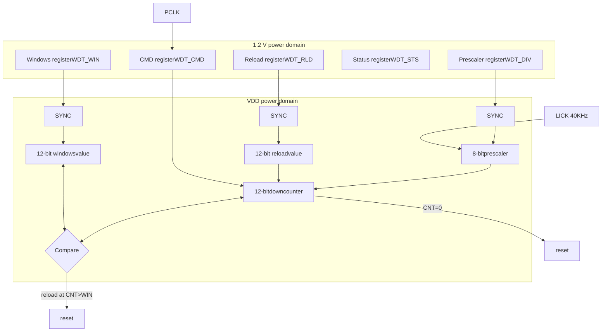

Figure 16-1 WDT block diagram

Table 16-1 WDT timeout period (LICK=40kHz)

| Prescaler divider | DIV\[2: 0] bits | Min.timeout (ms)RLD\[11: 0] = 0x000 | Max. timeout (ms)RLD\[11: 0] = 0xFFF |
| ----------------- | --------------- | ----------------------------------- | ------------------------------------ |
| /4                | 0               | 0.1                                 | 409.6                                |
| /8                | 1               | 0.2                                 | 819.2                                |
| /16               | 2               | 0.4                                 | 1638.4                               |
| /32               | 3               | 0.8                                 | 3276.8                               |
| /64               | 4               | 1.6                                 | 6553.6                               |
| /128              | 5               | 3.2                                 | 13107.2                              |
| /256              | (6 or 7)        | 6.4                                 | 26214.4                              |

# 16.4 Debug mode

When the microcontroller enters debug mode (Cortex®-M4F core halted), the WDT counter stops counting by setting the WDT_PAUSE in the DEBUG module. Refer to Chapter 30.2 for more information.

# 16.5 WDT registers

These peripheral registers must be accessed by words (32 bits).

Table 16-2 WDT register and reset value

| Register | Offset | Reset value |
| -------- | ------ | ----------- |
| WDT\_CMD | 0x00   | 0x0000 0000 |
| WDT\_DIV | 0x04   | 0x0000 0000 |
| WDT\_RLD | 0x08   | 0x0000 0FFF |
| WDT\_STS | 0x0C   | 0x0000 0000 |
| WDT\_WIN | 0x10   | 0x0000 0FFF |

### 16.5.1 Command register (WDT_CMD)

(Reset in Standby mode)

| Bit        | Name     | Reset value | Type | Description                                                                                                                                                                                    |
| ---------- | -------- | ----------- | ---- | ---------------------------------------------------------------------------------------------------------------------------------------------------------------------------------------------- |
| Bit 31: 16 | Reserved | 0x0000      | resd | Kept at its default value.                                                                                                                                                                     |
| Bit 15: 0  | CMD      | 0x0000      | wo   | Command register 0xAAAA: Reload counter 0x5555: Unlock write-protected WDT\_DIV and WDT\_RLD 0xCCCC: Enable WDT. If the hardware watchdog has been enabled, ignore this operation. |

### 16.5.2 Divider register (WDT_DIV)

| Bit       | Name     | Reset value | Type | Description                                                                                                                                                                                                                                                                                                                                                                                 |
| --------- | -------- | ----------- | ---- | ------------------------------------------------------------------------------------------------------------------------------------------------------------------------------------------------------------------------------------------------------------------------------------------------------------------------------------------------------------------------------------------- |
| Bit 31: 3 | Reserved | 0x0000 0000 | resd | Kept at its default value.                                                                                                                                                                                                                                                                                                                                                                  |
| Bit 2: 0  | DIV      | 0x0         | rw   | Clock division value 000: LICK divided by 4 001: LICK divided by 8 010: LICK divided by 16 011: LICK divided by 32 100: LICK divided by 64 101: LICK divided by 128 110: LICK divided by 256 111: LICK divided by 256 The write protection must be unlocked in order to enable write access to the register. The register can be read only when DIVF=0. |

### 16.5.3 Reload register (WDT_RLD)

(Reset in Standby mode)

| Bit        | Name     | Reset value | Type | Description                                                                                                                                        |
| ---------- | -------- | ----------- | ---- | -------------------------------------------------------------------------------------------------------------------------------------------------- |
| Bit 31: 12 | Reserved | 0x00000     | resd | Kept at its default value.                                                                                                                         |
| Bit 11: 0  | RLD      | 0xFFF       | rw   | Reload value The write protection must be unlocked in order to enable write access to the register. The register can be read only when RLDF=0. |

### 16.5.4 Status register (WDT_STS)

(Reset in Standby mode)

| Bit       | Name     | Reset value | Type | Description                                                                                                                                                                             |
| --------- | -------- | ----------- | ---- | --------------------------------------------------------------------------------------------------------------------------------------------------------------------------------------- |
| Bit 31: 2 | Reserved | 0x0000 0000 | resd | Kept at its default value.                                                                                                                                                              |
| Bit 1     | RLDF     | 0x0         | ro   | Reload value update complete flag 0: Reload value update complete 1: Reload value update is in process. The reload register WDT\_RLD can be written only when RLDF=0        |
| Bit 0     | DIVF     | 0x0         | ro   | Division value update complete flag 0: Division value update complete 1: Division value update is in process. The divider register WDT\_DIV can be written only when DIVF=0 |

### 16.5.5 Window register (WDT_WIN)

(Reset in Standby mode)

| Bit        | Name     | Reset value | Type | Description                                                                                                                                                                       |
| ---------- | -------- | ----------- | ---- | --------------------------------------------------------------------------------------------------------------------------------------------------------------------------------- |
| Bit 31: 12 | Reserved | 0x000000    | resd | Kept at its default value.                                                                                                                                                        |
| Bit 11 : 0 | WIN      | 0xFFF       | ro   | Window value When the counter value is greater than the window value, the reload counter will perform a reset. The reload counter value falls between 0 and the window value. |

